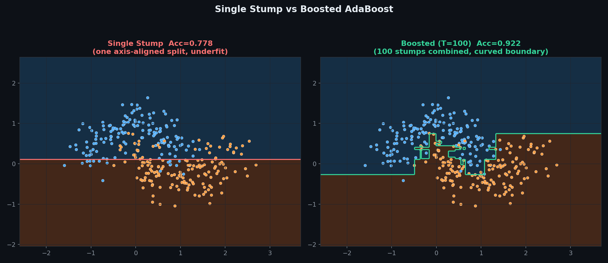
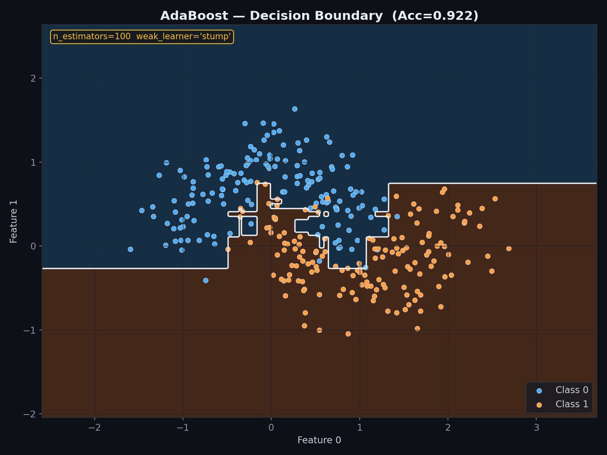
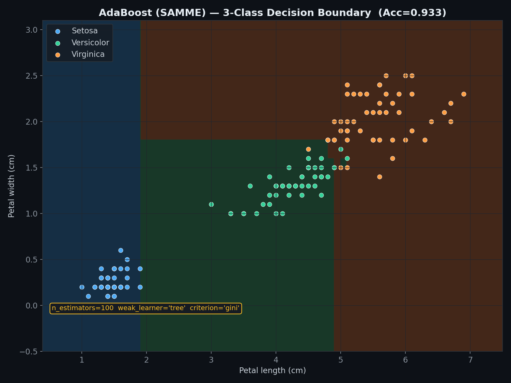
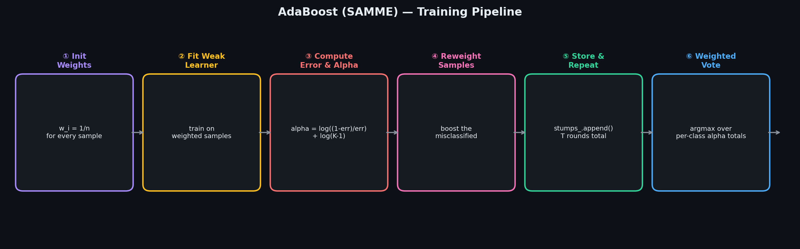
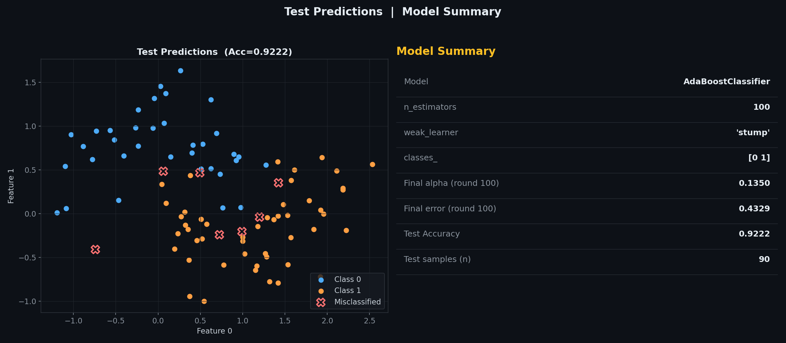
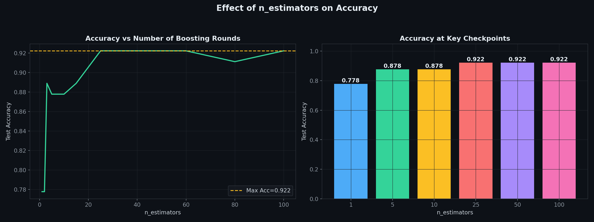
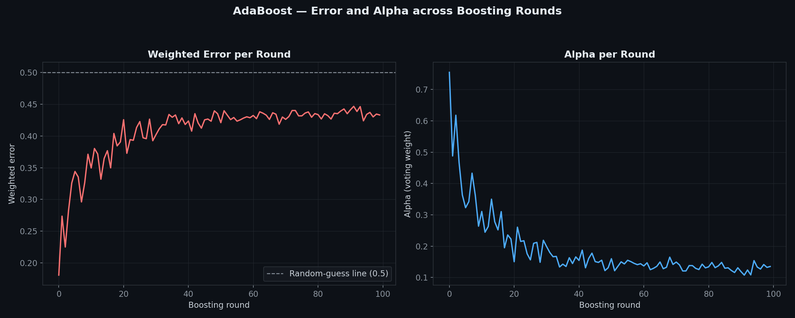
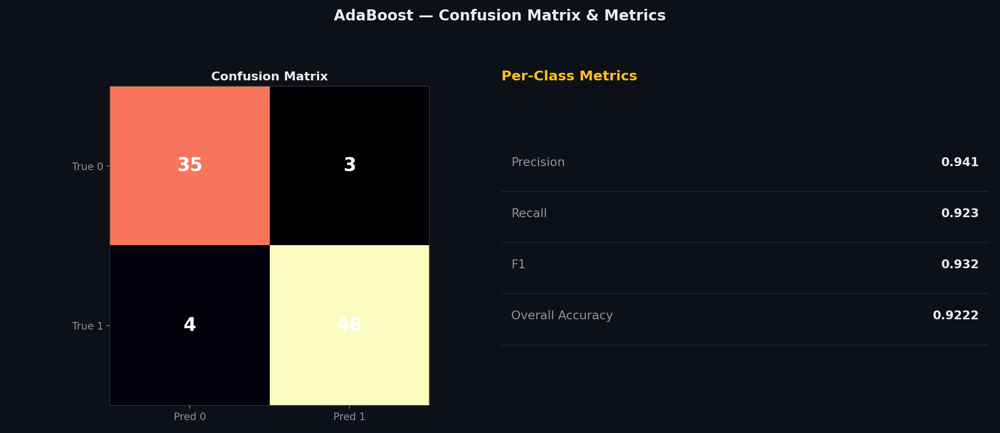
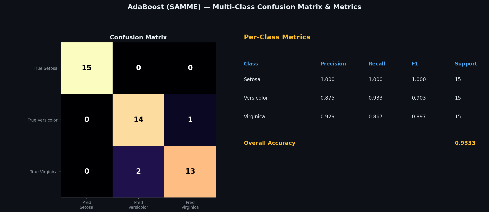
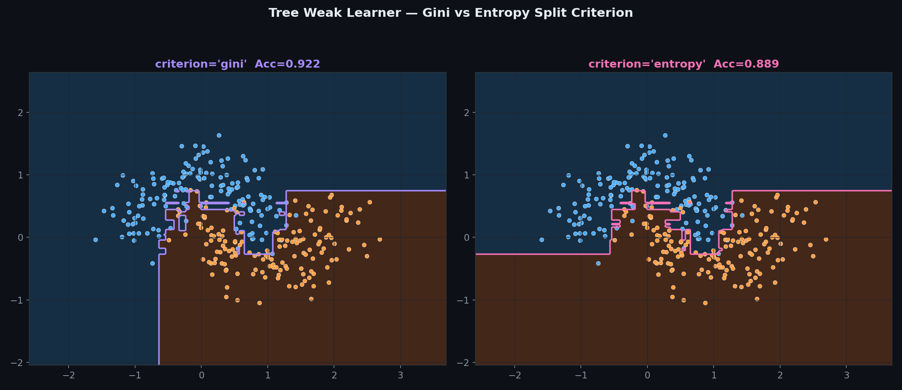

# AdaBoost (SAMME) — Adaptive Boosting for Binary & Multi-Class

> A clean, **NumPy-only** implementation of AdaBoost using **SAMME**, the standard multi-class generalisation.
> Boosts a sequence of **weak learners** — decision stumps by default, or shallow trees with **gini or entropy** splits — into one strong classifier.
> Works for **2 or more classes** with a single, unified algorithm — binary classification isn't a special case, it just falls out of the general formula.

---

## Table of Contents

1. [What is AdaBoost?](#1-what-is-adaboost)
2. [Binary vs Multi-Class — Why One Algorithm Handles Both](#2-binary-vs-multi-class--why-one-algorithm-handles-both)
3. [The Model](#3-the-model)
4. [The Weak Learners](#4-the-weak-learners)
5. [Sample Weights & Alpha](#5-sample-weights--alpha)
6. [Single Stump vs Boosted Ensemble](#6-single-stump-vs-boosted-ensemble)
7. [Binary Decision Boundary](#7-binary-decision-boundary)
8. [Multi-Class Decision Boundary](#8-multi-class-decision-boundary)
9. [Training Pipeline](#9-training-pipeline)
10. [Test Predictions & Model Summary](#10-test-predictions--model-summary)
11. [Effect of n_estimators](#11-effect-of-n_estimators)
12. [Error & Alpha across Rounds](#12-error--alpha-across-rounds)
13. [Confusion Matrix — Binary & Multi-Class](#13-confusion-matrix--binary--multi-class)
14. [Gini vs Entropy](#14-gini-vs-entropy)
15. [Usage](#15-usage)
16. [Assumptions](#16-assumptions)
17. [Pros & Cons vs Random Forest & a Single Decision Tree](#17-pros--cons-vs-random-forest--a-single-decision-tree)

---

## 1. What is AdaBoost?

AdaBoost ("Adaptive Boosting") builds a strong classifier out of many weak ones, trained **sequentially** rather than independently. Each new weak learner is trained on a re-weighted version of the data — samples the ensemble has been getting wrong get more weight, so the next learner is forced to pay attention to them.

Unlike a Random Forest, where every tree is trained independently and in parallel, AdaBoost's rounds depend on each other — round $t$'s sample weights are a direct consequence of how rounds $1 \ldots t{-}1$ performed.

| Symbol | Name | Meaning |
|--------|------|---------|
| $h_t(x)$ | Weak learner $t$ | One round's classifier, predicts an actual class label |
| $\alpha_t$ | Alpha | How much weight round $t$'s vote gets in the final prediction |
| $w_i$ | Sample weight | How much round $t{+}1$ should focus on sample $i$ |
| $\epsilon_t$ | Weighted error | Round $t$'s error rate, computed against the current weights |
| $K$ | `n_classes` | Number of distinct classes in the data |
| $T$ | `n_estimators` | Total number of boosting rounds |

---

## 2. Binary vs Multi-Class — Why One Algorithm Handles Both

This implementation uses **SAMME** (Stagewise Additive Modeling using a Multi-class Exponential loss), the standard generalisation of AdaBoost to $K \geq 2$ classes. Two things had to change from the classic two-class version:

1. **Weak learners predict actual class labels**, not $\{-1, +1\}$. `DecisionStump` splits on a feature/threshold and assigns each side the class with the highest total sample weight — this works identically whether there are 2 classes or 20.
2. **Alpha gains a `+ log(K-1)` correction term** (see [§5](#5-sample-weights--alpha)) so that a weak learner only needs to beat *random guessing among K classes* ($1/K$ accuracy), not the fixed 50% bar that only makes sense for two classes.

When $K = 2$, $\log(K-1) = \log(1) = 0$, so the alpha formula collapses back to being proportional to classic AdaBoost's, and picking the highest-total-alpha class between exactly two options is equivalent to the old $\text{sign}(\cdot)$ vote. **Binary classification isn't handled as a special case in the code — it's just what SAMME reduces to when $K=2$.**

---

## 3. The Model

The final prediction picks the class with the highest total alpha across every round that voted for it:

$$H(x) = \underset{k}{\text{argmax}} \sum_{t:\, h_t(x) = k} \alpha_t$$

Learners that performed well (low weighted error) get a large $\alpha_t$ and dominate the vote for whichever class they picked; learners barely better than chance get a vote close to zero.

---

## 4. The Weak Learners

Two weak learner types are supported, selected via `weak_learner`:

**`'stump'`** (default) — a depth-1 decision tree: one feature, one threshold, one split. Each side of the split predicts whichever class holds the most total sample weight there. Fast, and surprisingly effective once boosted.

**`'tree'`** — a shallow decision tree (`weak_learner_depth`, default 2), split using either:
- `criterion='gini'` — $1 - \sum_k p_k^2$
- `criterion='entropy'` — $-\sum_k p_k \log_2 p_k$

Both impurity measures are already written generically over however many classes are present — no binary-only assumptions anywhere in the split search.

The tree learner respects sample weights via a **weighted bootstrap**: rows are resampled proportional to their current weight before an ordinary (unweighted) tree is fit on the resample — a common trick that lets a plain tree-building routine behave like a weighted one.

---

## 5. Sample Weights & Alpha

At every round:

$$\epsilon_t = \sum_{i:\, h_t(x_i) \neq y_i} w_i$$

$$\alpha_t = \ln\left(\frac{1-\epsilon_t}{\epsilon_t}\right) + \ln(K-1)$$

$$w_i \leftarrow w_i \cdot e^{\alpha_t \cdot \mathbb{1}[h_t(x_i) \neq y_i]}, \quad \text{then renormalise so } \sum_i w_i = 1$$

Get sample $i$ right and its weight is untouched; get it wrong and its weight grows by a factor of $e^{\alpha_t}$ — the harder a sample has been to classify correctly, the more it dominates the next round's training.

---

## 6. Single Stump vs Boosted Ensemble



**Left:** one stump can only make a single axis-aligned cut — nowhere near enough to separate two interleaving moons. **Right:** 100 stumps combined, each focused on a different region the previous rounds struggled with, approximate a much more complex curved boundary — built entirely out of straight-line pieces.

---

## 7. Binary Decision Boundary



The characteristic **staircase** shape is the signature of a boosted-stump ensemble on a binary problem: every individual vote is a single axis-aligned split, and the combined boundary is the sum of a hundred small corrections layered on top of each other.

---

## 8. Multi-Class Decision Boundary



The exact same `AdaBoostClassifier` class, fit on Iris's petal length and width (3 classes) with a tree weak learner. No special multi-class mode was selected — `fit()` simply detected 3 unique labels and the SAMME alpha/vote formulas handled the rest.

---

## 9. Training Pipeline



The loop that runs once per boosting round, `n_estimators` times:

| Step | Operation |
|------|-----------|
| ① | Initialise weights — every sample starts equally important |
| ② | Fit a weak learner on the currently-weighted data |
| ③ | Compute weighted error, then this round's alpha (SAMME formula) |
| ④ | Reweight samples — boost whatever this round got wrong |
| ⑤ | Store the learner, repeat for $T$ rounds |
| ⑥ | Final prediction — argmax over each class's total alpha |

---

## 10. Test Predictions & Model Summary



**Left panel:** test-set predictions on the binary two-moons data, with misclassified points marked by a red X. **Right panel:** model configuration and headline numbers — including the alpha and error of the very last boosting round, which is usually small since later rounds focus on the hardest remaining samples.

---

## 11. Effect of n_estimators



Accuracy climbs quickly over the first ~10-20 rounds, then levels off. Because each new stump specifically targets the current ensemble's mistakes, gains come fast early on and shrink as fewer hard samples remain to fix. This holds regardless of how many classes are involved.

---

## 12. Error & Alpha across Rounds



**Left:** each round's weighted error — note it can spike back up when a round's weak learner draws a hard, heavily-reweighted subset. **Right:** alpha tracks error inversely — as later rounds struggle more (because the "easy" samples have already been solved), alpha for those rounds shrinks accordingly.

---

## 13. Confusion Matrix — Binary & Multi-Class



The binary case produces the familiar 2x2 confusion matrix with precision/recall/F1.



The exact same metrics generalise cleanly to $K > 2$ classes — precision, recall, and F1 are computed **per class** (one-vs-rest), and the confusion matrix grows to $K \times K$. Setosa is perfectly separated here; nearly all the model's confusion is between Versicolor and Virginica, which are known to overlap in petal measurements.

---

## 14. Gini vs Entropy



Both impurity measures produce very similar boundaries and accuracy here — they usually agree on which split is best, differing mainly in how strongly they penalise less-pure splits. Entropy's logarithmic penalty is a bit more sensitive to small class-probability differences; gini is cheaper to compute and the more common default. Both are computed generically over however many classes are present.

---

## 15. Usage

### Binary classification — stump weak learner

```python
import numpy as np
from AdaBoostClassifier import AdaBoostClassifier

X_train = np.array([[2, 2], [3, 3], [2.5, 1.5], [-2, -2], [-3, -1], [-1.5, -2.5]])
y_train = np.array([1, 1, 1, 0, 0, 0])

model = AdaBoostClassifier(n_estimators=50, weak_learner='stump', random_state=42)
model.fit(X_train, y_train)

print(model)
print(f"Alphas (first 5) : {model.alphas_[:5]}")

X_test = np.array([[2.8, 2.2], [-2.2, -1.8]])
print(f"Predictions : {model.predict(X_test)}")
print(f"Accuracy    : {model.score(X_train, y_train):.4f}")
```

### Multi-class classification — no code changes needed

```python
from sklearn.datasets import load_iris
from sklearn.model_selection import train_test_split

X, y = load_iris(return_X_y=True)   # 3 classes
X_tr, X_te, y_tr, y_te = train_test_split(X, y, test_size=0.3, random_state=42, stratify=y)

model = AdaBoostClassifier(n_estimators=100, weak_learner='tree',
                            weak_learner_depth=2, criterion='gini', random_state=42)
model.fit(X_tr, y_tr)   # exact same fit() call as the binary example

print(f"classes_ : {model.classes_}")   # [0 1 2]
print(f"Accuracy : {model.score(X_te, y_te):.4f}")
```

### Tree weak learner with entropy

```python
model = AdaBoostClassifier(
    n_estimators=50,
    weak_learner='tree',
    weak_learner_depth=2,
    criterion='entropy',
    random_state=42
)
model.fit(X_train, y_train)
print(f"Accuracy : {model.score(X_train, y_train):.4f}")
```

### Comparing n_estimators

```python
for k in [1, 5, 10, 25, 50, 100]:
    m = AdaBoostClassifier(n_estimators=k, weak_learner='stump', random_state=42)
    m.fit(X_train, y_train)
    print(f"n_estimators={k:>4} -> accuracy={m.score(X_train, y_train):.4f}")
```

---

## 16. Assumptions

| # | Assumption | How to check |
|---|-----------|--------------|
| 1 | **At least 2 classes** — `fit()` raises `ValueError` on a single-class dataset | — |
| 2 | **Weak learners should be better than random guessing** — SAMME breaks down if $\epsilon_t \geq 1 - 1/K$ consistently | Watch the `errors_` list after fitting |
| 3 | **Sensitive to noisy labels / outliers** — mislabeled points get reweighted upward every round they're missed | Cap `n_estimators`, or inspect final sample weights for outliers |
| 4 | **No feature scaling needed** — both stumps and trees split on raw thresholds | — |

> **AdaBoost can overfit with too many rounds on noisy data** — since mislabeled points keep getting boosted in weight round after round, eventually forcing the ensemble to contort around them. Cross-validate `n_estimators` rather than maximising it blindly.

> **More classes means the "beat random guessing" bar gets lower, not higher** — a weak learner only needs $> 1/K$ accuracy to be useful, since the `+log(K-1)` term in alpha accounts for how much harder random guessing is with more classes.

---

## 17. Pros & Cons vs Random Forest & a Single Decision Tree

| Criterion | **AdaBoost (SAMME)** | **Random Forest** | **Single Decision Tree** |
|-----------|--------------------------|----------------------|------------------------------|
| Training | Sequential (each round depends on the last) | Parallel (trees are independent) | One-shot |
| Base learner | Weak — stumps or shallow trees | Full-depth trees | Itself |
| Combines via | Weighted vote (alpha) | Majority vote (equal weight) | — |
| Multi-class support | Yes — SAMME, same algorithm as binary | Yes — natively | Yes — natively |
| Sensitivity to noise/outliers | High — misclassified points get boosted | Low — bootstrap averaging smooths noise | High — a single deep tree memorises noise |
| Bias vs variance | Reduces bias primarily | Reduces variance primarily | High variance if deep |
| Interpretability | Moderate — can inspect each stump | Lower — many full trees | Very high — one rule path |
| sklearn equivalent | `AdaBoostClassifier(algorithm='SAMME')` | `RandomForestClassifier` | `DecisionTreeClassifier` |

**Rule of thumb:** reach for AdaBoost when your weak learners are consistently, if weakly, better than chance and the data is reasonably clean; prefer a Random Forest when the data is noisy, since bagging's variance reduction is more robust to outliers than boosting's bias reduction.

---

## Dependencies

```
numpy >= 1.21
matplotlib >= 3.4   # optional — for plots only
scikit-learn        # optional — for the make_moons and Iris demo datasets only
```

---

## License

MIT
