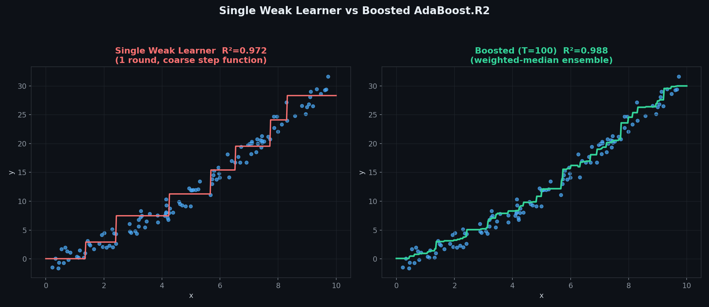
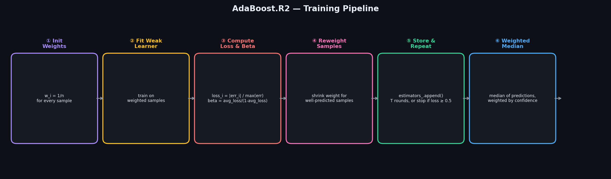
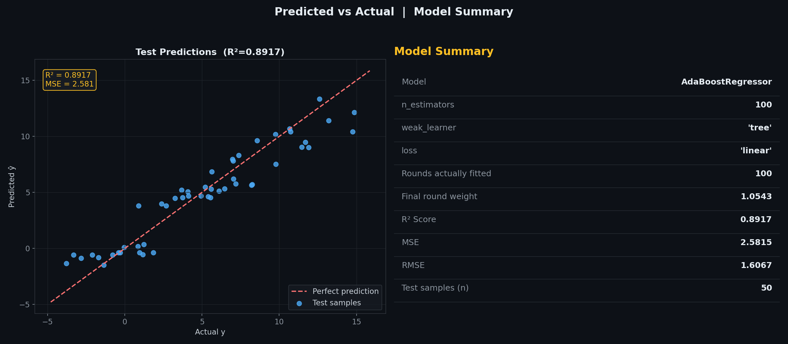
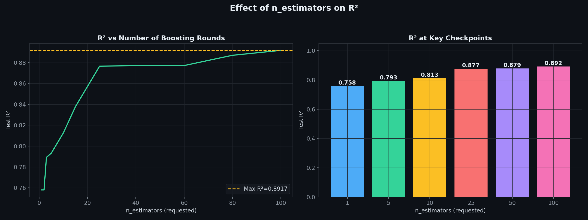
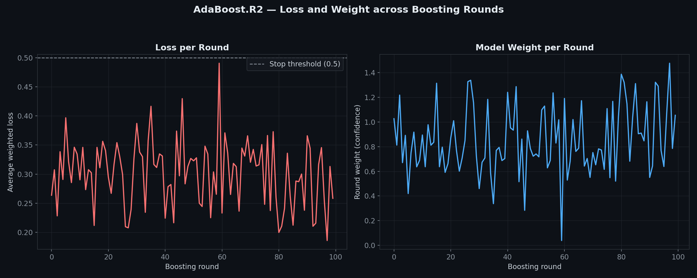
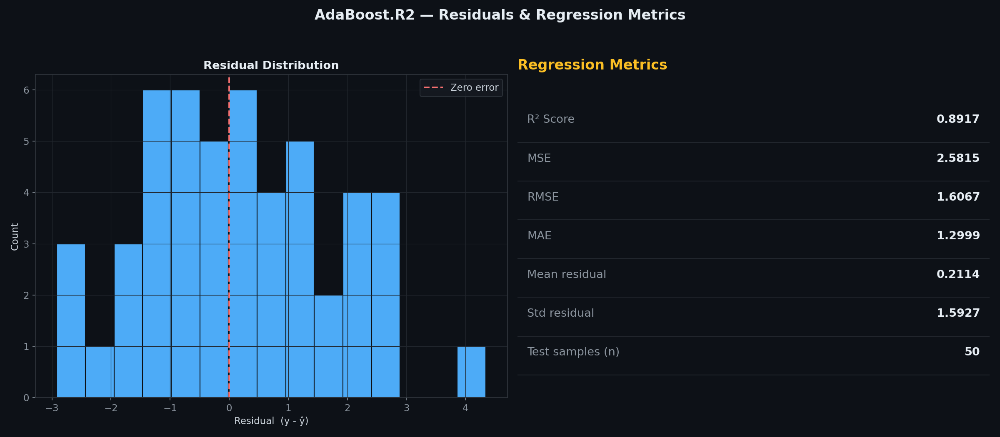
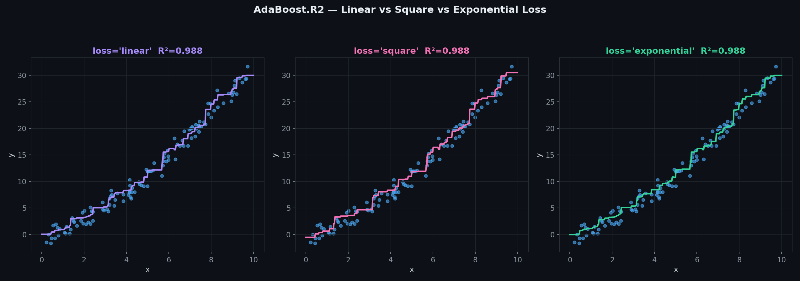

# AdaBoost.R2 — Adaptive Boosting for Regression

> A clean, **NumPy-only** implementation of AdaBoost for regression, using the **AdaBoost.R2** algorithm.
> Boosts a sequence of **weak regressors** — regression stumps by default, or shallow variance-reduction trees — into one strong ensemble.
> Predictions are combined via a **weighted median**, not an average — the same core boosting idea as the classifier, adapted for continuous targets.

---

## Table of Contents

1. [What is AdaBoost.R2?](#1-what-is-adaboostr2)
2. [How Regression Boosting Differs from Classification](#2-how-regression-boosting-differs-from-classification)
3. [The Model](#3-the-model)
4. [The Weak Learners](#4-the-weak-learners)
5. [Sample Weights, Loss & Beta](#5-sample-weights-loss--beta)
6. [Single Weak Learner vs Boosted Ensemble](#6-single-weak-learner-vs-boosted-ensemble)
7. [Prediction Surface](#7-prediction-surface)
8. [Training Pipeline](#8-training-pipeline)
9. [Predicted vs Actual](#9-predicted-vs-actual)
10. [Effect of n_estimators](#10-effect-of-n_estimators)
11. [Loss & Weight across Rounds](#11-loss--weight-across-rounds)
12. [Residuals & Regression Metrics](#12-residuals--regression-metrics)
13. [Linear vs Square vs Exponential Loss](#13-linear-vs-square-vs-exponential-loss)
14. [Usage](#14-usage)
15. [Assumptions](#15-assumptions)
16. [Pros & Cons vs Random Forest Regressor & a Single Decision Tree](#16-pros--cons-vs-random-forest-regressor--a-single-decision-tree)

---

## 1. What is AdaBoost.R2?

AdaBoost.R2 is the standard regression generalisation of AdaBoost. Like the classifier, it trains weak learners **sequentially** — each round is trained on re-weighted data, focusing more on whatever samples the ensemble has predicted worst so far. The core idea carries over directly from classification: get a sample wrong (or in this case, badly wrong) and its weight grows for the next round.

| Symbol | Name | Meaning |
|--------|------|---------|
| $h_t(x)$ | Weak learner $t$ | One round's regressor, predicts a continuous value |
| $L_i^{(t)}$ | Sample loss | Round $t$'s normalised error on sample $i$ |
| $\bar{L}_t$ | Average loss | Round $t$'s weighted-average loss across all samples |
| $\beta_t$ | Beta | $\bar{L}_t / (1 - \bar{L}_t)$ — how much to trust round $t$ |
| $w_i$ | Sample weight | How much round $t{+}1$ should focus on sample $i$ |
| $T$ | `n_estimators` | Maximum number of boosting rounds |

---

## 2. How Regression Boosting Differs from Classification

Classification AdaBoost has a clean notion of "right" or "wrong" — a prediction either matches the label or it doesn't. Regression has no such binary outcome, so AdaBoost.R2 needs three adjustments:

1. **Loss is continuous, not binary.** Each sample gets a normalised error in $[0, 1]$ instead of a 0/1 mismatch flag.
2. **Combining predictions can't be a vote.** There's no "majority value" — the ensemble instead takes a **weighted median** of every round's prediction.
3. **The stopping condition is explicit.** If a round's average loss reaches 0.5 or worse, that round is no better than a coin flip and boosting stops rather than continuing to degrade.

Everything else — reweighting samples based on how badly they were missed, giving better rounds more say in the final answer — is the same mechanism as classification AdaBoost.

---

## 3. The Model

The final prediction is the **weighted median** across every fitted round's prediction:

$$H(x) = \text{median}_{\,w}\big(h_1(x), h_2(x), \ldots, h_T(x)\big)$$

where each round's prediction is weighted by $\ln(1/\beta_t)$ — rounds with lower average loss get more say in where the median falls.

---

## 4. The Weak Learners

Two weak learner types are supported, selected via `weak_learner`:

**`'stump'`** (default) — a depth-1 regression tree: one feature, one threshold, each side predicting the sample-weighted mean of its target values. Fast, and a reasonable baseline once boosted.

**`'tree'`** — a shallow variance-reduction tree (`weak_learner_depth`, default 3), using the same MSE-based splitting as the standalone Decision Tree / Random Forest regressors in this repo.

The tree learner respects sample weights via a **weighted bootstrap**: rows are resampled proportional to their current weight before an ordinary (unweighted) tree is fit on the resample — the same trick used by the classifier's tree weak learner.

---

## 5. Sample Weights, Loss & Beta

For each sample, compute a normalised loss against the round's worst miss:

$$L_i = \begin{cases} |h_t(x_i) - y_i| \,/\, D & \text{loss='linear'} \\ \left(|h_t(x_i) - y_i| \,/\, D\right)^2 & \text{loss='square'} \\ 1 - e^{-|h_t(x_i) - y_i| / D} & \text{loss='exponential'} \end{cases} \qquad D = \max_i |h_t(x_i) - y_i|$$

Then:

$$\bar{L}_t = \sum_i w_i L_i, \qquad \beta_t = \frac{\bar{L}_t}{1 - \bar{L}_t}$$

$$w_i \leftarrow w_i \cdot \beta_t^{\,1 - L_i}, \quad \text{then renormalise so } \sum_i w_i = 1$$

A sample predicted almost perfectly ($L_i \approx 0$) has its weight multiplied by roughly $\beta_t$ (shrinks, since $\beta_t < 1$ for a useful round); a badly-missed sample ($L_i \approx 1$) keeps its weight almost unchanged — so relative to everything else, it becomes more prominent next round.

---

## 6. Single Weak Learner vs Boosted Ensemble



**Left:** one round alone already captures the broad shape with a depth-3 tree, but the step function is coarse. **Right:** 100 boosted rounds, combined via weighted median, trace a noticeably closer fit to the underlying curve — each round nudges the ensemble toward the samples the previous rounds handled worst.

---

## 7. Prediction Surface


The trained ensemble's prediction surface over two input features. Like the Random Forest Regressor, the underlying structure is built from axis-aligned tree splits, but combining many rounds via weighted median smooths the output considerably compared to any single weak learner.

---

## 8. Training Pipeline



The loop that runs once per boosting round, up to `n_estimators` times:

| Step | Operation |
|------|-----------|
| ① | Initialise weights — every sample starts equally important |
| ② | Fit a weak learner on the currently-weighted data |
| ③ | Compute each sample's normalised loss, then this round's beta |
| ④ | Reweight samples — well-predicted samples shrink in relative weight |
| ⑤ | Store the learner, repeat — or stop early if average loss ≥ 0.5 |
| ⑥ | Final prediction — weighted median across every stored round |

---

## 9. Predicted vs Actual



**Left panel:** each point is one test sample — actual $y$ on the x-axis, predicted $\hat{y}$ on the y-axis. Points hugging the red dashed diagonal are accurate predictions. **Right panel:** full model summary, including how many rounds were actually fitted (can be less than `n_estimators` if boosting stopped early) and the final round's confidence weight.

---

## 10. Effect of n_estimators



R² climbs with more rounds and then levels off, the same pattern seen in the classifier and in Random Forest — most of the benefit comes from the first several dozen rounds.

---

## 11. Loss & Weight across Rounds



**Left:** each round's average weighted loss — bounded below 0.5 by construction, since boosting stops the moment a round crosses that line. **Right:** each round's confidence weight, $\ln(1/\beta_t)$ — lower-loss rounds earn more influence over the final weighted median.

---

## 12. Residuals & Regression Metrics



**Left:** distribution of test-set residuals — should be roughly centred at zero with no strong skew. **Right:** the full set of regression metrics (R², MSE, RMSE, MAE, mean/std of residuals) in one place.

---

## 13. Linear vs Square vs Exponential Loss



All three loss functions map a round's raw error into $[0, 1]$ before it factors into $\bar{L}_t$ and the weight update — they differ only in how harshly large errors are penalised relative to small ones:

- **`linear`** (default) — proportional to the error, the mildest penalty
- **`square`** — penalises large errors more aggressively than small ones
- **`exponential`** — saturates fastest, treating any sufficiently large error as "equally bad"

On well-behaved data all three tend to converge to similar fits, as seen here; the choice matters most when outliers are present, where `square` and `exponential` will chase them harder than `linear`.

---

## 14. Usage

### Basic fit and predict

```python
import numpy as np
from AdaBoostRegressor import AdaBoostRegressor

X_train = np.random.uniform(-3, 3, (200, 3))
y_train = np.sin(X_train[:, 0]) * 3 + X_train[:, 1] ** 2 + np.random.randn(200) * 0.3

model = AdaBoostRegressor(n_estimators=100, weak_learner='tree', weak_learner_depth=3, random_state=42)
model.fit(X_train, y_train)

print(model)
print(f"Rounds actually fitted : {len(model.estimators_)}")
print(f"Final round weight     : {model.weights_[-1]:.4f}")

X_test = np.random.uniform(-3, 3, (20, 3))
y_pred = model.predict(X_test)
print(f"Predictions : {y_pred}")
```

### Comparing loss functions

```python
for loss in ['linear', 'square', 'exponential']:
    m = AdaBoostRegressor(n_estimators=50, weak_learner='tree', loss=loss, random_state=42)
    m.fit(X_train, y_train)
    print(f"loss={loss:>12} -> R²={m.score(X_train, y_train):.4f}")
```

### Comparing n_estimators

```python
for k in [1, 5, 10, 25, 50, 100]:
    m = AdaBoostRegressor(n_estimators=k, weak_learner='tree', random_state=42)
    m.fit(X_train, y_train)
    print(f"n_estimators={k:>4} -> R²={m.score(X_train, y_train):.4f}, "
          f"rounds fitted={len(m.estimators_)}")
```

---

## 15. Assumptions

| # | Assumption | How to check |
|---|-----------|--------------|
| 1 | **Weak learners should be better than the worst-case baseline** — boosting stops if average loss reaches 0.5 | Check `len(model.estimators_)` against `n_estimators` after fitting |
| 2 | **Sensitive to noisy targets / outliers** — badly-missed samples keep high relative weight round after round | Try `loss='linear'` first; watch for the ensemble over-focusing on a handful of points |
| 3 | **No feature scaling needed** — both stumps and trees split on raw thresholds | — |
| 4 | **Small-sample bootstrap can be unstable** — the tree weak learner's weighted bootstrap can occasionally collapse on very small datasets | Prefer `weak_learner='stump'` or increase sample size for tiny datasets |

> **Fewer rounds may get fitted than requested** — `n_estimators` is a maximum, not a guarantee. If a round's average loss hits 0.5 or worse, boosting halts there since that round provides no better than baseline information.

---

## 16. Pros & Cons vs Random Forest Regressor & a Single Decision Tree

| Criterion | **AdaBoost.R2** | **Random Forest Regressor** | **Single Decision Tree** |
|-----------|--------------------|----------------------------------|------------------------------|
| Training | Sequential (each round depends on the last) | Parallel (trees are independent) | One-shot |
| Base learner | Weak — stumps or shallow trees | Full-depth trees | Itself |
| Combines via | Weighted median | Mean average | — |
| Sensitivity to noise/outliers | High — badly-missed samples get boosted | Low — bootstrap averaging smooths noise | High — a single deep tree memorises noise |
| Bias vs variance | Reduces bias primarily | Reduces variance primarily | High variance if deep |
| Can stop early | Yes — if a round is no better than baseline | No — always trains all trees | — |
| Interpretability | Moderate — can inspect each round | Lower — many full trees | Very high — one rule path |
| sklearn equivalent | `AdaBoostRegressor` | `RandomForestRegressor` | `DecisionTreeRegressor` |

**Rule of thumb:** reach for AdaBoost.R2 when your weak learners are consistently better than a naive baseline and the data is reasonably clean; prefer a Random Forest when the data is noisy, since bagging's variance reduction is more robust to outliers than boosting's bias reduction.

---

## Dependencies

```
numpy >= 1.21
matplotlib >= 3.4   # optional — for plots only
```

---

## License

MIT
