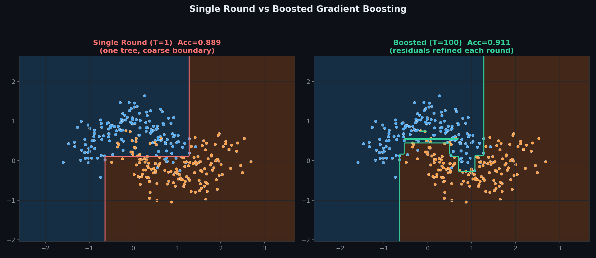
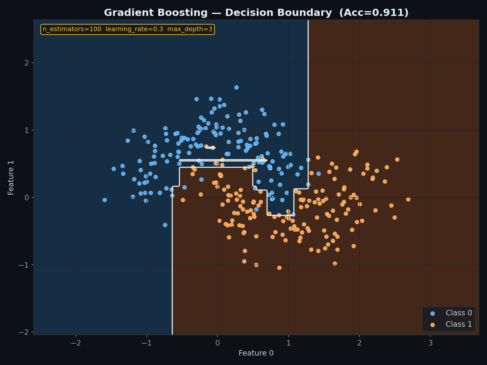
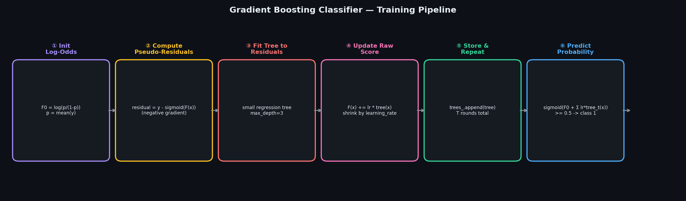
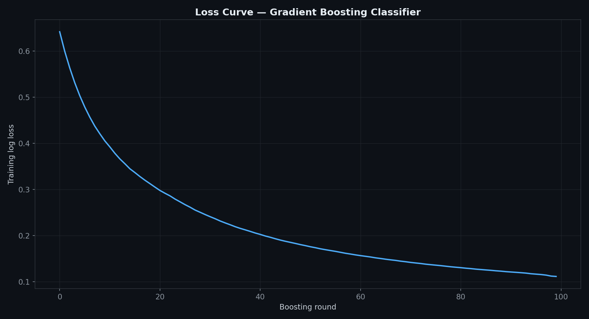
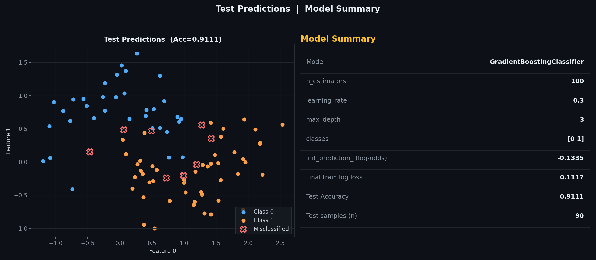
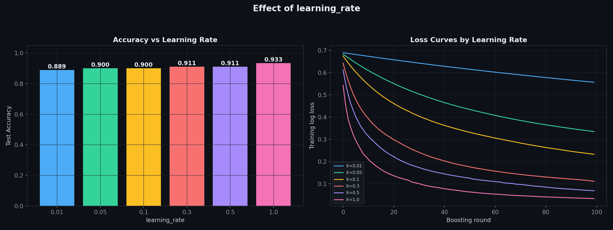
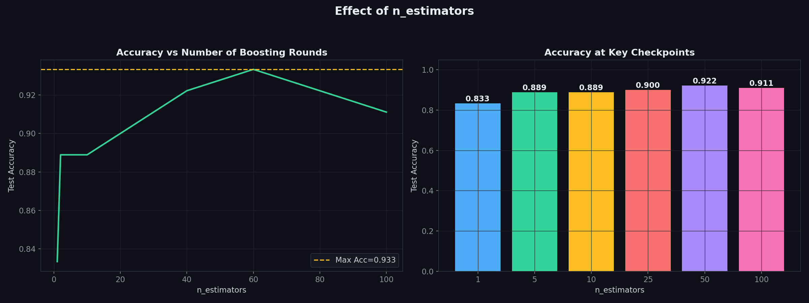
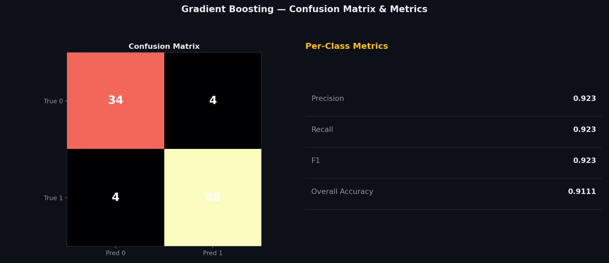

# Gradient Boosting Classifier — Fitting Trees to the Gradient of Log Loss

> A clean, **NumPy-only** implementation of Gradient Boosting for binary classification.
> Starts from the log-odds of the class balance, then each round fits a small regression tree to the current **pseudo-residuals** and nudges the raw score closer, scaled by a `learning_rate`.
> Same core mechanism as `GradientBoostingRegressor` — swap squared-error residuals for log-loss gradients and add a sigmoid at the end.

---

## Table of Contents

1. [What is Gradient Boosting Classification?](#1-what-is-gradient-boosting-classification)
2. [How This Differs from the Regressor](#2-how-this-differs-from-the-regressor)
3. [The Model](#3-the-model)
4. [Pseudo-Residuals — The Gradient of Log Loss](#4-pseudo-residuals--the-gradient-of-log-loss)
5. [The Weak Learner](#5-the-weak-learner)
6. [Single Round vs Boosted Ensemble](#6-single-round-vs-boosted-ensemble)
7. [Decision Boundary](#7-decision-boundary)
8. [Training Pipeline](#8-training-pipeline)
9. [Loss Curve](#9-loss-curve)
10. [Test Predictions & Model Summary](#10-test-predictions--model-summary)
11. [Effect of learning_rate](#11-effect-of-learning_rate)
12. [Effect of n_estimators](#12-effect-of-n_estimators)
13. [Confusion Matrix](#13-confusion-matrix)
14. [Usage](#14-usage)
15. [Assumptions](#15-assumptions)
16. [Pros & Cons vs AdaBoost & Random Forest Classifier](#16-pros--cons-vs-adaboost--random-forest-classifier)

---

## 1. What is Gradient Boosting Classification?

Gradient Boosting Classification applies the same residual-fitting idea as the regressor, adapted for a binary target. Instead of predicting $y$ directly, the ensemble builds up a running **raw score** (log-odds), and each new tree is trained to predict how wrong the current probability estimate still is. Push that raw score through a sigmoid at the end and you get a probability.

| Symbol | Name | Meaning |
|--------|------|---------|
| $F_t(x)$ | Raw score after round $t$ | Running sum of the initial log-odds plus every tree so far |
| $p_i$ | Predicted probability | $\sigma(F_t(x_i))$ — sigmoid of the raw score |
| $r_i$ | Pseudo-residual | $y_i - p_i$ — how far the current probability is from the true label |
| $h_t(x)$ | Round $t$'s tree | Trained to predict the pseudo-residuals |
| $\alpha$ | `learning_rate` | Shrinks each tree's contribution to the running score |
| $T$ | `n_estimators` | Total number of boosting rounds |

---

## 2. How This Differs from the Regressor

Three changes turn `GradientBoostingRegressor` into `GradientBoostingClassifier`:

1. **The initial prediction is a log-odds, not a mean.** $F_0 = \ln\!\left(\frac{p}{1-p}\right)$, where $p$ is the fraction of positive-class samples.
2. **The residual is $y - \sigma(F(x))$, not $y - F(x)$.** This is the negative gradient of **log loss** rather than squared error — the trees still get fit with ordinary MSE-based splitting, only the *target* they're fit to changes.
3. **Predictions go through a sigmoid.** The raw accumulated score isn't a probability by itself — `predict_proba` applies $\sigma(\cdot)$ before returning class probabilities.

Everything else — the round-by-round structure, the shrinkage via `learning_rate`, storing one tree per round — is identical to the regressor.

---

## 3. The Model

The final raw score is the initial log-odds plus every tree's shrunk contribution, same additive structure as the regressor:

$$F_T(x) = F_0 + \alpha \sum_{t=1}^{T} h_t(x)$$

The predicted probability of the positive class comes from passing that score through a sigmoid:

$$P(y=1 \mid x) = \sigma(F_T(x)) = \frac{1}{1 + e^{-F_T(x)}}$$

---

## 4. Pseudo-Residuals — The Gradient of Log Loss

Binary log loss for a single sample is:

$$\mathcal{L}(y, p) = -\big[y \ln p + (1-y)\ln(1-p)\big], \qquad p = \sigma(F(x))$$

Its negative gradient with respect to the raw score $F(x)$ works out to a strikingly simple form:

$$-\frac{\partial \mathcal{L}}{\partial F(x)} = y - p$$

That's the exact same "actual minus predicted" residual used for squared-error regression — which is why the same regression-tree machinery can be reused unchanged, just fed a different target each round.

---

## 5. The Weak Learner

A single `DecisionTree` — same `CreateNode` / MSE-splitting structure as every other tree-based model in this repo — fit to the current pseudo-residuals rather than the raw labels. Kept shallow (`max_depth=3` by default) since each tree only needs to explain a small correction, not the whole decision boundary by itself.

---

## 6. Single Round vs Boosted Ensemble



**Left:** one tree, fit directly with `learning_rate=1.0`, gives a coarse boundary. **Right:** 100 rounds at `learning_rate=0.3`, each correcting a bit more of the remaining log-loss gradient, converge to a boundary that follows the moons' curve far more closely.

---

## 7. Decision Boundary



Built from 100 shallow trees stacked additively — note the boundary is more textured than a single tree's blocky regions but smoother than a raw ensemble vote, since it's shaped by a continuously-updated probability surface rather than a hard vote.

---

## 8. Training Pipeline



The loop that runs once per boosting round, `n_estimators` times:

| Step | Operation |
|------|-----------|
| ① | Initialise the raw score at the log-odds of the class balance |
| ② | Compute pseudo-residuals — $y - \sigma(F(x))$ |
| ③ | Fit a small tree to those residuals |
| ④ | Update the running raw score, scaled by `learning_rate` |
| ⑤ | Store the tree, repeat for $T$ rounds |
| ⑥ | Predict — sigmoid of the final raw score, thresholded at 0.5 |

---

## 9. Loss Curve



Training log loss decreases steadily round over round — steep early on as the easiest samples get classified correctly, flattening as later rounds chase the harder, more ambiguous points near the decision boundary.

---

## 10. Test Predictions & Model Summary



**Left panel:** test-set predictions, with misclassified points marked by a red X. **Right panel:** model configuration and headline numbers, including the initial log-odds and final training log loss.

---

## 11. Effect of learning_rate



**Left:** test accuracy across a range of learning rates at a fixed `n_estimators=100`. **Right:** the corresponding training loss curves — smaller learning rates descend more slowly and need more rounds to reach the same loss.

---

## 12. Effect of n_estimators



Accuracy climbs with more rounds and then levels off, the same pattern seen in every boosting method in this repo — diminishing returns once the easy structure in the data has been captured.

---

## 13. Confusion Matrix



Standard binary classification breakdown — true/false positives and negatives, plus precision, recall, and F1 computed from them.

---

## 14. Usage

### Basic fit and predict

```python
import numpy as np
from GradientBoostingClassifier import GradientBoostingClassifier

X_train = np.array([[2, 2], [3, 3], [2.5, 1.5], [-2, -2], [-3, -1], [-1.5, -2.5]])
y_train = np.array([1, 1, 1, 0, 0, 0])

model = GradientBoostingClassifier(n_estimators=100, learning_rate=0.1, max_depth=3, random_state=42)
model.fit(X_train, y_train)

print(model)
print(f"Init log-odds    : {model.init_prediction_:.4f}")
print(f"Final train loss : {model.train_loss_[-1]:.4f}")

X_test = np.array([[2.8, 2.2], [-2.2, -1.8]])
print(f"Probabilities : {model.predict_proba(X_test)}")
print(f"Predictions   : {model.predict(X_test)}")
print(f"Accuracy      : {model.score(X_train, y_train):.4f}")
```

### Plot the loss curve

```python
import matplotlib.pyplot as plt

plt.plot(model.train_loss_)
plt.xlabel("Boosting round")
plt.ylabel("Training log loss")
plt.title("Gradient Boosting Classifier Loss Curve")
plt.show()
```

### Comparing learning rates

```python
for lr in [0.01, 0.05, 0.1, 0.3, 1.0]:
    m = GradientBoostingClassifier(n_estimators=100, learning_rate=lr, max_depth=3, random_state=42)
    m.fit(X_train, y_train)
    print(f"learning_rate={lr:<5} -> accuracy={m.score(X_train, y_train):.4f}")
```

---

## 15. Assumptions

| # | Assumption | How to check |
|---|-----------|--------------|
| 1 | **Binary labels only** — this implementation does not support multi-class directly | `fit()` raises `ValueError` if more than 2 classes are given |
| 2 | **learning_rate and n_estimators trade off against each other** — smaller rates need more rounds | Cross-validate both together |
| 3 | **No feature scaling needed** — trees split on raw thresholds | — |
| 4 | **Can overfit with too many rounds** — later trees eventually chase noise in the residuals | Watch `train_loss_` and validate on a held-out set |

> **The sigmoid link means raw scores aren't probabilities** — `F(x)` can be any real number; only after passing through $\sigma(\cdot)$ does it become a value in $[0, 1]$. Keep this in mind if inspecting `init_prediction_` or intermediate scores directly.

---

## 16. Pros & Cons vs AdaBoost & Random Forest Classifier

| Criterion | **Gradient Boosting** | **AdaBoost (SAMME)** | **Random Forest Classifier** |
|-----------|---------------------------|---------------------------|------------------------------------|
| Training | Sequential, fits gradient of log loss | Sequential, reweights samples | Parallel (trees are independent) |
| Combines via | Sigmoid of summed raw scores | Weighted vote (alpha) | Majority vote (equal weight) |
| Multi-class support | Not in this implementation (binary only) | Yes — SAMME | Yes — natively |
| Output | Calibrated-ish probability | Hard label (or vote fraction) | Vote fraction |
| Sensitivity to noise/outliers | Moderate-high | High — misclassified points get boosted | Low — bootstrap averaging smooths noise |
| Key hyperparameters | `learning_rate` + `n_estimators` (linked) | `n_estimators`, weak learner type | `n_estimators`, `max_depth` |
| sklearn equivalent | `GradientBoostingClassifier` | `AdaBoostClassifier(algorithm='SAMME')` | `RandomForestClassifier` |

**Rule of thumb:** reach for Gradient Boosting when probability calibration and squeezing out maximum accuracy matter enough to justify tuning `learning_rate` and `n_estimators` together; prefer a Random Forest as a faster, lower-maintenance baseline.

---

## Dependencies

```
numpy >= 1.21
matplotlib >= 3.4   # optional — for plots only
scikit-learn        # optional — for the make_moons demo dataset only
```

---

## License

MIT
