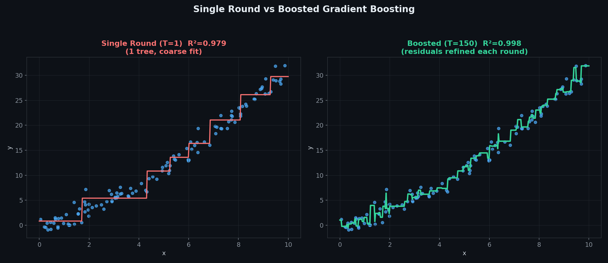
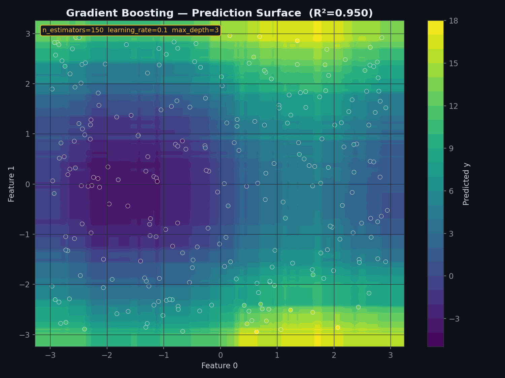
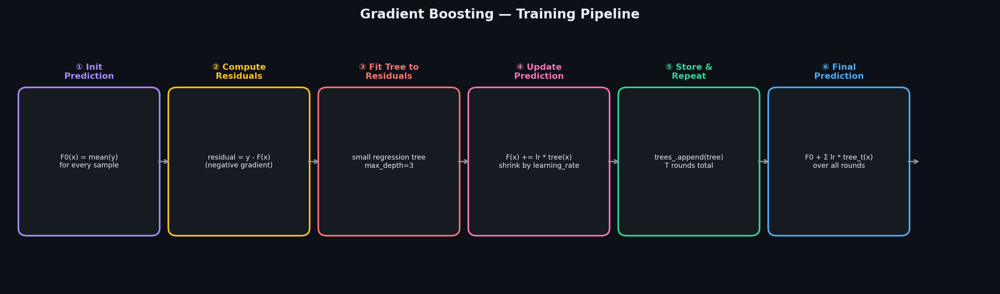
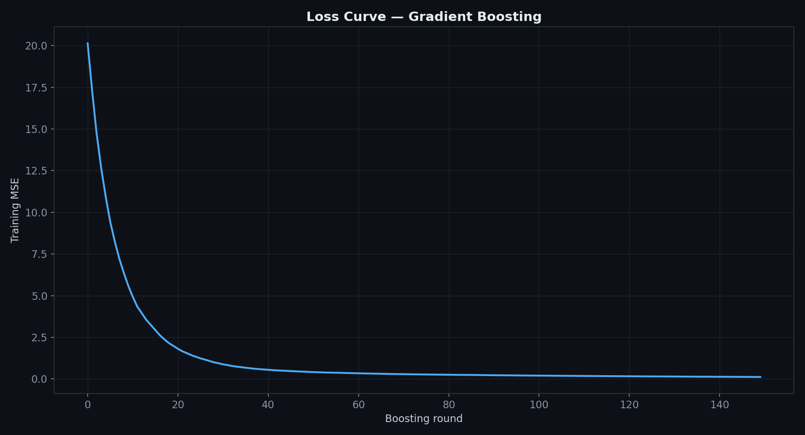
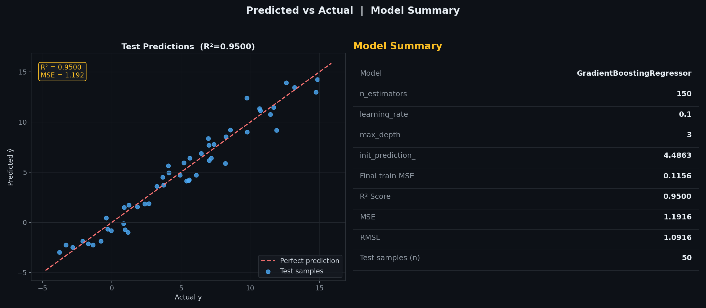
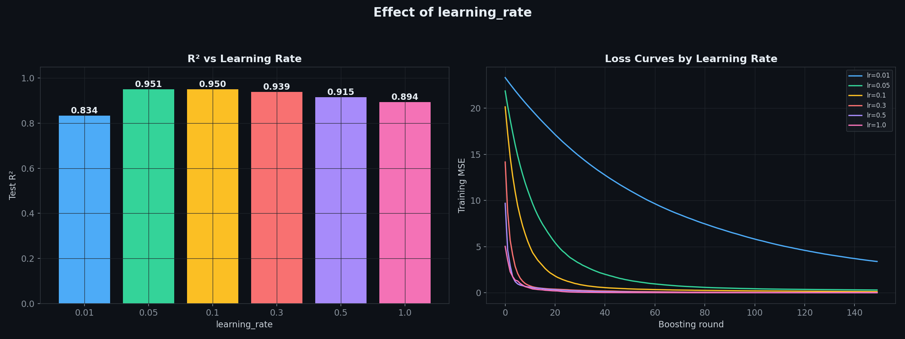
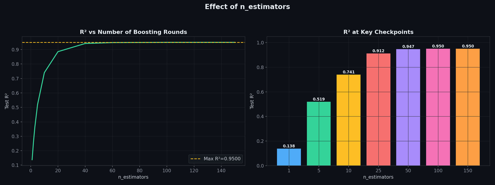
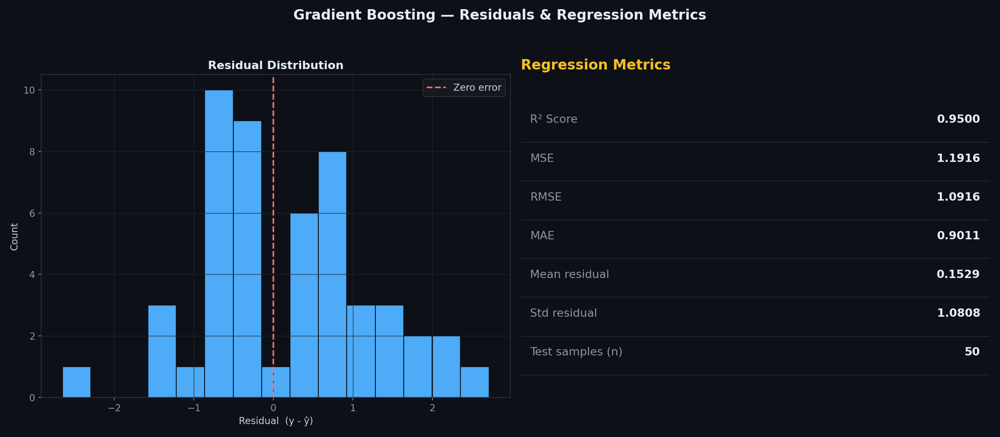

# Gradient Boosting Regressor — Fitting Trees to Residuals

> A clean, **NumPy-only** implementation of Gradient Boosting for regression.
> Starts from a single constant prediction, then each round fits a small tree to the **current residuals** and nudges the overall prediction closer, scaled by a `learning_rate`.
> Unlike AdaBoost, there's no sample reweighting or voting — every round directly targets what the ensemble still has wrong.

---

## Table of Contents

1. [What is Gradient Boosting?](#1-what-is-gradient-boosting)
2. [How This Differs from AdaBoost](#2-how-this-differs-from-adaboost)
3. [The Model](#3-the-model)
4. [Fitting to Residuals — Why It Works](#4-fitting-to-residuals--why-it-works)
5. [The Weak Learner](#5-the-weak-learner)
6. [Single Round vs Boosted Ensemble](#6-single-round-vs-boosted-ensemble)
7. [Prediction Surface](#7-prediction-surface)
8. [Training Pipeline](#8-training-pipeline)
9. [Loss Curve](#9-loss-curve)
10. [Predicted vs Actual](#10-predicted-vs-actual)
11. [Effect of learning_rate](#11-effect-of-learning_rate)
12. [Effect of n_estimators](#12-effect-of-n_estimators)
13. [Residuals & Regression Metrics](#13-residuals--regression-metrics)
14. [Usage](#14-usage)
15. [Assumptions](#15-assumptions)
16. [Pros & Cons vs AdaBoost.R2 & Random Forest Regressor](#16-pros--cons-vs-adaboostr2--random-forest-regressor)

---

## 1. What is Gradient Boosting?

Gradient Boosting builds an ensemble one small tree at a time, where each new tree is trained to correct the mistakes of everything built so far. Concretely: start with a trivial prediction (the target mean), measure how wrong it is on every sample, then train a tree to predict those errors — and add a shrunk version of that tree's output to the running prediction. Repeat.

| Symbol | Name | Meaning |
|--------|------|---------|
| $F_t(x)$ | Ensemble prediction after round $t$ | Running sum of the initial value plus every tree so far |
| $r_i$ | Residual | $y_i - F_t(x_i)$ — what's still unexplained after round $t$ |
| $h_t(x)$ | Round $t$'s tree | Trained to predict the residuals, not the original target |
| $\alpha$ | `learning_rate` | Shrinks each tree's contribution to the running prediction |
| $T$ | `n_estimators` | Total number of boosting rounds |

---

## 2. How This Differs from AdaBoost

Both are sequential boosting methods, but they correct mistakes differently:

- **AdaBoost** reweights *samples* — misclassified or badly-predicted points get more weight, so the *next weak learner* is trained on a re-weighted version of the *original* targets.
- **Gradient Boosting** reweights nothing. Instead, it changes the *target* — each tree is trained directly on the current **residuals**, so it's explicitly learning to fill in whatever gap remains.

For squared-error loss, "fitting to the residuals" and "fitting to the negative gradient of the loss" are the same thing — which is where the technique gets its name.

---

## 3. The Model

The final prediction is the initial guess plus every tree's shrunk contribution:

$$F_T(x) = F_0(x) + \alpha \sum_{t=1}^{T} h_t(x), \qquad F_0(x) = \bar{y}$$

Each $h_t$ is a small regression tree fit on the residuals from the previous round, not on $y$ directly.

---

## 4. Fitting to Residuals — Why It Works

At round $t$, the current prediction is $F_{t-1}(x)$ and the residual for sample $i$ is:

$$r_i = y_i - F_{t-1}(x_i)$$

A tree $h_t$ is then trained to predict $r_i$ from $x_i$. Adding $\alpha \cdot h_t(x)$ to the running prediction moves it a small step closer to the true target — repeating this enough times drives the residuals toward zero. The `learning_rate` controls the step size: smaller steps need more rounds but generalise better; larger steps converge faster but risk overshooting.

---

## 5. The Weak Learner

A single `DecisionTree` (same `CreateNode` / MSE-splitting structure as the standalone Decision Tree and Random Forest regressors in this repo), typically kept shallow — `max_depth=3` by default. Unlike the Random Forest's trees, there's no random feature subsampling here: every split considers every feature, since the randomness that matters for bagging isn't needed when each tree is explicitly targeting a different, evolving residual.

---

## 6. Single Round vs Boosted Ensemble



**Left:** a single depth-3 tree, fit directly to the target with `learning_rate=1.0`, already captures the broad shape. **Right:** 150 rounds at `learning_rate=0.1`, each fixing a little more of the remaining residual, converge to a noticeably tighter fit.

---

## 7. Prediction Surface



The ensemble's prediction surface over two input features, built from 150 shallow trees stacked on top of each other. Despite each individual tree being simple, the sum of many small, residual-correcting trees produces a smooth, expressive surface.

---

## 8. Training Pipeline



The loop that runs once per boosting round, `n_estimators` times:

| Step | Operation |
|------|-----------|
| ① | Initialise prediction — start every sample at the target mean |
| ② | Compute residuals — what's still unexplained |
| ③ | Fit a small tree to those residuals |
| ④ | Update the running prediction, scaled by `learning_rate` |
| ⑤ | Store the tree, repeat for $T$ rounds |
| ⑥ | Final prediction — sum of the initial value and every tree's contribution |

---

## 9. Loss Curve



Training MSE drops steeply in the first several rounds as the easiest patterns get picked up, then flattens out as later rounds chase smaller and smaller remaining errors — the same overall shape seen in the GD/SGD regressors' loss curves, just driven by trees instead of a single global gradient step.

---

## 10. Predicted vs Actual



**Left panel:** each point is one test sample — actual $y$ on the x-axis, predicted $\hat{y}$ on the y-axis. Points hugging the red dashed diagonal are accurate predictions. **Right panel:** full model summary, including the initial prediction and the final round's training MSE.

---

## 11. Effect of learning_rate



**Left:** test R² across a range of learning rates, with the same `n_estimators=150` throughout — too small (`0.01`) doesn't get enough rounds to converge; too large (`1.0`) overshoots and generalises worse. **Right:** the corresponding training loss curves — smaller learning rates descend more slowly but more smoothly.

---

## 12. Effect of n_estimators



R² climbs steadily with more rounds, then levels off once the residuals have mostly been explained — adding more trees past that point mainly risks overfitting rather than helping.

---

## 13. Residuals & Regression Metrics



**Left:** distribution of test-set residuals — should be roughly centred at zero with no strong skew. **Right:** the full set of regression metrics (R², MSE, RMSE, MAE, mean/std of residuals) in one place.

---

## 14. Usage

### Basic fit and predict

```python
import numpy as np
from GradientBoostingRegressor import GradientBoostingRegressor

X_train = np.random.uniform(-3, 3, (200, 3))
y_train = np.sin(X_train[:, 0]) * 3 + X_train[:, 1] ** 2 + np.random.randn(200) * 0.3

model = GradientBoostingRegressor(n_estimators=150, learning_rate=0.1, max_depth=3, random_state=42)
model.fit(X_train, y_train)

print(model)
print(f"Init prediction : {model.init_prediction_:.4f}")
print(f"Final train MSE : {model.train_loss_[-1]:.4f}")

X_test = np.random.uniform(-3, 3, (20, 3))
y_pred = model.predict(X_test)
print(f"Predictions : {y_pred}")
```

### Plot the loss curve

```python
import matplotlib.pyplot as plt

plt.plot(model.train_loss_)
plt.xlabel("Boosting round")
plt.ylabel("Training MSE")
plt.title("Gradient Boosting Loss Curve")
plt.show()
```

### Comparing learning rates

```python
for lr in [0.01, 0.05, 0.1, 0.3, 1.0]:
    m = GradientBoostingRegressor(n_estimators=150, learning_rate=lr, max_depth=3, random_state=42)
    m.fit(X_train, y_train)
    print(f"learning_rate={lr:<5} -> R²={m.score(X_train, y_train):.4f}")
```

---

## 15. Assumptions

| # | Assumption | How to check |
|---|-----------|--------------|
| 1 | **learning_rate and n_estimators trade off against each other** — smaller rates need more rounds | Cross-validate both together rather than tuning independently |
| 2 | **No feature scaling needed** — trees split on raw thresholds | — |
| 3 | **Sensitive to outliers** — squared-error residuals let large errors dominate early rounds | Consider capping extreme targets, or a robust loss variant |
| 4 | **Can overfit with too many rounds** — later trees eventually start fitting noise in the residuals | Watch `train_loss_` and validate on a held-out set |

> **Smaller learning rates generalise better, given enough rounds** — this is the single most important tuning trade-off in gradient boosting. A common strategy is to pick a small `learning_rate` (0.05-0.1) and increase `n_estimators` until validation performance stops improving.

---

## 16. Pros & Cons vs AdaBoost.R2 & Random Forest Regressor

| Criterion | **Gradient Boosting** | **AdaBoost.R2** | **Random Forest Regressor** |
|-----------|---------------------------|---------------------|----------------------------------|
| Training | Sequential, fits residuals directly | Sequential, reweights samples | Parallel (trees are independent) |
| Combines via | Weighted sum (learning_rate) | Weighted median | Mean average |
| Typical accuracy | Often highest, with tuning | Good | Solid baseline, less tuning needed |
| Sensitivity to noise/outliers | Moderate-high — residuals amplify large errors | High — badly-missed samples get boosted | Low — bootstrap averaging smooths noise |
| Key hyperparameters | `learning_rate` + `n_estimators` (linked) | `n_estimators`, loss type | `n_estimators`, `max_depth` |
| Training speed | Slower — sequential, many small trees | Slower — sequential | Faster — trees train independently |
| sklearn equivalent | `GradientBoostingRegressor` | `AdaBoostRegressor` | `RandomForestRegressor` |

**Rule of thumb:** reach for Gradient Boosting when squeezing out maximum accuracy is worth the extra tuning effort; prefer a Random Forest as a faster, lower-maintenance baseline that's naturally more resistant to overfitting.

---

## Dependencies

```
numpy >= 1.21
matplotlib >= 3.4   # optional — for plots only
```

---

## License

MIT
