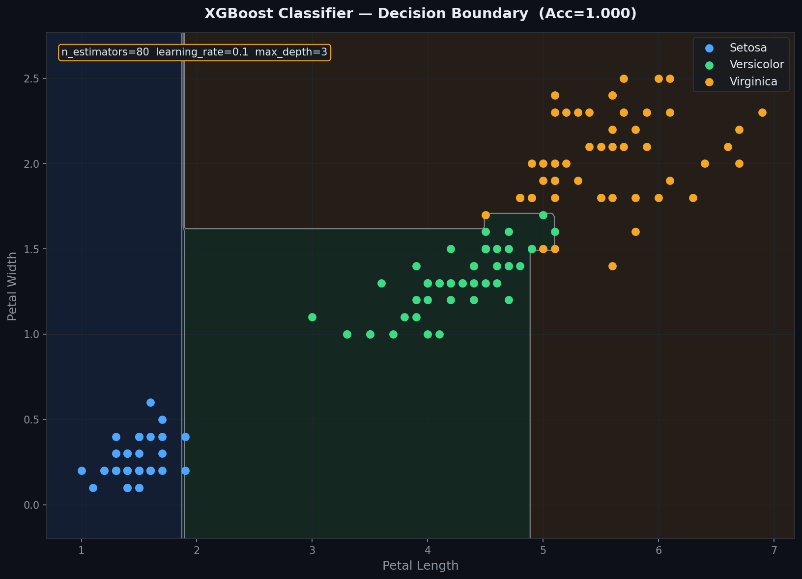
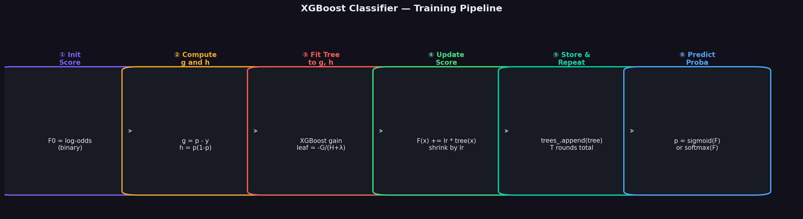
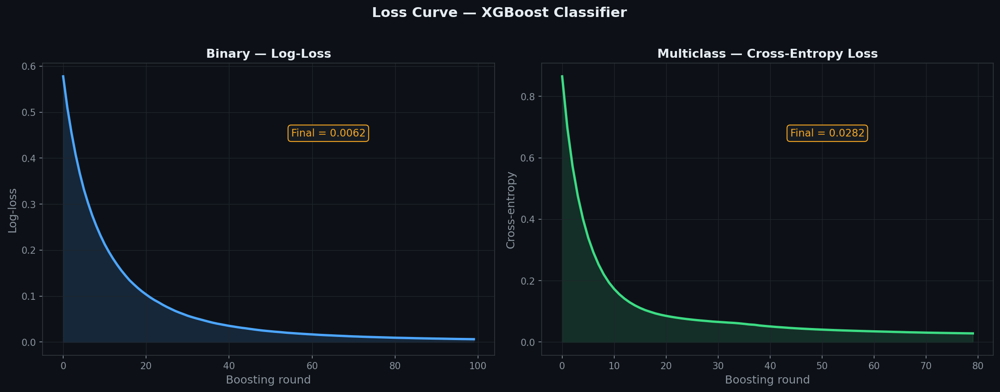
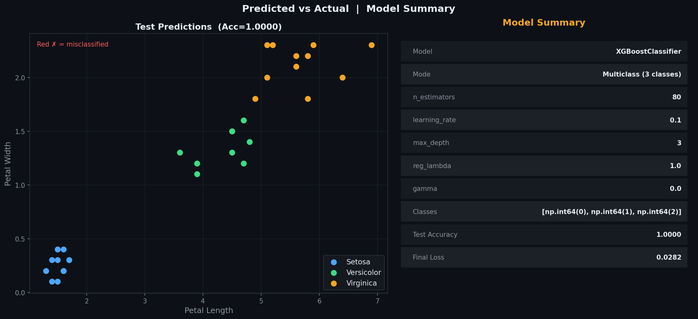
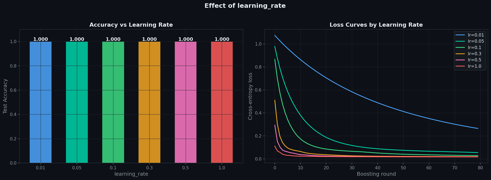
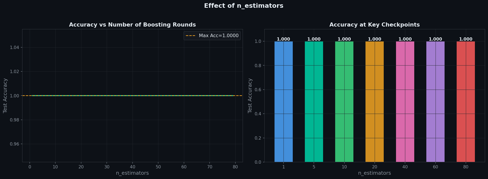
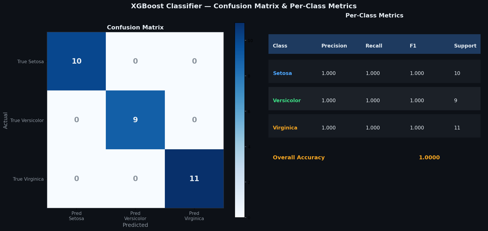

# XGBoost Classifier — Second-Order Gradient Boosting for Classification

> A clean, **NumPy-only** implementation of XGBoost for classification.  
> Supports **binary** (log-loss + sigmoid) and **multiclass** (cross-entropy + softmax, OvR).  
> Uses both **gradient (g)** and **hessian (h)** of the loss for precise leaf weights and split gains,  
> plus built-in **L2 regularisation** and **gain-based pruning** — same core as XGBoostRegressor.

---

## Table of Contents

1. [What is XGBoost Classifier?](#1-what-is-xgboost-classifier)
2. [The Model](#2-the-model)
3. [How It Differs from XGBoost Regressor](#3-how-it-differs-from-xgboost-regressor)
4. [Binary Classification — Log-Loss](#4-binary-classification--log-loss)
5. [Multiclass Classification — Softmax OvR](#5-multiclass-classification--softmax-ovr)
6. [XGBoost Gain & Leaf Weight](#6-xgboost-gain--leaf-weight)
7. [Regularisation and Pruning](#7-regularisation-and-pruning)
8. [Geometric Intuition](#8-geometric-intuition)
9. [Decision Boundary](#9-decision-boundary)
10. [Training Pipeline](#10-training-pipeline)
11. [Loss Curve](#11-loss-curve)
12. [Predicted vs Actual](#12-predicted-vs-actual)
13. [Effect of learning_rate](#13-effect-of-learning_rate)
14. [Effect of n_estimators](#14-effect-of-n_estimators)
15. [Confusion Matrix & Metrics](#15-confusion-matrix--metrics)
16. [Usage](#16-usage)
17. [Assumptions](#17-assumptions)
18. [Pros & Cons vs AdaBoost & GBM Classifier](#18-pros--cons-vs-adaboost--gbm-classifier)

---

## 1. What is XGBoost Classifier?

XGBoost Classifier builds an ensemble of trees sequentially, where each tree corrects the probabilistic errors of all previous trees. Unlike AdaBoost (which re-weights samples) or plain Gradient Boosting (which fits raw residuals), XGBoost uses a **second-order Taylor approximation** of the log-loss or cross-entropy — giving more mathematically precise splits and leaf values.

| Symbol | Name | Meaning |
|--------|------|---------|
| $F_t(x)$ | Raw score after round $t$ | Running sum — passed through sigmoid/softmax for probabilities |
| $g_i$ | Gradient | First derivative of loss w.r.t. $F(x_i)$ |
| $h_i$ | Hessian | Second derivative of loss w.r.t. $F(x_i)$ |
| $\alpha$ | `learning_rate` | Shrinks each tree's contribution |
| $\lambda$ | `reg_lambda` | L2 regularisation on leaf weights |
| $\gamma$ | `gamma` | Minimum gain required to make a split |
| $T$ | `n_estimators` | Total number of boosting rounds |

Two modes controlled by the number of unique classes in `y_train`:

| Mode | Condition | Loss | Activation |
|------|-----------|------|-----------|
| Binary | 2 classes | Log-loss | Sigmoid |
| Multiclass | 3+ classes | Cross-entropy | Softmax (OvR) |

---

## 2. The Model

**Binary:** raw score for sample $i$ after $T$ rounds:

$$F_T(x_i) = F_0 + \alpha \sum_{t=1}^{T} h_t(x_i)$$

$$P(y=1 \mid x) = \sigma(F_T(x)) = \frac{1}{1 + e^{-F_T(x)}}$$

**Multiclass (OvR):** one score per class $k$, passed through softmax:

$$P(y=k \mid x) = \text{softmax}(F_T^{(k)}(x))_k = \frac{e^{F_T^{(k)}(x)}}{\sum_j e^{F_T^{(j)}(x)}}$$

Init score:

- Binary: $F_0 = \log\!\left(\dfrac{\bar{p}}{1-\bar{p}}\right)$ — log-odds of the positive class
- Multiclass: $F_0^{(k)} = \log(\text{class freq}_k)$ — one init score per class

---

## 3. How It Differs from XGBoost Regressor

| Aspect | XGBoostRegressor | XGBoostClassifier |
|--------|-----------------|------------------|
| Loss | MSE | Log-loss (binary) / Cross-entropy (multi) |
| Gradient $g_i$ | $\hat{y}_i - y_i$ | $p_i - y_i$ |
| Hessian $h_i$ | $1.0$ | $p_i(1-p_i)$ |
| Init score | $\bar{y}$ | Log-odds / log(class freq) |
| Output | Raw prediction | Probabilities via sigmoid/softmax |
| Multiclass | Not applicable | OvR — $K$ trees per round |
| `train_loss_` | Training MSE | Training log-loss |

The `XGBTree` and gain formula are **identical** — only the gradient and hessian change.

---

## 4. Binary Classification — Log-Loss

For binary labels $y \in \{0, 1\}$ with predicted probability $p = \sigma(F(x))$:

$$\mathcal{L} = -\frac{1}{n}\sum_{i=1}^{n}\left[y_i \log p_i + (1-y_i)\log(1-p_i)\right]$$

Gradients and hessians:

$$g_i = p_i - y_i \qquad h_i = p_i(1 - p_i)$$

The hessian $h_i = p_i(1-p_i)$ is largest when $p_i \approx 0.5$ (most uncertain) and smallest near 0 or 1 (most confident) — this naturally down-weights confident predictions and focuses the tree on uncertain samples.

---

## 5. Multiclass Classification — Softmax OvR

For $K$ classes with one-hot targets $Y \in \{0,1\}^{n \times K}$:

$$\mathcal{L} = -\frac{1}{n}\sum_{i=1}^{n}\sum_{k=1}^{K} Y_{ik}\log p_{ik}$$

At each round, $K$ trees are fitted — one per class:

$$g_i^{(k)} = p_i^{(k)} - Y_{ik} \qquad h_i^{(k)} = p_i^{(k)}(1 - p_i^{(k)})$$

Each tree independently corrects that class's score. The softmax ensures all $K$ probabilities sum to 1 after each update.

---

## 6. XGBoost Gain & Leaf Weight

**Split gain** — computed for every candidate feature/threshold:

$$\text{Gain} = \frac{1}{2}\left[\frac{G_L^2}{H_L + \lambda} + \frac{G_R^2}{H_R + \lambda} - \frac{G^2}{H + \lambda}\right] - \gamma$$

**Optimal leaf weight:**

$$w_j^* = -\frac{G_j}{H_j + \lambda}$$

where $G_j = \sum_{i \in S_j} g_i$ and $H_j = \sum_{i \in S_j} h_i$ over samples in leaf $j$.

The hessian in the denominator means that uncertain samples (large $h_i$) pull the leaf weight toward zero more strongly — a natural confidence-weighted regularisation.

---

## 7. Regularisation and Pruning

| Parameter | Effect |
|-----------|--------|
| `reg_lambda` | L2 penalty on leaf weights — larger = more shrinkage |
| `gamma` | Minimum gain to split — larger = shallower, simpler trees |
| `max_depth` | Hard depth limit |
| `min_samples_split` | Minimum samples to attempt a split |

Start with `reg_lambda=1.0`, `gamma=0.0` and increase if the model overfits on validation data.

---

## 8. Geometric Intuition

- Each round shifts the decision boundary slightly — early rounds make large corrections, later rounds make fine adjustments
- The log-loss gradient $g_i = p_i - y_i$ is largest for confidently wrong predictions — the model prioritises fixing its worst mistakes first
- Increasing `reg_lambda` smooths the boundary — less risk of overfitting on noisy class regions
- Increasing `gamma` prunes splits that give tiny gains — forces each tree to make only meaningful splits

---

## 9. Decision Boundary



| Visual Element | Meaning |
|----------------|---------|
| Coloured regions | Predicted class regions — ensemble boundary |
| White contour lines | Decision boundaries between classes |
| Coloured dots | Training samples per class |

XGBoost builds smooth, complex boundaries by summing many shallow trees — unlike a single Decision Tree's axis-aligned rectangles.

---

## 10. Training Pipeline



**Binary** — per round:

| Step | Operation |
|------|-----------|
| ① | Compute $p = \sigma(F(x))$ — current probabilities |
| ② | Compute $g = p - y$, $h = p(1-p)$ |
| ③ | Fit one `XGBTree` to $g$, $h$ |
| ④ | Update $F(x) \mathrel{+}= \alpha \cdot \text{tree}(x)$ |
| ⑤ | Store tree, repeat $T$ rounds |

**Multiclass** — per round: repeat steps ①–④ for each of the $K$ classes independently.

---

## 11. Loss Curve



Training log-loss stored in `train_loss_` drops steeply in the first rounds as the largest probability errors get corrected, then flattens as the model converges. Always plot this to confirm convergence and detect overfitting.

---

## 12. Predicted vs Actual



**Left panel:** correct predictions shown as coloured dots. Red ✗ marks misclassified test samples.

**Right panel:** full model summary — all hyperparameters, classes, mode (binary/multiclass), accuracy.

---

## 13. Effect of learning_rate



Too small — model doesn't converge in the given rounds. Too large — model overshoots and generalises poorly. The sweet spot is typically `0.05–0.1` with enough rounds.

---

## 14. Effect of n_estimators



Accuracy climbs steeply in early rounds, then plateaus. More rounds past the plateau risk overfitting — especially without `reg_lambda` or `gamma` to constrain tree complexity.

---

## 15. Confusion Matrix & Metrics



**Left — Confusion Matrix:** rows are true classes, columns are predicted.

**Right — Per-Class Metrics:**

| Metric | Formula | Meaning |
|--------|---------|---------|
| Precision | $TP / (TP + FP)$ | Of all predicted as class $k$, how many were actually $k$ |
| Recall | $TP / (TP + FN)$ | Of all true class $k$, how many were correctly found |
| F1 | $2 \cdot P \cdot R / (P + R)$ | Harmonic mean of precision and recall |

---

## 16. Usage

### Binary classification

```python
import numpy as np
from XGBoostClassifier import XGBoostClassifier
from sklearn.datasets import load_breast_cancer
from sklearn.model_selection import train_test_split
from sklearn.preprocessing import StandardScaler

X, y = load_breast_cancer(return_X_y=True)
X_train, X_test, y_train, y_test = train_test_split(X, y, test_size=0.2, random_state=42)

scaler  = StandardScaler()
X_train = scaler.fit_transform(X_train)
X_test  = scaler.transform(X_test)

model = XGBoostClassifier(n_estimators=100, learning_rate=0.1,
                           max_depth=3, reg_lambda=1.0, gamma=0.0,
                           random_state=42)
model.fit(X_train, y_train)

print(f"Accuracy      : {model.score(X_test, y_test):.4f}")
print(f"Final log-loss: {model.train_loss_[-1]:.4f}")
print(model)

y_pred  = model.predict(X_test)
y_proba = model.predict_proba(X_test)
print(f"Proba shape   : {y_proba.shape}")
```

### Multiclass classification

```python
from sklearn.datasets import load_iris

X, y = load_iris(return_X_y=True)
X_train, X_test, y_train, y_test = train_test_split(X, y, test_size=0.2, random_state=42)

model = XGBoostClassifier(n_estimators=50, learning_rate=0.1,
                           max_depth=3, reg_lambda=1.0, random_state=42)
model.fit(X_train, y_train)

print(f"Accuracy  : {model.score(X_test, y_test):.4f}")
print(f"Classes   : {model.classes_}")
print(f"n_classes : {model.n_classes_}")
print(model)
```

### Plot loss curve

```python
import matplotlib.pyplot as plt

plt.plot(model.train_loss_)
plt.xlabel("Boosting round")
plt.ylabel("Log-loss")
plt.title("XGBoost Classifier — Loss Curve")
plt.show()
```

### Tuning reg_lambda and gamma

```python
for lam in [0.1, 1.0, 5.0, 10.0]:
    m = XGBoostClassifier(n_estimators=100, learning_rate=0.1,
                           max_depth=3, reg_lambda=lam, random_state=42)
    m.fit(X_train, y_train)
    print(f"reg_lambda={lam:5.1f}  Acc={m.score(X_test, y_test):.4f}")

for gam in [0.0, 0.5, 1.0, 2.0]:
    m = XGBoostClassifier(n_estimators=100, learning_rate=0.1,
                           max_depth=3, gamma=gam, random_state=42)
    m.fit(X_train, y_train)
    print(f"gamma={gam:5.1f}  Acc={m.score(X_test, y_test):.4f}")
```

### Comparing learning rates

```python
for lr in [0.01, 0.05, 0.1, 0.3, 1.0]:
    m = XGBoostClassifier(n_estimators=100, learning_rate=lr,
                           max_depth=3, random_state=42)
    m.fit(X_train, y_train)
    print(f"learning_rate={lr:<5}  Acc={m.score(X_test, y_test):.4f}")
```

---

## 17. Assumptions

| # | Assumption | How to check |
|---|-----------|--------------|
| 1 | Binary or multiclass labels only | `len(np.unique(y))` >= 2 |
| 2 | Feature scaling recommended | Apply `StandardScaler` before fitting |
| 3 | `reg_lambda > 0` always recommended | Default is 1.0 — prevents leaf weights exploding |
| 4 | Smaller `learning_rate` needs more rounds | Monitor `train_loss_` |
| 5 | Can overfit with too many rounds | Watch train vs test accuracy |

> **Feature scaling** — not strictly required (tree splits are threshold-based) but helps gradient magnitudes stay in a reasonable range, especially for log-loss with large raw scores.

---

## 18. Pros & Cons vs AdaBoost & GBM Classifier

| Criterion | XGBoost | AdaBoost | Gradient Boosting |
|-----------|---------|---------|------------------|
| Loss | Log-loss / Cross-entropy | Exponential loss | Log-loss / deviance |
| Gradient order | Second-order ($g$ + $h$) | First-order (sample weights) | First-order |
| Leaf values | Regularised optimal weight | Majority vote | Mean of residuals |
| Regularisation | Built-in — $\lambda$, $\gamma$ | None | None |
| Multiclass | OvR — $K$ trees/round | OvR — $K$ classifiers | OvR or multinomial |
| Overfitting risk | Low (lambda + gamma) | Moderate | Moderate |
| Training speed | Slower — sequential + gain | Faster — stumps only | Slower — sequential |
| Accuracy | Highest with tuning | Good on clean data | High |
| sklearn equiv | `XGBClassifier` | `AdaBoostClassifier` | `GradientBoostingClassifier` |

---

## Dependencies

```
numpy >= 1.21
matplotlib >= 3.4   # optional — for plots only
sklearn              # optional — for datasets only
```

---

## License

MIT
