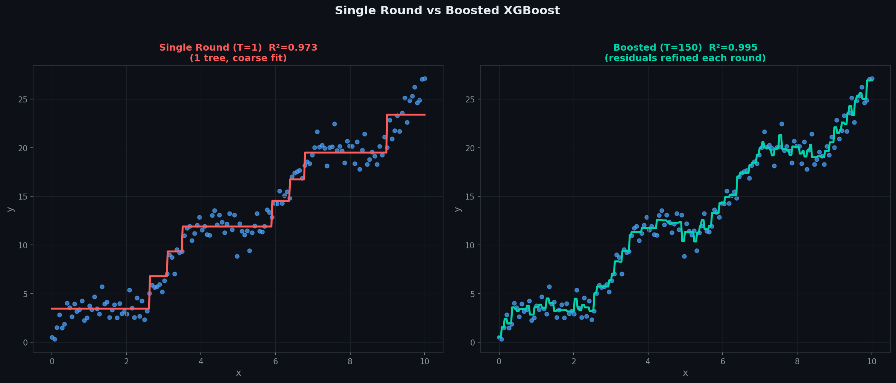
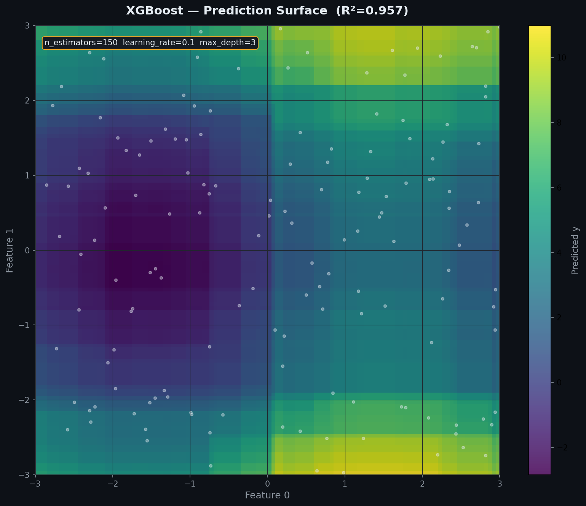
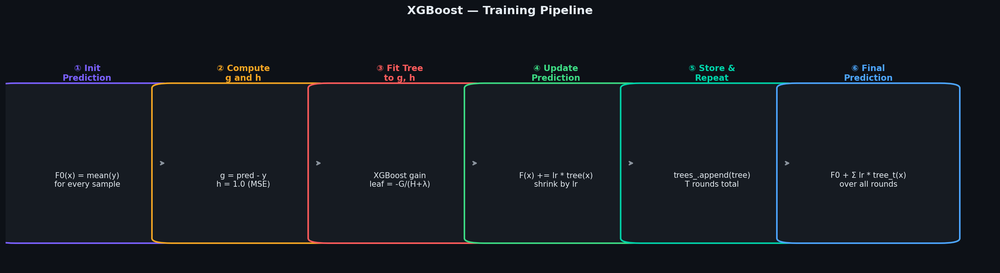
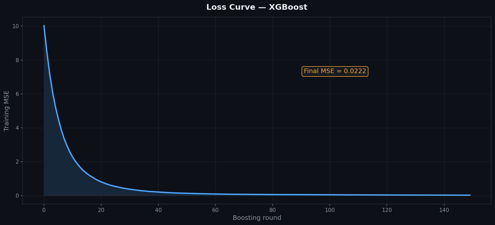
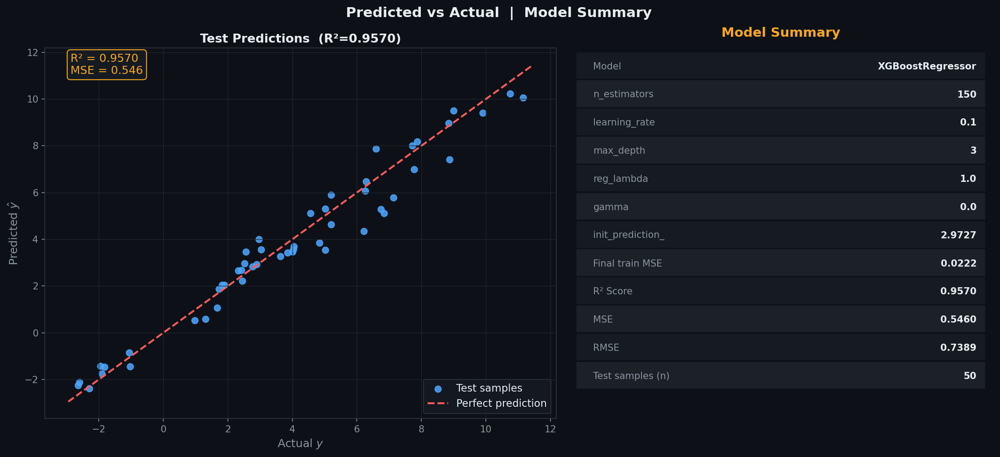
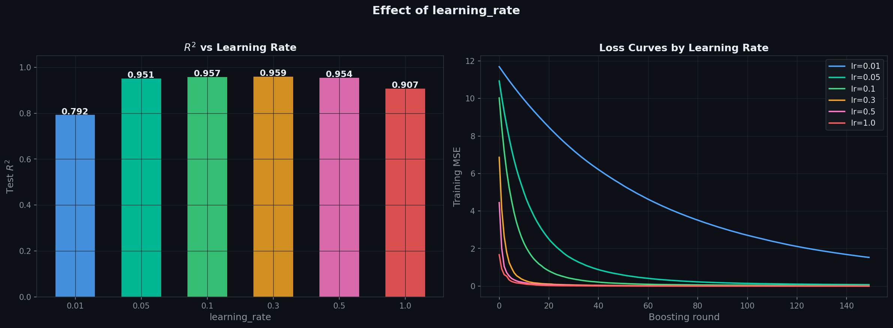
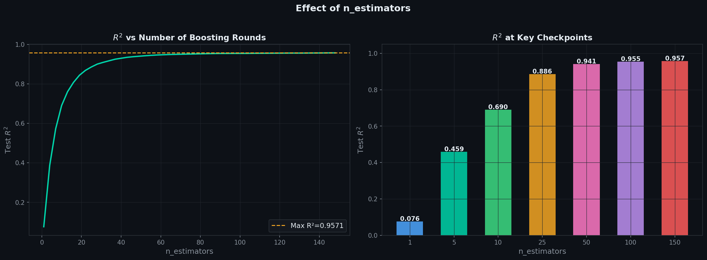
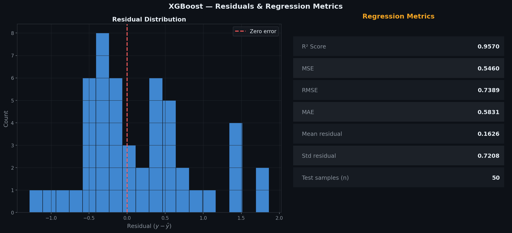

# XGBoost Regressor — Second-Order Gradient Boosting

> A clean, **NumPy-only** implementation of XGBoost for regression.  
> Extends Gradient Boosting by using both the **gradient (g)** and **hessian (h)** of the loss  
> to compute exact leaf weights and split gains, plus built-in **L2 regularisation** and **gain-based pruning**.  
> Same residual-fitting idea as GBR — but with more mathematically precise tree construction.

---

## Table of Contents

1. [What is XGBoost?](#1-what-is-xgboost)
2. [How This Differs from Gradient Boosting](#2-how-this-differs-from-gradient-boosting)
3. [The Model](#3-the-model)
4. [Second-Order Approximation — Why It Works](#4-second-order-approximation--why-it-works)
5. [XGBoost Gain Formula](#5-xgboost-gain-formula)
6. [Optimal Leaf Weight](#6-optimal-leaf-weight)
7. [Regularisation and Pruning](#7-regularisation-and-pruning)
8. [Single Round vs Boosted Ensemble](#8-single-round-vs-boosted-ensemble)
9. [Prediction Surface](#9-prediction-surface)
10. [Training Pipeline](#10-training-pipeline)
11. [Loss Curve](#11-loss-curve)
12. [Predicted vs Actual](#12-predicted-vs-actual)
13. [Effect of learning_rate](#13-effect-of-learning_rate)
14. [Effect of n_estimators](#14-effect-of-n_estimators)
15. [Residuals & Regression Metrics](#15-residuals--regression-metrics)
16. [Usage](#16-usage)
17. [Assumptions](#17-assumptions)
18. [Pros & Cons vs GBR & Random Forest](#18-pros--cons-vs-gbr--random-forest)

---

## 1. What is XGBoost?

XGBoost (Extreme Gradient Boosting) builds an ensemble one tree at a time, where each new tree is trained to correct the mistakes of everything built so far — same as Gradient Boosting. The key difference is **how** each tree is built: XGBoost uses a second-order Taylor expansion of the loss function, giving it more information per split.

| Symbol | Name | Meaning |
|--------|------|---------|
| $F_t(x)$ | Ensemble prediction after round $t$ | Running sum of init value plus all trees so far |
| $g_i$ | Gradient | First derivative of loss w.r.t. $F(x_i)$ — direction of error |
| $h_i$ | Hessian | Second derivative of loss w.r.t. $F(x_i)$ — curvature |
| $\alpha$ | `learning_rate` | Shrinks each tree's contribution |
| $\lambda$ | `reg_lambda` | L2 regularisation on leaf weights |
| $\gamma$ | `gamma` | Minimum gain required to make a split |
| $T$ | `n_estimators` | Total number of boosting rounds |

For squared loss (MSE):

$$g_i = \hat{y}_i - y_i \qquad h_i = 1$$

---

## 2. How This Differs from Gradient Boosting

Both methods fit trees sequentially to correct residual errors. The key differences:

| Aspect | Gradient Boosting | XGBoost |
|--------|------------------|---------|
| Tree targets | Raw residuals $r_i = y_i - F(x_i)$ | Gradients $g_i$ and hessians $h_i$ |
| Split criterion | Variance reduction (MSE of residuals) | XGBoost gain formula using $G$, $H$ |
| Leaf values | Mean of residuals in leaf | $-G_j / (H_j + \lambda)$ — regularised optimal weight |
| Regularisation | None built in | L2 via $\lambda$, minimum gain via $\gamma$ |
| Split pruning | Only gain $> 0$ | Gain must exceed $\gamma$ |

For squared loss both are mathematically equivalent — but XGBoost's formulation generalises naturally to other loss functions just by swapping $g$ and $h$.

---

## 3. The Model

The final prediction is the initial guess plus every tree's shrunk contribution:

$$F_T(x) = F_0(x) + \alpha \sum_{t=1}^{T} h_t(x), \qquad F_0(x) = \bar{y}$$

Each $h_t$ is an `XGBTree` fitted on the gradients and hessians from the previous round.

---

## 4. Second-Order Approximation — Why It Works

At round $t$, the loss for sample $i$ is approximated using a Taylor expansion around the current prediction $F_{t-1}(x_i)$:

$$L_i \approx g_i \cdot h_t(x_i) + \frac{1}{2} h_i \cdot h_t(x_i)^2 + \text{const}$$

Minimising this per-leaf gives an exact analytical solution for the optimal leaf weight — no need for iterative updates. The hessian $h_i$ acts as a local learning rate that adjusts how much each sample should influence the leaf.

---

## 5. XGBoost Gain Formula

At each split candidate, the gain is:

$$\text{Gain} = \frac{1}{2}\left[\frac{G_L^2}{H_L + \lambda} + \frac{G_R^2}{H_R + \lambda} - \frac{G^2}{H + \lambda}\right] - \gamma$$

where $G = \sum g_i$, $H = \sum h_i$ over the node's samples, and $L$, $R$ denote left and right children.

A split is made only if Gain $> 0$. The $\gamma$ term directly penalises tree complexity — increasing it produces shallower, simpler trees.

---

## 6. Optimal Leaf Weight

For each leaf $j$ containing samples $S_j$, the optimal weight that minimises the second-order approximation is:

$$w_j^* = -\frac{G_j}{H_j + \lambda} = -\frac{\sum_{i \in S_j} g_i}{\sum_{i \in S_j} h_i + \lambda}$$

The $\lambda$ in the denominator shrinks the leaf weight toward zero — this is the L2 regularisation effect. Larger $\lambda$ means smaller, more conservative leaf weights.

---

## 7. Regularisation and Pruning

| Parameter | Effect |
|-----------|--------|
| `reg_lambda` | L2 penalty on leaf weights — larger = more shrinkage toward zero |
| `gamma` | Minimum gain to make a split — larger = fewer splits, shallower trees |
| `max_depth` | Hard depth limit — same as GBR |
| `min_samples_split` | Minimum samples to attempt a split |

Both `reg_lambda` and `gamma` together control overfitting. Start with `reg_lambda=1.0`, `gamma=0.0` and increase if the model overfits.

---

## 8. Single Round vs Boosted Ensemble



**Left:** a single depth-3 XGBTree with `learning_rate=1.0` — coarse step function fit.  
**Right:** 150 rounds at `learning_rate=0.1` — each tree refines the remaining residuals, converging to a much tighter fit.

---

## 9. Prediction Surface



The ensemble's prediction surface over two input features after 150 boosting rounds. Despite each individual tree being shallow, the sum of many small residual-correcting trees produces a smooth, expressive surface.

---

## 10. Training Pipeline



The loop that runs once per boosting round, `n_estimators` times:

| Step | Operation |
|------|-----------|
| ① | Initialise — start every sample at the training mean |
| ② | Compute $g$ and $h$ — gradient and hessian of the loss |
| ③ | Fit `XGBTree` to $g$, $h$ using the XGBoost gain formula |
| ④ | Update the running prediction, scaled by `learning_rate` |
| ⑤ | Store the tree, repeat for $T$ rounds |
| ⑥ | Final prediction — init value plus every tree's contribution |

---

## 11. Loss Curve



Training MSE drops steeply in the first rounds as the largest residuals get corrected, then flattens as later rounds chase smaller remaining errors. XGBoost typically converges faster than plain GBR for the same number of rounds due to the more precise split criterion.

---

## 12. Predicted vs Actual



**Left panel:** each point is one test sample — actual $y$ on x-axis, predicted $\hat{y}$ on y-axis. Points hugging the red dashed diagonal are accurate predictions.

**Right panel:** full model summary — all hyperparameters, init prediction, final train MSE, R², MSE, RMSE, and test sample count.

---

## 13. Effect of learning_rate



**Left:** test R² across a range of learning rates with the same `n_estimators=150`. Too small (`0.01`) doesn't converge in 150 rounds; too large (`1.0`) overshoots and generalises worse.

**Right:** corresponding training loss curves — smaller rates descend more slowly but more smoothly.

---

## 14. Effect of n_estimators



R² climbs steeply with the first few rounds, then levels off once most residuals are explained. Adding more rounds past the plateau mainly risks overfitting rather than helping test performance.

---

## 15. Residuals & Regression Metrics



**Left:** distribution of test-set residuals — should be roughly centred at zero with no strong skew.

**Right:** full regression metric table — R², MSE, RMSE, MAE, mean and std of residuals, and test sample count.

---

## 16. Usage

### Basic fit and predict

```python
import numpy as np
from XGBoostRegressor import XGBoostRegressor

X_train = np.random.uniform(-3, 3, (200, 3))
y_train = np.sin(X_train[:,0])*3 + X_train[:,1]**2 + np.random.randn(200)*0.3

model = XGBoostRegressor(n_estimators=150, learning_rate=0.1,
                          max_depth=3, reg_lambda=1.0, gamma=0.0, random_state=42)
model.fit(X_train, y_train)

print(model)
print(f"Init prediction : {model.init_prediction_:.4f}")
print(f"Final train MSE : {model.train_loss_[-1]:.4f}")

X_test = np.random.uniform(-3, 3, (20, 3))
y_pred = model.predict(X_test)
print(f"Predictions : {y_pred}")
```

### Plot the loss curve

```python
import matplotlib.pyplot as plt

plt.plot(model.train_loss_)
plt.xlabel("Boosting round")
plt.ylabel("Training MSE")
plt.title("XGBoost Loss Curve")
plt.show()
```

### Tuning reg_lambda and gamma

```python
for lam in [0.0, 0.1, 1.0, 5.0, 10.0]:
    m = XGBoostRegressor(n_estimators=150, learning_rate=0.1,
                          max_depth=3, reg_lambda=lam, random_state=42)
    m.fit(X_train, y_train)
    print(f"reg_lambda={lam:5.1f}  R²={m.score(X_test, y_test):.4f}")

for gam in [0.0, 0.5, 1.0, 2.0, 5.0]:
    m = XGBoostRegressor(n_estimators=150, learning_rate=0.1,
                          max_depth=3, gamma=gam, random_state=42)
    m.fit(X_train, y_train)
    print(f"gamma={gam:5.1f}  R²={m.score(X_test, y_test):.4f}")
```

### Comparing learning rates

```python
for lr in [0.01, 0.05, 0.1, 0.3, 1.0]:
    m = XGBoostRegressor(n_estimators=150, learning_rate=lr,
                          max_depth=3, random_state=42)
    m.fit(X_train, y_train)
    print(f"learning_rate={lr:<5}  R²={m.score(X_test, y_test):.4f}")
```

---

## 17. Assumptions

| # | Assumption | How to check |
|---|-----------|--------------|
| 1 | `learning_rate` and `n_estimators` trade off — smaller rates need more rounds | Cross-validate both together |
| 2 | No feature scaling needed — trees split on raw thresholds | — |
| 3 | `reg_lambda > 0` always recommended — prevents leaf weights exploding | Default is 1.0 |
| 4 | `gamma=0` is fine to start — increase only if the model overfits | Watch train vs test loss |
| 5 | Can overfit with too many rounds — later trees fit noise | Monitor `train_loss_` and validate |

> **Smaller learning rates generalise better given enough rounds** — the standard strategy is `learning_rate=0.05–0.1` with `n_estimators=100–500` and early stopping on a validation set.

---

## 18. Pros & Cons vs GBR & Random Forest

| Criterion | XGBoost | Gradient Boosting | Random Forest |
|-----------|---------|------------------|--------------|
| Training | Sequential, second-order trees | Sequential, first-order trees | Parallel, independent trees |
| Split criterion | XGBoost gain (g, h) | Variance reduction | Variance reduction |
| Leaf values | Regularised optimal weight | Mean of residuals | Mean of samples |
| Regularisation | Built-in — lambda, gamma | None built in | None (depth/n_trees) |
| Typical accuracy | Highest, with tuning | High | Solid baseline |
| Sensitivity to outliers | Moderate | Moderate-high | Low |
| Key hyperparameters | lr + n\_estimators + lambda + gamma | lr + n\_estimators | n\_estimators + max\_depth |
| Training speed | Slower — sequential + gain computation | Slower — sequential | Faster — parallel |
| sklearn equivalent | `XGBRegressor` | `GradientBoostingRegressor` | `RandomForestRegressor` |

**Rule of thumb:** use XGBoost when maximum accuracy is the goal and tuning time is available. Use GBR for a simpler boosting baseline. Use Random Forest when you want a strong result with minimal hyperparameter tuning.

---

## Dependencies

```
numpy >= 1.21
matplotlib >= 3.4   # optional — for plots only
```

---

## License

MIT
