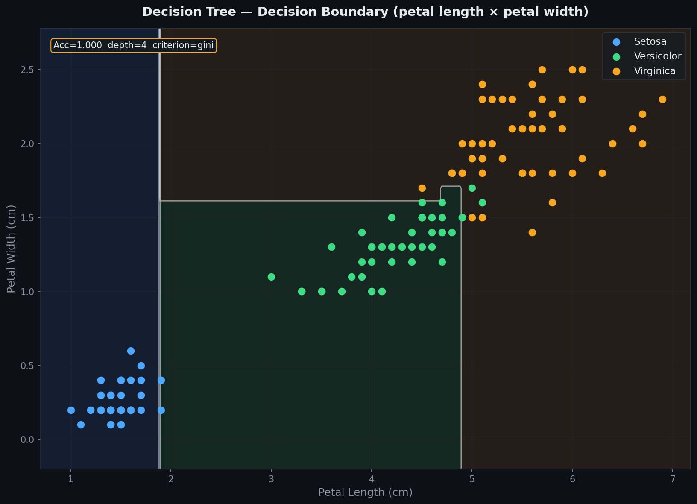
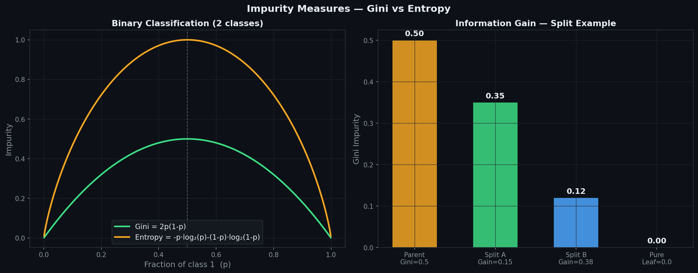
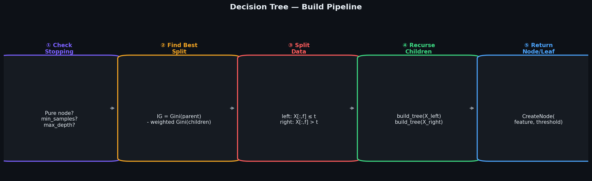
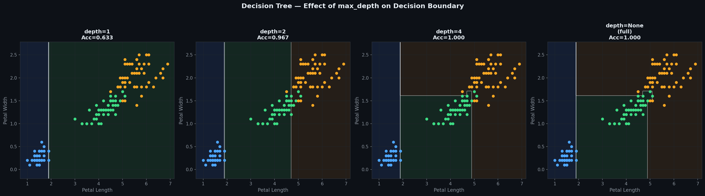
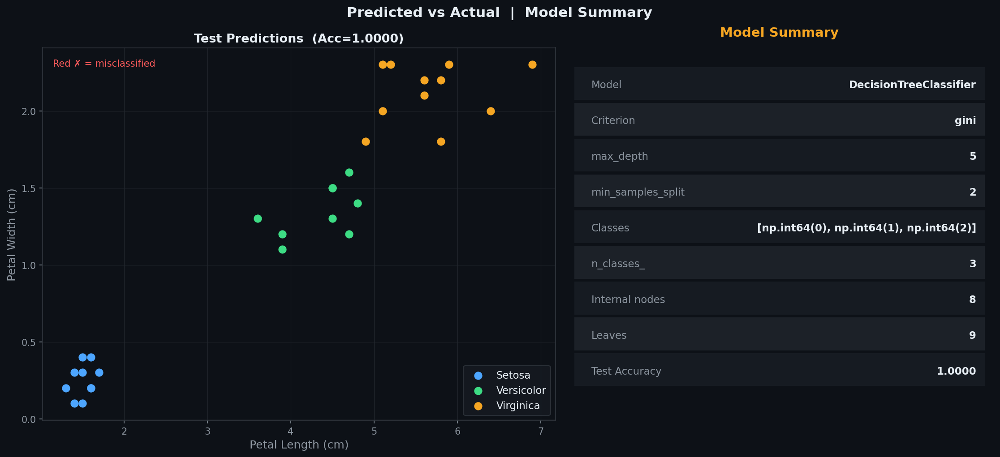
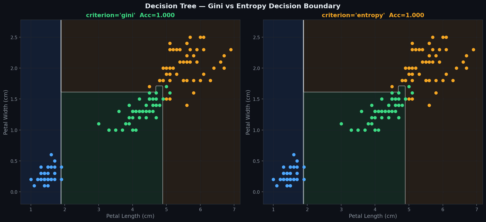
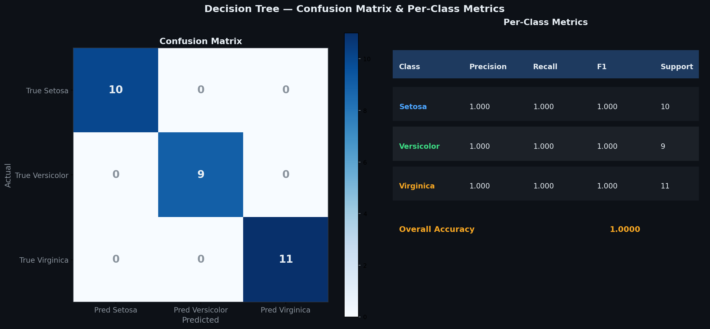

# Decision Tree Classifier — Gini & Entropy

> A clean, **NumPy-only** implementation of Decision Tree Classification  
> supporting **numeric and categorical features**, two impurity criteria — **Gini and Entropy** —  
> and **recursive tree building** with configurable depth and minimum sample constraints.

---

## Table of Contents

1. [What is a Decision Tree?](#1-what-is-a-decision-tree)
2. [The Model](#2-the-model)
3. [Impurity Measures](#3-impurity-measures)
4. [Information Gain](#4-information-gain)
5. [Splitting Strategy](#5-splitting-strategy)
6. [Stopping Conditions](#6-stopping-conditions)
7. [Geometric Intuition](#7-geometric-intuition)
8. [Decision Boundary](#8-decision-boundary)
9. [Impurity Measures Visualised](#9-impurity-measures-visualised)
10. [Build Pipeline](#10-build-pipeline)
11. [Effect of max_depth](#11-effect-of-max_depth)
12. [Predicted vs Actual](#12-predicted-vs-actual)
13. [Gini vs Entropy Boundary](#13-gini-vs-entropy-boundary)
14. [Confusion Matrix & Metrics](#14-confusion-matrix--metrics)
15. [Usage](#15-usage)
16. [Assumptions](#16-assumptions)

---

## 1. What is a Decision Tree?

A Decision Tree recursively partitions the feature space into regions, assigning each region the majority class of training samples that fall within it.

Given $n$ observations $(\mathbf{x}_1, y_1), \ldots, (\mathbf{x}_n, y_n)$, the tree learns a sequence of **if-else rules** on features:

$$\hat{y} = \text{majority\_class}\!\left(\{y_i : \mathbf{x}_i \text{ falls in leaf region}\}\right)$$

| Symbol | Name | Meaning |
|--------|------|---------|
| `feature` | Split feature index | Which column to split on |
| `threshold` | Split value | Numeric: $\leq t$ / $> t$; Categorical: $= c$ / $\neq c$ |
| `max_depth` | Tree depth limit | Prevents overfitting — limits how many splits are made |
| `min_samples_split` | Minimum split size | Node with fewer samples becomes a leaf |
| `criterion` | Impurity measure | `'gini'` or `'entropy'` |

Two node types:

| Node | Condition | Contains |
|------|-----------|---------|
| **Internal node** | `value is None` | `feature`, `threshold`, `left`, `right` |
| **Leaf node** | `value is not None` | Majority class label |

---

## 2. The Model

The tree is a recursive structure of `CreateNode` objects:

```
root
├── Node(feature=2, threshold=1.9)
│   ├── Leaf(value=0)          ← Setosa
│   └── Node(feature=3, threshold=1.7)
│       ├── Leaf(value=1)      ← Versicolor
│       └── Leaf(value=2)      ← Virginica
```

Prediction traverses from root to leaf:

$$\hat{y} = \text{traverse}(\mathbf{x}, \text{root})$$

At each internal node:
- **Numeric:** go left if $x[\text{feature}] \leq \text{threshold}$, else right
- **Categorical:** go left if $x[\text{feature}] = \text{threshold}$, else right

---

## 3. Impurity Measures

### Gini Impurity

$$\text{Gini}(y) = 1 - \sum_{k=1}^{K} p_k^2$$

where $p_k$ is the fraction of samples of class $k$ in node $y$.

- Range: $[0, 0.5]$ for binary, $[0, 1-1/K]$ for $K$ classes
- Zero when all samples belong to the same class (pure node)
- Maximum at uniform class distribution

### Entropy

$$H(y) = -\sum_{k=1}^{K} p_k \log_2 p_k$$

- Range: $[0, \log_2 K]$
- Zero for pure nodes, maximum for uniform distribution
- Slightly slower to compute but can produce slightly different splits

**Rule of thumb:** Gini is faster and produces similar results to Entropy in practice. Use Entropy when you want splits that maximise information content.

---

## 4. Information Gain

At each node, the best split maximises the **Information Gain**:

$$\text{IG}(y, \text{split}) = \text{Impurity}(y_\text{parent}) - \frac{|y_\text{left}|}{|y|}\,\text{Impurity}(y_\text{left}) - \frac{|y_\text{right}|}{|y|}\,\text{Impurity}(y_\text{right})$$

A split with $\text{IG} \leq 0$ is rejected — the node becomes a leaf with the majority class.

---

## 5. Splitting Strategy

For each feature, candidate thresholds are evaluated:

**Numeric features:**
$$\text{Thresholds} = \text{unique values of } x_j$$

Split: left if $x_j \leq t$, right if $x_j > t$

**Categorical features:**
$$\text{Categories} = \text{unique values of } x_j$$

Split: left if $x_j = c$, right if $x_j \neq c$

The feature-threshold pair with the highest Information Gain is chosen.

---

## 6. Stopping Conditions

The recursive build stops and creates a **leaf node** when any of these are true:

| Condition | Reason |
|-----------|--------|
| All samples have the same class | Node is already pure |
| `len(y) < min_samples_split` | Too few samples to split further |
| `depth >= max_depth` | Depth limit reached |
| Best Information Gain $\leq 0$ | No split improves purity |

---

## 7. Geometric Intuition

Decision Trees partition the feature space with **axis-aligned rectangular splits** — each split is a horizontal or vertical line (in 2D).

- Deep trees → more rectangles → tighter fit → risk of overfitting
- Shallow trees → fewer rectangles → more generalisation → risk of underfitting
- `max_depth=1` → a single split → called a **decision stump**

---

## 8. Decision Boundary



| Visual Element | Meaning |
|----------------|---------|
| Coloured regions | Predicted class regions — axis-aligned rectangles |
| White lines | Decision boundaries between regions |
| Coloured dots | Training samples per class |

The characteristic staircase pattern shows axis-aligned splits — unlike SVMs or logistic regression which produce smooth boundaries.

---

## 9. Impurity Measures Visualised



**Left:** Gini and Entropy plotted against class proportion $p$. Both peak at $p=0.5$ (maximum uncertainty) and reach zero at $p=0$ and $p=1$ (pure nodes). Entropy is slightly higher and more curved.

**Right:** Example Information Gain calculation — the best split maximises the drop in impurity from parent to children.

---

## 10. Build Pipeline



Five-step recursive pipeline:

| Step | Operation | Detail |
|------|-----------|--------|
| ① | Check stopping | Pure? Too few samples? Max depth reached? |
| ② | Find best split | Try every feature × threshold, compute IG |
| ③ | Split data | Partition X and y into left and right subsets |
| ④ | Recurse children | Call `_build_tree` on each subset |
| ⑤ | Return node/leaf | `CreateNode` with split info or majority class |

---

## 11. Effect of max_depth



Four panels sweeping `max_depth` from 1 to None (fully grown):

| `max_depth` | Effect |
|------------|--------|
| `1` | Decision stump — one split only |
| `2` | Two levels — coarse boundary |
| `4` | Good balance of fit and generalisation |
| `None` | Fully grown — memorises training data |

Always choose `max_depth` via cross-validation — never leave it as `None` on noisy data.

---

## 12. Predicted vs Actual



**Left panel:** correct predictions shown as coloured dots. Red ✗ markers show misclassified test samples.

**Right panel:** full model summary — criterion, depth, split threshold, classes, node count, leaf count, and accuracy.

---

## 13. Gini vs Entropy Boundary



Both criteria fitted to the same data at the same depth. Boundaries are usually very similar — Gini is slightly faster. Entropy can sometimes produce more balanced splits on imbalanced data.

---

## 14. Confusion Matrix & Metrics



**Left — Confusion Matrix:** rows are true classes, columns are predicted.

**Right — Per-Class Metrics:**

| Metric | Formula | Meaning |
|--------|---------|---------|
| Precision | $TP / (TP + FP)$ | Of all predicted as class $k$, how many were actually $k$ |
| Recall | $TP / (TP + FN)$ | Of all true class $k$, how many were correctly identified |
| F1 | $2 \cdot P \cdot R / (P + R)$ | Harmonic mean of precision and recall |

---

## 15. Usage

### Basic fit and predict

```python
import numpy as np
from DecisionTreeClassifier import DecisionTreeClassifier

from sklearn.datasets import load_iris
from sklearn.model_selection import train_test_split

X, y = load_iris(return_X_y=True)
X_train, X_test, y_train, y_test = train_test_split(X, y, test_size=0.2, random_state=42)

model = DecisionTreeClassifier(max_depth=5, criterion='gini', min_samples_split=2)
model.fit(X_train, y_train)

print(f"Accuracy  : {model.score(X_test, y_test):.4f}")
print(f"Classes   : {model.classes_}")
print(f"Root node : {model.root}")
print(model)

y_pred = model.predict(X_test)
```

### Entropy criterion

```python
model = DecisionTreeClassifier(max_depth=4, criterion='entropy')
model.fit(X_train, y_train)
print(f"Entropy Acc : {model.score(X_test, y_test):.4f}")
```

### With categorical features

```python
X_cat = np.array([['red',   1],
                  ['blue',  2],
                  ['red',   3],
                  ['green', 1]], dtype=object)
y_cat = np.array([0, 1, 0, 1])

model = DecisionTreeClassifier(max_depth=3)
model.fit(X_cat, y_cat)
print(model.predict(np.array([['red', 2]], dtype=object)))
```

### Comparing depths

```python
for depth in [1, 2, 3, 5, None]:
    m = DecisionTreeClassifier(max_depth=depth, criterion='gini')
    m.fit(X_train, y_train)
    print(f"depth={str(depth):4s}  Acc={m.score(X_test, y_test):.4f}")
```

---

## 16. Assumptions

| # | Assumption | How to check |
|---|-----------|--------------|
| 1 | **No feature scaling needed** — splits are threshold-based, scale-invariant | — |
| 2 | **max_depth must be set** — unbounded trees overfit noisy data | Cross-validation |
| 3 | **Axis-aligned boundaries** — non-linear but rectangular only | Decision boundary plot |
| 4 | **Handles mixed types** — numeric and categorical features supported | Check `feature_type` in nodes |

> **Decision Trees do not require feature scaling** — unlike SVM, KNN, or logistic regression, splits are based on thresholds so feature magnitude doesn't matter.

> **Overfitting risk** — fully grown trees memorise training data. Always set `max_depth` or `min_samples_split` and validate on held-out data.

---

## Decision Tree vs Logistic Regression vs SVC

| Criterion | Decision Tree | Logistic Regression | SVC |
|-----------|--------------|-------------------|-----|
| Boundary shape | Axis-aligned rectangles | Linear hyperplane | Max-margin (kernel) |
| Non-linear | Yes — rectangles | No | Yes — via kernels |
| Feature scaling | Not needed | Required | Required |
| Interpretability | Very high — rules | High — weights | Low — dual space |
| Categorical features | Yes — natively | No — needs encoding | No — needs encoding |
| Overfitting risk | High (deep trees) | Low | Low (with C tuning) |
| Handles mixed types | Yes | No | No |

---

## Dependencies

```
numpy >= 1.21
matplotlib >= 3.4   # optional — for plots only
sklearn              # optional — for datasets only
```

---

## License

MIT
