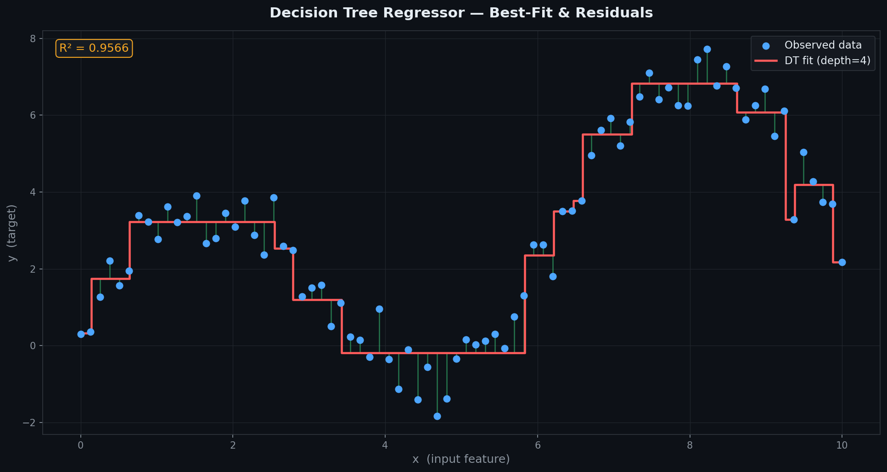
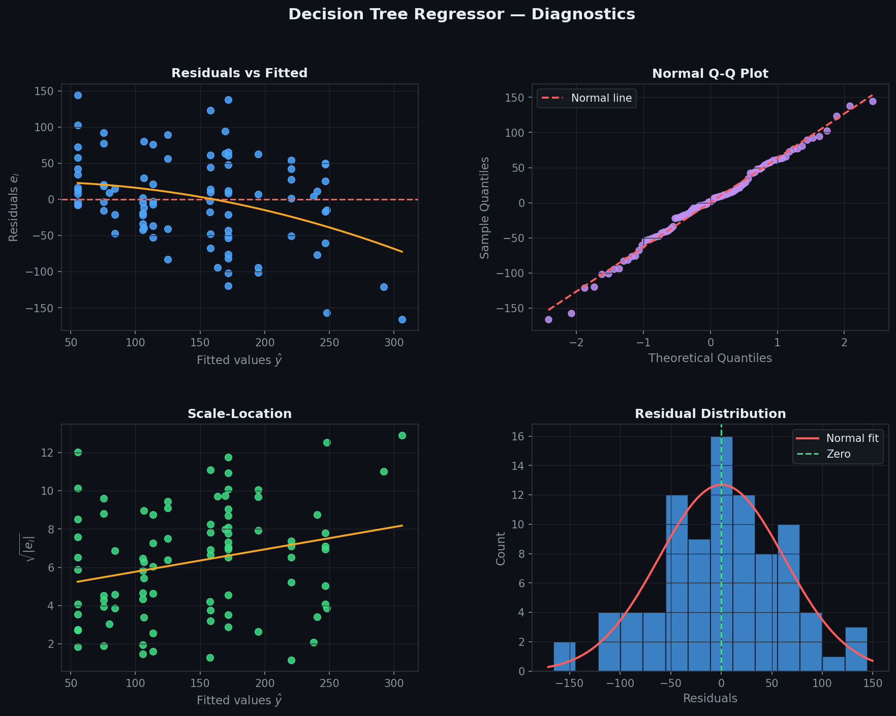
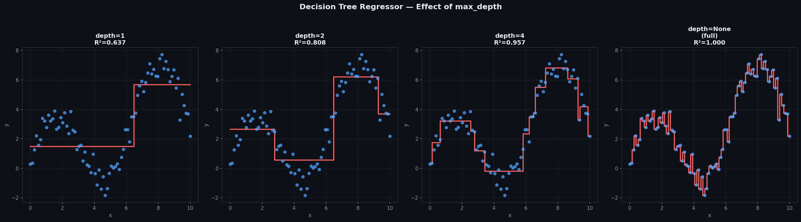
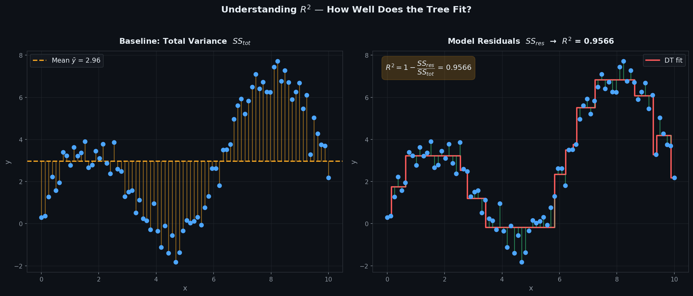

# Decision Tree Regressor — MSE & MAE Variance Reduction

> A clean, **NumPy-only** implementation of Decision Tree Regression  
> supporting **numeric and categorical features**, two split criteria — **MSE and MAE** —  
> and **recursive tree building** with configurable depth and minimum sample constraints.  
> Each leaf predicts the **mean of its training samples** — no closed-form, no gradient descent.

---

## Table of Contents

1. [What is a Decision Tree Regressor?](#1-what-is-a-decision-tree-regressor)
2. [The Model](#2-the-model)
3. [Split Criterion — Variance Reduction](#3-split-criterion--variance-reduction)
4. [Impurity Measures](#4-impurity-measures)
5. [Splitting Strategy](#5-splitting-strategy)
6. [Stopping Conditions](#6-stopping-conditions)
7. [Geometric Intuition](#7-geometric-intuition)
8. [Best-Fit & Residuals](#8-best-fit--residuals)
9. [Variance Reduction Visualised](#9-variance-reduction-visualised)
10. [Build Pipeline](#10-build-pipeline)
11. [Regression Diagnostics](#11-regression-diagnostics)
12. [Predicted vs Actual](#12-predicted-vs-actual)
13. [Effect of max_depth](#13-effect-of-max_depth)
14. [Understanding R²](#14-understanding-r)
15. [Usage](#15-usage)
16. [Assumptions](#16-assumptions)

---

## 1. What is a Decision Tree Regressor?

A Decision Tree Regressor recursively partitions the feature space into rectangular regions and assigns each region the **mean target value** of training samples that fall within it.

Given $n$ observations $(\mathbf{x}_1, y_1), \ldots, (\mathbf{x}_n, y_n)$ with continuous $y$:

$$\hat{y} = \text{mean}\!\left(\{y_i : \mathbf{x}_i \text{ falls in leaf region}\}\right)$$

| Symbol | Name | Meaning |
|--------|------|---------|
| `feature` | Split feature index | Which column to split on |
| `threshold` | Split value | Numeric: $\leq t$ / $> t$ — Categorical: $= c$ / $\neq c$ |
| `max_depth` | Tree depth limit | Prevents overfitting |
| `min_samples_split` | Minimum split size | Nodes with fewer samples become leaves |
| `criterion` | Split measure | `'mse'` or `'mae'` |

Two node types:

| Node | Condition | Contains |
|------|-----------|---------|
| **Internal node** | `value is None` | `feature`, `threshold`, `left`, `right` |
| **Leaf node** | `value is not None` | Mean of $y$ values in that region |

---

## 2. The Model

The tree is a recursive structure of `CreateNode` objects:

```
root
├── Node(feature=0, threshold=3.5)
│   ├── Leaf(value=2.14)
│   └── Node(feature=0, threshold=6.2)
│       ├── Leaf(value=4.87)
│       └── Leaf(value=7.31)
```

Prediction traverses from root to leaf:

$$\hat{y} = \text{traverse}(\mathbf{x}, \text{root})$$

At each internal node:
- **Numeric:** go left if $x[\text{feature}] \leq \text{threshold}$, else right
- **Categorical:** go left if $x[\text{feature}] = \text{threshold}$, else right

---

## 3. Split Criterion — Variance Reduction

At each node, the best split maximises the **Variance Reduction**:

$$\text{VR}(y, \text{split}) = \text{Impurity}(y_\text{parent}) - \frac{|y_\text{left}|}{|y|}\,\text{Impurity}(y_\text{left}) - \frac{|y_\text{right}|}{|y|}\,\text{Impurity}(y_\text{right})$$

A split with $\text{VR} \leq 0$ is rejected — the node becomes a leaf predicting $\text{mean}(y)$.

---

## 4. Impurity Measures

### MSE (Mean Squared Error) — default

$$\text{MSE}(y) = \frac{1}{|y|}\sum_{i}(y_i - \bar{y})^2$$

- Measures variance of $y$ values around their mean
- Zero for a perfectly homogeneous leaf (all $y_i$ identical)
- Sensitive to outliers — squaring amplifies large deviations

### MAE (Mean Absolute Error)

$$\text{MAE}(y) = \frac{1}{|y|}\sum_{i}|y_i - \text{median}(y)|$$

- Measures spread around the **median** instead of mean
- More robust to outliers — linear penalty instead of quadratic
- Slightly slower to compute

**Rule of thumb:** use MSE for most problems. Switch to MAE when the target has heavy-tailed noise or outliers.

---

## 5. Splitting Strategy

For each feature, candidate thresholds are evaluated:

**Numeric features:**

$$\text{Thresholds} = \text{unique values of } x_j$$

Split: left if $x_j \leq t$, right if $x_j > t$

**Categorical features:**

$$\text{Categories} = \text{unique values of } x_j$$

Split: left if $x_j = c$, right if $x_j \neq c$

The feature-threshold pair with the highest Variance Reduction is chosen.

---

## 6. Stopping Conditions

The recursive build stops and creates a **leaf node** when any of these are true:

| Condition | Reason |
|-----------|--------|
| `len(y) < min_samples_split` | Too few samples to split further |
| `depth >= max_depth` | Depth limit reached |
| Best Variance Reduction $\leq 0$ | No split reduces impurity |

Leaf prediction is always $\text{mean}(y)$ of the samples in that node.

---

## 7. Geometric Intuition

Decision Tree Regressors partition the feature space with **axis-aligned rectangular splits** — each split is a horizontal or vertical cut.

- Each leaf predicts a **constant value** (mean of its samples)
- The overall prediction function is a **piecewise constant** approximation of the true function
- Deep trees → more pieces → tighter approximation → risk of overfitting
- Shallow trees → fewer pieces → smoother but higher bias

---

## 8. Best-Fit & Residuals



| Visual Element | Meaning |
|----------------|---------|
| Blue dots | Training samples |
| Purple dots | Test samples |
| Red step function | DT prediction — piecewise constant fit |
| Green bars | Residuals $e_i = y_i - \hat{y}_i$ for test samples |

The characteristic **step function** shape distinguishes tree regressors from linear models — each horizontal segment is one leaf's constant prediction.

---

## 9. Variance Reduction Visualised


**Left:** Variance Reduction plotted against all possible thresholds for feature 0. The amber dashed line marks the best split — the threshold that maximally reduces MSE.

**Right:** Parent vs children MSE comparison at the best split. The weighted average of children MSE is always lower than parent MSE when Variance Reduction > 0.

---

## 10. Build Pipeline


Five-step recursive pipeline:

| Step | Operation | Detail |
|------|-----------|--------|
| ① | Check stopping | Too few samples? Max depth reached? |
| ② | Find best split | Try every feature × threshold, compute VR |
| ③ | Split data | Partition X and y into left and right subsets |
| ④ | Recurse children | Call `_build_tree` on each subset |
| ⑤ | Leaf prediction | `value = mean(y)` of samples in leaf |

---

## 11. Regression Diagnostics

After fitting, verify the four core assumptions visually:



| Plot | What to look for | Assumption verified |
|------|-----------------|---------------------|
| **Residuals vs Fitted** | Random scatter around $y=0$ | Linearity |
| **Normal Q-Q** | Points on the diagonal line | Normality of residuals |
| **Scale-Location** | Flat, uniform band — no funnel | Homoscedasticity |
| **Residual Histogram** | Bell-shaped, centred at 0 | Normality |

**Red flags:**
- Systematic steps in residuals → tree depth too shallow; increase `max_depth`
- Funnel shape → variance grows with fitted value; try log($y$)
- Heavy tails in Q-Q → outliers affecting splits; use `criterion='mae'`

---

## 12. Predicted vs Actual


**Left panel:** each point is one test sample — actual $y$ on x-axis, predicted $\hat{y}$ on y-axis.
- Points hugging the **red dashed diagonal** = accurate predictions.
- Vertical clusters reflect the piecewise constant nature of tree predictions.

**Right panel:** full model summary — criterion, depth, split settings, node/leaf count, R², MSE, RMSE.

---

## 13. Effect of max_depth



Four panels sweeping `max_depth` from 1 to None (fully grown):

| `max_depth` | Effect |
|------------|--------|
| `1` | One split — coarsest piecewise constant |
| `3` | A few pieces — reasonable generalisation |
| `5` | Good balance of fit and generalisation |
| `None` | Fully grown — memorises training data, overfits |

Always choose `max_depth` via cross-validation — never leave it as `None` on noisy data.

---

## 14. Understanding R²

$$R^2 = 1 - \frac{SS_{res}}{SS_{tot}} = 1 - \frac{\sum(y_i - \hat{y}_i)^2}{\sum(y_i - \bar{y})^2}$$



| Panel | Shows | Represents |
|-------|-------|-----------|
| Left — amber bars | Deviation from mean $\bar{y}$ | $SS_{tot}$ — total variance |
| Right — green bars | Deviation from tree fit | $SS_{res}$ — unexplained variance |

| $R^2$ value | Meaning |
|------------|---------|
| $= 1.0$ | Perfect fit — tree explains all variance |
| $\approx 0.9$ | Strong fit — 90% of variance explained |
| $= 0.0$ | No better than predicting $\bar{y}$ |
| $< 0$ | Worse than the mean baseline |

---

## 15. Usage

### Basic fit and predict

```python
import numpy as np
from DecisionTreeRegressor import DecisionTreeRegressor

X_train = np.array([[1],[2],[3],[4],[5],[6],[7],[8]], dtype=float)
y_train = np.array([1.2, 2.8, 2.5, 5.1, 4.9, 7.3, 6.8, 9.0])

model = DecisionTreeRegressor(max_depth=3, criterion='mse')
model.fit(X_train, y_train)

print(f"R²        : {model.score(X_train, y_train):.4f}")
print(f"Root node : {model.root}")
print(model)

y_pred = model.predict(np.array([[5.5],[6.5]], dtype=float))
print(f"Predictions: {y_pred}")
```

### MAE criterion

```python
model = DecisionTreeRegressor(max_depth=4, criterion='mae')
model.fit(X_train, y_train)
print(f"MAE R² : {model.score(X_train, y_train):.4f}")
```

### Comparing depths

```python
from sklearn.model_selection import train_test_split

X_tr, X_te, y_tr, y_te = train_test_split(X_train, y_train,
                                            test_size=0.2, random_state=42)
for depth in [1, 2, 3, 5, None]:
    m = DecisionTreeRegressor(max_depth=depth, criterion='mse')
    m.fit(X_tr, y_tr)
    print(f"depth={str(depth):4s}  R²={m.score(X_te, y_te):.4f}")
```

### Multi-feature example

```python
from sklearn.datasets import load_diabetes

X, y = load_diabetes(return_X_y=True)
X_tr, X_te, y_tr, y_te = train_test_split(X, y, test_size=0.2, random_state=42)

model = DecisionTreeRegressor(max_depth=5, min_samples_split=5, criterion='mse')
model.fit(X_tr, y_tr)

print(f"R²          : {model.score(X_te, y_te):.4f}")
print(f"n_features_ : {model.n_features_}")
print(model)
```

---

## 16. Assumptions

| # | Assumption | How to check |
|---|-----------|--------------|
| 1 | **No feature scaling needed** — splits are threshold-based | — |
| 2 | **max_depth must be set** — unbounded trees overfit | Cross-validation |
| 3 | **Piecewise constant output** — cannot extrapolate beyond training range | Decision boundary plot |
| 4 | **Handles mixed types** — numeric and categorical features supported | Use dtype=object for categorical |

> **Decision Trees do not require feature scaling** — unlike linear models, splits are based on thresholds so feature magnitude doesn't matter.

> **Cannot extrapolate** — tree predictions are bounded by the range of training targets. For values outside the training range, the tree always predicts the mean of the closest leaf — unlike linear models which extrapolate.

---

## Decision Tree Regressor vs Linear Regression vs SVR

| Criterion | Decision Tree | Linear Regression | SVR |
|-----------|--------------|-------------------|-----|
| Prediction | Piecewise constant | Global linear | Smooth kernel fit |
| Non-linear | Yes — rectangles | No | Yes — via kernels |
| Feature scaling | Not needed | Not needed | Required |
| Extrapolation | No — bounded by training range | Yes | Partially |
| Interpretability | Very high — rules | High — weights | Low — dual space |
| Categorical features | Yes — natively | No | No |
| Overfitting risk | High (deep trees) | Low | Low (with C/ε tuning) |

---

## Dependencies

```
numpy >= 1.21
matplotlib >= 3.4   # optional — for plots only
scipy >= 1.7        # optional — for Q-Q diagnostics
sklearn              # optional — for datasets only
```

---

## License

MIT
