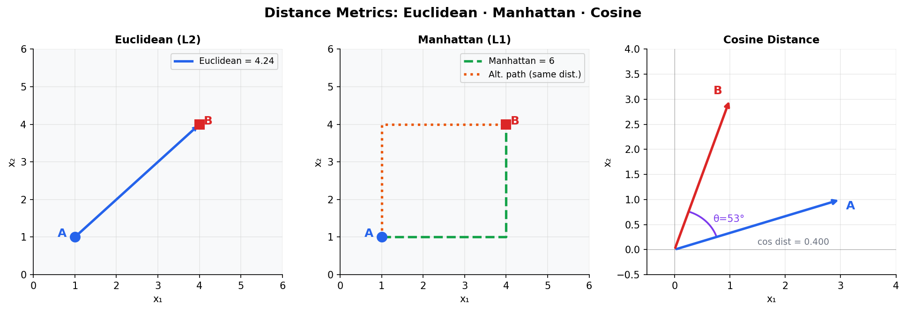
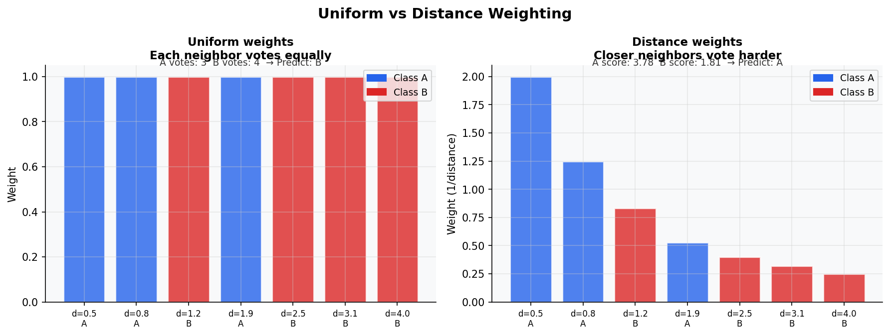
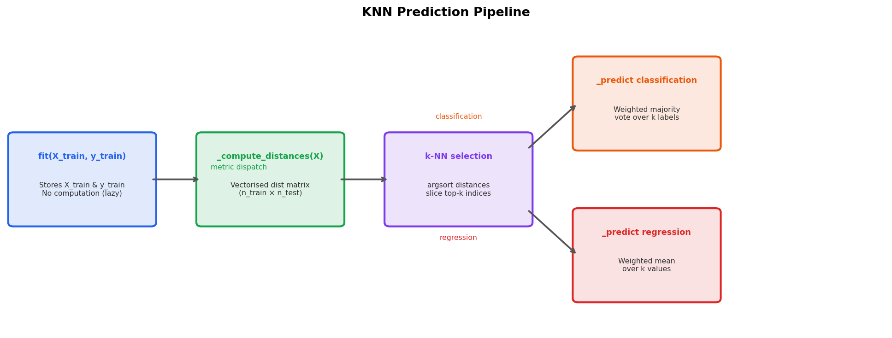
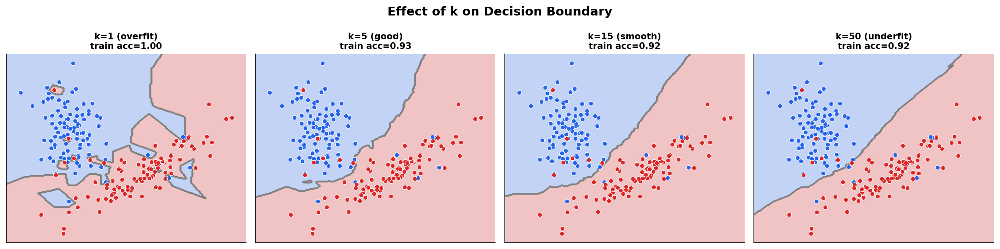
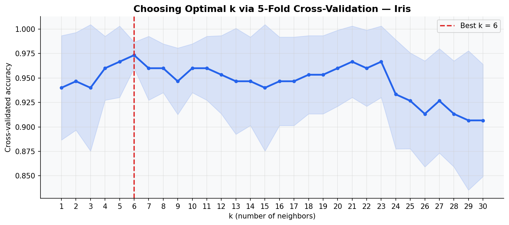
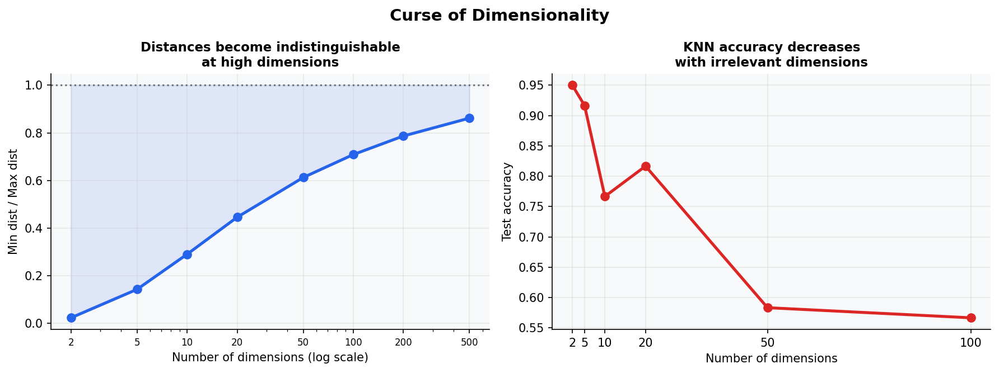
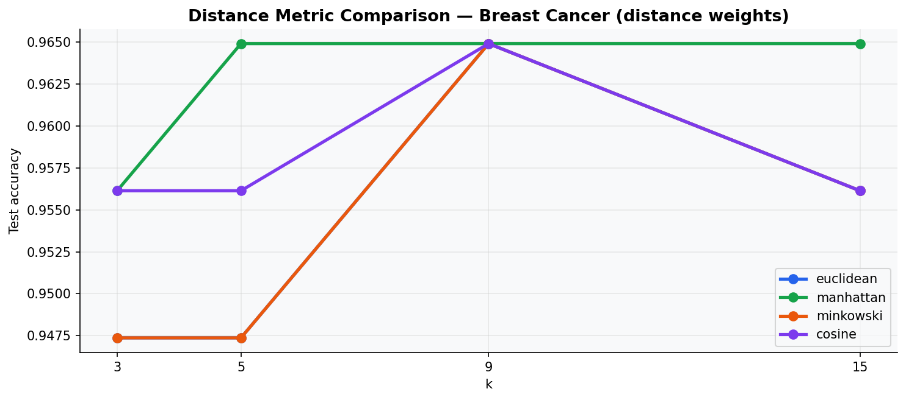
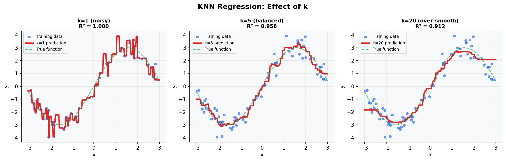

# K-Nearest Neighbors — Classification & Regression

> A pure-NumPy implementation of K-Nearest Neighbors supporting **classification** (weighted majority vote), **regression** (weighted mean), and four **distance metrics** — Euclidean, Manhattan, Minkowski, and Cosine — with no scikit-learn under the hood.

---

## Table of Contents

- [Overview](#overview)
- [Mathematical Foundation](#mathematical-foundation)
- [Distance Metrics](#distance-metrics)
- [The KNN Algorithm](#the-knn-algorithm)
- [Weighted Voting & Prediction](#weighted-voting--prediction)
- [Training Pipeline](#training-pipeline)
- [Choosing k](#choosing-k)
- [Curse of Dimensionality](#curse-of-dimensionality)
- [API Reference](#api-reference)
- [Usage Examples](#usage-examples)
- [Key Differences: Classification vs Regression](#key-differences-classification-vs-regression)
- [Distance Metric Comparison](#distance-metric-comparison)
- [Notes](#notes)

---

## Overview

This module provides a from-scratch implementation of K-Nearest Neighbors using **only NumPy**. It supports two task modes controlled by `task`, and four distance metrics controlled by `metric`:

| Mode | Parameter | Prediction | Use Case |
|------|-----------|------------|----------|
| Classification | `task='classification'` | Weighted majority vote | Discrete class labels |
| Regression | `task='regression'` | Weighted mean | Continuous target values |

| Metric | Parameter | Measures |
|--------|-----------|----------|
| Euclidean | `metric='euclidean'` | Straight-line distance (L2 norm) |
| Manhattan | `metric='manhattan'` | Grid / taxicab distance (L1 norm) |
| Minkowski | `metric='minkowski'` | Generalised Lp norm — order controlled by `p` |
| Cosine | `metric='cosine'` | Angular dissimilarity — direction, not magnitude |

---

## Mathematical Foundation

### Core Idea

KNN is a **non-parametric, instance-based** (lazy) learner. It makes no assumptions about the underlying data distribution and does not learn an explicit model at training time. Instead, it stores the entire training set and defers all computation to prediction time.

Given a query point **x**, the prediction is based entirely on the `k` training samples closest to **x** under the chosen distance metric. The training phase reduces to:

```
fit(X_train, y_train)  →  store X_train, y_train   [O(1) time]
predict(x)             →  find k nearest, aggregate  [O(n · p) per query]
```

where `n` is the number of training samples and `p` is the number of features.

### Vectorised Distance Matrix

For efficiency, all pairwise distances between training points and test points are computed in a single **vectorised operation** — no Python loops over samples:

```
D ∈ ℝ^(n_train × n_test)     where  Dᵢⱼ = dist(X_train[i], X_test[j])
```

The k-nearest neighbors of each test point are then retrieved via `argsort(D, axis=0)[:k]` — sorting each column and slicing the top `k` indices.

---

## Distance Metrics



The left panel shows **Euclidean distance** — the straight-line hypotenuse between two points. The center panel shows **Manhattan distance** — travel along axis-aligned paths; all paths between A and B that only move right and up have the same L1 length. The right panel shows **Cosine distance** — it measures the angle between two vectors regardless of their magnitudes, making it direction-sensitive but scale-insensitive.

### Euclidean Distance (L2)

The standard geometric distance between two points `xᵢ` and `xⱼ` in ℝᵖ:

```
d(xᵢ, xⱼ) = ‖xᵢ − xⱼ‖₂ = √( Σₖ (xᵢₖ − xⱼₖ)² )
```

Sensitive to feature scale — **always standardise features** before using Euclidean distance.

### Manhattan Distance (L1)

Sum of absolute differences along each axis:

```
d(xᵢ, xⱼ) = ‖xᵢ − xⱼ‖₁ = Σₖ |xᵢₖ − xⱼₖ|
```

More robust to outliers than L2, since squaring is not involved. Preferred when features represent interpretably additive quantities (e.g. pixel intensities, word counts).

### Minkowski Distance (Lp)

A unified generalisation of L1 and L2, parameterised by order `p`:

```
d(xᵢ, xⱼ) = ‖xᵢ − xⱼ‖ₚ = ( Σₖ |xᵢₖ − xⱼₖ|ᵖ )^(1/p)
```

Special cases: `p=1` → Manhattan, `p=2` → Euclidean. As `p → ∞`, it converges to the Chebyshev distance (maximum absolute difference across dimensions).

### Cosine Distance

Measures **angular dissimilarity** between vectors, ignoring magnitude:

```
cos(θ) = (xᵢ · xⱼ) / (‖xᵢ‖ · ‖xⱼ‖)

d_cosine(xᵢ, xⱼ) = 1 − cos(θ)     ∈ [0, 2]
```

A cosine distance of 0 means identical direction; 1 means orthogonal; 2 means opposite. Ideal for text and sparse embeddings where the magnitude of a vector encodes quantity (document length) but direction encodes meaning.

> **Numerical note:** The implementation adds a small `ε = 1e-12` to the denominator to avoid division by zero for zero-magnitude vectors, and clips the result to `[0, 2]` to handle floating-point values outside `[−1, 1]` that would cause `arccos` to fail.

---

## The KNN Algorithm

### Step-by-Step

Given query point **x** and training set `{(x₁, y₁), …, (xₙ, yₙ)}`:

**1. Compute distances:**
```
dᵢ = dist(x, xᵢ)    for all i = 1, …, n
```

**2. Rank neighbors:**
```
Sort indices by dᵢ in ascending order → [i₁, i₂, …, iₙ]
```

**3. Select k nearest:**
```
N_k(x) = { (x_{i₁}, y_{i₁}), …, (x_{iₖ}, y_{iₖ}) }
```

**4. Aggregate (classification):**
```
ŷ = argmax_c  Σ_{(xⱼ, yⱼ) ∈ N_k(x)}  wⱼ · 𝟙[yⱼ = c]
```

**4. Aggregate (regression):**
```
ŷ = ( Σ_{(xⱼ, yⱼ) ∈ N_k(x)} wⱼ · yⱼ ) / ( Σⱼ wⱼ )
```

where `wⱼ` are the neighbor weights (see [Weighted Voting](#weighted-voting--prediction)).

---

## Weighted Voting & Prediction



**Uniform weighting** (`weights='uniform'`) — every neighbor casts an equal vote regardless of distance. In the example above, 4 of 7 neighbors belong to class B → predict B, even though the two closest neighbors are class A.

**Distance weighting** (`weights='distance'`) — each neighbor's vote is scaled by `1 / dᵢ`. Close neighbors dominate. In the same example, the two nearby class-A points outweigh the distant class-B points → predict A.

### Weighting Formulas

| Mode | Weight `wᵢ` |
|------|-------------|
| `'uniform'` | `1` for all neighbors |
| `'distance'` | `1 / dᵢ` |
| Exact match (`dᵢ = 0`) | `1` for matching neighbor, `0` for all others |

> **Exact-match handling:** If a test point is identical to a training point, `1/0` would be undefined. The implementation detects zero-distance neighbors and assigns full weight exclusively to them, ignoring all other neighbors in that query.

### Classification: Weighted Majority Vote

For each candidate class `c`, the weighted vote count is:

```
score(c) = Σ_{j ∈ N_k(x)}  wⱼ · 𝟙[yⱼ = c]
```

The predicted class is `argmax_c score(c)`.

### Regression: Weighted Mean

```
ŷ = Σ_{j ∈ N_k(x)} wⱼ · yⱼ  /  Σ_{j} wⱼ
```

For uniform weights this reduces to the simple arithmetic mean of the k neighbors' target values.

---

## Training Pipeline



Unlike gradient-based models, KNN performs **no computation at fit time**. The pipeline activates entirely at prediction:

1. `fit()` stores `X_train` and `y_train` as NumPy arrays — no optimization, no parameters estimated.
2. `predict()` calls `_compute_distances()` which dispatches to the appropriate metric function based on `self.metric`.
3. The full distance matrix `D` of shape `(n_train, n_test)` is computed in a single vectorised operation.
4. `np.argsort(D, axis=0)[:k]` extracts the k nearest training indices for each test sample.
5. Neighbor labels and distances are sliced; weights are computed via `_get_weights()`.
6. Each test sample is predicted by `_predict_single_classification()` or `_predict_single_regression()`.

### Vectorised Distance Computation

All four metrics are implemented using broadcasting — no loops over individual training samples:

```python
diff = X_train[:, np.newaxis, :] - X_test[np.newaxis, :, :]   # (n_train, n_test, p)

# Euclidean
D = np.sqrt(np.sum(diff ** 2, axis=2))

# Manhattan
D = np.sum(np.abs(diff), axis=2)

# Minkowski
D = np.sum(np.abs(diff) ** p, axis=2) ** (1 / p)
```

Cosine is handled separately via matrix multiply:

```python
dot         = X_train @ X_test.T                           # (n_train, n_test)
norm_train  = np.linalg.norm(X_train, axis=1, keepdims=True)
norm_test   = np.linalg.norm(X_test,  axis=1, keepdims=True).T
cosine_sim  = dot / (norm_train * norm_test + 1e-12)
D           = np.clip(1.0 - cosine_sim, 0.0, 2.0)
```

---

## Choosing k

The value of `k` is the single most important hyperparameter in KNN. It directly controls the **bias-variance tradeoff**:

- **Small k (e.g. k=1):** very low bias, very high variance. The decision boundary follows every training point — the model memorises noise and overfits.
- **Large k:** lower variance but higher bias. The boundary becomes over-smoothed and may miss genuine local structure.



From left to right: `k=1` produces an extremely jagged boundary that perfectly classifies training data but will generalise poorly. `k=5` is well-balanced. `k=15` begins to smooth, and `k=50` collapses toward a nearly linear boundary.

### Cross-Validation to Find Optimal k

The recommended approach is **k-fold cross-validation** over a range of k values:



The shaded band shows ±1 standard deviation across folds. The best k is typically found in the region where accuracy plateaus — selecting the smallest k in that plateau reduces variance without sacrificing accuracy.

> **Rule of thumb:** Start with `k = √n_samples` as an initial estimate, then tune via cross-validation. Always use odd `k` for binary classification to avoid ties.

### Bias-Variance Summary

| k | Bias | Variance | Decision boundary | Risk |
|---|------|----------|-------------------|------|
| 1 | Very low | Very high | Highly irregular | Overfitting |
| 5–15 | Low | Moderate | Smooth, local | Good generalisation |
| Large | High | Low | Coarse, global | Underfitting |

---

## Curse of Dimensionality

KNN is acutely sensitive to high-dimensional input spaces — a phenomenon known as the **curse of dimensionality**.



**Left panel:** As dimensionality increases, the ratio of the nearest to farthest neighbor distance approaches 1. In high-dimensional space, all points become roughly equidistant — the notion of "nearest neighbor" loses meaning. **Right panel:** KNN accuracy degrades sharply as the number of irrelevant (noise) dimensions grows, because irrelevant features contribute noise to every distance computation.

### Why This Happens

In `d` dimensions, the volume of a unit hypersphere is proportional to `rᵈ`. As `d` grows, an exponentially larger number of training points are needed to maintain the same density of neighbors near any query point. With a fixed dataset, the `k` nearest neighbors in high dimensions may not be geometrically close at all.

### Mitigations

| Strategy | Description |
|----------|-------------|
| **Feature scaling** | Always apply `StandardScaler` — unscaled features dominate distance calculations |
| **Dimensionality reduction** | Apply PCA or feature selection to remove uninformative dimensions before fitting |
| **Feature selection** | Remove correlated or zero-variance features |
| **Cosine metric** | For sparse high-dimensional data (text embeddings), cosine distance is more robust than Euclidean |

---

## API Reference

### Constructor

`KNearestNeighbors(k=5, task='classification', metric='euclidean', p=2, weights='uniform')`

| Parameter | Type | Default | Description |
|-----------|------|---------|-------------|
| `k` | `int` | `5` | Number of nearest neighbors to consider |
| `task` | `str` | `'classification'` | `'classification'` (majority vote) or `'regression'` (mean) |
| `metric` | `str` | `'euclidean'` | Distance function: `'euclidean'` · `'manhattan'` · `'minkowski'` · `'cosine'` |
| `p` | `float` | `2` | Minkowski order — only used when `metric='minkowski'` |
| `weights` | `str` | `'uniform'` | Voting scheme: `'uniform'` (equal) or `'distance'` (inverse-distance) |

### Methods

| Method | Returns | Description |
|--------|---------|-------------|
| `fit(X_train, y_train)` | `self` | Store training data — no computation performed |
| `predict(X_test)` | `ndarray` | Predicted labels `(n_samples,)` for both tasks |
| `score(X_test, y_test)` | `float` | Classification: accuracy · Regression: R² score |

### Attributes (after `fit`)

| Attribute | Description |
|-----------|-------------|
| `self._X_train` | Stored training features `(n_train, n_features)` |
| `self._y_train` | Stored training targets `(n_train,)` |

### Internal Methods

| Method | Description |
|--------|-------------|
| `_euclidean(X)` | Vectorised L2 distance matrix `(n_train, n_test)` |
| `_manhattan(X)` | Vectorised L1 distance matrix |
| `_minkowski(X)` | Vectorised Lp distance matrix |
| `_cosine(X)` | Cosine distance matrix via dot product |
| `_compute_distances(X)` | Dispatches to active metric; returns `(n_train, n_test)` |
| `_get_weights(distances)` | Returns weight matrix `(n_test, k)` |
| `_predict_single_classification(labels, weights)` | Weighted majority vote for one sample |
| `_predict_single_regression(values, weights)` | Weighted mean for one sample |

---

## Usage Examples

### Classification — Iris Dataset

```python
from sklearn.datasets import load_iris
from sklearn.model_selection import train_test_split
from sklearn.preprocessing import StandardScaler

X, y = load_iris(return_X_y=True)
X_train, X_test, y_train, y_test = train_test_split(X, y, test_size=0.2, random_state=42)

scaler  = StandardScaler()
X_train = scaler.fit_transform(X_train)
X_test  = scaler.transform(X_test)

model = KNearestNeighbors(k=5, metric='euclidean', weights='distance')
model.fit(X_train, y_train)

print(f"Accuracy: {model.score(X_test, y_test):.4f}")   # ~1.0000
```

### Classification — Manhattan Distance

```python
model = KNearestNeighbors(k=7, metric='manhattan', weights='uniform')
model.fit(X_train, y_train)
print(f"Accuracy: {model.score(X_test, y_test):.4f}")
```

### Classification — Cosine Distance (text-like data)

```python
model = KNearestNeighbors(k=5, metric='cosine', weights='distance')
model.fit(X_train, y_train)
print(f"Accuracy: {model.score(X_test, y_test):.4f}")
```

### Regression — Sinusoidal Function

```python
import numpy as np

np.random.seed(42)
X_train = np.sort(np.random.uniform(-3, 3, 80)).reshape(-1, 1)
y_train = np.sin(X_train.ravel()) * 3 + np.random.randn(80) * 0.5

X_test  = np.linspace(-3, 3, 200).reshape(-1, 1)

model = KNearestNeighbors(k=5, task='regression', weights='distance')
model.fit(X_train, y_train)

y_pred = model.predict(X_test)
print(f"R² (train): {model.score(X_train, y_train):.4f}")
```

### Minkowski Distance with Custom p

```python
# p=1 → Manhattan, p=2 → Euclidean, p=3 → cubic norm
model = KNearestNeighbors(k=5, metric='minkowski', p=3)
model.fit(X_train, y_train)
print(f"Accuracy: {model.score(X_test, y_test):.4f}")
```

### Finding Optimal k via Cross-Validation

```python
import numpy as np
from sklearn.model_selection import StratifiedKFold

k_range = range(1, 31)
skf = StratifiedKFold(n_splits=5, shuffle=True, random_state=42)
cv_scores = []

for k in k_range:
    fold_acc = []
    for tr_idx, te_idx in skf.split(X_train, y_train):
        m = KNearestNeighbors(k=k).fit(X_train[tr_idx], y_train[tr_idx])
        fold_acc.append(m.score(X_train[te_idx], y_train[te_idx]))
    cv_scores.append(np.mean(fold_acc))

best_k = list(k_range)[np.argmax(cv_scores)]
print(f"Best k = {best_k},  CV accuracy = {max(cv_scores):.4f}")
```

---

## Key Differences: Classification vs Regression

| Aspect | Classification | Regression |
|--------|---------------|------------|
| **Target** | Discrete class labels `y ∈ {c₁, …, cₖ}` | Continuous values `y ∈ ℝ` |
| **Aggregation** | Weighted majority vote | Weighted mean |
| **Output** | Class label | Real number |
| **Score metric** | Accuracy (fraction correct) | R² (coefficient of determination) |
| **Tie-breaking** | First class in sorted order wins | No ties possible |
| **Typical k** | Odd (avoids ties for binary) | Any value |

---

## Distance Metric Comparison



Accuracy across four metrics and four values of k on the Breast Cancer dataset with distance weighting. The Euclidean and Minkowski metrics tend to perform similarly; Manhattan is competitive and often more robust on data with outliers; Cosine can underperform on features with meaningful magnitude information but excels on normalized or sparse high-dimensional data.

| Metric | Best for | Avoid when |
|--------|----------|------------|
| `euclidean` | Continuous, scaled, low-dimensional data | Unscaled features, high dimensions |
| `manhattan` | Sparse data, data with outliers | Features with very different scales |
| `minkowski` | Flexible — tune `p` on validation set | — |
| `cosine` | Text, embeddings, sparse vectors | Features where magnitude is meaningful |

---

## Notes

- **No training cost** — KNN is a lazy learner. All computation is deferred to prediction time. For large datasets, prediction becomes the bottleneck: `O(n · p)` per query. Consider KD-trees or Ball trees (e.g. `sklearn.neighbors.KDTree`) for approximate nearest-neighbor search at scale.
- **Feature scaling is essential** — raw features on different scales cause large-magnitude features to dominate Euclidean, Manhattan, and Minkowski distances. Always apply `StandardScaler` or `MinMaxScaler` before fitting.
- **Cosine metric is scale-invariant** — it ignores vector length entirely. Normalizing features before applying cosine distance has no effect, since the normalization cancels in the formula.
- **`fit()` returns `self`** — supports method chaining: `model.fit(X_train, y_train).score(X_test, y_test)`.
- **Regression `score()` returns R²** — a value of 1.0 is a perfect fit; 0.0 means the model performs as well as predicting the mean; negative values mean it performs worse than the mean.
- **Memory cost** — the entire training set is held in memory at all times. For very large datasets, this may be prohibitive.
- **KNN regression** smooths the target surface — the degree of smoothing is controlled by `k`. Low `k` interpolates noisily; high `k` over-smooths.

---

## KNN Regression Visual



Left to right: `k=1` exactly interpolates training points and captures all noise; `k=5` recovers the true sine-wave shape well with R² near the maximum; `k=20` over-smooths and flattens peaks — high bias, low variance.
