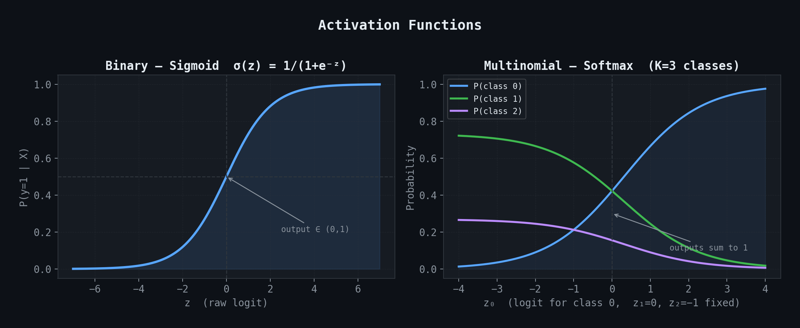
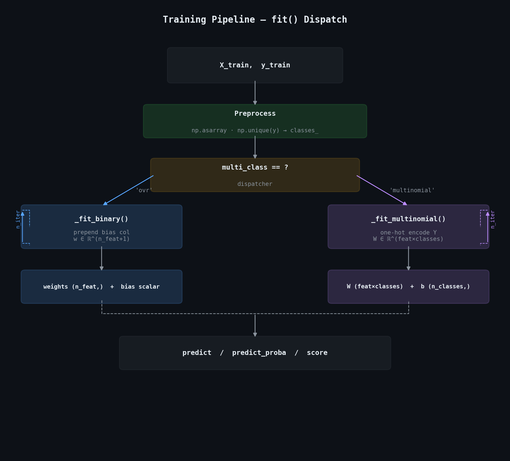
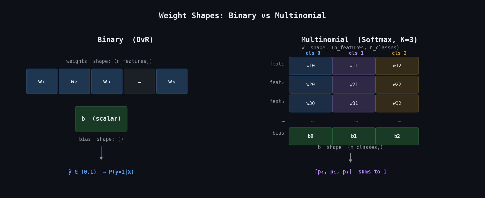
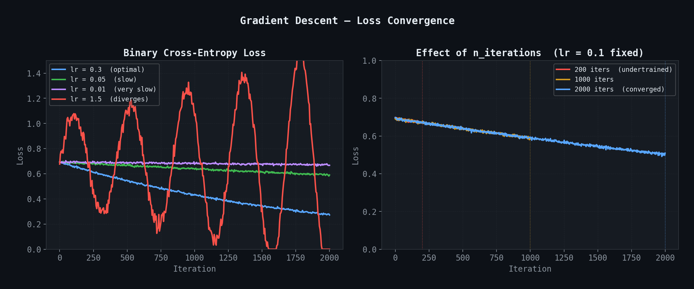
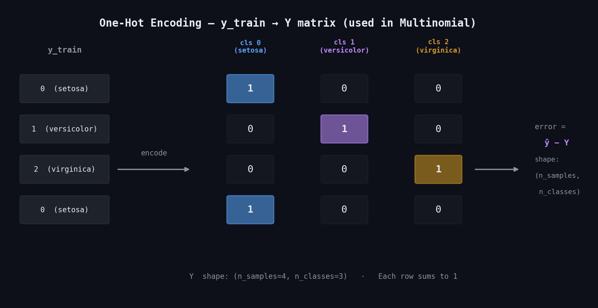
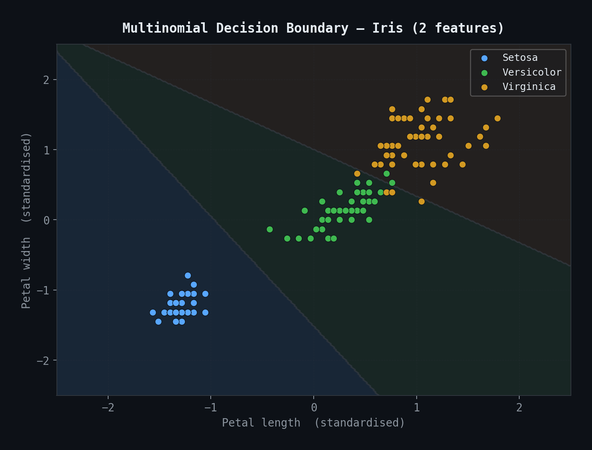

# Logistic Regression — Binary & Multinomial Classifier

> A pure-NumPy implementation of Logistic Regression supporting both **binary classification** (sigmoid) and **multinomial / softmax classification** — no scikit-learn under the hood.

---

## Table of Contents

- [Overview](#overview)
- [Mathematical Foundation](#mathematical-foundation)
- [Activation Functions](#activation-functions)
- [Training Pipeline](#training-pipeline)
- [Weight Architecture](#weight-architecture)
- [Gradient Descent & Convergence](#gradient-descent--convergence)
- [One-Hot Encoding](#one-hot-encoding)
- [Decision Boundary](#decision-boundary)
- [API Reference](#api-reference)
- [Usage Examples](#usage-examples)
- [Key Differences: Binary vs Multinomial](#key-differences-binary-vs-multinomial)

---

## Overview

This module provides a from-scratch implementation of Logistic Regression using **only NumPy**. It supports two modes controlled by the `multi_class` parameter:

| Mode | Parameter | Activation | Use Case |
|------|-----------|------------|----------|
| Binary / One-vs-Rest | `multi_class='ovr'` | Sigmoid | 2-class problems |
| Multinomial | `multi_class='multinomial'` | Softmax | 3+ class problems |

---

## Mathematical Foundation

### Sigmoid Function (Binary)

Used for binary classification. Maps any real number to the range `(0, 1)`:

```
σ(z) = 1 / (1 + e^(−z))
```

The output is interpreted as **P(y = 1 | X)**.

### Softmax Function (Multinomial)

Generalises sigmoid to K classes. Converts a vector of raw scores into a **probability distribution**:

```
softmax(z_k) = e^(z_k) / Σ e^(z_j)   for j = 1..K
```

Each output is `P(y = class_k | X)`, and all K outputs sum to 1.

> **Numerical Stability:** The implementation subtracts `max(z)` before exponentiation — a standard trick that prevents overflow without changing the result mathematically.

---

## Activation Functions



The left plot shows the **sigmoid curve** — note how it smoothly maps any logit to a probability between 0 and 1, with the decision boundary at `z = 0` (prob = 0.5).

The right plot shows **softmax** across 3 classes as `z₀` varies with `z₁=0, z₂=−1` fixed — each output is a valid probability and the three curves always sum to 1.

---

## Training Pipeline



The `fit()` method acts as a **dispatcher**:

1. Input arrays are converted via `np.asarray` and unique classes are stored in `self.classes_`
2. Based on `multi_class`, execution routes to either `_fit_binary()` or `_fit_multinomial()`
3. Both branches run `n_iterations` steps of batch gradient descent
4. The trained weights are stored and used by `predict`, `predict_proba`, and `score`

### Binary path — `_fit_binary()`

```python
# Bias is folded into the weight vector via a prepended column of 1s
X_train = np.insert(X_train, 0, 1, axis=1)
weights = np.zeros(X_train.shape[1])

for _ in range(self.n_iterations):
    y_hat = self.sigmoid(np.dot(X_train, weights))
    weights += self.lr * (np.dot((y_train - y_hat), X_train) / n)
```

### Multinomial path — `_fit_multinomial()`

```python
W = np.zeros((n_features, n_classes))
b = np.zeros(n_classes)
Y = self._one_hot_encode(y_train)    # shape: (n, K)

for _ in range(self.n_iterations):
    y_hat = self.softmax(X @ W + b)  # shape: (n, K)
    error = y_hat - Y                # gradient of cross-entropy
    W    -= self.lr * X.T @ error / n
    b    -= self.lr * error.mean(axis=0)
```

---

## Weight Architecture



The fundamental difference between the two modes is the **shape of the learned parameters**:

- **Binary:** a single 1D weight vector `(n_features,)` plus a scalar bias — one decision boundary separating two classes.
- **Multinomial:** a 2D weight matrix `(n_features, n_classes)` plus a bias vector `(n_classes,)` — one set of weights *per class*, each producing a raw score (logit) fed into softmax.

---

## Gradient Descent & Convergence



**Left panel — effect of learning rate:**

| Learning rate | Behaviour |
|---------------|-----------|
| `lr = 0.3` | Smooth, fast convergence ✅ |
| `lr = 0.05` | Converges correctly, but slowly |
| `lr = 0.01` | Very slow — may need more iterations |
| `lr = 1.5` | Oscillates / diverges ❌ |

**Right panel — effect of iterations:**  
Even with a moderate learning rate, insufficient iterations leave the model undertrained. The loss plateaus — at that point additional iterations yield diminishing returns.

> **Tip:** Always **standardise** your features (`StandardScaler`) before training. Unnormalised features create steep, narrow loss valleys where gradient descent struggles.

### Update Rule Comparison

| | Binary | Multinomial |
|---|---|---|
| **Prediction** | `ŷ = σ(Xw + b)` | `ŷ = softmax(XW + b)` |
| **Error** | `y − ŷ` (scalar / sample) | `ŷ − Y` (vector / sample) |
| **Weight update** | `w += lr × Xᵀ(y−ŷ) / n` | `W -= lr × Xᵀ(ŷ−Y) / n` |
| **Bias update** | included in `w[0]` | `b -= lr × mean(ŷ−Y)` |
| **Sign** | gradient **ascent** on log-likelihood | gradient **descent** on cross-entropy |

Both update rules converge to the same solution — the sign flip is a matter of formulation.

---

## One-Hot Encoding



The multinomial path requires **one-hot encoded targets** so the gradient can be computed as a matrix subtraction `(ŷ − Y)`:

- Each integer label `k` becomes a zero vector with a `1` at position `k`
- The resulting matrix `Y` has shape `(n_samples, n_classes)` with each row summing to 1
- This allows the gradient `error = ŷ − Y` to have the same shape as the prediction `ŷ`, making weight updates a clean matrix multiply: `W -= lr × Xᵀ @ error / n`

The implementation handles **arbitrary label types** (integers or strings) via `np.unique` — `self.classes_` maps argmax indices back to original labels at prediction time.

---

## Decision Boundary



Multinomial softmax regression on the **Iris dataset** (petal length × petal width, standardised). The model learns one linear decision boundary per class pair. Key observations:

- **Setosa** (blue) is linearly separable from the other two classes
- **Versicolor / Virginica** overlap slightly — logistic regression draws the best linear boundary it can, but a non-linear model would reduce misclassifications in that region
- The softmax probability contours show how confidence increases as samples move further from the boundary

---

## API Reference

### Constructor

```python
LogisticRegression(lr=0.5, n_iterations=2000, multi_class='ovr')
```

| Parameter | Type | Default | Description |
|-----------|------|---------|-------------|
| `lr` | `float` | `0.5` | Learning rate (step size per gradient update) |
| `n_iterations` | `int` | `2000` | Number of gradient descent iterations |
| `multi_class` | `str` | `'ovr'` | `'ovr'` for binary/sigmoid, `'multinomial'` for softmax |

### Methods

| Method | Returns | Description |
|--------|---------|-------------|
| `fit(X_train, y_train)` | `self` | Train the model — dispatches to binary or multinomial path |
| `predict_proba(X_test)` | `ndarray` | Binary: `(n,)` · Multinomial: `(n, K)` probabilities |
| `predict(X_test, threshold=0.5)` | `ndarray` | Binary: threshold · Multinomial: argmax over classes |
| `score(X_test, y_test)` | `float` | Accuracy = fraction of correct predictions |

### Attributes (after `fit`)

| Attribute | Shape | Description |
|-----------|-------|-------------|
| `self.weights` | `(n_features,)` or `(n_features, n_classes)` | Learned feature weights |
| `self.bias` | scalar or `(n_classes,)` | Learned bias term(s) |
| `self.classes_` | `(n_classes,)` | Unique class labels from `y_train` |

---

## Usage Examples

### Binary Classification

```python
from sklearn.datasets import load_breast_cancer
from sklearn.model_selection import train_test_split
from sklearn.preprocessing import StandardScaler

X, y = load_breast_cancer(return_X_y=True)
X_train, X_test, y_train, y_test = train_test_split(X, y, test_size=0.2, random_state=42)

scaler = StandardScaler()
X_train = scaler.fit_transform(X_train)
X_test  = scaler.transform(X_test)

model = LogisticRegression(lr=0.1, n_iterations=1000, multi_class='ovr')
model.fit(X_train, y_train)

print(f"Accuracy:  {model.score(X_test, y_test):.4f}")   # ~0.9737
print(f"Weights:   {model.weights.shape}")                # (30,)
print(f"Bias:      {model.bias:.4f}")                     # scalar

probs = model.predict_proba(X_test[:3])
print(probs)   # [0.998, 0.002, 0.987] — one probability per sample
```

### Multinomial Classification

```python
from sklearn.datasets import load_iris
from sklearn.model_selection import train_test_split
from sklearn.preprocessing import StandardScaler

X, y = load_iris(return_X_y=True)
X_train, X_test, y_train, y_test = train_test_split(X, y, test_size=0.2, random_state=42)

scaler = StandardScaler()
X_train = scaler.fit_transform(X_train)
X_test  = scaler.transform(X_test)

model = LogisticRegression(lr=0.1, n_iterations=1000, multi_class='multinomial')
model.fit(X_train, y_train)

print(f"Accuracy:  {model.score(X_test, y_test):.4f}")   # ~0.9667
print(f"Weights:   {model.weights.shape}")                # (4, 3)
print(f"Bias:      {model.bias.shape}")                   # (3,)

probs = model.predict_proba(X_test[:3])
print(probs)
# [[0.001, 0.023, 0.976],   ← class 2 (virginica)
#  [0.972, 0.027, 0.001],   ← class 0 (setosa)
#  [0.003, 0.994, 0.003]]   ← class 1 (versicolor)
```

---

## Key Differences: Binary vs Multinomial

| Aspect | Binary (`ovr`) | Multinomial (`softmax`) |
|--------|----------------|-------------------------|
| **Activation** | Sigmoid → scalar | Softmax → probability vector |
| **Weight shape** | `(n_features,)` | `(n_features, n_classes)` |
| **Bias shape** | scalar | `(n_classes,)` |
| **Target encoding** | Raw `{0, 1}` labels | One-hot matrix `(n, K)` |
| **Loss (implicit)** | Binary cross-entropy | Categorical cross-entropy |
| **Prediction** | Threshold on prob | `argmax` over class probs |
| **Works for K > 2?** | No (needs OvR wrapping) | Yes, natively |
| **Parameters count** | `n_features + 1` | `n_features × K + K` |

---

## Notes

- **No regularisation** is applied. Adding L2 penalty (`λ * W`) to the gradient is a natural extension.
- **Batch gradient descent** — the full dataset is used per update. For large datasets, mini-batch SGD would be more efficient.
- **Feature scaling** is strongly recommended — logistic regression is sensitive to feature magnitude.
- **String labels** are fully supported — `self.classes_` maps integer indices back to original labels.
