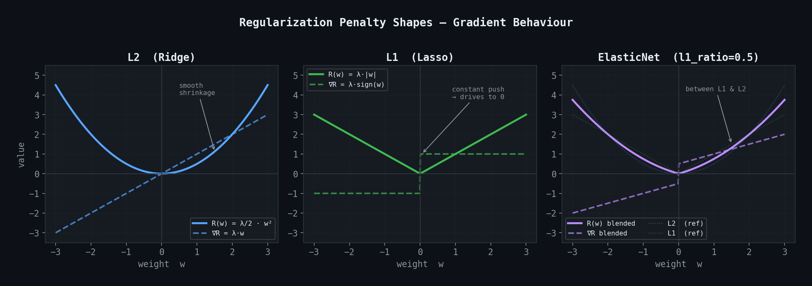
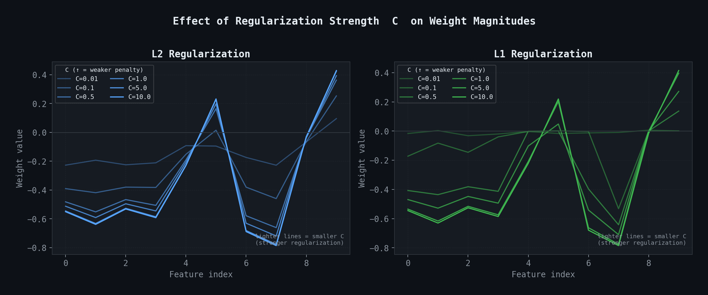
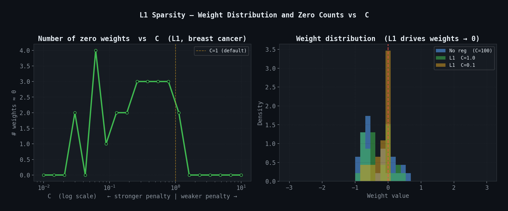
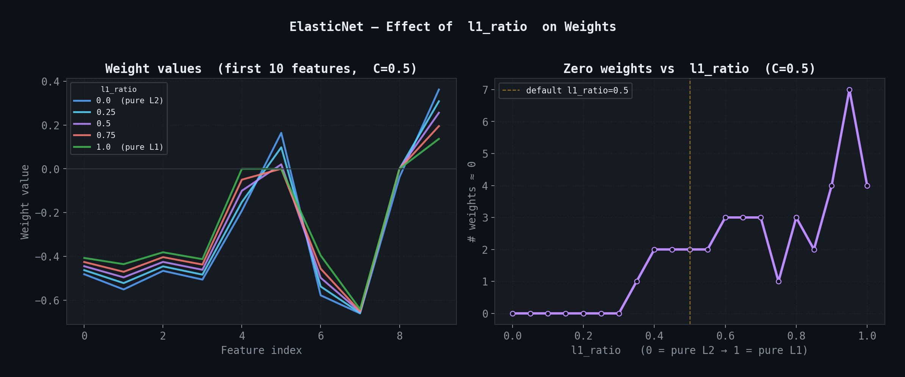
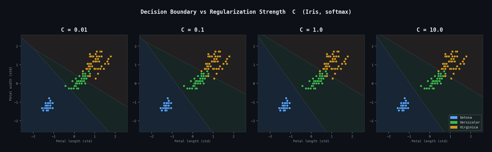

# Logistic Regression — Binary & Multinomial Classifier

> A pure-NumPy implementation of Logistic Regression supporting **binary classification** (sigmoid), **multinomial / softmax classification**, and **L1 / L2 / ElasticNet regularization** — no scikit-learn under the hood.

---

## Table of Contents

- [Overview](#overview)
- [Mathematical Foundation](#mathematical-foundation)
- [Loss Functions & Derivation](#loss-functions--derivation)
- [Gradient Descent & Update Rules](#gradient-descent--update-rules)
- [Regularization (Penalty)](#regularization-penalty)
- [Training Pipeline](#training-pipeline)
- [Weight Architecture](#weight-architecture)
- [One-Hot Encoding](#one-hot-encoding)
- [Decision Boundary](#decision-boundary)
- [API Reference](#api-reference)
- [Usage Examples](#usage-examples)
- [Key Differences: Binary vs Multinomial](#key-differences-binary-vs-multinomial)
- [Regularization Comparison](#regularization-comparison)
- [Notes](#notes)

---

## Overview

This module provides a from-scratch implementation of Logistic Regression using **only NumPy**. It supports two classification modes controlled by `multi_class`, and four regularization schemes controlled by `penalty`:

| Mode | Parameter | Activation | Use Case |
|------|-----------|------------|----------|
| Binary / One-vs-Rest | `multi_class='ovr'` | Sigmoid | 2-class problems |
| Multinomial | `multi_class='multinomial'` | Softmax | 3+ class problems |

| Penalty | Parameter | Effect |
|---------|-----------|--------|
| None | `penalty='none'` | No regularization (original behaviour) |
| Ridge | `penalty='l2'` | Shrinks weights smoothly toward zero |
| Lasso | `penalty='l1'` | Drives some weights to exactly zero (sparse) |
| ElasticNet | `penalty='elasticnet'` | Blended L1 + L2 penalty |

---

## Mathematical Foundation

### Sigmoid Function (Binary)

The sigmoid maps any real-valued logit `z = wᵀx + b` to the interval `(0, 1)`:

```
σ(z) = 1 / (1 + e^(−z))
```

The output is interpreted as the conditional probability **P(y = 1 | x)**. Key properties:

- `σ(0) = 0.5` — the natural decision threshold
- `σ(z) → 1` as `z → +∞`
- `σ(z) → 0` as `z → −∞`
- Derivative: `σ'(z) = σ(z) · (1 − σ(z))` — used in backpropagation

### Softmax Function (Multinomial)

Softmax generalises sigmoid to K classes. Given a raw score vector **z** ∈ ℝᴷ:

```
softmax(z)_k = e^(z_k) / Σⱼ e^(z_j)     for k = 1, …, K
```

Each output is `P(y = k | x)`, and all K outputs sum to 1, forming a valid probability distribution.

> **Numerical Stability:** In practice, `max(z)` is subtracted from every element before exponentiation. This does not change the result mathematically — the constant cancels in the numerator and denominator — but prevents floating-point overflow from large exponentials:
>
> ```
> softmax(z)_k = e^(z_k − max(z)) / Σⱼ e^(z_j − max(z))
> ```


The left plot shows the **sigmoid curve** — smoothly maps any logit to `(0, 1)` with the decision boundary at `z = 0`. The right plot shows **softmax** across 3 classes — the three probability curves always sum to 1 and the winning class dominates as its logit grows.

---

## Loss Functions & Derivation

### Binary Cross-Entropy Loss

Given `n` samples, the negative log-likelihood (binary cross-entropy) is:

```
L(w) = −(1/n) Σᵢ [ yᵢ · log(ŷᵢ) + (1 − yᵢ) · log(1 − ŷᵢ) ]
```

where `ŷᵢ = σ(wᵀxᵢ + b)`.

**Gradient derivation** with respect to `w`:

Taking `∂L/∂w` and applying the chain rule through `σ`, and using the identity `σ'(z) = σ(z)(1 − σ(z))`:

```
∂L/∂w = −(1/n) Σᵢ [ yᵢ · (1 − ŷᵢ) − (1 − yᵢ) · ŷᵢ ] · xᵢ
       = −(1/n) Σᵢ (yᵢ − ŷᵢ) · xᵢ
       = −(1/n) Xᵀ(y − ŷ)          [matrix form]
```

Because we **maximise** the log-likelihood (equivalently minimise the loss), the weight update becomes:

```
w ← w + lr · (1/n) · Xᵀ(y − ŷ)
```

The gradient for bias `b` follows identically, where `x = 1` for every sample:

```
∂L/∂b = −(1/n) Σᵢ (yᵢ − ŷᵢ)
```

### Categorical Cross-Entropy Loss (Multinomial)

For K classes with one-hot targets `Y ∈ {0,1}^(n×K)` and predictions `Ŷ = softmax(XW + b)`:

```
L(W) = −(1/n) Σᵢ Σₖ Yᵢₖ · log(Ŷᵢₖ)
```

**Gradient derivation** with respect to `W`:

The softmax–cross-entropy combination has a remarkably clean gradient. Let `eᵢ = ŷᵢ − yᵢ` be the error vector per sample. Then:

```
∂L/∂W = (1/n) Xᵀ (Ŷ − Y)          shape: (n_features, n_classes)
∂L/∂b = (1/n) Σᵢ (ŷᵢ − yᵢ)        shape: (n_classes,)
```

Because this is **minimising** the loss (gradient descent):

```
W ← W − lr · (1/n) · Xᵀ(Ŷ − Y)
b ← b − lr · mean(Ŷ − Y, axis=0)
```

> **Note on sign:** The binary update uses gradient **ascent** on the log-likelihood (add gradient), while the multinomial update uses gradient **descent** on the cross-entropy loss (subtract gradient). Both converge to the same solution — the sign difference is purely a matter of formulation.

---

## Gradient Descent & Update Rules

### Full Update Rule Summary

| | Binary | Multinomial |
|---|---|---|
| **Logit** | `z = Xw + b` | `Z = XW + b` |
| **Prediction** | `ŷ = σ(z)` | `Ŷ = softmax(Z)` |
| **Error** | `y − ŷ`  ∈ ℝⁿ | `Ŷ − Y`  ∈ ℝ^(n×K) |
| **Weight gradient** | `−(1/n) Xᵀ(y − ŷ)` | `(1/n) Xᵀ(Ŷ − Y)` |
| **Bias gradient** | `−(1/n) Σ(y − ŷ)` | `(1/n) Σ(Ŷ − Y)` |
| **Weight update** | `w += lr · (−∂L/∂w)` | `W -= lr · ∂L/∂W` |


**Left panel — effect of learning rate:**

| Learning Rate | Behaviour |
|---------------|-----------|
| `lr = 0.3` | Smooth, fast convergence ✅ |
| `lr = 0.05` | Converges correctly, but slowly |
| `lr = 0.01` | Very slow — may need more iterations |
| `lr = 1.5` | Overshoots minimum, oscillates / diverges ❌ |

Even with an appropriate learning rate, too few iterations leave the model undertrained. The loss plateaus when gradients become small — additional iterations beyond that yield diminishing returns.

> **Tip:** Always **standardise** your features (`StandardScaler`) before training. Raw features on different scales create elongated, narrow loss valleys where gradient descent takes many small steps in one direction and overshoots in another.

---

## Regularization (Penalty)

Regularization adds a penalty term `R(w)` to the loss function to discourage large weights and reduce overfitting:

```
L_reg(w) = L(w) + R(w)
```

### Effective Regularization Strength

The penalty is scaled by `λ = 1 / (C × n_samples)`:

- **Larger C** → smaller λ → weaker penalty (more freedom to fit the data)
- **Smaller C** → larger λ → stronger penalty (more aggressive shrinkage)

### L2 Regularization (Ridge)

Penalty term and its gradient:

```
R(w)    = (λ/2) · ‖w‖²  =  (λ/2) · Σⱼ wⱼ²
∇R(w)   = λ · w
```

The `(1/2)` factor is included so the derivative comes out clean without a factor of 2. The effect is a **proportional pull** toward zero — large weights are penalized more than small ones, resulting in smooth uniform shrinkage.

### L1 Regularization (Lasso)

Penalty term and its sub-gradient:

```
R(w)    = λ · ‖w‖₁  =  λ · Σⱼ |wⱼ|
∇R(w)   = λ · sign(w)
```

Unlike L2, the gradient is a **constant** `±λ` regardless of weight magnitude. This means small weights receive the same push as large ones, eventually driving them to exactly zero — producing **sparse solutions** useful for feature selection.

### ElasticNet Regularization

A convex combination of L1 and L2:

```
R(w)    = λ · [ α · ‖w‖₁  +  (1−α)/2 · ‖w‖² ]
∇R(w)   = λ · [ α · sign(w)  +  (1−α) · w ]
```

where `α = l1_ratio`. This inherits sparsity from L1 and the stability of L2, making it well-suited when many features are correlated.



Each plot shows the penalty function `R(w)` (solid) and its gradient `∇R(w)` (dashed). L2's gradient grows linearly — large weights get pushed harder. L1's gradient is a flat `±λ` constant — every weight gets the same push regardless of magnitude, which is what drives small weights all the way to zero. ElasticNet sits between both.

### Weight Update with Penalty

The regularization gradient is **added** to the loss gradient before the weight step. The bias is **never regularized**:

**Binary:**
```
w ← w + lr · [ (1/n) Xᵀ(y − ŷ)  −  ∇R(w) ]
b ← b + lr · (1/n) Σ(y − ŷ)                     [no penalty]
```

**Multinomial:**
```
W ← W − lr · [ (1/n) Xᵀ(Ŷ − Y)  +  ∇R(W) ]
b ← b − lr · mean(Ŷ − Y, axis=0)                [no penalty]
```

> **Why not regularize bias?** The bias controls the overall offset of the decision boundary. Penalizing it would shift predictions toward zero regardless of the data, introducing unnecessary bias (in the statistical sense) without reducing variance.



As `C` decreases (stronger penalty), all weight magnitudes shrink. With L1, many weights collapse to exactly zero, leaving only the most predictive features active — this is feature selection via regularization.



**Left:** The number of zero weights increases sharply as `C` decreases — smaller `C` drives more features to exactly zero. **Right:** The weight distribution under strong L1 (C=0.1) is heavily concentrated at zero compared to no regularization.



As `l1_ratio` increases from 0 (pure L2) to 1 (pure L1), the weight profile shifts from smooth uniform shrinkage to sparse zero-dominated solutions. The right panel shows the monotone increase in zero weights as the L1 component grows.

### ElasticNet Mix Reference

| `l1_ratio` | Behaviour |
|------------|-----------|
| `0.0` | Pure L2 — Ridge |
| `0.5` | Equal mix (default) |
| `1.0` | Pure L1 — Lasso |

---

## Training Pipeline


The `fit()` method acts as a **dispatcher**:

1. Inputs are cast to NumPy arrays; unique class labels are stored in `self.classes_`
2. Based on `multi_class`, execution routes to `_fit_binary()` or `_fit_multinomial()`
3. Both branches run `n_iterations` steps of batch gradient descent, applying the penalty gradient at each step
4. Trained weights and bias are stored and subsequently used by `predict`, `predict_proba`, and `score`

### Binary path

The bias is folded into the weight vector by prepending a column of 1s to `X`, so a single weight vector `w ∈ ℝ^(1+p)` covers both. At each step:

1. Compute logit: `z = X_aug · w`
2. Compute prediction: `ŷ = σ(z)`
3. Compute data gradient: `g = Xᵀ(y − ŷ) / n`
4. Compute penalty gradient for `w[1:]` only (skip bias at index 0): `∇R`
5. Update: `w ← w + lr · (g − ∇R)`

After training, `w[0]` is stored as `self.bias` and `w[1:]` as `self.weights`.

### Multinomial path

Weights `W ∈ ℝ^(p×K)` and bias `b ∈ ℝᴷ` are maintained separately. At each step:

1. Compute logits: `Z = XW + b`  — shape `(n, K)`
2. Compute predictions: `Ŷ = softmax(Z)`  — shape `(n, K)`
3. Compute error: `E = Ŷ − Y`  — shape `(n, K)`
4. Compute weight gradient: `∂L/∂W = Xᵀ E / n`
5. Update weights with penalty: `W ← W − lr · (∂L/∂W + ∇R(W))`
6. Update bias without penalty: `b ← b − lr · mean(E, axis=0)`

---

## Weight Architecture


| | Binary | Multinomial |
|---|---|---|
| **Weight shape** | `(n_features,)` | `(n_features, n_classes)` |
| **Bias shape** | scalar | `(n_classes,)` |
| **Parameter count** | `n_features + 1` | `n_features × K + K` |
| **Interpretation** | One hyperplane splits two classes | One weight vector per class; argmax of scores gives predicted class |

With stronger regularization (smaller `C`), weight magnitudes are reduced, the decision boundary becomes smoother, and the model generalises better to unseen data at the cost of some training accuracy.

---

## One-Hot Encoding


The multinomial path requires targets encoded as a matrix `Y ∈ {0,1}^(n×K)` so that the gradient `E = Ŷ − Y` is well-defined as a matrix subtraction of matching shape:

```
y = [0, 2, 1]   →   Y = [[1, 0, 0],
                          [0, 0, 1],
                          [0, 1, 0]]
```

Each row of `Y` sums to 1. The gradient `E = Ŷ − Y` has shape `(n, K)`, matching `Ŷ`, which makes the weight update a single matrix multiply: `∂L/∂W = Xᵀ E / n`.

The implementation accepts **arbitrary label types** (integers or strings) via `np.unique`. After training, `self.classes_[argmax(ŷ)]` maps predicted indices back to original labels.

---

## Decision Boundary


Logistic regression learns **linear** decision boundaries — a hyperplane `wᵀx + b = 0` in feature space.

- **Binary:** one hyperplane separates the two classes. Points where `wᵀx + b > 0` → class 1; `< 0` → class 0.
- **Multinomial:** one hyperplane per class pair. The predicted class is whichever linear score `wₖᵀx + bₖ` is largest — i.e., `argmax_k(XW + b)`.

On the Iris dataset (petal length × petal width, standardised):

- **Setosa** is linearly separable from the other two classes
- **Versicolor / Virginica** overlap slightly — logistic regression draws the best linear boundary it can; a non-linear model would reduce misclassifications in that region
- The softmax probability contours show how confidence increases as samples move further from the boundary
- Stronger regularization (smaller `C`) produces smoother, less overfit boundaries



From left to right, `C` increases (weaker regularization). Very small `C = 0.01` forces heavily constrained, almost collapsed boundaries. Moderate `C = 1.0` gives clean, well-generalised separation. Large `C = 10.0` allows the boundary to closely follow the training data — risk of overfitting on noisier datasets.

---

## API Reference

### Constructor

`LogisticRegression(lr=0.5, n_iterations=2000, multi_class='ovr', penalty='l2', C=1.0, l1_ratio=0.5)`

| Parameter | Type | Default | Description |
|-----------|------|---------|-------------|
| `lr` | `float` | `0.5` | Learning rate — step size per gradient update |
| `n_iterations` | `int` | `2000` | Number of gradient descent iterations |
| `multi_class` | `str` | `'ovr'` | `'ovr'` for binary/sigmoid · `'multinomial'` for softmax |
| `penalty` | `str` | `'l2'` | `'none'` · `'l2'` · `'l1'` · `'elasticnet'` |
| `C` | `float` | `1.0` | Inverse regularization strength — larger = weaker penalty |
| `l1_ratio` | `float` | `0.5` | ElasticNet mix: `0.0` = pure L2 · `1.0` = pure L1 |

### Methods

| Method | Returns | Description |
|--------|---------|-------------|
| `fit(X_train, y_train)` | `self` | Train the model |
| `predict_proba(X_test)` | `ndarray` | Binary: `(n,)` · Multinomial: `(n, K)` probabilities |
| `predict(X_test, threshold=0.5)` | `ndarray` | Binary: threshold on prob · Multinomial: argmax |
| `score(X_test, y_test)` | `float` | Accuracy — fraction of correct predictions |

### Attributes (after `fit`)

| Attribute | Shape | Description |
|-----------|-------|-------------|
| `self.weights` | `(n_features,)` or `(n_features, n_classes)` | Learned feature weights |
| `self.bias` | scalar or `(n_classes,)` | Learned bias term(s) |
| `self.classes_` | `(n_classes,)` | Unique class labels from `y_train` |

### Internal Methods

| Method | Description |
|--------|-------------|
| `_fit_binary(X, y)` | Gradient descent loop — binary |
| `_fit_multinomial(X, y)` | Gradient descent loop — softmax |
| `_penalty_gradient(w, n)` | Returns `∇R(w)` for the active penalty |
| `_one_hot_encode(y)` | Converts labels to one-hot matrix `(n, K)` |
| `sigmoid(z)` | Element-wise sigmoid |
| `softmax(z)` | Row-wise numerically stable softmax |

---

## Usage Examples

### Binary Classification — L2 (default)

```python
from sklearn.datasets import load_breast_cancer
from sklearn.model_selection import train_test_split
from sklearn.preprocessing import StandardScaler

X, y = load_breast_cancer(return_X_y=True)
X_train, X_test, y_train, y_test = train_test_split(X, y, test_size=0.2, random_state=42)

scaler  = StandardScaler()
X_train = scaler.fit_transform(X_train)
X_test  = scaler.transform(X_test)

model = LogisticRegression(lr=0.1, n_iterations=1000, penalty='l2', C=1.0)
model.fit(X_train, y_train)

print(f"Accuracy: {model.score(X_test, y_test):.4f}")   # ~0.9737
print(f"Weights:  {model.weights.shape}")                # (30,)
print(f"Bias:     {model.bias:.4f}")
```

### Binary Classification — L1 (sparse weights)

```python
model = LogisticRegression(lr=0.1, n_iterations=1000, penalty='l1', C=0.5)
model.fit(X_train, y_train)

print(f"Accuracy:     {model.score(X_test, y_test):.4f}")
print(f"Zero weights: {(model.weights == 0).sum()}")   # several weights driven to 0
```

### Binary Classification — ElasticNet

```python
model = LogisticRegression(
    lr=0.1, n_iterations=1000,
    penalty='elasticnet', C=1.0, l1_ratio=0.3   # 30% L1, 70% L2
)
model.fit(X_train, y_train)
print(f"Accuracy: {model.score(X_test, y_test):.4f}")
```

### Multinomial Classification — Softmax + L2

```python
from sklearn.datasets import load_iris
from sklearn.model_selection import train_test_split
from sklearn.preprocessing import StandardScaler

X, y = load_iris(return_X_y=True)
X_train, X_test, y_train, y_test = train_test_split(X, y, test_size=0.2, random_state=42)

scaler  = StandardScaler()
X_train = scaler.fit_transform(X_train)
X_test  = scaler.transform(X_test)

model = LogisticRegression(
    lr=0.1, n_iterations=1000,
    multi_class='multinomial',
    penalty='l2', C=1.0
)
model.fit(X_train, y_train)

print(f"Accuracy: {model.score(X_test, y_test):.4f}")   # ~0.9667
print(f"Weights:  {model.weights.shape}")                # (4, 3)
print(f"Bias:     {model.bias.shape}")                   # (3,)

probs = model.predict_proba(X_test[:3])
print(probs)
# [[0.001, 0.023, 0.976],   ← class 2 (virginica)
#  [0.972, 0.027, 0.001],   ← class 0 (setosa)
#  [0.003, 0.994, 0.003]]   ← class 1 (versicolor)
```

### No Regularization

```python
model = LogisticRegression(penalty='none')
model.fit(X_train, y_train)
```

---

## Key Differences: Binary vs Multinomial

| Aspect | Binary (`ovr`) | Multinomial (`softmax`) |
|--------|----------------|-------------------------|
| **Activation** | Sigmoid → scalar prob | Softmax → probability vector |
| **Weight shape** | `(n_features,)` | `(n_features, n_classes)` |
| **Bias shape** | Scalar | `(n_classes,)` |
| **Target encoding** | Raw `{0, 1}` labels | One-hot matrix `(n, K)` |
| **Loss** | Binary cross-entropy | Categorical cross-entropy |
| **Gradient sign** | Ascent on log-likelihood | Descent on cross-entropy |
| **Prediction** | Threshold prob at 0.5 | `argmax` over class scores |
| **Works for K > 2?** | No (needs OvR wrapping) | Yes, natively |
| **Parameter count** | `n_features + 1` | `n_features × K + K` |

---

## Regularization Comparison

| | `none` | `l2` | `l1` | `elasticnet` |
|--|--------|------|------|--------------|
| **Penalty `R(w)`** | — | `(λ/2) ‖w‖²` | `λ ‖w‖₁` | `λ [α‖w‖₁ + (1−α)/2 ‖w‖²]` |
| **Gradient `∇R`** | `0` | `λw` | `λ sign(w)` | `λ[α·sign(w) + (1−α)·w]` |
| **Shrinks weights?** | ✗ | ✅ smoothly | ✅ to zero | ✅ both |
| **Sparse solution?** | ✗ | ✗ | ✅ | ✅ (partial) |
| **Controlled by** | — | `C` | `C` | `C`, `l1_ratio` |
| **Best for** | No overfit risk | General use | Feature selection | Correlated features |

### Choosing `C`

| Value | Effect |
|-------|--------|
| `C = 10.0` | Weak penalty — near-unregularized |
| `C = 1.0` | Moderate — good default |
| `C = 0.1` | Strong — aggressively shrinks weights |

---

## Notes

- **Batch gradient descent** uses the full dataset per update. For large datasets, mini-batch SGD would improve efficiency.
- **Feature scaling is essential** — unscaled features create ill-conditioned loss landscapes. Always apply `StandardScaler` before fitting.
- **Bias is never regularized** — standard practice, as penalizing the bias introduces statistical bias without reducing variance.
- **String labels are fully supported** — `self.classes_` preserves original label types and maps argmax indices back at prediction time.
- **`fit()` returns `self`** — supports method chaining: `model.fit(X_train, y_train).score(X_test, y_test)`.
