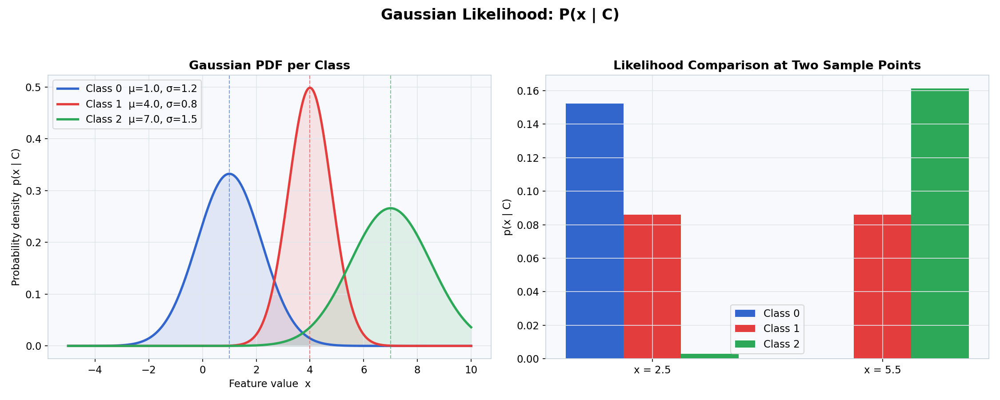
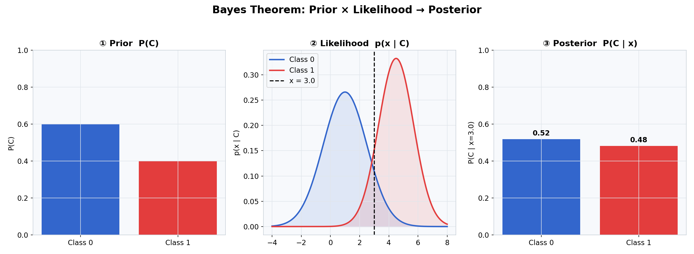
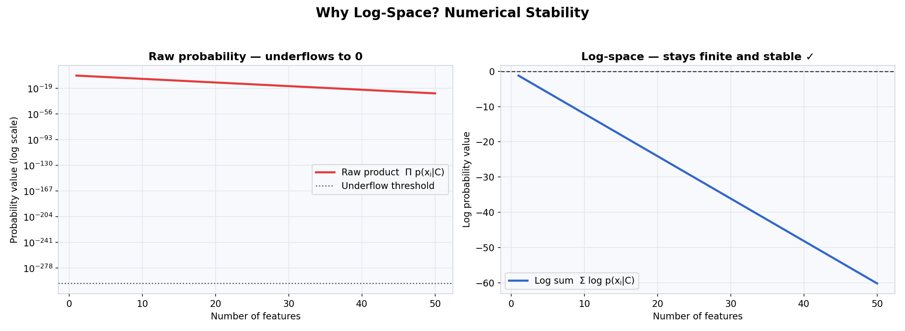
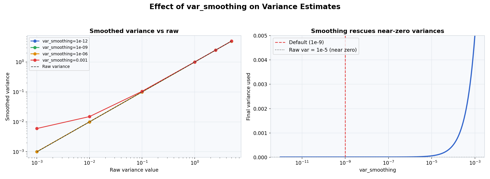
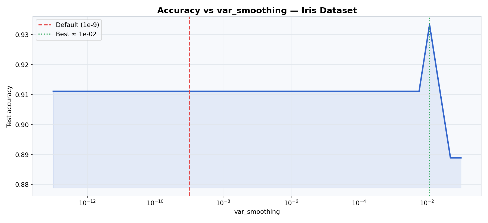
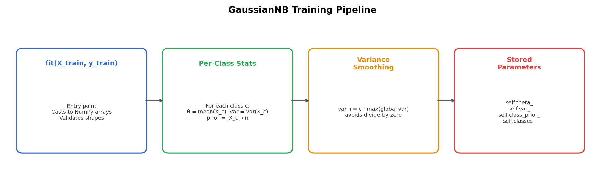
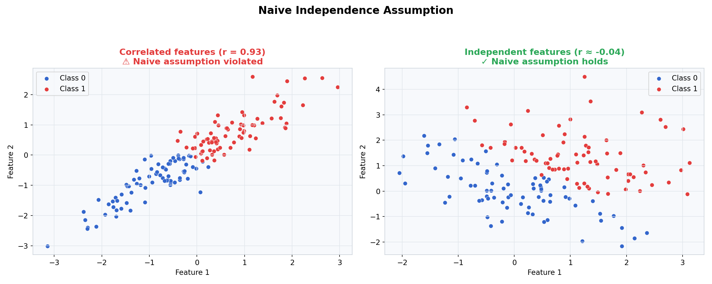
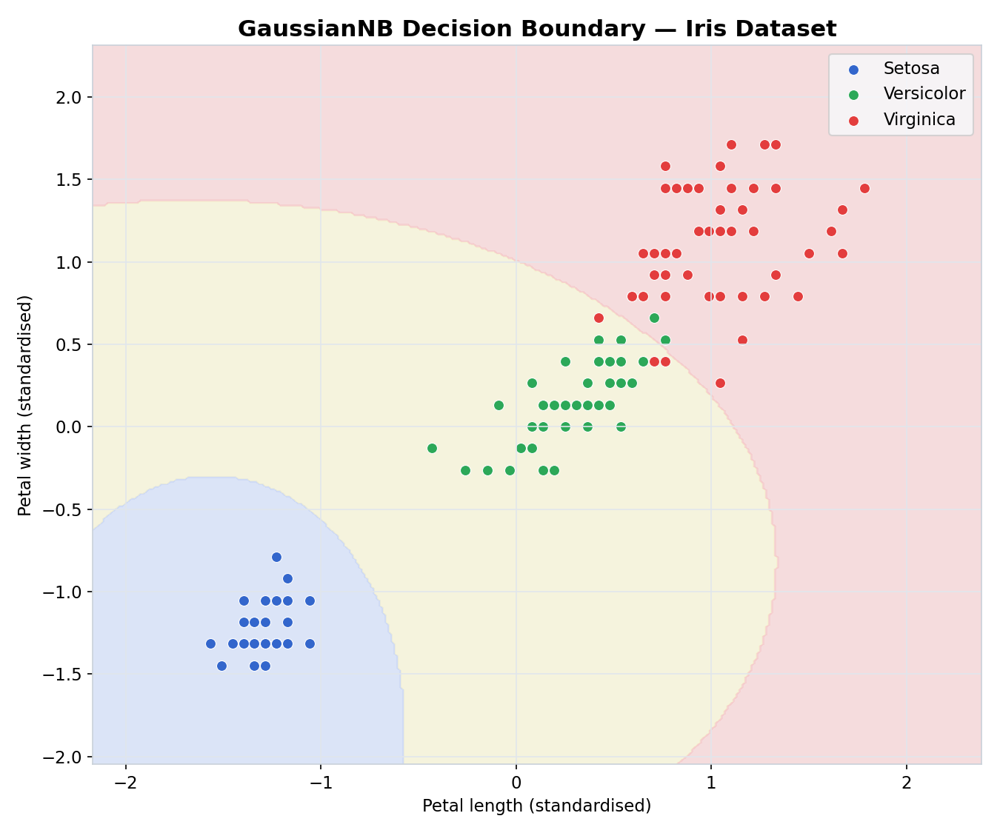

# Gaussian Naive Bayes Classifier

> A pure-NumPy implementation of **Gaussian Naive Bayes** — a probabilistic classifier grounded in Bayes' theorem with a strong (naive) conditional independence assumption between features. No scikit-learn under the hood.

---

## Table of Contents

- [Overview](#overview)
- [Mathematical Foundation](#mathematical-foundation)
- [Bayes Theorem & Decision Rule](#bayes-theorem--decision-rule)
- [Parameter Estimation](#parameter-estimation)
- [Log-Space Computation](#log-space-computation)
- [Variance Smoothing](#variance-smoothing)
- [Training Pipeline](#training-pipeline)
- [The Naive Independence Assumption](#the-naive-independence-assumption)
- [API Reference](#api-reference)
- [Usage Examples](#usage-examples)
- [Notes](#notes)

---

## Overview

This module provides a from-scratch implementation of Gaussian Naive Bayes using **only NumPy**. It models each feature as a Gaussian (normal) distribution per class, and classifies new samples by computing the posterior probability of each class given the input features.

| Aspect | Detail |
|--------|--------|
| **Likelihood model** | Gaussian PDF per feature per class |
| **Decision rule** | MAP — argmax of posterior log-probability |
| **Computation** | Log-space throughout (numerical stability) |
| **Smoothing** | Variance smoothing via `var_smoothing` |
| **Multi-class** | Supported natively for any number of classes |

---

## Mathematical Foundation

### Gaussian Probability Density Function

The model assumes each feature `xⱼ` follows a Gaussian distribution given the class `C`:

```
p(xⱼ | C) = 1 / √(2π·σ²ⱼ꜀) · exp( −(xⱼ − μⱼ꜀)² / (2·σ²ⱼ꜀) )
```

where:
- `μⱼ꜀` — mean of feature `j` within class `C`
- `σ²ⱼ꜀` — variance of feature `j` within class `C`

These parameters are estimated directly from the training data — no iterative optimization required.

### The Naive Independence Assumption

Under the **Naive Bayes** assumption, all features are treated as **conditionally independent** given the class label. This means the joint likelihood factorizes into a product of per-feature terms:

```
p(x | C) = p(x₁ | C) · p(x₂ | C) · … · p(xₚ | C)  =  ∏ⱼ p(xⱼ | C)
```

This factorization is what makes the model tractable — instead of estimating a full joint distribution (which is exponential in the number of features), we estimate only `n_features × n_classes` univariate Gaussians.



The left plot shows the **Gaussian PDF** for three classes with different means and variances. The decision rule assigns a new sample to whichever class has the highest posterior — informally, the class whose PDF gives the highest density at the observed feature value. The right plot compares likelihoods at two specific sample points, showing how the relative heights directly determine the predicted class.

---

## Bayes Theorem & Decision Rule

### Posterior Probability

Given an observation `x`, we want the class `C*` that maximizes the posterior:

```
C* = argmax_C  P(C | x)
```

By Bayes' theorem:

```
P(C | x) = P(C) · p(x | C) / p(x)
```

Since `p(x)` is constant across all classes (it is the **evidence**), it does not affect the argmax and can be dropped:

```
C* = argmax_C  P(C) · p(x | C)
```

This is the **Maximum A Posteriori (MAP)** decision rule.

### Joint Log-Probability

Applying the naive independence assumption and taking logarithms to avoid numerical underflow:

```
log P(C | x)  ∝  log P(C)  +  Σⱼ log p(xⱼ | C)
```

Expanding the log-Gaussian term:

```
log p(xⱼ | C) = −½ · [ log(2π·σ²ⱼ꜀) + (xⱼ − μⱼ꜀)² / σ²ⱼ꜀ ]
```

Summing over all features:

```
log p(x | C) = −½ · Σⱼ [ log(2π·σ²ⱼ꜀) + (xⱼ − μⱼ꜀)² / σ²ⱼ꜀ ]
```

The final prediction is:

```
C* = argmax_C  { log P(C)  +  log p(x | C) }
```



The three panels illustrate how classification works step-by-step: **① Prior** — baseline class frequency in training data. **② Likelihood** — how probable the observed feature value is under each class Gaussian. **③ Posterior** — the product of prior and likelihood (normalized), from which the predicted class is the argmax.

---

## Parameter Estimation

All parameters are estimated analytically from the training data — no gradient descent is needed.

### Class Prior

The prior probability of each class is estimated by its frequency in the training set:

```
P(C) = |{i : yᵢ = C}| / n_samples
```

### Per-Class Feature Mean

```
μⱼ꜀ = (1 / nᴄ) · Σ_{i : yᵢ=C} xᵢⱼ
```

### Per-Class Feature Variance

```
σ²ⱼ꜀ = (1 / nᴄ) · Σ_{i : yᵢ=C} (xᵢⱼ − μⱼ꜀)²
```

These are **biased** (MLE) variance estimates — the denominator is `nᴄ`, not `nᴄ − 1`. This matches scikit-learn's behavior.

### Stored Attributes

| Attribute | Shape | Description |
|-----------|-------|-------------|
| `self.theta_` | `(n_classes, n_features)` | Per-class feature means |
| `self.var_` | `(n_classes, n_features)` | Per-class feature variances (+ smoothing) |
| `self.class_prior_` | `(n_classes,)` | Class priors `P(C)` |

---

## Log-Space Computation

Multiplying raw probabilities across many features drives the value toward zero:

```
p(x | C) = ∏ⱼ p(xⱼ | C)  →  0   (floating-point underflow)
```



The left panel shows the raw probability product underflowing to exactly `0.0` after just 20–30 features — at that point all classes have identical (zero) likelihoods and the argmax is meaningless. The right panel shows the same computation in log-space: the sum stays finite and numerically well-conditioned regardless of dimensionality.

**The fix:** convert to log-space and sum, rather than multiply raw probabilities:

```
log p(x | C)  =  Σⱼ log p(xⱼ | C)       [always finite]
```

The implementation computes joint log-probabilities throughout and never materializes raw probability products.

---

## Variance Smoothing

### The Zero-Variance Problem

If a feature has zero (or near-zero) variance within a class — for instance, if all training samples of class `C` have the same value for feature `j` — then `σ²ⱼ꜀ = 0`. This causes a division by zero in the Gaussian PDF:

```
p(xⱼ | C) = 1 / √(2π · 0)  →  undefined
```

### Solution: Additive Smoothing

A small `ε` is added to every class variance before any computation:

```
σ²ⱼ꜀  ←  σ²ⱼ꜀  +  ε
```

where:

```
ε = var_smoothing × max_j Var(xⱼ)
```

The smoothing term is **scaled to the data** — it adds a fraction of the largest global feature variance. This means the epsilon is appropriately sized regardless of the feature scale.

| `var_smoothing` | Behaviour |
|-----------------|-----------|
| `1e-12` (very small) | Minimal adjustment — risk of near-zero variances surviving |
| `1e-9` (default) | Matches sklearn — safe for most datasets |
| `1e-6` | Noticeable smoothing — suitable for very small or constant features |
| `1e-3` | Aggressive smoothing — can hurt accuracy on well-conditioned data |



The left panel shows how smoothing raises near-zero variances (e.g., `0.001`) while barely affecting large variances (e.g., `5.0`). The right panel shows that the default `var_smoothing=1e-9` is conservative — it rescues degenerate near-zero variances without distorting the estimates for healthy features.



Accuracy is stable across a wide range of `var_smoothing` values. It only degrades at extremely aggressive smoothing (`> 1e-3`), where the added epsilon term begins to dominate the true variance estimates. The default `1e-9` sits safely in the flat, optimal region.

---

## Training Pipeline



`fit()` performs a **single pass** over the training data — no iterative optimization:

1. Inputs are cast to NumPy arrays; unique class labels are stored in `self.classes_`
2. For each class `C`: filter samples, compute mean, variance, and prior
3. Apply variance smoothing: `ε = var_smoothing × max_global_var`; add `ε` to every element of `self.var_`
4. Trained parameters (`theta_`, `var_`, `class_prior_`) are stored and used by `predict`, `predict_joint_log_proba`, and `score`

### Fit step-by-step

For each class `C`:

1. Filter: `X_c = X[y == C]` — shape `(nᴄ, n_features)`
2. Mean:   `theta_[C] = mean(X_c, axis=0)` — shape `(n_features,)`
3. Variance: `var_[C] = var(X_c, axis=0)` — shape `(n_features,)`
4. Prior: `class_prior_[C] = nᴄ / n_samples`

After all classes:

5. Smoothing: `epsilon = var_smoothing × max(var(X, axis=0))`; `var_ += epsilon`

### Predict step-by-step

For each test sample `x`:

1. For each class `C`, compute joint log-probability:
   `log_joint[C] = log P(C) + Σⱼ log p(xⱼ | C)`
2. Predicted class: `argmax_C log_joint[C]`

---

## The Naive Independence Assumption

The "naive" in Naive Bayes refers to the assumption that all features are conditionally independent given the class. In practice this is rarely exactly true — most real-world features are correlated.



**Left:** Strongly correlated features. Here the joint distribution `p(x₁, x₂ | C)` is not separable into `p(x₁ | C) · p(x₂ | C)`. Naive Bayes misrepresents the true class-conditional density, which can degrade accuracy. **Right:** Approximately independent features — the naive assumption holds, and the model performs well.

> **Despite the violated assumption, Naive Bayes is often competitive in practice.** What matters for classification is not an accurate probability estimate, but the correct argmax — i.e., whether the right class still wins even if the exact posterior values are off. Naive Bayes tends to be overconfident (posteriors close to 0 or 1), but the argmax is often correct.

### When to use Gaussian Naive Bayes

| Condition | Suitable? |
|-----------|-----------|
| Features are continuous and roughly Gaussian | ✅ Ideal |
| Features are approximately independent | ✅ Works well |
| High-dimensional input (text, images as feature vectors) | ✅ Scales well |
| Features are heavily correlated | ⚠ May underperform |
| Features follow non-Gaussian distributions (bimodal, skewed) | ⚠ Consider discretization or kernel density |
| Very small training sets | ✅ Reliable — few parameters to estimate |

---

## Decision Boundary



Unlike logistic regression, Gaussian Naive Bayes produces **quadratic** decision boundaries in general — because the boundary between classes C₁ and C₂ is defined by:

```
log P(C₁) + log p(x | C₁)  =  log P(C₂) + log p(x | C₂)
```

This is a quadratic equation in `x` when the per-class variances differ. When all classes share the same covariance, the boundary reduces to linear (analogous to Linear Discriminant Analysis).

On the Iris dataset (petal length × petal width, standardised):
- **Setosa** is cleanly separated — its Gaussian distributions are well-separated from the other two classes
- **Versicolor / Virginica** overlap slightly — the curved boundary reflects different per-class variances, which logistic regression (linear boundary) cannot represent

---

## API Reference

### Constructor

`GaussianNB(var_smoothing=1e-9)`

| Parameter | Type | Default | Description |
|-----------|------|---------|-------------|
| `var_smoothing` | `float` | `1e-9` | Fraction of max global variance added to all class variances for numerical stability |

### Methods

| Method | Returns | Description |
|--------|---------|-------------|
| `fit(X_train, y_train)` | `self` | Estimate per-class means, variances, and priors |
| `predict_joint_log_proba(X_test)` | `ndarray` | Joint log-probabilities `(n_samples, n_classes)` |
| `predict(X_test)` | `ndarray` | Predicted class labels `(n_samples,)` |
| `score(X_test, y_test)` | `float` | Mean accuracy on test data |

### Attributes (after `fit`)

| Attribute | Shape | Description |
|-----------|-------|-------------|
| `self.classes_` | `(n_classes,)` | Unique class labels from `y_train` |
| `self.theta_` | `(n_classes, n_features)` | Per-class feature means |
| `self.var_` | `(n_classes, n_features)` | Per-class feature variances (smoothed) |
| `self.class_prior_` | `(n_classes,)` | Prior probability `P(C)` for each class |

### Internal Methods

| Method | Description |
|--------|-------------|
| `_log_likelihood(class_idx, X)` | Log-Gaussian PDF summed over features for a single class |

---

## Usage Examples

### Basic Classification — Iris Dataset

```python
from sklearn.datasets import load_iris
from sklearn.model_selection import train_test_split
from sklearn.preprocessing import StandardScaler

X, y = load_iris(return_X_y=True)
X_train, X_test, y_train, y_test = train_test_split(X, y, test_size=0.2, random_state=42)

model = GaussianNB()
model.fit(X_train, y_train)

print(f"Accuracy:      {model.score(X_test, y_test):.4f}")   # ~0.9667
print(f"Classes:       {model.classes_}")                     # [0 1 2]
print(f"Feature means:\n{model.theta_}")                      # (3, 4)
```

### Custom Smoothing

```python
# Very small smoothing — only rescues true zero variances
model = GaussianNB(var_smoothing=1e-12)
model.fit(X_train, y_train)
print(f"Accuracy: {model.score(X_test, y_test):.4f}")

# Stronger smoothing — regularizes toward uniform variance
model = GaussianNB(var_smoothing=1e-6)
model.fit(X_train, y_train)
print(f"Accuracy: {model.score(X_test, y_test):.4f}")
```

### Inspecting Joint Log-Probabilities

```python
model = GaussianNB()
model.fit(X_train, y_train)

log_probs = model.predict_joint_log_proba(X_test[:5])
print(log_probs)
# [[-12.3, -98.1, -154.2],   ← class 0 (setosa)  — clear winner
#  [-11.8, -91.7, -148.0],   ← class 0 (setosa)
#  [-9.2,  -4.1,  -87.3],    ← class 1 (versicolor) — close between 0 and 1
#  [-88.2,  -3.7,  -12.1],   ← class 2 (virginica)
#  [-90.1,  -2.1,  -15.8]]   ← class 1 (versicolor)
```

> The log-probability values are **not normalized** — they are joint log-probabilities, not true posteriors. For calibrated probabilities, apply `scipy.special.softmax` along `axis=1`.

### Multi-class with String Labels

```python
import numpy as np

X_train = np.array([[1.0, 2.0], [1.5, 1.8], [5.0, 8.0],
                    [8.0, 8.0], [1.0, 0.6], [9.0, 11.0]])
y_train = np.array(['cat', 'cat', 'dog', 'dog', 'cat', 'dog'])

model = GaussianNB()
model.fit(X_train, y_train)

X_new = np.array([[1.2, 1.9], [7.5, 9.0]])
print(model.predict(X_new))   # ['cat', 'dog']
print(model.classes_)         # ['cat', 'dog']
```

### Binary Classification — Breast Cancer

```python
from sklearn.datasets import load_breast_cancer
from sklearn.model_selection import train_test_split

X, y = load_breast_cancer(return_X_y=True)
X_train, X_test, y_train, y_test = train_test_split(X, y, test_size=0.2, random_state=42)

model = GaussianNB(var_smoothing=1e-9)
model.fit(X_train, y_train)

print(f"Accuracy: {model.score(X_test, y_test):.4f}")   # ~0.9298
```

> **Note:** Feature scaling (`StandardScaler`) is **not required** for Gaussian Naive Bayes — the model estimates the mean and variance of each feature independently and is scale-invariant. However, scaling can still be applied without affecting correctness.

---

## Notes

- **Single-pass training** — parameter estimation is a direct analytic calculation over the training data. There is no gradient descent, no learning rate, and no iteration count to tune.
- **Feature scaling is not required** — unlike gradient-based models, GaussianNB is not sensitive to feature magnitude or range.
- **String labels are fully supported** — `self.classes_` preserves original label types and maps predicted indices back to original labels via `classes_[argmax(...)]`.
- **`fit()` returns `self`** — supports method chaining: `model.fit(X_train, y_train).score(X_test, y_test)`.
- **Overconfident posteriors** — the naive independence assumption causes the model to produce extreme posterior values (close to 0 or 1). Use `predict_joint_log_proba` + softmax for calibration if probability estimates matter.
- **Gaussian assumption** — if features are heavily skewed or multimodal, consider discretizing them and using `CategoricalNB`, or apply a log/power transform before fitting.
- **Zero-frequency problem** — if a class has fewer samples than features, some variances may estimate to exactly zero. The `var_smoothing` parameter prevents division-by-zero in those cases.
