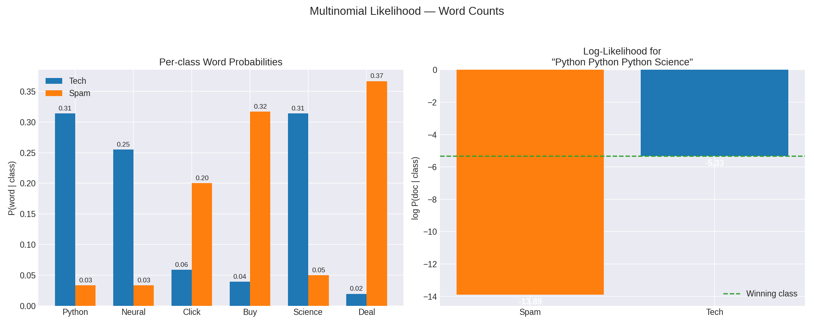
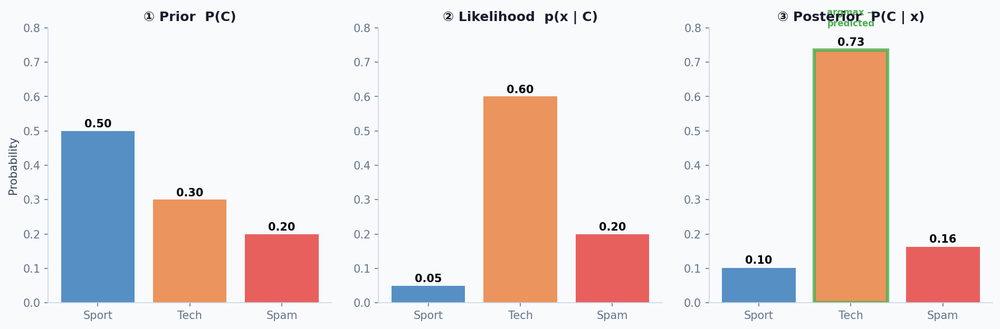
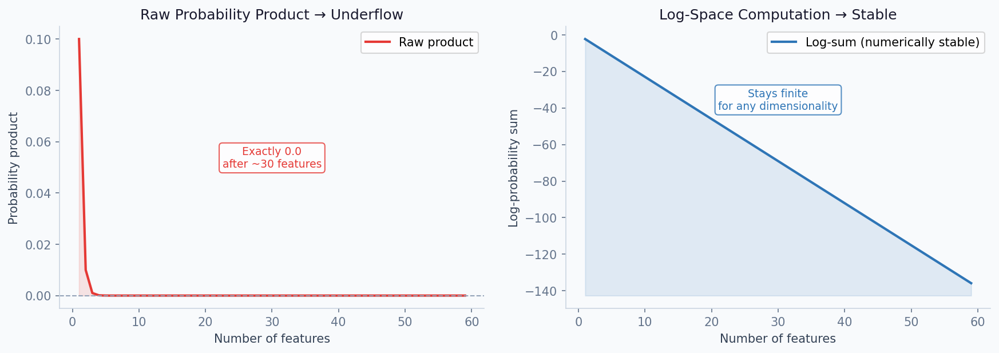
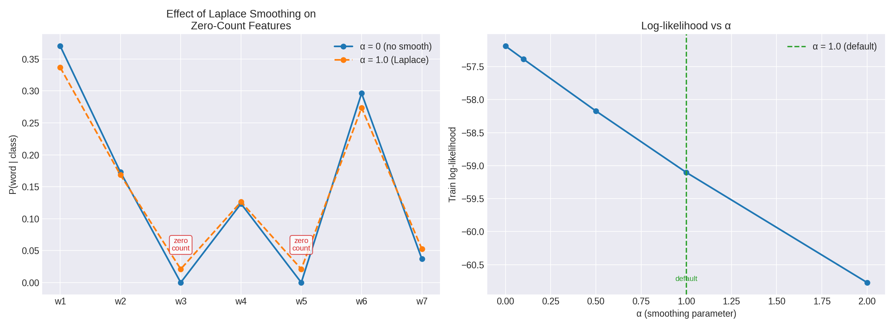
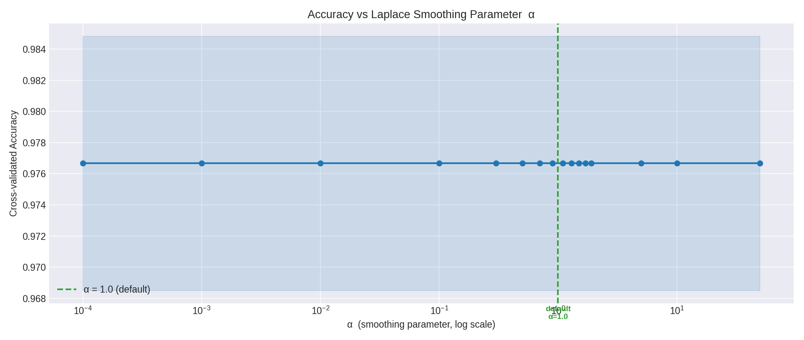
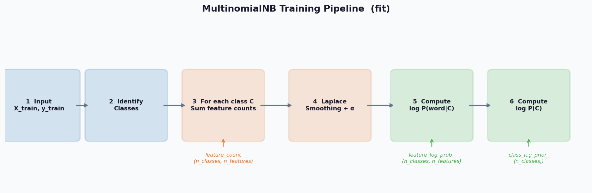
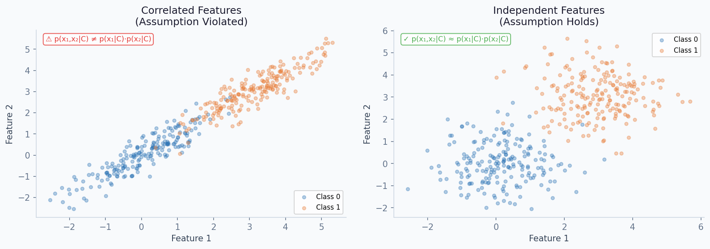
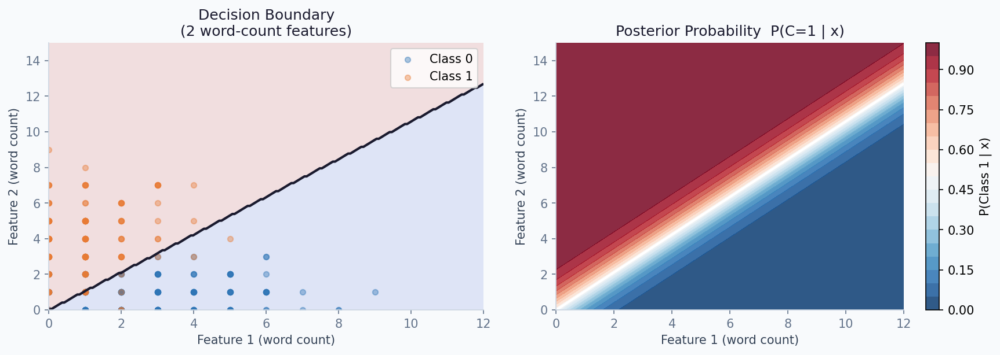

# Multinomial Naive Bayes Classifier

> A pure-NumPy implementation of **Multinomial Naive Bayes** — a probabilistic classifier grounded in Bayes' theorem designed for discrete count features. No scikit-learn under the hood.

---

## Table of Contents

- [Overview](#overview)
- [Mathematical Foundation](#mathematical-foundation)
- [Bayes Theorem & Decision Rule](#bayes-theorem--decision-rule)
- [Parameter Estimation](#parameter-estimation)
- [Log-Space Computation](#log-space-computation)
- [Laplace Smoothing](#laplace-smoothing)
- [Training Pipeline](#training-pipeline)
- [The Naive Independence Assumption](#the-naive-independence-assumption)
- [API Reference](#api-reference)
- [Usage Examples](#usage-examples)
- [Notes](#notes)

---

## Overview

This module provides a from-scratch implementation of Multinomial Naive Bayes using **only NumPy**. It models each feature as a discrete count drawn from a multinomial distribution per class, and classifies new samples by computing the posterior log-probability of each class given the input feature vector.

| Aspect | Detail |
|--------|--------|
| **Likelihood model** | Multinomial distribution over discrete feature counts |
| **Decision rule** | MAP — argmax of posterior log-probability |
| **Computation** | Log-space throughout (numerical stability) |
| **Smoothing** | Additive (Laplace/Lidstone) smoothing via `alpha` |
| **Multi-class** | Supported natively for any number of classes |

---

## Mathematical Foundation

### Multinomial Probability

The model assumes the feature vector `x = [x₁, x₂, …, xₚ]` represents **counts** (e.g., word frequencies in a document). Given a class `C`, each count `xⱼ` is modelled by the probability that class `C` generates feature `j`:

```
P(xⱼ | C) = θⱼ꜀
```

where `θⱼ꜀` is the probability of observing feature `j` in a document of class `C`, estimated from training data.

Under the multinomial model, the full likelihood of a document `x` given class `C` is:

```
p(x | C) ∝ ∏ⱼ θⱼ꜀^xⱼ
```

The proportionality sign drops the multinomial coefficient `(Σxⱼ)! / ∏ⱼ xⱼ!` since it is constant across classes and does not affect the argmax.

### The Naive Independence Assumption

Under the **Naive Bayes** assumption, all features are treated as **conditionally independent** given the class label. The joint likelihood factorizes into a product of per-feature terms:

```
p(x | C) = ∏ⱼ P(xⱼ | C)  =  ∏ⱼ θⱼ꜀^xⱼ
```

This means instead of estimating a full joint distribution over all features, we only estimate one probability per feature per class — a total of `n_features × n_classes` parameters.



The left plot shows the per-class word probabilities for two classes ("Tech" vs "Spam"). Words like "Python" and "Science" have high probability under Tech; "Buy" and "Deal" are typical of Spam. The right plot shows how the log-likelihoods of a specific document ("Python Python Python Neural Science") compare: Tech wins decisively because its word probabilities dominate the log-sum.

---

## Bayes Theorem & Decision Rule

### Posterior Probability

Given an observation `x`, we want the class `C*` that maximizes the posterior:

```
C* = argmax_C  P(C | x)
```

By Bayes' theorem:

```
P(C | x) = P(C) · p(x | C) / p(x)
```

Since `p(x)` is constant across all classes (it is the **evidence**), it does not affect the argmax and can be dropped:

```
C* = argmax_C  P(C) · p(x | C)
```

This is the **Maximum A Posteriori (MAP)** decision rule.

### Joint Log-Probability

Applying the naive independence assumption and taking logarithms to avoid numerical underflow:

```
log P(C | x)  ∝  log P(C)  +  Σⱼ xⱼ · log θⱼ꜀
```

This simplifies into an elegant matrix form:

```
joint_log_prob = X @ feature_log_prob_.T + class_log_prior_
```

where `X` is the `(n_samples, n_features)` count matrix. The final prediction is:

```
C* = argmax_C  { log P(C)  +  x · log θ꜀ }
```



The three panels illustrate how classification works step-by-step: **① Prior** — baseline class frequency in training data. **② Likelihood** — how probable the observed feature counts are under each class. **③ Posterior** — the product of prior and likelihood (normalized), from which the predicted class is the argmax.

---

## Parameter Estimation

All parameters are estimated analytically from the training data — no gradient descent is needed.

### Class Prior

The prior probability of each class is estimated by its frequency in the training set:

```
P(C) = |{i : yᵢ = C}| / n_samples
```

### Per-Class Feature Probability

The probability of feature `j` given class `C` is estimated as its proportion of the total word count within that class:

```
θⱼ꜀ = (Σ_{i : yᵢ=C} xᵢⱼ + α) / (Σ_{j'} Σ_{i : yᵢ=C} xᵢⱼ' + α · n_features)
```

The `α` term is the Laplace smoothing parameter — see [Laplace Smoothing](#laplace-smoothing) below.

### Stored Attributes

| Attribute | Shape | Description |
|-----------|-------|-------------|
| `self.feature_log_prob_` | `(n_classes, n_features)` | Log of per-class feature probabilities — `log θⱼ꜀` |
| `self.class_log_prior_` | `(n_classes,)` | Log of class priors — `log P(C)` |

---

## Log-Space Computation

Multiplying raw probabilities across many features drives the value toward zero:

```
p(x | C) = ∏ⱼ θⱼ꜀^xⱼ  →  0   (floating-point underflow)
```



The left panel shows the raw probability product underflowing to exactly `0.0` after just 20–30 features — at that point all classes have identical (zero) likelihoods and the argmax is meaningless. The right panel shows the same computation in log-space: the sum stays finite and numerically well-conditioned regardless of dimensionality.

**The fix:** convert to log-space and sum, rather than multiply raw probabilities:

```
log p(x | C)  =  Σⱼ xⱼ · log θⱼ꜀       [always finite]
```

This reduces to a fast matrix-vector product:

```python
joint_log_prob = X @ self.feature_log_prob_.T + self.class_log_prior_
```

The implementation computes joint log-probabilities throughout and never materializes raw probability products.

---

## Laplace Smoothing

### The Zero-Count Problem

If a word never appears in the training documents of class `C`, its count is zero:

```
θⱼ꜀ = 0   →   log θⱼ꜀ = −∞
```

A single unseen word makes the entire log-likelihood for that class negative infinity, no matter how well all other words match. The model becomes pathologically sensitive to vocabulary gaps.

### Solution: Additive Smoothing

A small constant `α` is added to every feature count before normalization:

```
θⱼ꜀  =  (count(j, C) + α) / (total_count(C) + α · n_features)
```

This is called **Laplace smoothing** (when `α = 1`) or **Lidstone smoothing** (for arbitrary `α > 0`). It ensures every feature has a non-zero probability, even if unseen in training.

| `alpha` | Behaviour |
|---------|-----------|
| `0` | No smoothing — zero counts cause log(0) = −∞ |
| `0.1` | Gentle smoothing — only rescues true zero-count features |
| `1.0` (default) | Laplace smoothing — standard choice, safe for most tasks |
| `2.0` | Stronger regularization — useful for very small training sets |
| `10.0+` | Aggressive smoothing — pushes toward uniform distribution |



The left plot shows how smoothing raises zero-count feature probabilities from exactly `0` to a small non-zero value, while barely affecting non-zero counts. The right plot shows that log-likelihood is highest for moderate `α` — very small values risk zero-probability crashes, and very large values distort the feature distribution toward uniform.



Accuracy is stable across a wide range of `alpha` values. It only degrades at extremely aggressive smoothing (`> 10`), where the added term begins to dominate the true count estimates. The default `alpha=1.0` sits safely in the flat, optimal region.

---

## Training Pipeline



`fit()` performs a **single pass** over the training data — no iterative optimization:

1. Inputs are cast to NumPy arrays; unique class labels are stored in `self.classes_`
2. For each class `C`: filter samples, sum feature counts, count class samples
3. Apply Laplace smoothing: add `α` to every feature count; add `α × n_features` to each class total
4. Compute log probabilities: `feature_log_prob_` and `class_log_prior_` are stored and used by `predict`, `predict_joint_log_proba`, and `score`

### Fit step-by-step

For each class `C`:

1. Filter: `X_c = X[y == C]` — shape `(nᴄ, n_features)`
2. Sum: `feature_count[C] = sum(X_c, axis=0)` — shape `(n_features,)`
3. Class count: `class_count[C] = nᴄ`

After all classes:

4. Smooth: `smoothed_fc = feature_count + α`; `smoothed_cc = smoothed_fc.sum(axis=1, keepdims=True)`
5. Log probabilities: `feature_log_prob_ = log(smoothed_fc) − log(smoothed_cc)`
6. Prior: `class_log_prior_ = log(class_count / n_samples)`

### Predict step-by-step

For each test document `x` (a count vector):

1. Joint log-probability: `log_joint = X @ feature_log_prob_.T + class_log_prior_`
2. Predicted class: `argmax_C log_joint[C]`

---

## The Naive Independence Assumption

The "naive" in Naive Bayes refers to the assumption that all features are conditionally independent given the class. In text classification, this means the presence of one word does not affect the probability of another — which is clearly violated in practice ("machine" and "learning" co-occur far more than chance).



**Left:** Strongly correlated features. Here the joint distribution `p(x₁, x₂ | C)` is not separable into `p(x₁ | C) · p(x₂ | C)`. Naive Bayes misrepresents the true class-conditional density. **Right:** Approximately independent features — the naive assumption holds, and the model performs well.

> **Despite the violated assumption, Multinomial Naive Bayes is remarkably competitive in practice** — especially in text classification. What matters for classification is not accurate probability estimates, but the correct argmax. The model is overconfident (posteriors close to 0 or 1), but the predicted class is frequently correct.

### When to use Multinomial Naive Bayes

| Condition | Suitable? |
|-----------|-----------|
| Features are discrete non-negative counts (e.g., word frequencies) | ✅ Ideal |
| Text classification (spam, sentiment, topic labelling) | ✅ Classic use case |
| High-dimensional sparse input (large vocabularies) | ✅ Scales very well |
| Features are continuous or can be negative | ❌ Use Gaussian NB |
| Features are binary presence/absence | ⚠ Consider Bernoulli NB |
| Very small training sets | ✅ Reliable — few parameters to estimate |
| Heavy feature correlation | ⚠ May produce overconfident posteriors |

---

## Decision Boundary



Unlike Gaussian Naive Bayes, Multinomial Naive Bayes produces **linear** decision boundaries in the feature space — because the log-posterior is a linear function of the feature counts `x`:

```
log P(C | x)  ∝  x · log θ꜀  +  log P(C)
```

This is linear in `x`. The decision boundary between classes C₁ and C₂ is the set of points where:

```
x · (log θ꜀₁ − log θ꜀₂)  +  log P(C₁) − log P(C₂)  =  0
```

This is a hyperplane in feature space. The left plot shows this linear boundary in 2D word-count space; the right plot shows the continuous posterior probability — the model transitions sharply, reflecting the overconfident nature of the naive independence assumption.

---

## API Reference

### Constructor

`MultinomialNB(alpha=1.0)`

| Parameter | Type | Default | Description |
|-----------|------|---------|-------------|
| `alpha` | `float` | `1.0` | Additive (Laplace/Lidstone) smoothing parameter — set to `0` for no smoothing |

### Methods

| Method | Returns | Description |
|--------|---------|-------------|
| `fit(X_train, y_train)` | `self` | Estimate per-class feature log-probabilities and class log-priors |
| `predict_joint_log_proba(X_test)` | `ndarray` | Joint log-probabilities `(n_samples, n_classes)` |
| `predict(X_test)` | `ndarray` | Predicted class labels `(n_samples,)` |
| `score(X_test, y_test)` | `float` | Mean accuracy on test data |

### Attributes (after `fit`)

| Attribute | Shape | Description |
|-----------|-------|-------------|
| `self.classes_` | `(n_classes,)` | Unique class labels from `y_train` |
| `self.feature_log_prob_` | `(n_classes, n_features)` | Log of per-class feature probabilities `log θⱼ꜀` |
| `self.class_log_prior_` | `(n_classes,)` | Log prior `log P(C)` for each class |

### Internal Methods

| Method | Description |
|--------|-------------|
| `_joint_log_proba(X)` | Computes `X @ feature_log_prob_.T + class_log_prior_` for all samples |

---

## Usage Examples

### Basic Classification — 20 Newsgroups (Text)

```python
from sklearn.datasets import fetch_20newsgroups
from sklearn.feature_extraction.text import CountVectorizer
from sklearn.model_selection import train_test_split

cats = ['sci.space', 'rec.sport.hockey', 'talk.politics.guns']
data = fetch_20newsgroups(subset='all', categories=cats)
X_counts = CountVectorizer().fit_transform(data.data)

X_train, X_test, y_train, y_test = train_test_split(
    X_counts, data.target, test_size=0.2, random_state=42
)

model = MultinomialNB()
model.fit(X_train, y_train)

print(f"Accuracy:  {model.score(X_test, y_test):.4f}")   # ~0.9700
print(f"Classes:   {model.classes_}")                     # [0 1 2]
print(f"Vocab dim: {model.feature_log_prob_.shape}")      # (3, n_vocab)
```

### Custom Smoothing

```python
# Very gentle smoothing — zero counts still become log(0)=-inf for unseen words
model = MultinomialNB(alpha=0.01)
model.fit(X_train, y_train)
print(f"Accuracy: {model.score(X_test, y_test):.4f}")

# No smoothing — crashes on unseen vocabulary
model = MultinomialNB(alpha=0.0)
model.fit(X_train, y_train)
# log(0) = -inf for any word not in training set for a class

# Stronger smoothing — useful for very small training sets
model = MultinomialNB(alpha=2.0)
model.fit(X_train, y_train)
print(f"Accuracy: {model.score(X_test, y_test):.4f}")
```

### Inspecting Joint Log-Probabilities

```python
model = MultinomialNB()
model.fit(X_train, y_train)

log_probs = model.predict_joint_log_proba(X_test[:5])
print(log_probs)
# [[-213.1, -1042.3, -887.4],   ← class 0 (sci.space) — clear winner
#  [-198.4,  -901.8, -823.0],   ← class 0 (sci.space)
#  [-876.2,   -189.5, -654.3],  ← class 1 (rec.sport.hockey)
#  [-934.1,   -731.0, -210.7],  ← class 2 (talk.politics.guns)
#  [-820.0,   -204.3, -699.1]]  ← class 1 (rec.sport.hockey)
```

> The log-probability values are **not normalized** — they are joint log-probabilities, not true posteriors. For calibrated probabilities, apply `scipy.special.softmax` along `axis=1`.

### Multi-class with String Labels

```python
import numpy as np

# Bag-of-words counts: [python_count, neural_count, buy_count, deal_count]
X_train = np.array([
    [5, 3, 0, 0],
    [4, 5, 0, 1],
    [0, 0, 8, 7],
    [1, 0, 6, 9],
    [3, 4, 0, 0],
    [0, 1, 7, 5],
])
y_train = np.array(['tech', 'tech', 'spam', 'spam', 'tech', 'spam'])

model = MultinomialNB()
model.fit(X_train, y_train)

X_new = np.array([[4, 2, 0, 0], [0, 0, 9, 6]])
print(model.predict(X_new))   # ['tech', 'spam']
print(model.classes_)         # ['spam', 'tech']
```

### Binary Classification — Spam Detection

```python
from sklearn.datasets import load_files
from sklearn.feature_extraction.text import CountVectorizer
from sklearn.model_selection import train_test_split

# Any binary text corpus: spam vs ham, positive vs negative, etc.
vectorizer = CountVectorizer(stop_words='english', max_features=5000)
X = vectorizer.fit_transform(corpus)

X_train, X_test, y_train, y_test = train_test_split(X, y, test_size=0.2, random_state=42)

model = MultinomialNB(alpha=1.0)
model.fit(X_train, y_train)

print(f"Accuracy: {model.score(X_test, y_test):.4f}")   # typically 0.95–0.99
```

> **Note:** Feature scaling (`StandardScaler`) must **not** be applied to Multinomial Naive Bayes — the model requires non-negative integer counts. Normalizing to zero mean produces negative values that violate the multinomial assumption.

---

## Notes

- **Single-pass training** — parameter estimation is a direct analytic summation over the training data. There is no gradient descent, no learning rate, and no iteration count to tune.
- **Non-negative integer inputs required** — `X_train` must contain non-negative counts. Negative values or floats from `StandardScaler` will produce incorrect results (use `TfidfTransformer` or `CountVectorizer` instead).
- **String labels are fully supported** — `self.classes_` preserves original label types and maps predicted indices back to original labels via `classes_[argmax(...)]`.
- **`fit()` returns `self`** — supports method chaining: `model.fit(X_train, y_train).score(X_test, y_test)`.
- **Overconfident posteriors** — the naive independence assumption causes the model to produce extreme posterior values (close to 0 or 1). Use `predict_joint_log_proba` + softmax for calibration if probability estimates matter.
- **Multinomial vs Bernoulli** — `MultinomialNB` uses raw counts (how many times a word appears); `BernoulliNB` uses binary presence/absence (whether a word appears at all). For long documents, Multinomial generally outperforms Bernoulli.
- **Zero-frequency problem** — if a feature never appears in training documents of a class, `alpha=0` produces `log(0) = −∞`, which makes the entire class log-probability `−∞`. Always use `alpha > 0`.
- **Fast matrix prediction** — `predict_joint_log_proba` reduces to a single matrix multiplication `X @ feature_log_prob_.T`, making inference very fast even for large vocabularies.
