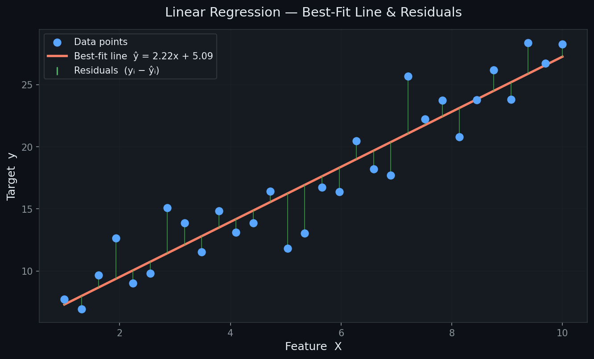
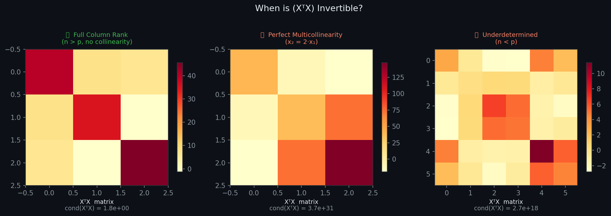
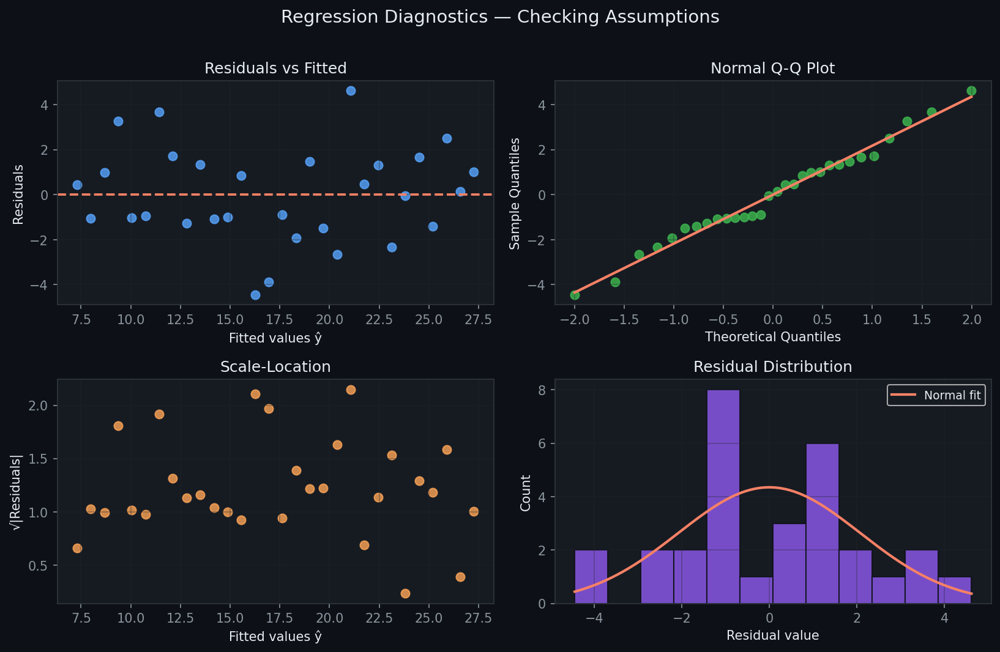

# Linear Regression — Closed-Form Solution

> A clean, NumPy-only implementation of Ordinary Least Squares regression using the **Normal Equation**.  
> No iterative optimisation, no learning rate, no epochs — just one matrix inversion.

---

## Table of Contents

1. [What is Linear Regression?](#1-what-is-linear-regression)
2. [The Model](#2-the-model)
3. [Cost Function — MSE](#3-cost-function--mse)
4. [Deriving the Normal Equation](#4-deriving-the-normal-equation)
5. [Geometric Intuition](#5-geometric-intuition)
6. [When is the Solution Valid?](#6-when-is-the-solution-valid)
7. [Regression Diagnostics](#7-regression-diagnostics)
8. [Multivariate Results](#8-multivariate-results)
9. [Usage](#9-usage)
10. [Assumptions](#10-assumptions)
11. [Pros & Cons vs Gradient Descent](#11-pros--cons-vs-gradient-descent)

---

## 1. What is Linear Regression?

Linear Regression is the task of fitting the **best straight line** (or hyperplane) through a set of data points by modelling a continuous target $y$ as a weighted linear combination of input features $\mathbf{x}$.



*Each green vertical bar is a **residual** — the gap between a real observation and the model's prediction. The red line minimises the sum of squared residuals.*

---

## 2. The Model

For $n$ samples and $p$ features the prediction is:

$$\hat{y}_i = w_1 x_{i1} + w_2 x_{i2} + \cdots + w_p x_{ip} + b$$

In matrix form — after prepending a column of 1s to absorb the bias $b$:

$$\hat{\mathbf{y}} = \mathbf{X}\boldsymbol{\hat\beta}, \qquad \mathbf{X} \in \mathbb{R}^{n \times (p+1)},\quad \boldsymbol{\hat\beta} \in \mathbb{R}^{p+1}$$

where $\boldsymbol{\hat\beta} = [b,\ w_1,\ w_2,\ \ldots,\ w_p]^T$.

---

## 3. Cost Function — MSE

We want to minimise the **Mean Squared Error**:

$$\mathcal{L}(\boldsymbol\beta) = \frac{1}{n}\|\mathbf{y} - \mathbf{X}\boldsymbol\beta\|^2 = \frac{1}{n}\sum_{i=1}^{n}(y_i - \hat{y}_i)^2$$

The loss surface is a **convex bowl** — it has exactly one global minimum with no local minima to get trapped in.


*The green dot marks the analytic global minimum $(w^*, b^*)$ sitting at the bottom of the convex bowl. The closed-form solution jumps directly there.*

---

## 4. Deriving the Normal Equation

Starting from the MSE objective (ignoring the $\frac{1}{n}$ constant):

| Step | Expression |
|------|-----------|
| **Expand** | $\mathcal{L} = (\mathbf{y} - \mathbf{X}\boldsymbol\beta)^T(\mathbf{y} - \mathbf{X}\boldsymbol\beta)$ |
| **Differentiate** | $\dfrac{\partial \mathcal{L}}{\partial \boldsymbol\beta} = -2\mathbf{X}^T(\mathbf{y} - \mathbf{X}\boldsymbol\beta)$ |
| **Set to zero** | $\mathbf{X}^T\mathbf{X}\,\boldsymbol{\hat\beta} = \mathbf{X}^T\mathbf{y}$ |
| **Solve** | $\boxed{\boldsymbol{\hat\beta} = (\mathbf{X}^T\mathbf{X})^{-1}\mathbf{X}^T\mathbf{y}}$ |

This is the **Normal Equation** — a single, exact, closed-form expression for the optimal weights.


*Left: $\hat{\mathbf{y}} = \mathbf{X}\boldsymbol{\hat\beta}$ is the **orthogonal projection** of $\mathbf{y}$ onto the column space of $\mathbf{X}$. Right: the five-step derivation in one glance.*

---

## 5. Geometric Intuition

The Normal Equation has an elegant geometric interpretation:

- $\mathbf{y}$ lives in $\mathbb{R}^n$ (one dimension per sample).
- The column space of $\mathbf{X}$ is a $p$-dimensional subspace.
- $\hat{\mathbf{y}} = \mathbf{X}\boldsymbol{\hat\beta}$ is the point in that subspace **closest** to $\mathbf{y}$.
- "Closest" in Euclidean distance ⟺ the residual $\mathbf{y} - \hat{\mathbf{y}}$ is **perpendicular** to every column of $\mathbf{X}$, which gives exactly $\mathbf{X}^T(\mathbf{y} - \mathbf{X}\boldsymbol{\hat\beta}) = \mathbf{0}$ — i.e., the Normal Equation.

---

## 6. When is the Solution Valid?

$(\mathbf{X}^T\mathbf{X})^{-1}$ exists **if and only if** $\mathbf{X}$ has full column rank:

| Condition | Effect on $\mathbf{X}^T\mathbf{X}$ | Fix |
|-----------|-------------------------------------|-----|
| $n > p$ and no collinearity | ✅ Invertible, unique solution | — |
| Perfect multicollinearity ($x_j = c \cdot x_k$) | ❌ Singular | Remove duplicate feature |
| $n < p$ (more features than samples) | ❌ Rank-deficient | Regularise (Ridge: add $\lambda I$) |



*Heatmaps of $\mathbf{X}^T\mathbf{X}$ under three scenarios. A near-singular matrix (high condition number) leads to numerically unstable or non-existent inverses.*

**Ridge Regression fallback:**

$$\boldsymbol{\hat\beta}_{\text{ridge}} = (\mathbf{X}^T\mathbf{X} + \lambda\mathbf{I})^{-1}\mathbf{X}^T\mathbf{y}$$

Adding $\lambda\mathbf{I}$ guarantees invertibility and shrinks coefficients toward zero.

---

## 7. Regression Diagnostics

After fitting, always verify the four core assumptions visually:



| Plot | What to look for | Assumption checked |
|------|-----------------|-------------------|
| **Residuals vs Fitted** | Random scatter around 0 | Linearity & homoscedasticity |
| **Normal Q-Q** | Points on the diagonal | Normality of residuals |
| **Scale-Location** | Flat, random band | Constant variance |
| **Residual Distribution** | Bell-shaped histogram | Normality |

---

## 8. Multivariate Results

In the multivariate case ($p > 1$), the same Normal Equation applies without modification.


*Left: predictions closely track true values (R² near 1). Right: the learned $\hat\beta$ values — green bars are positive weights, red bars are negative.*

---

## 9. Usage

```python
import numpy as np
from linear_regression import LinearRegression

# Prepare data
X_train = np.array([[1], [2], [3], [4], [5]], dtype=float)
y_train = np.array([2.1, 3.9, 6.2, 7.8, 10.1])

# Fit
model = LinearRegression()
model.fit(X_train, y_train)

print("Intercept (b) :", model.intercept_)   # scalar
print("Weights   (w) :", model.coef_)        # array, shape (n_features,)

# Predict
X_test = np.array([[6], [7], [8]], dtype=float)
y_pred = model.predict(X_test)
print("Predictions   :", y_pred)

# Evaluate
print(f"R²  = {model.score(X_test, y_pred):.4f}")
```

**Multi-feature example:**

```python
X_multi = np.random.randn(100, 3)          # 100 samples, 3 features
y_multi = X_multi @ np.array([1.5, -2.0, 3.0]) + 5.0 + np.random.randn(100)

model.fit(X_multi, y_multi)
predictions = model.predict(X_multi)
```

---

## 10. Assumptions

For the OLS estimator to be **BLUE** (Best Linear Unbiased Estimator — Gauss-Markov theorem):

1. **Linearity** — the true relationship is $y = \mathbf{X}\boldsymbol\beta + \varepsilon$.
2. **No perfect multicollinearity** — $\text{rank}(\mathbf{X}) = p + 1$.
3. **Zero-mean errors** — $\mathbb{E}[\varepsilon] = 0$.
4. **Homoscedasticity** — $\text{Var}(\varepsilon_i) = \sigma^2$ (constant for all $i$).
5. **No autocorrelation** — $\text{Cov}(\varepsilon_i, \varepsilon_j) = 0$ for $i \neq j$.
6. *(For inference only)* **Normality** — $\varepsilon \sim \mathcal{N}(0, \sigma^2)$.

---

## 11. Pros & Cons vs Gradient Descent

| Criterion | **Closed Form** (Normal Equation) | **Gradient Descent** |
|-----------|----------------------------------|----------------------|
| Convergence | Exact, one-shot | Iterative, may need tuning |
| Hyperparameters | None | Learning rate, epochs |
| Time complexity | $O(p^3)$ — dominated by matrix inversion | $O(k \cdot n \cdot p)$ — $k$ iterations |
| Memory | Stores $\mathbf{X}^T\mathbf{X}$ ($p^2$ floats) | One mini-batch at a time |
| Best for | $p \lesssim 10{,}000$ features | Very large $p$ or online learning |
| Invertibility | Fails if $\mathbf{X}^T\mathbf{X}$ is singular | Always applicable |

**Rule of thumb:** prefer the Normal Equation when the feature count is in the thousands or below; switch to gradient descent for large-scale or streaming data.

---

## Dependencies

```
numpy >= 1.21
```

No other dependencies required.

---

## License

MIT