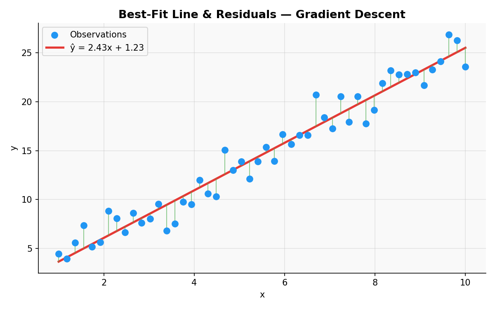
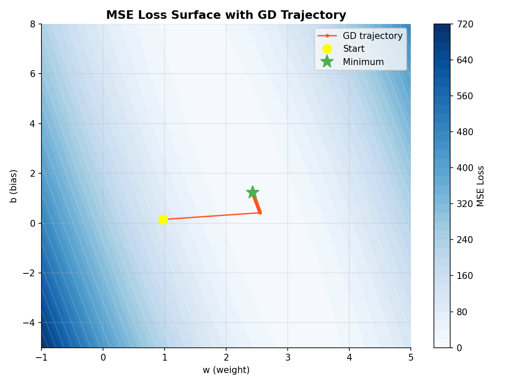
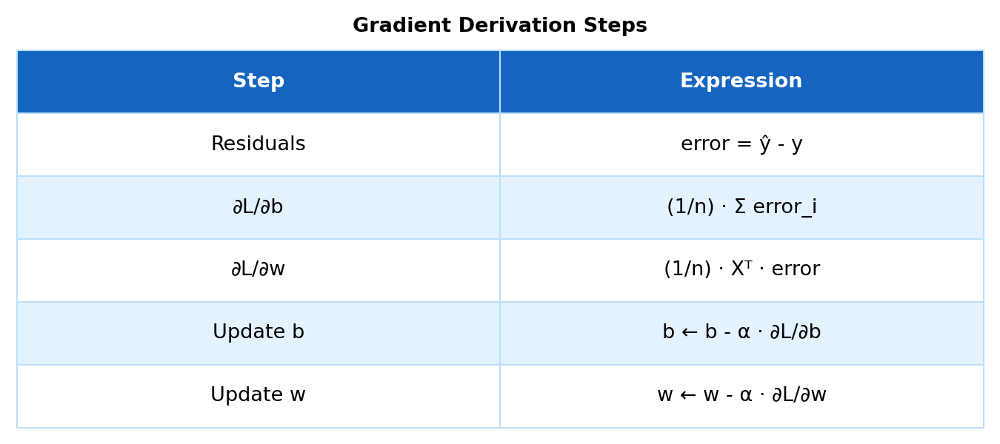
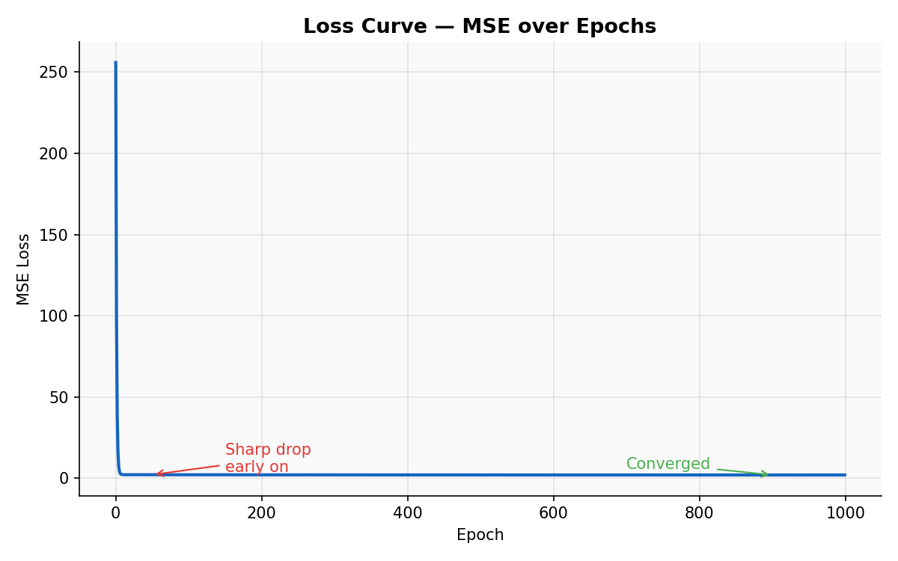
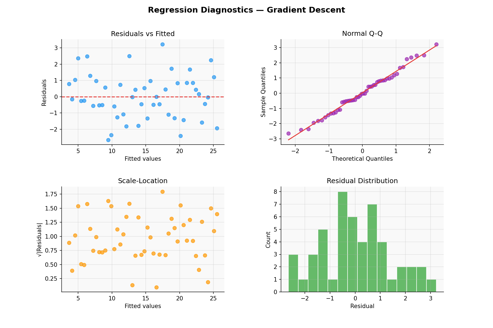
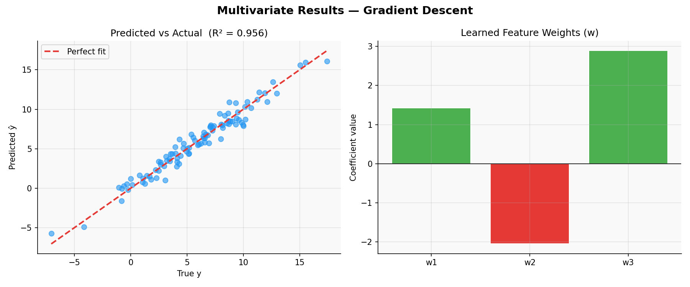

# Linear Regression — Gradient Descent

> A clean, NumPy-only implementation of Linear Regression trained via **Batch Gradient Descent**.  
> No closed-form inversion — iteratively nudges weights $w$ and bias $b$ down the loss surface until convergence.

---

## Table of Contents

1. [What is Gradient Descent?](#1-what-is-gradient-descent)
2. [The Model](#2-the-model)
3. [Cost Function — MSE](#3-cost-function--mse)
4. [Deriving the Gradients](#4-deriving-the-gradients)
5. [Geometric Intuition](#5-geometric-intuition)
6. [Loss Curve](#6-loss-curve)
7. [Regression Diagnostics](#7-regression-diagnostics)
8. [Multivariate Results](#8-multivariate-results)
9. [Usage](#9-usage)
10. [Assumptions](#10-assumptions)
11. [Pros & Cons vs Normal Equation](#11-pros--cons-vs-normal-equation)

---

## 1. What is Gradient Descent?

Gradient Descent is an iterative optimisation algorithm that finds the minimum of a function by repeatedly stepping in the **direction of steepest descent** (the negative gradient).

Instead of solving for the optimal weights analytically, we start from zero initialisation and move step-by-step toward the minimum of the loss surface.



*Each green vertical bar is a **residual** — the gap between a real observation and the model's prediction. The red line is the best-fit found by gradient descent after convergence.*

---

## 2. The Model

For $n$ samples and $p$ features the prediction is:

$$\hat{y}_i = w_1 x_{i1} + w_2 x_{i2} + \cdots + w_p x_{ip} + b$$

In matrix form:

$$\hat{\mathbf{y}} = \mathbf{X}\mathbf{w} + b, \qquad \mathbf{X} \in \mathbb{R}^{n \times p},\quad \mathbf{w} \in \mathbb{R}^{p},\quad b \in \mathbb{R}$$

where $\mathbf{w} = [w_1,\ w_2,\ \ldots,\ w_p]^T$ are the feature weights and $b$ is the bias.

---

## 3. Cost Function — MSE

We minimise the **Mean Squared Error** over all $n$ training samples:

$$\mathcal{L}(\mathbf{w}, b) = \frac{1}{n}\sum_{i=1}^{n}(y_i - \hat{y}_i)^2 = \frac{1}{n}\|\mathbf{y} - \hat{\mathbf{y}}\|^2$$

The loss surface is **convex** — one global minimum, guaranteed convergence for a small enough learning rate.



*Contour map of the loss surface over $(w, b)$. The orange trajectory shows gradient descent stepping from the yellow start point toward the green minimum.*

---

## 4. Deriving the Gradients

Taking partial derivatives of $\mathcal{L}$ with respect to $b$ and $\mathbf{w}$:

**Gradient w.r.t bias $b$:**

$$\frac{\partial \mathcal{L}}{\partial b} = \frac{1}{n}\sum_{i=1}^{n}(\hat{y}_i - y_i) = \frac{1}{n}\mathbf{1}^T(\hat{\mathbf{y}} - \mathbf{y})$$

**Gradient w.r.t weights $\mathbf{w}$:**

$$\frac{\partial \mathcal{L}}{\partial \mathbf{w}} = \frac{1}{n}\mathbf{X}^T(\hat{\mathbf{y}} - \mathbf{y})$$

**Update rule — simultaneously update $\mathbf{w}$ and $b$ each epoch:**

$$\mathbf{w} \leftarrow \mathbf{w} - \alpha \cdot \frac{\partial \mathcal{L}}{\partial \mathbf{w}}, \qquad b \leftarrow b - \alpha \cdot \frac{\partial \mathcal{L}}{\partial b}$$

where $\alpha$ is the **learning rate**.



*The five-step derivation — from residuals to the final parameter updates — in one glance.*

---

## 5. Geometric Intuition

- $\mathbf{y}$ lives in $\mathbb{R}^n$ (one dimension per sample).
- Gradient descent searches for $\mathbf{w}$ and $b$ that minimise the distance between $\hat{\mathbf{y}}$ and $\mathbf{y}$.
- Each step moves $(w, b)$ in the direction that reduces MSE the fastest.
- Convergence is guaranteed because the MSE surface is a **convex bowl** with a single global minimum.

---

## 6. Loss Curve

`loss_history_` stores MSE at every epoch. A healthy curve drops sharply then flattens — always plot it to confirm convergence.



*Sharp drop early on as large gradients correct the initialisation, then flattening as $(w, b)$ settle near the minimum. If the curve rises or oscillates — reduce the learning rate.*

---

## 7. Regression Diagnostics

After fitting, always verify the four core assumptions visually:



| Plot | What to look for | Assumption checked |
|------|-----------------|-------------------|
| **Residuals vs Fitted** | Random scatter around 0 | Linearity & homoscedasticity |
| **Normal Q-Q** | Points on the diagonal | Normality of residuals |
| **Scale-Location** | Flat, random band | Constant variance |
| **Residual Distribution** | Bell-shaped histogram | Normality |

---

## 8. Multivariate Results

In the multivariate case ($p > 1$), the same gradient update applies without modification.



*Left: predictions closely track true values (R² near 1). Right: the learned $\mathbf{w}$ values — green bars are positive weights, red bars are negative.*

---

## 9. Usage

```python
import numpy as np
from gradient_descent_regressor import GradientDescentRegressor

# Prepare data
X_train = np.array([[1], [2], [3], [4], [5]], dtype=float)
y_train = np.array([2.1, 3.9, 6.2, 7.8, 10.1])

# Fit
model = GradientDescentRegressor(learning_rate=0.01, epochs=1000)
model.fit(X_train, y_train)

print("Intercept (b) :", model.intercept_)   # scalar
print("Weights   (w) :", model.coef_)        # array, shape (n_features,)

# Predict
X_test = np.array([[6], [7], [8]], dtype=float)
y_pred = model.predict(X_test)
print("Predictions   :", y_pred)

# Evaluate
print(f"R²  = {model.score(X_test, y_pred):.4f}")

# Plot loss curve
import matplotlib.pyplot as plt
plt.plot(model.loss_history_)
plt.xlabel("Epoch"); plt.ylabel("MSE")
plt.title("Loss Curve")
plt.show()
```

**Multi-feature example:**

```python
X_multi = np.random.randn(100, 3)          # 100 samples, 3 features
y_multi = X_multi @ np.array([1.5, -2.0, 3.0]) + 5.0 + np.random.randn(100)

model = GradientDescentRegressor(learning_rate=0.01, epochs=2000)
model.fit(X_multi, y_multi)
predictions = model.predict(X_multi)
```

---

## 10. Assumptions

For gradient descent to find a meaningful solution:

1. **Linearity** — the true relationship is $y = \mathbf{X}\mathbf{w} + b + \varepsilon$.
2. **Zero-mean errors** — $\mathbb{E}[\varepsilon] = 0$.
3. **Homoscedasticity** — $\text{Var}(\varepsilon_i) = \sigma^2$ (constant for all $i$).
4. **No autocorrelation** — $\text{Cov}(\varepsilon_i, \varepsilon_j) = 0$ for $i \neq j$.
5. **Feature scaling recommended** — gradient descent converges faster when features are on the same scale (use `StandardScaler`).

---

## 11. Pros & Cons vs Normal Equation

| Criterion | **Gradient Descent** | **Normal Equation** |
|-----------|----------------------|----------------------|
| Convergence | Iterative, needs tuning | Exact, one-shot |
| Hyperparameters | Learning rate, epochs | None |
| Time complexity | $O(k \cdot n \cdot p)$ — $k$ iterations | $O(p^3)$ — matrix inversion |
| Memory | One pass at a time | Stores $\mathbf{X}^T\mathbf{X}$ ($p^2$ floats) |
| Best for | Large $p$, online learning | $p \lesssim 10{,}000$ features |
| Invertibility | Always applicable | Fails if $\mathbf{X}^T\mathbf{X}$ is singular |
| Feature scaling | Required for fast convergence | Not needed |

**Rule of thumb:** use gradient descent when features exceed the thousands or data arrives in streams; use the Normal Equation for small-to-medium datasets.

---

## Dependencies

```
numpy >= 1.21
```

No other dependencies required.

---

## License

MIT
