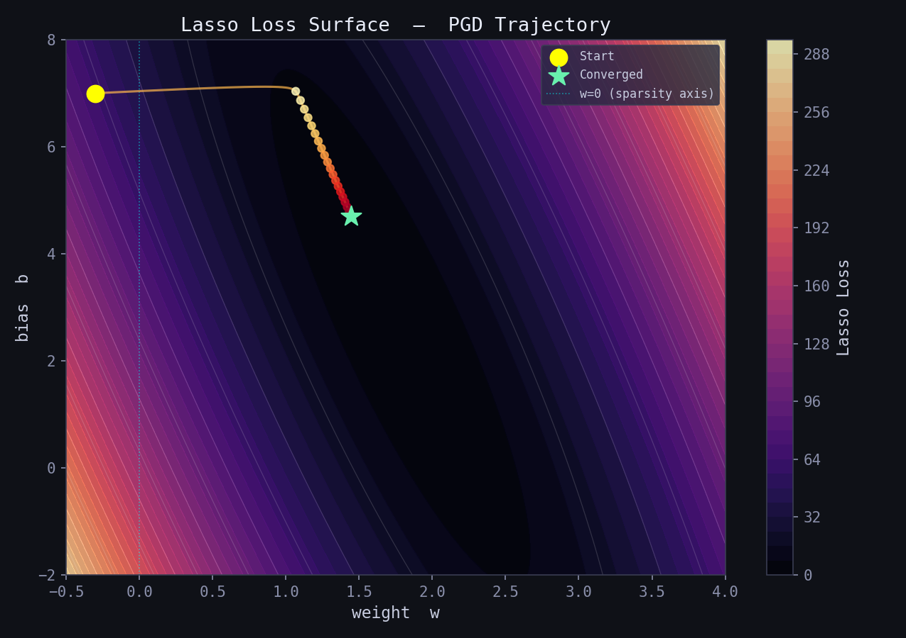
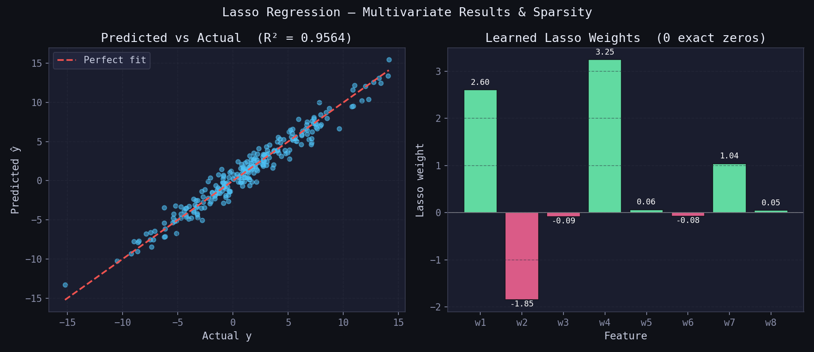

# Lasso Regression — L1-Regularised Linear Regression

> A clean, NumPy-only implementation of **Lasso Regression** supporting two solvers:  
> **Coordinate Descent** (CD, fast and exact) and **Proximal Gradient Descent** (PGD, iterative).  
> Lasso adds an L1 penalty to the weights — the only regulariser that shrinks coefficients to **exactly zero**, performing automatic variable selection alongside regularisation.

---

## Table of Contents

1. [What is Lasso Regression?](#1-what-is-lasso-regression)
2. [The Model](#2-the-model)
3. [Cost Function — Regularised MSE](#3-cost-function--regularised-mse)
4. [Deriving the Updates](#4-deriving-the-updates)
5. [Geometric Intuition](#5-geometric-intuition)
6. [Regularisation Path & Sparsity](#6-regularisation-path--sparsity)
7. [Loss Curve — CD vs PGD](#7-loss-curve--cd-vs-pgd)
8. [Regression Diagnostics](#8-regression-diagnostics)
9. [Multivariate Results & Sparsity](#9-multivariate-results--sparsity)
10. [Usage](#10-usage)
11. [Hyperparameter Guide](#11-hyperparameter-guide)
12. [Assumptions](#12-assumptions)
13. [Comparison — OLS vs Ridge vs Lasso](#13-comparison--ols-vs-ridge-vs-lasso)

---

## 1. What is Lasso Regression?

**Lasso** (Least Absolute Shrinkage and Selection Operator) is an extension of Ordinary Least Squares (OLS) that adds the **sum of absolute weight values** as a penalty to the loss function.

Unlike Ridge (L2), which only shrinks weights toward zero, Lasso can push weights to **exactly zero** — effectively removing irrelevant features from the model. This makes Lasso a powerful tool for:

1. **Regularisation** — preventing overfitting by penalising large weights.
2. **Variable selection** — automatically identifying the most informative features.
3. **Sparse models** — producing compact, interpretable solutions when most features are noise.

The degree of sparsity is controlled by a single hyperparameter `alpha` (λ):

- `alpha = 0` → identical to plain OLS (no regularisation).
- Increasing `alpha` → more weights driven to exactly zero.
- `alpha → ∞` → all weights collapse to zero.


*The red line is the Lasso best-fit line. Green bars are small residuals; pink bars are large residuals. Lasso slightly shrinks the slope compared to OLS, trading a small increase in bias for lower variance and sparser weights.*

---

## 2. The Model

For $m$ samples and $p$ features the prediction is identical to OLS and Ridge:

$$\hat{y}_i = w_1 x_{i1} + w_2 x_{i2} + \cdots + w_p x_{ip} + b$$

In matrix form over the full training set $\mathbf{X} \in \mathbb{R}^{m \times p}$:

$$\hat{\mathbf{y}} = \mathbf{X}\,\mathbf{w} + b, \qquad \mathbf{w} \in \mathbb{R}^{p},\quad b \in \mathbb{R}$$

where $\mathbf{w} = [w_1,\ w_2,\ \ldots,\ w_p]^T$ are the feature weights and $b$ is the **un-penalised** scalar bias.

The critical difference from OLS and Ridge lies in the penalty term applied during optimisation — Lasso uses the **L1 norm** $\|\mathbf{w}\|_1$ rather than the squared L2 norm, which is what enables exact zeros.

---

## 3. Cost Function — Regularised MSE

Lasso minimises the **Mean Squared Error plus an L1 penalty on the weights**:

$$\mathcal{L}(\mathbf{w}, b) = \underbrace{\frac{1}{m}\|\mathbf{X}\mathbf{w} + b - \mathbf{y}\|^2}_{\text{MSE}} + \underbrace{\frac{\alpha}{m}\|\mathbf{w}\|_1}_{\text{Lasso penalty}}$$

where $\|\mathbf{w}\|_1 = |w_1| + |w_2| + \cdots + |w_p|$ is the **L1 norm** of the weight vector.

Key properties:

- The L1 penalty is **not differentiable at zero** — this is what enables exact zeros but prevents a closed-form global solution.
- The bias $b$ is **not penalised** — only the feature weights are regularised.
- Dividing $\alpha$ by $m$ keeps the penalty on the same scale as the MSE gradient regardless of dataset size.
- The surface is **convex** — a unique global minimum always exists.



*Contour map of the Lasso loss surface over $(w, b)$. The amber trajectory shows the PGD parameter path from the yellow start toward the green converged minimum. Note the cyan vertical line at $w=0$ — the L1 penalty creates a kink here, which is why the minimum often falls exactly on this axis.*

---

## 4. Deriving the Updates

Because the L1 penalty is non-differentiable at zero, standard gradient descent cannot be applied directly. Two solvers handle this:

### Coordinate Descent (CD)  —  recommended

For each feature $j$, holding all other weights fixed, the 1-D Lasso sub-problem has the closed-form solution via the **soft-threshold operator**:

$$w_j^* = \frac{S\!\left(\rho_j,\;\dfrac{\alpha}{m}\right)}{z_j}$$

where:

$$\rho_j = \frac{1}{m}\,\mathbf{x}_j^T\,\mathbf{r}_j \qquad \text{(partial correlation, residual excluding } w_j \text{)}$$

$$z_j = \frac{1}{m}\|\mathbf{x}_j\|^2 \qquad \text{(column normaliser)}$$

$$S(z,\, t) = \text{sign}(z)\cdot\max(|z| - t,\; 0) \qquad \text{(soft-threshold operator)}$$

The soft-threshold function is the key: it shrinks $\rho_j$ by $\alpha/m$, and if $|\rho_j| \leq \alpha/m$ the weight is set to **exactly zero**.

### Proximal Gradient Descent (PGD)

Each update is a two-step operation:

**Step 1 — Gradient step on the smooth MSE term only:**
$$\mathbf{w}_{½} = \mathbf{w} - \eta \cdot \frac{1}{m}\,\mathbf{X}^T(\mathbf{X}\mathbf{w} + b - \mathbf{y})$$

**Step 2 — Proximal step — apply soft-threshold to handle L1:**
$$\mathbf{w} \leftarrow S\!\left(\mathbf{w}_{½},\;\frac{\eta\,\alpha}{m}\right)$$

**Bias update (no penalty):**
$$b \leftarrow b - \eta \cdot \frac{1}{m}\sum_{i=1}^{m}(\hat{y}_i - y_i)$$


*Left: the five-step PGD pipeline. Right: the soft-threshold function $S(z, t)$ — values inside the shaded zone $|z| \leq t$ are mapped to exactly zero; values outside are shifted toward zero by $t$.*

---

## 5. Geometric Intuition

- OLS minimises the MSE with **no constraint** on weights — the solution can lie anywhere.
- Ridge adds a **spherical L2 constraint** — the feasible region is a smooth ball; weights are shrunk but rarely reach zero.
- Lasso adds a **diamond-shaped L1 constraint** — the feasible region has sharp corners aligned with the axes.

The Lasso solution is the point where the MSE ellipsoids first touch the L1 diamond. Because the diamond has **corners on the axes**, the touching point is very often at a corner — meaning one or more weights are exactly zero.

This is the fundamental geometric reason why Lasso performs variable selection and Ridge does not:

| Property | Ridge (L2 ball) | Lasso (L1 diamond) |
|---|---|---|
| Shape of constraint | Sphere — smooth | Diamond — corners on axes |
| Solution at corner? | Almost never | Very often |
| Exact zeros produced? | No | Yes |
| Variable selection? | No | Yes |

---

## 6. Regularisation Path & Sparsity

As `alpha` increases from 0, Lasso progressively drives weights to zero. Plotting the coefficients against `alpha` reveals the **regularisation path** — a compact visual showing which features survive at each level of regularisation.


*Left: regularisation path — each coloured line is one weight coefficient plotted against alpha (log scale). True-zero features (dashed) collapse first; informative features persist longer. Right: number of non-zero weights vs alpha — the step-function descent shows Lasso driving weights to zero one at a time. The green dashed line marks the true number of non-zero features (4).*

**What to look for:**

| Observation | Interpretation |
|---|---|
| Path hits zero early | That feature is weakly informative; Lasso correctly removes it |
| Path stays large | That feature has strong signal; robust to regularisation |
| All paths at zero | alpha is too large — model is underfit; reduce alpha |
| All paths non-zero | alpha is too small — no sparsity benefit yet |

---

## 7. Loss Curve — CD vs PGD

`loss_history_` stores the full Lasso loss (MSE + L1 penalty) at the end of every iteration or epoch.


*Left (CD): converges in very few iterations — often under 20 passes for well-conditioned data. Right (PGD): the characteristic sharp initial drop followed by smooth flattening. The log-scale inset confirms clean monotone decay. If the PGD curve oscillates or diverges — reduce `learning_rate`.*

---

## 8. Regression Diagnostics

After fitting, verify the four core OLS assumptions visually. Lasso regression inherits these assumptions:


| Plot | What to look for | Assumption checked |
|---|---|---|
| **Residuals vs Fitted** | Random scatter around 0 | Linearity & homoscedasticity |
| **Normal Q-Q** | Points on the diagonal | Normality of residuals |
| **Scale-Location** | Flat, random band | Constant variance |
| **Residual Distribution** | Bell-shaped histogram | Normality |

---

## 9. Multivariate Results & Sparsity

The most distinctive feature of Lasso in the multivariate case is the **exact zero weights** it produces — muted grey bars in the chart below indicate features that Lasso has completely removed from the model.



*Left: predicted values closely track actual values (R² near 1.0). Right: the learned Lasso weights — green bars are positive, pink bars are negative, and **grey bars with "0 ✓" are exact zeros** produced by the L1 penalty. Lasso has successfully identified the irrelevant features and set them to zero, matching the true sparse structure of the data.*

---

## 10. Usage

```python
import numpy as np
from lasso_regression import LassoRegressor

# ── Coordinate Descent (recommended default) ──────────────────────────────────
X_train = np.array([[1], [2], [3], [4], [5]], dtype=float)
y_train = np.array([2.1, 3.9, 6.2, 7.8, 10.1])

model = LassoRegressor(alpha=0.1, solver='cd')
model.fit(X_train, y_train)

print("Intercept (b) :", model.intercept_)   # scalar float
print("Weights   (w) :", model.coef_)        # ndarray, shape (n_features,)
print("n_iter_       :", model.n_iter_)      # iterations until convergence
print("__repr__      :", model)

# ── Predict ───────────────────────────────────────────────────────────────────
X_test = np.array([[6], [7], [8]], dtype=float)
y_pred = model.predict(X_test)
print("Predictions   :", y_pred)

# ── Evaluate — R² ─────────────────────────────────────────────────────────────
print(f"R²  = {model.score(X_test, y_train[:3]):.4f}")
```

**Proximal Gradient Descent solver:**

```python
model = LassoRegressor(alpha=0.1, solver='pgd',
                       learning_rate=0.05, epochs=2000)
model.fit(X_train, y_train)

# Plot loss curve to confirm convergence
import matplotlib.pyplot as plt
plt.plot(model.loss_history_)
plt.xlabel("Epoch"); plt.ylabel("Lasso Loss  (MSE + L1)")
plt.title("Lasso PGD — Loss Curve")
plt.show()
```

**Multi-feature sparse example:**

```python
from sklearn.datasets import make_regression
from sklearn.preprocessing import StandardScaler
from sklearn.model_selection import train_test_split

X, y = make_regression(n_samples=500, n_features=20,
                       n_informative=6, noise=10, random_state=0)

# Feature scaling is strongly recommended for Lasso
scaler = StandardScaler()
X_scaled = scaler.fit_transform(X)

X_train, X_test, y_train, y_test = train_test_split(
    X_scaled, y, test_size=0.2, random_state=42
)

model = LassoRegressor(alpha=0.5, solver='cd', max_iter=2000, tol=1e-6)
model.fit(X_train, y_train)

print(f"Train R²     : {model.score(X_train, y_train):.4f}")
print(f"Test  R²     : {model.score(X_test,  y_test ):.4f}")
print(f"Non-zero w   : {(model.coef_ != 0).sum()} / {X.shape[1]}")
```

**Comparing alpha values (regularisation path):**

```python
alphas = [0.001, 0.01, 0.1, 0.5, 1.0, 5.0]

for a in alphas:
    m = LassoRegressor(alpha=a, solver='cd').fit(X_train, y_train)
    n_nz = (m.coef_ != 0).sum()
    print(f"alpha={a:5.3f}  |  Test R²: {m.score(X_test, y_test):.4f}  "
          f"|  Non-zero: {n_nz:2d} / {X.shape[1]}")
```

---

## 11. Hyperparameter Guide

### `alpha`

| Value | Behaviour | Recommended when |
|---|---|---|
| 0.0 | No regularisation — identical to OLS | Features are uncorrelated, no overfitting |
| 0.001 – 0.01 | Very mild shrinkage, few zeros | Large datasets, most features informative |
| 0.1 – 0.5 | Moderate sparsity | **Default starting point** |
| 1.0 – 5.0 | Strong sparsity, many exact zeros | Many irrelevant features expected |
| 10.0+ | Near-total sparsity | Extremely noisy, high-dimensional data |

### `solver`

- Use `'cd'` (Coordinate Descent) by default — it converges in very few iterations, requires no learning rate tuning, and handles exact zeros naturally.
- Switch to `'pgd'` (Proximal Gradient Descent) when you want a smooth, epoch-by-epoch loss curve for monitoring, or when experimenting with learning rate schedules.

### `learning_rate` *(PGD solver only)*

- Start with `0.01` or `0.05` for standardised features.
- If the loss **diverges** → halve the learning rate.
- If the loss **plateaus too early** → try a slight increase.

### `epochs` *(PGD solver only)*

- Monitor `loss_history_` — stop when the curve fully flattens.
- A typical range is `500 – 3000` for small-to-medium datasets.
- With feature scaling, far fewer epochs are needed.

### `max_iter` and `tol` *(CD solver only)*

- `max_iter=1000` and `tol=1e-4` are good defaults for most problems.
- Tighten `tol` to `1e-6` or `1e-7` for high-precision coefficient estimates.
- Check `n_iter_` after fitting — if it equals `max_iter`, the solver did not converge; increase `max_iter`.

### `fit_intercept`

- Always leave as `True` (default) unless the data has been manually centred to zero mean.
- The intercept is **never penalised** — applying L1 to it would shift the model's mean prediction, which is almost never desired.

---

## 12. Assumptions

For Lasso Regression to produce a meaningful solution:

1. **Linearity** — the true relationship is $y = \mathbf{X}\mathbf{w} + b + \varepsilon$.
2. **Zero-mean errors** — $\mathbb{E}[\varepsilon] = 0$.
3. **Homoscedasticity** — $\text{Var}(\varepsilon_i) = \sigma^2$ (constant for all $i$).
4. **No autocorrelation** — $\text{Cov}(\varepsilon_i, \varepsilon_j) = 0$ for $i \neq j$.
5. **Feature scaling required** — unlike Ridge, Lasso is highly sensitive to feature scale. Always apply `StandardScaler` (zero mean, unit variance) before fitting; without scaling, features with larger magnitudes will be penalised more aggressively.
6. **Alpha selection** — use cross-validation (`LassoCV` in scikit-learn or a manual loop) to choose the best `alpha` rather than guessing.
7. **Correlated features caveat** — when features are highly correlated, Lasso arbitrarily selects one and zeros out the others. If retaining all correlated features is important, use Ridge or Elastic Net instead.

---

## 13. Comparison — OLS vs Ridge vs Lasso

| Criterion | **OLS** | **Ridge (L2)** | **Lasso (L1)** ✓ |
|---|---|---|---|
| Penalty term | None | $\alpha\|\mathbf{w}\|_2^2$ | $\alpha\|\mathbf{w}\|_1$ |
| Penalty shape | — | Sphere (smooth) | Diamond (corners) |
| Weight shrinkage | None | Toward zero | Toward zero |
| Exact zero weights | No | No | **Yes** |
| Variable selection | No | No | **Yes** |
| Handles multicollinearity | Poorly | Well | Partially (picks one) |
| Closed-form solution | Yes | Yes | **No** |
| Unique solution | Yes (if full rank) | Always | Not always |
| Best for | Small, clean, uncorrelated | Most regression problems | **Many irrelevant features** |
| Bias introduced | None | Small | Small–moderate |
| Variance reduction | None | Significant | **Significant** |
| Interpretability | Baseline | Moderate | **High (sparse)** |

**Rule of thumb:** use Lasso when you believe many of your features are irrelevant and you want the model to automatically identify and discard them. Use Ridge when all features are likely informative and you mainly want to prevent overfitting. Use Elastic Net when you want both sparsity and the stability of Ridge for correlated features.

---

## Dependencies

```
numpy >= 1.21
```

No other dependencies required.

---

## License

MIT
