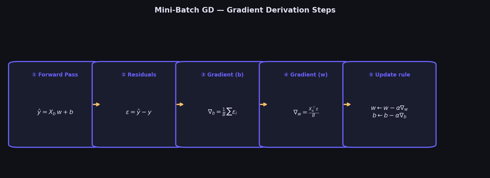
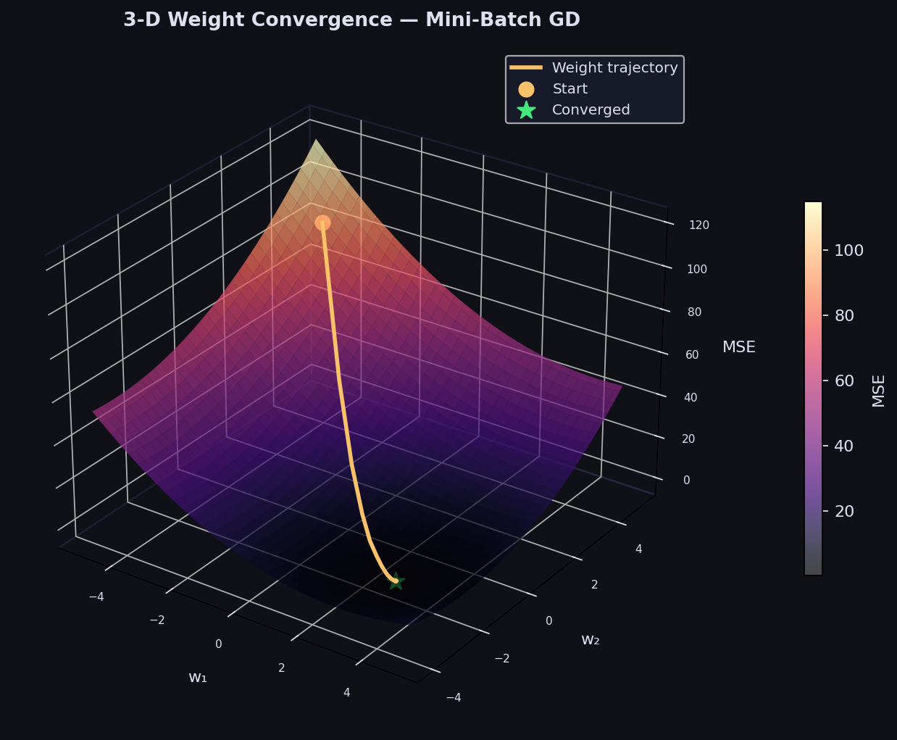
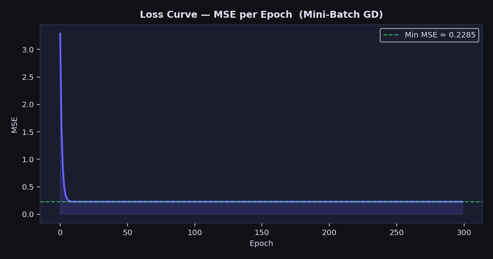

# Linear Regression — Mini-Batch Gradient Descent

> A clean, NumPy-only implementation of Linear Regression trained via **Mini-Batch Gradient Descent**.  
> Balances the stability of Batch GD with the speed of Stochastic GD — the algorithm behind most modern deep-learning optimisers.

---

## Table of Contents

1. [What is Mini-Batch Gradient Descent?](#1-what-is-mini-batch-gradient-descent)
2. [The Model](#2-the-model)
3. [Cost Function — MSE](#3-cost-function--mse)
4. [Deriving the Gradients](#4-deriving-the-gradients)
5. [Geometric Intuition](#5-geometric-intuition)
6. [3-D Weight Convergence](#6-3-d-weight-convergence)
7. [Loss Curve](#7-loss-curve)
8. [Regression Diagnostics](#8-regression-diagnostics)
9. [Multivariate Results](#9-multivariate-results)
10. [Usage](#10-usage)
11. [Hyperparameter Guide](#11-hyperparameter-guide)
12. [Assumptions](#12-assumptions)
13. [Comparison — Batch vs Mini-Batch vs Stochastic GD](#13-comparison--batch-vs-mini-batch-vs-stochastic-gd)

---

## 1. What is Mini-Batch Gradient Descent?

Mini-Batch Gradient Descent (MBGD) is an iterative optimisation algorithm that updates model parameters by stepping in the **direction of steepest descent** — computed on a small random subset (a *mini-batch*) of training data each iteration.

Each training epoch proceeds as follows:

1. **Shuffle** the dataset randomly to eliminate ordering bias.
2. **Partition** the shuffled data into mini-batches of size *B*.
3. **For each mini-batch**, compute the gradient and update parameters.

This gives **one full parameter update per batch**, and **⌈m / B⌉ updates per epoch** — far more gradient steps than Batch GD for the same number of epochs, while still being less noisy than pure Stochastic GD.


*Each green vertical bar is a **residual** — the gap between a real observation and the model's prediction. The red line is the best-fit line found after convergence.*

---

## 2. The Model

For $m$ samples and $p$ features the prediction is:

$$\hat{y}_i = w_1 x_{i1} + w_2 x_{i2} + \cdots + w_p x_{ip} + b$$

In matrix form over a mini-batch $\mathbf{X}_b \in \mathbb{R}^{B \times p}$:

$$\hat{\mathbf{y}}_b = \mathbf{X}_b\,\mathbf{w} + b, \qquad \mathbf{w} \in \mathbb{R}^{p},\quad b \in \mathbb{R}$$

where $\mathbf{w} = [w_1,\ w_2,\ \ldots,\ w_p]^T$ are the feature weights and $b$ is the scalar bias.

---

## 3. Cost Function — MSE

We minimise the **Mean Squared Error** computed over each mini-batch of size $B$:

$$\mathcal{L}(\mathbf{w}, b) = \frac{1}{B}\sum_{i=1}^{B}(\hat{y}_i - y_i)^2 = \frac{1}{B}\|\hat{\mathbf{y}}_b - \mathbf{y}_b\|^2$$

The full-epoch loss (stored in `loss_history_`) is evaluated over all $m$ samples:

$$\mathcal{L}_{\text{epoch}} = \frac{1}{m}\|\mathbf{X}\mathbf{w} + b - \mathbf{y}\|^2$$

The MSE surface is **convex** — one global minimum exists, and convergence is guaranteed for a sufficiently small learning rate.


*Contour map of the MSE loss surface over $(w, b)$. The amber trajectory shows the parameter path stepping from the yellow start point toward the green global minimum.*

---

## 4. Deriving the Gradients

Taking partial derivatives of the batch MSE with respect to $b$ and $\mathbf{w}$:

**Gradient w.r.t bias $b$:**

$$\frac{\partial \mathcal{L}}{\partial b} = \frac{1}{B}\sum_{i=1}^{B}(\hat{y}_i - y_i) = \frac{1}{B}\mathbf{1}^T(\hat{\mathbf{y}}_b - \mathbf{y}_b)$$

**Gradient w.r.t weights $\mathbf{w}$:**

$$\frac{\partial \mathcal{L}}{\partial \mathbf{w}} = \frac{1}{B}\mathbf{X}_b^T(\hat{\mathbf{y}}_b - \mathbf{y}_b)$$

**Update rule — applied once per mini-batch:**

$$\mathbf{w} \leftarrow \mathbf{w} - \alpha \cdot \frac{\partial \mathcal{L}}{\partial \mathbf{w}}, \qquad b \leftarrow b - \alpha \cdot \frac{\partial \mathcal{L}}{\partial b}$$

where $\alpha$ is the **learning rate**.



*The five-step pipeline — from forward pass to parameter update — visualised in one glance.*

---

## 5. Geometric Intuition

- $\mathbf{y}$ lives in $\mathbb{R}^m$ (one dimension per sample).
- MBGD searches for $(\mathbf{w},\, b)$ that minimise the squared distance between $\hat{\mathbf{y}}$ and $\mathbf{y}$.
- Because gradients are computed on a random subset, the trajectory is **noisier** than Batch GD but explores the loss surface more aggressively — this noise can help escape shallow local minima in non-convex settings.
- Convergence is guaranteed for the MSE surface because it is a **convex bowl** with a single global minimum.
- Shuffling at the start of every epoch ensures that no single ordering of batches dominates learning.

---

## 6. 3-D Weight Convergence

The plot below traces the trajectory of two learned weights $(w_1,\, w_2)$ across all epochs on top of the 3-D MSE loss surface.



*The amber path descends the magma-coloured MSE surface from the starting point (circle) toward the global minimum (green star). The characteristic "noisy but progressive" descent of Mini-Batch GD is clearly visible — each epoch's update zig-zags around the true gradient direction yet consistently moves toward lower loss.*

**What to look for:**

| Observation | Interpretation |
|---|---|
| Smooth, direct path | Learning rate may be too small (Batch GD-like behaviour) |
| Erratic, diverging path | Learning rate is too large — reduce it |
| Gradual spiral to minimum | Healthy MBGD convergence |
| Path stalls at a plateau | Reduce `batch_size` for noisier (more exploratory) updates |

---

## 7. Loss Curve

`loss_history_` stores the full-dataset MSE at the end of every epoch. A healthy curve drops sharply then flattens. Always plot it to confirm convergence.



*Sharp drop in the early epochs as large gradients correct the zero-initialisation, followed by a smooth flattening as $(w, b)$ settle near the minimum. MBGD curves are slightly smoother than pure SGD but can show mild oscillation — this is expected. If the curve rises or diverges — reduce the learning rate.*

---

## 8. Regression Diagnostics

After fitting, verify the four core OLS assumptions visually:


| Plot | What to look for | Assumption checked |
|---|---|---|
| **Residuals vs Fitted** | Random scatter around 0 | Linearity & homoscedasticity |
| **Normal Q-Q** | Points on the diagonal | Normality of residuals |
| **Scale-Location** | Flat, random band | Constant variance |
| **Residual Distribution** | Bell-shaped histogram | Normality |

---

## 9. Multivariate Results

In the multivariate case ($p > 1$), the same gradient update applies — no modifications needed.


*Left: predicted values closely track actual values (R² near 1.0). Right: the learned $\mathbf{w}$ values — green bars are positive weights, red/pink bars are negative weights, with the magnitude shown above each bar.*

---

## 10. Usage

```python
import numpy as np
from mbgd_regressor import MBGDRegressor

# ── Univariate example ────────────────────────────────────────────────────────
X_train = np.array([[1], [2], [3], [4], [5]], dtype=float)
y_train = np.array([2.1, 3.9, 6.2, 7.8, 10.1])

model = MBGDRegressor(batch_size=2, learning_rate=0.01, epochs=1000, random_state=42)
model.fit(X_train, y_train)

print("Intercept (b) :", model.intercept_)   # scalar float
print("Weights   (w) :", model.coef_)        # ndarray, shape (n_features,)
print("__repr__      :", model)

# ── Predict ───────────────────────────────────────────────────────────────────
X_test = np.array([[6], [7], [8]], dtype=float)
y_pred = model.predict(X_test)
print("Predictions   :", y_pred)

# ── Evaluate — R² ─────────────────────────────────────────────────────────────
print(f"R²  = {model.score(X_test, y_train[:3]):.4f}")

# ── Plot loss curve ───────────────────────────────────────────────────────────
import matplotlib.pyplot as plt
plt.plot(model.loss_history_)
plt.xlabel("Epoch"); plt.ylabel("MSE")
plt.title("MBGD Loss Curve")
plt.show()
```

**Multi-feature example:**

```python
from sklearn.datasets import make_regression
from sklearn.preprocessing import StandardScaler
from sklearn.model_selection import train_test_split

X, y = make_regression(n_samples=500, n_features=8, noise=10, random_state=0)

# Feature scaling is recommended for faster convergence
scaler = StandardScaler()
X_scaled = scaler.fit_transform(X)

X_train, X_test, y_train, y_test = train_test_split(X_scaled, y, test_size=0.2, random_state=42)

model = MBGDRegressor(batch_size=32, learning_rate=0.05, epochs=500, random_state=42)
model.fit(X_train, y_train)

print(f"Train R²: {model.score(X_train, y_train):.4f}")
print(f"Test  R²: {model.score(X_test,  y_test ):.4f}")
```

**Comparing Batch vs Mini-Batch:**

```python
from gradient_descent_regressor import GradientDescentRegressor

bgd   = GradientDescentRegressor(learning_rate=0.01, epochs=300)
mbgd  = MBGDRegressor(batch_size=32, learning_rate=0.01, epochs=300, random_state=0)

bgd.fit(X_train, y_train);  print("BGD  R²:", bgd.score(X_test, y_test))
mbgd.fit(X_train, y_train); print("MBGD R²:", mbgd.score(X_test, y_test))

# Plot both loss curves
plt.plot(bgd.loss_history_,  label="Batch GD  (smooth)")
plt.plot(mbgd.loss_history_, label="Mini-Batch GD (noisier, faster)")
plt.legend(); plt.xlabel("Epoch"); plt.ylabel("MSE"); plt.show()
```

---

## 11. Hyperparameter Guide

### `batch_size`

| Value | Behaviour | Recommended when |
|---|---|---|
| 1 | Pure SGD — maximum noise, slowest per-epoch | Rarely; online learning only |
| 16 – 64 | Classic MBGD — noisy but fast convergence | Most regression problems |
| 128 – 512 | Approaches Batch GD — smoother, fewer updates | Large datasets, stable loss surfaces |
| $m$ (all data) | Identical to Batch GD | Small datasets only |

### `learning_rate`

- Start with `0.01` or `0.05` for standardised features.
- If the loss **diverges** → halve the learning rate.
- If the loss **plateaus too early** → try a slight increase or reduce `batch_size`.
- Rule of thumb: larger `batch_size` allows a larger `learning_rate`.

### `epochs`

- Monitor `loss_history_` — stop when the curve fully flattens.
- A typical range is `500 – 2000` for small-to-medium datasets.
- With feature scaling, far fewer epochs are needed.

### `random_state`

- Set to any integer for reproducible results across runs.
- Leave as `None` for non-deterministic shuffling (useful for ensembles).

---

## 12. Assumptions

For MBGD to find a meaningful solution:

1. **Linearity** — the true relationship is $y = \mathbf{X}\mathbf{w} + b + \varepsilon$.
2. **Zero-mean errors** — $\mathbb{E}[\varepsilon] = 0$.
3. **Homoscedasticity** — $\text{Var}(\varepsilon_i) = \sigma^2$ (constant for all $i$).
4. **No autocorrelation** — $\text{Cov}(\varepsilon_i, \varepsilon_j) = 0$ for $i \neq j$.
5. **Feature scaling recommended** — `StandardScaler` (zero mean, unit variance) is strongly advised; MBGD converges significantly faster when all features are on the same scale.

---

## 13. Comparison — Batch vs Mini-Batch vs Stochastic GD

| Criterion | **Batch GD** | **Mini-Batch GD** ✓ | **Stochastic GD** |
|---|---|---|---|
| Gradient computed on | All $m$ samples | $B$ samples per step | 1 sample per step |
| Updates per epoch | 1 | $\lceil m/B \rceil$ | $m$ |
| Gradient noise | None (exact) | Low–medium | High |
| Convergence path | Smooth, direct | Slightly noisy | Very noisy |
| Speed per epoch | Slow | **Fast** | Very fast |
| Memory | Full dataset | One batch | One sample |
| Best for | Small datasets | **Most cases** | Online / streaming |
| Vectorisation benefit | Full | **Full** | Minimal |
| Escapes local minima | No | Partially | Yes (but unstable) |

**Rule of thumb:** use Mini-Batch GD with `batch_size=32` as the default starting point. Scale up the batch size as your dataset grows and hardware allows.

---

## Dependencies

```
numpy >= 1.21
```

No other dependencies required.

---

## License

MIT
