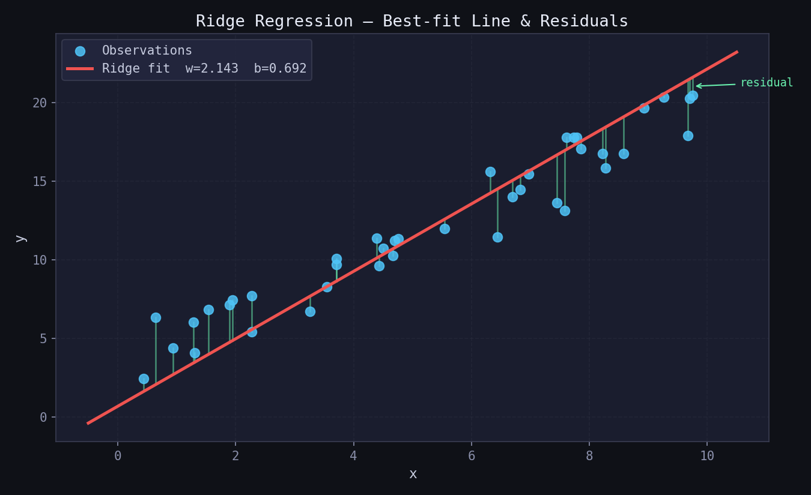
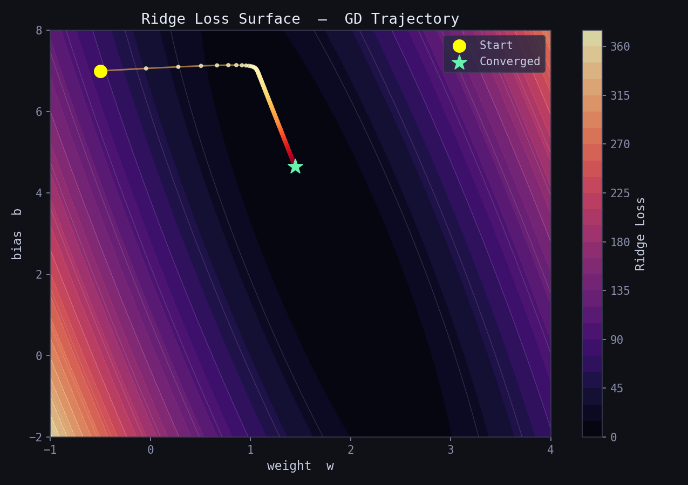
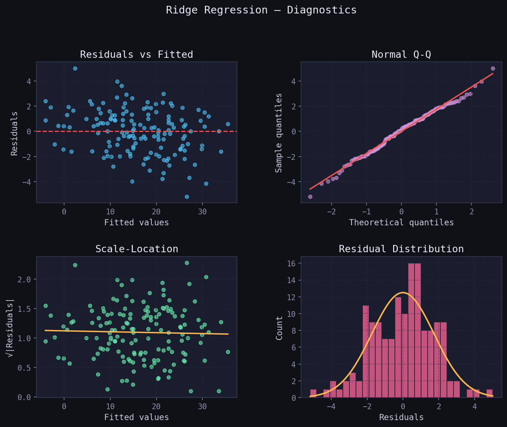
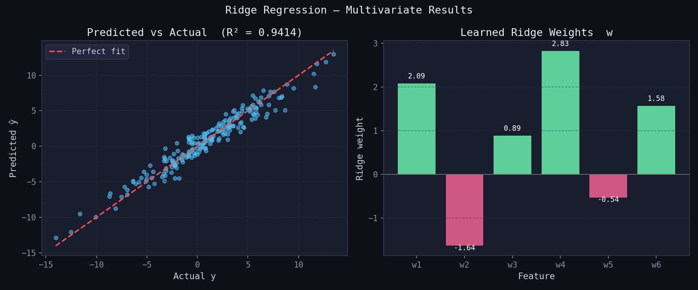

# Ridge Regression — L2-Regularised Linear Regression

> A clean, NumPy-only implementation of **Ridge Regression** supporting two solvers:  
> **Closed-form Normal Equation** (exact, instant) and **Gradient Descent** (iterative, scalable).  
> Ridge adds an L2 penalty to the weights to prevent overfitting and handle multicollinearity — one of the most important tools in the regularisation toolkit.

---

## Table of Contents

1. [What is Ridge Regression?](#1-what-is-ridge-regression)
2. [The Model](#2-the-model)
3. [Cost Function — Regularised MSE](#3-cost-function--regularised-mse)
4. [Deriving the Gradients](#4-deriving-the-gradients)
5. [Geometric Intuition](#5-geometric-intuition)
6. [Loss Surface — Effect of Alpha](#6-loss-surface--effect-of-alpha)
7. [Loss Curve (GD Solver)](#7-loss-curve-gd-solver)
8. [Regression Diagnostics](#8-regression-diagnostics)
9. [Multivariate Results](#9-multivariate-results)
10. [Usage](#10-usage)
11. [Hyperparameter Guide](#11-hyperparameter-guide)
12. [Assumptions](#12-assumptions)
13. [Comparison — OLS vs Ridge vs Lasso](#13-comparison--ols-vs-ridge-vs-lasso)

---

## 1. What is Ridge Regression?

Ridge Regression (also called **Tikhonov regularisation**) is an extension of Ordinary Least Squares (OLS) that adds a **squared penalty on the magnitude of the weights** to the loss function.

Without regularisation, OLS can overfit noisy data or produce numerically unstable solutions when features are highly correlated (multicollinearity). Ridge solves both problems by:

1. **Shrinking** all weight coefficients toward zero — preventing any single feature from dominating.
2. **Stabilising** the matrix inverse in the Normal Equation — making the solution well-conditioned even when `XᵀX` is near-singular.

The severity of the shrinkage is controlled by a single hyperparameter `alpha` (λ):

- `alpha = 0` → identical to plain OLS.
- `alpha → ∞` → all weights collapse to zero.



*The red line is the Ridge best-fit line. Green vertical bars are **residuals** — gaps between each observation and the model's prediction. Ridge shrinks the slope slightly compared to OLS, trading a small bias for lower variance.*

---

## 2. The Model

For $m$ samples and $p$ features the prediction is identical to OLS:

$$\hat{y}_i = w_1 x_{i1} + w_2 x_{i2} + \cdots + w_p x_{ip} + b$$

In matrix form over the full training set $\mathbf{X} \in \mathbb{R}^{m \times p}$:

$$\hat{\mathbf{y}} = \mathbf{X}\,\mathbf{w} + b, \qquad \mathbf{w} \in \mathbb{R}^{p},\quad b \in \mathbb{R}$$

where $\mathbf{w} = [w_1,\ w_2,\ \ldots,\ w_p]^T$ are the feature weights and $b$ is the **un-penalised** scalar bias.

The key difference from OLS is in *how* $\mathbf{w}$ is found — the Ridge objective penalises large weight values during optimisation.

---

## 3. Cost Function — Regularised MSE

Ridge minimises the **Mean Squared Error plus an L2 penalty on the weights**:

$$\mathcal{L}(\mathbf{w}, b) = \underbrace{\frac{1}{m}\|\mathbf{X}\mathbf{w} + b - \mathbf{y}\|^2}_{\text{MSE}} + \underbrace{\frac{\alpha}{m}\|\mathbf{w}\|^2}_{\text{Ridge penalty}}$$

Key properties:

- The penalty term $\|\mathbf{w}\|^2 = w_1^2 + w_2^2 + \cdots + w_p^2$ is the **squared L2 norm** of the weight vector.
- The bias $b$ is **not penalised** — only the feature weights are regularised.
- Dividing $\alpha$ by $m$ keeps the penalty on the same scale as the MSE gradient regardless of dataset size.
- The surface is **strictly convex** — a unique global minimum always exists.



*Contour map of the Ridge loss surface over $(w, b)$. The amber trajectory shows the GD parameter path from the yellow start point toward the green global minimum. Compared to plain OLS, the minimum is pulled slightly toward the origin by the L2 penalty.*

---

## 4. Deriving the Gradients

### Closed-form solver

Setting $\frac{\partial \mathcal{L}}{\partial \mathbf{w}} = 0$ and solving analytically gives the **Ridge Normal Equation**:

$$\mathbf{w}^* = \left(\mathbf{X}^T\mathbf{X} + \alpha \mathbf{I}_p\right)^{-1} \mathbf{X}^T \mathbf{y}$$

When `fit_intercept=True` the bias is folded into the weight vector by augmenting $\mathbf{X}$ with a column of ones. The `(0, 0)` entry of the identity matrix is zeroed so the intercept remains un-penalised.

The matrix $\left(\mathbf{X}^T\mathbf{X} + \alpha \mathbf{I}_p\right)$ is always positive-definite for $\alpha > 0$, guaranteeing the inverse exists even when $\mathbf{X}^T\mathbf{X}$ is singular.

### Gradient Descent solver

Taking partial derivatives of the Ridge objective with respect to $b$ and $\mathbf{w}$:

**Gradient w.r.t. bias $b$ (no regularisation):**

$$\frac{\partial \mathcal{L}}{\partial b} = \frac{1}{m}\sum_{i=1}^{m}(\hat{y}_i - y_i) = \frac{1}{m}\mathbf{1}^T(\hat{\mathbf{y}} - \mathbf{y})$$

**Gradient w.r.t. weights $\mathbf{w}$ (with Ridge penalty):**

$$\frac{\partial \mathcal{L}}{\partial \mathbf{w}} = \frac{1}{m}\mathbf{X}^T(\hat{\mathbf{y}} - \mathbf{y}) + \frac{\alpha}{m}\mathbf{w}$$

**Update rule — applied once per epoch:**

$$\mathbf{w} \leftarrow \mathbf{w} - \eta \cdot \frac{\partial \mathcal{L}}{\partial \mathbf{w}}, \qquad b \leftarrow b - \eta \cdot \frac{\partial \mathcal{L}}{\partial b}$$

where $\eta$ is the **learning rate**.


*Five-step pipeline — forward pass → residuals → gradients (with Ridge term) → parameter update — visualised side by side for both solvers.*

---

## 5. Geometric Intuition

- In OLS, we search for $(\mathbf{w}, b)$ that minimise $\|\hat{\mathbf{y}} - \mathbf{y}\|^2$ with **no constraint on the size of $\mathbf{w}$**.
- Ridge adds a **spherical constraint** $\|\mathbf{w}\|^2 \leq t$ — the feasible region for the weights is a ball around the origin.
- The solution is the point where the MSE ellipsoids first touch the L2 ball. Unlike Lasso (which uses a diamond-shaped L1 ball), the L2 ball is **smooth** — solutions are rarely exactly zero, meaning Ridge shrinks but does not perform variable selection.
- Increasing `alpha` shrinks the L2 ball — the solution is forced closer to the origin.
- When features are highly correlated, `XᵀX` is near-singular and OLS weights explode. The `+αI` term inflates the eigenvalues, directly stabilising the solution.

---

## 6. Loss Surface — Effect of Alpha

The `alpha` parameter fundamentally changes the shape of the loss surface and therefore the location of the optimal weights.


*Loss surfaces for four values of alpha (0, 0.1, 1, 10) plotted over the $(w_1, w_2)$ plane. As alpha increases, the minimum migrates toward the origin (white star). The elliptical contours become more circular — the penalty dominates the curvature — and the solution is increasingly regularised.*

**What to look for:**

| Observation | Interpretation |
|---|---|
| Minimum far from origin | alpha is effectively 0 — pure OLS |
| Minimum migrating inward | alpha is shrinking the weights |
| Nearly circular contours | Ridge penalty dominates; reduce alpha if underfitting |
| Path diverges | Learning rate too large; reduce `learning_rate` |

---

## 7. Loss Curve (GD Solver)

`loss_history_` stores the full-dataset Ridge loss at the end of every epoch when `solver='gd'`. A healthy curve drops sharply then flattens. Always plot it to confirm convergence.


*Sharp initial drop as large gradients correct the zero initialisation, followed by smooth flattening as $(w, b)$ settle near the minimum. A well-tuned learning rate produces this clean monotone decay. If the curve oscillates or diverges — reduce `learning_rate`.*

---

## 8. Regression Diagnostics

After fitting, verify the four core OLS assumptions visually. Ridge regression inherits these assumptions:



| Plot | What to look for | Assumption checked |
|---|---|---|
| **Residuals vs Fitted** | Random scatter around 0 | Linearity & homoscedasticity |
| **Normal Q-Q** | Points on the diagonal | Normality of residuals |
| **Scale-Location** | Flat, random band | Constant variance |
| **Residual Distribution** | Bell-shaped histogram | Normality |

---

## 9. Multivariate Results

In the multivariate case ($p > 1$), Ridge regularisation is especially important — it prevents individual correlated features from receiving extreme compensating weights that cancel each other.



*Left: predicted values closely track actual values (R² near 1.0). Right: the learned Ridge weights $\mathbf{w}$ — green bars are positive weights, red/pink bars are negative. Notice that compared to OLS, no single bar dominates; the Ridge penalty has distributed the influence more evenly across correlated features.*

---

## 10. Usage

```python
import numpy as np
from ridge_regression import RidgeRegressor

# ── Closed-form solver (recommended for most cases) ───────────────────────────
X_train = np.array([[1], [2], [3], [4], [5]], dtype=float)
y_train = np.array([2.1, 3.9, 6.2, 7.8, 10.1])

model = RidgeRegressor(alpha=0.1, solver='closed')
model.fit(X_train, y_train)

print("Intercept (b) :", model.intercept_)   # scalar float
print("Weights   (w) :", model.coef_)        # ndarray, shape (n_features,)
print("__repr__      :", model)

# ── Predict ───────────────────────────────────────────────────────────────────
X_test = np.array([[6], [7], [8]], dtype=float)
y_pred = model.predict(X_test)
print("Predictions   :", y_pred)

# ── Evaluate — R² ─────────────────────────────────────────────────────────────
print(f"R²  = {model.score(X_test, y_train[:3]):.4f}")
```

**Gradient Descent solver:**

```python
model = RidgeRegressor(alpha=0.1, solver='gd',
                       learning_rate=0.05, epochs=2000)
model.fit(X_train, y_train)

# Plot loss curve to confirm convergence
import matplotlib.pyplot as plt
plt.plot(model.loss_history_)
plt.xlabel("Epoch"); plt.ylabel("Ridge MSE Loss")
plt.title("Ridge GD — Loss Curve")
plt.show()
```

**Multi-feature example:**

```python
from sklearn.datasets import make_regression
from sklearn.preprocessing import StandardScaler
from sklearn.model_selection import train_test_split

X, y = make_regression(n_samples=500, n_features=8, noise=10, random_state=0)

# Feature scaling is strongly recommended for the GD solver
scaler = StandardScaler()
X_scaled = scaler.fit_transform(X)

X_train, X_test, y_train, y_test = train_test_split(
    X_scaled, y, test_size=0.2, random_state=42
)

# Closed-form — no learning rate to tune
model = RidgeRegressor(alpha=1.0, solver='closed')
model.fit(X_train, y_train)

print(f"Train R²: {model.score(X_train, y_train):.4f}")
print(f"Test  R²: {model.score(X_test,  y_test ):.4f}")
```

**Comparing solvers and alpha values:**

```python
alphas = [0.0, 0.1, 1.0, 10.0]

for a in alphas:
    m = RidgeRegressor(alpha=a, solver='closed').fit(X_train, y_train)
    print(f"alpha={a:5.1f}  |  Test R²: {m.score(X_test, y_test):.4f}  "
          f"|  ||w||: {np.linalg.norm(m.coef_):.4f}")
```

---

## 11. Hyperparameter Guide

### `alpha`

| Value | Behaviour | Recommended when |
|---|---|---|
| 0.0 | No regularisation — identical to OLS | Features are uncorrelated, no overfitting |
| 0.01 – 0.1 | Very mild shrinkage | Large datasets, low noise |
| 1.0 | Moderate shrinkage | **Default starting point** |
| 10 – 100 | Strong shrinkage | High multicollinearity, many features |
| 1000+ | Near-zero weights | Features are almost entirely noise |

### `solver`

- Use `'closed'` by default — it is exact, requires no tuning, and is fast for $p \lesssim 10\,000$.
- Switch to `'gd'` for very large datasets where the matrix inverse becomes expensive, or when you want to monitor convergence via `loss_history_`.

### `learning_rate` *(GD solver only)*

- Start with `0.01` or `0.05` for standardised features.
- If the loss **diverges** → halve the learning rate.
- If the loss **plateaus too early** → try a slight increase.

### `epochs` *(GD solver only)*

- Monitor `loss_history_` — stop when the curve fully flattens.
- A typical range is `500 – 3000` for small-to-medium datasets.
- With feature scaling, far fewer epochs are needed.

### `fit_intercept`

- Always leave as `True` (default) unless the data has been manually centred to zero mean.
- The intercept is **never penalised** — regularising it would shift the model's mean prediction, which is almost never desired.

---

## 12. Assumptions

For Ridge Regression to produce a meaningful solution:

1. **Linearity** — the true relationship is $y = \mathbf{X}\mathbf{w} + b + \varepsilon$.
2. **Zero-mean errors** — $\mathbb{E}[\varepsilon] = 0$.
3. **Homoscedasticity** — $\text{Var}(\varepsilon_i) = \sigma^2$ (constant for all $i$).
4. **No autocorrelation** — $\text{Cov}(\varepsilon_i, \varepsilon_j) = 0$ for $i \neq j$.
5. **Feature scaling recommended** — `StandardScaler` (zero mean, unit variance) is strongly advised for the `'gd'` solver; convergence is significantly faster when all features are on the same scale. The `'closed'` solver is scale-invariant but still benefits from scaling for numerical stability.
6. **Alpha selection** — use cross-validation (e.g. `RidgeCV` in scikit-learn) to choose the best `alpha` rather than guessing.

---

## 13. Comparison — OLS vs Ridge vs Lasso

| Criterion | **OLS** | **Ridge (L2)** ✓ | **Lasso (L1)** |
|---|---|---|---|
| Penalty term | None | $\alpha\|\mathbf{w}\|_2^2$ | $\alpha\|\mathbf{w}\|_1$ |
| Penalty shape | — | Sphere (smooth) | Diamond (corners) |
| Weight shrinkage | None | Toward zero | Toward zero |
| Exact zero weights | No | **No** | Yes (sparse) |
| Variable selection | No | No | **Yes** |
| Handles multicollinearity | Poorly | **Well** | Partially |
| Closed-form solution | Yes | **Yes** | No |
| Unique solution | Yes (if full rank) | **Always** | Not always |
| Best for | Small, clean, uncorrelated | **Most regression problems** | Many irrelevant features |
| Bias introduced | None | Small | Small–moderate |
| Variance reduction | None | **Significant** | Significant |

**Rule of thumb:** start with Ridge (`alpha=1.0`, `solver='closed'`) as the default regularised regressor. Switch to Lasso only if you expect many features to be truly irrelevant and want an automatically sparse model.

---

## Dependencies

```
numpy >= 1.21
```

No other dependencies required.

---

## License

MIT
