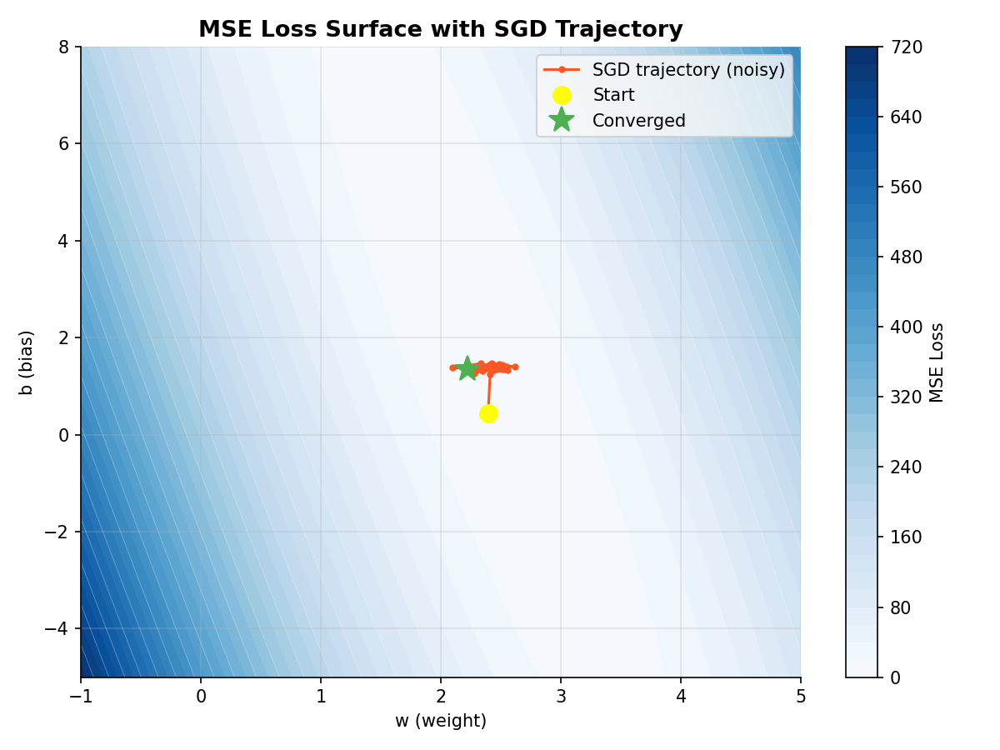
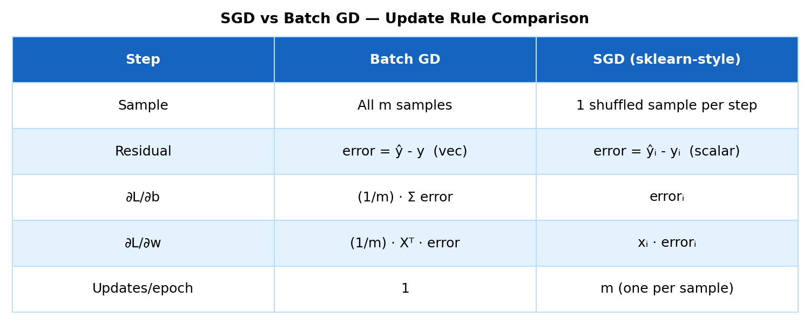
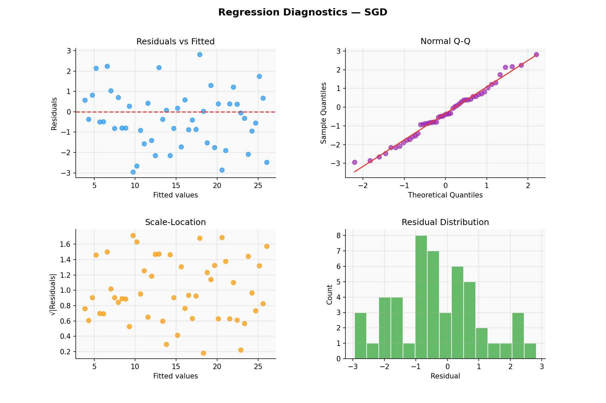
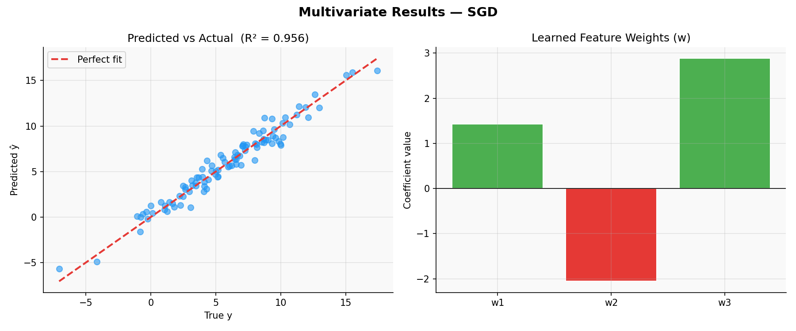

# Linear Regression — Stochastic Gradient Descent (SGD)

> A clean, NumPy-only implementation of Linear Regression trained via **Stochastic Gradient Descent**.  
> Matches sklearn behaviour — shuffles data each epoch, updates $w$ and $b$ once per sample.

---

## Table of Contents

1. [What is SGD?](#1-what-is-sgd)
2. [The Model](#2-the-model)
3. [Cost Function — MSE](#3-cost-function--mse)
4. [Deriving the Gradients](#4-deriving-the-gradients)
5. [Geometric Intuition](#5-geometric-intuition)
6. [Loss Curve](#6-loss-curve)
7. [Regression Diagnostics](#7-regression-diagnostics)
8. [Multivariate Results](#8-multivariate-results)
9. [Usage](#9-usage)
10. [Assumptions](#10-assumptions)
11. [Pros & Cons vs Batch GD & Normal Equation](#11-pros--cons-vs-batch-gd--normal-equation)

---

## 1. What is SGD?

Stochastic Gradient Descent is a variant of Gradient Descent that updates weights using **one sample at a time** instead of the full dataset.

Each epoch shuffles the training data and loops through every sample — making **m updates per epoch** (one per sample). This matches exactly how `sklearn.linear_model.SGDRegressor` works internally.


*Each green vertical bar is a **residual** — the gap between a real observation and the model's prediction. The red line is the best-fit found by SGD after convergence.*

---

## 2. The Model

For $n$ samples and $p$ features the prediction is:

$$\hat{y}_i = w_1 x_{i1} + w_2 x_{i2} + \cdots + w_p x_{ip} + b$$

In matrix form:

$$\hat{\mathbf{y}} = \mathbf{X}\mathbf{w} + b, \qquad \mathbf{X} \in \mathbb{R}^{n \times p},\quad \mathbf{w} \in \mathbb{R}^{p},\quad b \in \mathbb{R}$$

where $\mathbf{w} = [w_1,\ w_2,\ \ldots,\ w_p]^T$ are the feature weights and $b$ is the bias.

---

## 3. Cost Function — MSE

We minimise the **Mean Squared Error** over all $n$ training samples:

$$\mathcal{L}(\mathbf{w}, b) = \frac{1}{n}\sum_{i=1}^{n}(y_i - \hat{y}_i)^2$$

However, unlike Batch GD — SGD never actually computes this full-dataset loss during the update step. Each weight update uses the error from **a single sample** only.



*The SGD trajectory is noticeably noisier than Batch GD — it bounces around the contours before settling near the minimum. This noise can help escape shallow local minima in non-convex problems.*

---

## 4. Deriving the Gradients

For a **single sample** $(x_i, y_i)$, the per-sample loss is:

$$\mathcal{L}_i = (y_i - \hat{y}_i)^2 = (\hat{y}_i - y_i)^2$$

Taking partial derivatives:

**Gradient w.r.t bias $b$:**

$$\frac{\partial \mathcal{L}_i}{\partial b} = \hat{y}_i - y_i = \text{error}_i$$

**Gradient w.r.t weights $\mathbf{w}$:**

$$\frac{\partial \mathcal{L}_i}{\partial \mathbf{w}} = x_i \cdot (\hat{y}_i - y_i) = x_i \cdot \text{error}_i$$

> No $\frac{1}{m}$ division — single sample, no averaging needed.



*Side-by-side comparison of Batch GD vs SGD update rules. The key difference: SGD uses one sample's error directly, Batch GD averages over all m samples.*

---

## 5. Geometric Intuition

- Each epoch **shuffles** the dataset — every sample is seen exactly once per epoch.
- For each sample $i$, we compute the residual and immediately nudge $(w, b)$.
- The path through the loss surface is **jagged** — each sample pulls the weights slightly differently.
- Over many epochs the noise averages out and the weights converge near the true minimum.

**Why shuffle?** Without shuffling, ordered data (e.g. time series) creates systematic bias in updates — the model would overfit the last few samples seen each epoch.

---

## 6. Loss Curve

`loss_history_` stores MSE over the full dataset at the end of each epoch. Unlike Batch GD, the SGD loss curve is **noisy** — this is expected behaviour.


*Blue (Batch GD) descends smoothly. Orange (SGD) is noisier but converges to the same region. The noise is the price of faster per-epoch updates.*

---

## 7. Regression Diagnostics

After fitting, always verify the four core assumptions visually:



| Plot | What to look for | Assumption checked |
|------|-----------------|-------------------|
| **Residuals vs Fitted** | Random scatter around 0 | Linearity & homoscedasticity |
| **Normal Q-Q** | Points on the diagonal | Normality of residuals |
| **Scale-Location** | Flat, random band | Constant variance |
| **Residual Distribution** | Bell-shaped histogram | Normality |

---

## 8. Multivariate Results

In the multivariate case ($p > 1$), the same per-sample update applies without modification.



*Left: predictions closely track true values (R² near 1). Right: the learned $\mathbf{w}$ values — green bars are positive weights, red bars are negative.*

---

## 9. Usage

```python
import numpy as np
from sgd_regressor import SGDRegressor

# Prepare data
X_train = np.array([[1], [2], [3], [4], [5]], dtype=float)
y_train = np.array([2.1, 3.9, 6.2, 7.8, 10.1])

# Fit
model = SGDRegressor(learning_rate=0.01, epochs=1000)
model.fit(X_train, y_train)

print("Intercept (b) :", model.intercept_)   # scalar
print("Weights   (w) :", model.coef_)        # array, shape (n_features,)

# Predict
X_test = np.array([[6], [7], [8]], dtype=float)
y_pred = model.predict(X_test)
print("Predictions   :", y_pred)

# Evaluate
print(f"R²  = {model.score(X_test, y_pred):.4f}")

# Plot loss curve
import matplotlib.pyplot as plt
plt.plot(model.loss_history_)
plt.xlabel("Epoch"); plt.ylabel("MSE")
plt.title("SGD Loss Curve")
plt.show()
```

**Multi-feature example:**

```python
X_multi = np.random.randn(100, 3)          # 100 samples, 3 features
y_multi = X_multi @ np.array([1.5, -2.0, 3.0]) + 5.0 + np.random.randn(100)

model = SGDRegressor(learning_rate=0.01, epochs=2000)
model.fit(X_multi, y_multi)
predictions = model.predict(X_multi)
```

---

## 10. Assumptions

For SGD to find a meaningful solution:

1. **Linearity** — the true relationship is $y = \mathbf{X}\mathbf{w} + b + \varepsilon$.
2. **Zero-mean errors** — $\mathbb{E}[\varepsilon] = 0$.
3. **Homoscedasticity** — $\text{Var}(\varepsilon_i) = \sigma^2$ (constant for all $i$).
4. **No autocorrelation** — $\text{Cov}(\varepsilon_i, \varepsilon_j) = 0$ for $i \neq j$.
5. **Feature scaling strongly recommended** — SGD is more sensitive to feature scale than Batch GD. Use `StandardScaler` before fitting.

---

## 11. Pros & Cons vs Batch GD & Normal Equation

| Criterion | **SGD** | **Batch GD** | **Normal Equation** |
|-----------|---------|--------------|----------------------|
| Updates per epoch | m (one per sample) | 1 | — (one-shot) |
| Gradient noise | High (single sample) | Low (full dataset) | None |
| Convergence | Noisy but fast | Smooth but slower | Exact, instant |
| Hyperparameters | Learning rate, epochs | Learning rate, epochs | None |
| Time complexity | $O(k \cdot n \cdot p)$ | $O(k \cdot n \cdot p)$ | $O(p^3)$ |
| Best for | Large datasets, online learning | Medium datasets | $p \lesssim 10{,}000$ |
| Feature scaling | Strongly required | Recommended | Not needed |
| sklearn equivalent | `SGDRegressor` | — | `LinearRegression` |

**Rule of thumb:** use SGD for large datasets where Batch GD is too slow per epoch; use the Normal Equation for small-to-medium datasets where an exact solution is preferred.

---

## Dependencies

```
numpy >= 1.21
```

No other dependencies required.

---

## License

MIT
