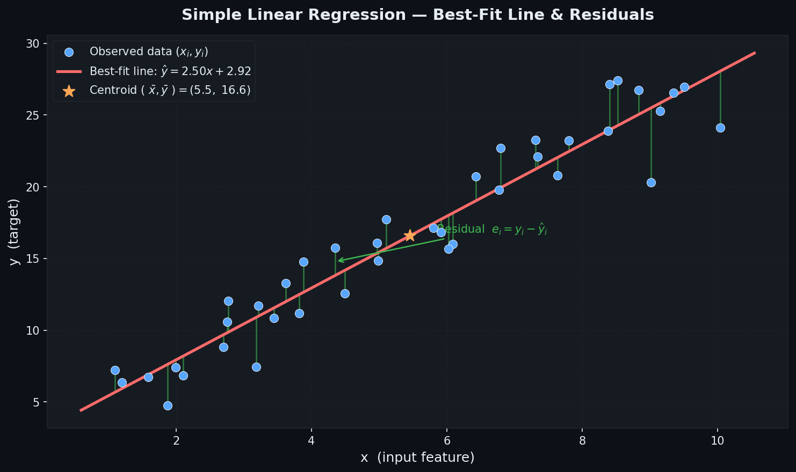
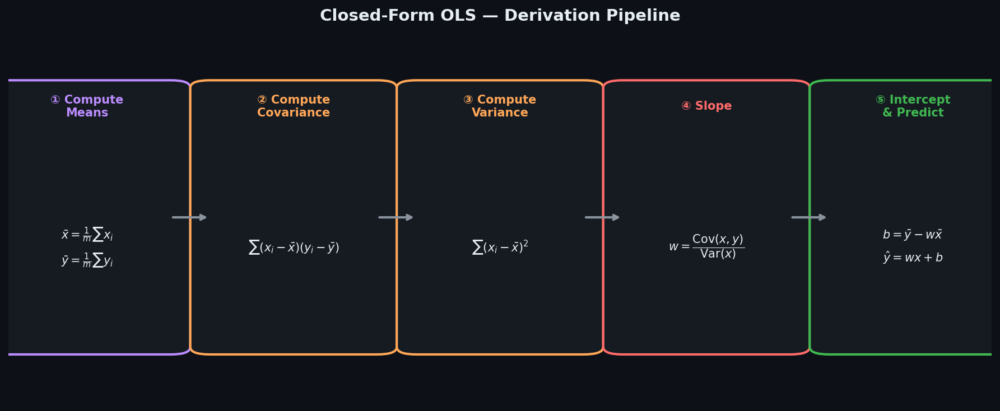
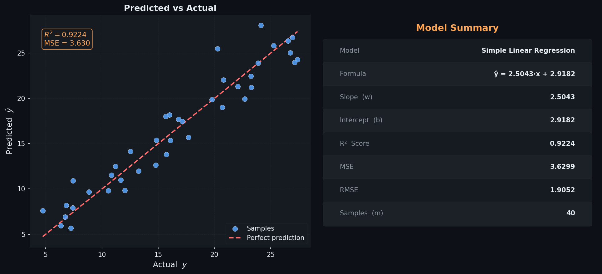
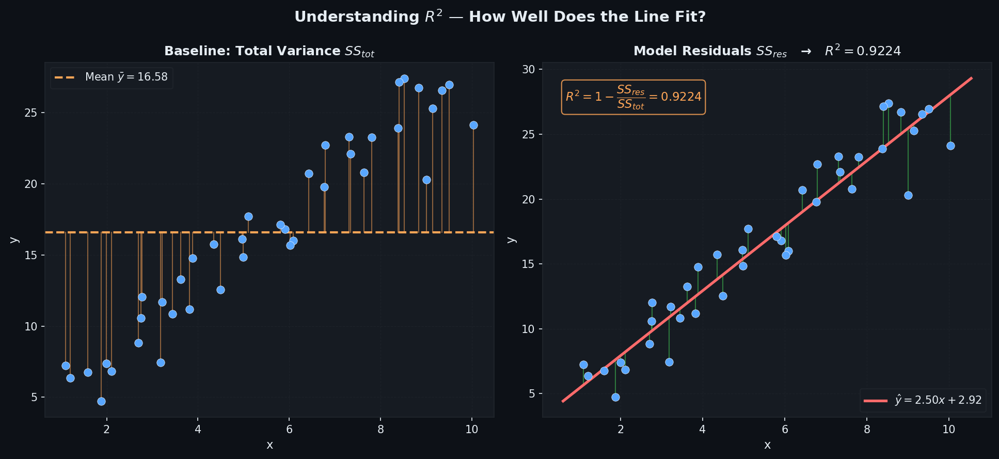

# Simple Linear Regression — Closed-Form OLS

> A clean, **NumPy-only** implementation of Simple Linear Regression using the  
> **Ordinary Least Squares (OLS) closed-form solution**.  
> Fits a straight line through $(x, y)$ data by minimising Mean Squared Error —  
> **no iterations, no learning rate, exact answer in one step.**

---

## Table of Contents

1. [What is Simple Linear Regression?](#1-what-is-simple-linear-regression)
2. [The Model](#2-the-model)
3. [Cost Function — MSE](#3-cost-function--mse)
4. [Closed-Form Solution](#4-closed-form-solution)
5. [Best-Fit Line & Residuals](#5-best-fit-line--residuals)
6. [MSE Loss Surface](#6-mse-loss-surface)
7. [Derivation Pipeline](#7-derivation-pipeline)
8. [Regression Diagnostics](#8-regression-diagnostics)
9. [Predicted vs Actual](#9-predicted-vs-actual)
10. [Understanding R²](#10-understanding-r)
11. [Usage](#11-usage)
12. [Class Reference](#12-class-reference)
13. [Assumptions](#13-assumptions)

---

## 1. What is Simple Linear Regression?

Simple Linear Regression models the **linear relationship between one input $x$ and one output $y$**.

Given $m$ observations $(x_1, y_1),\ldots,(x_m, y_m)$, it finds the line:

$$\hat{y} = w \cdot x + b$$

| Symbol | Name | Meaning |
|--------|------|---------|
| $w$ | Slope | Change in $\hat{y}$ per unit increase in $x$ |
| $b$ | Intercept | Value of $\hat{y}$ when $x = 0$ |
| $\hat{y}$ | Prediction | Model output for a given $x$ |
| $e_i = y_i - \hat{y}_i$ | Residual | Error for sample $i$ |

---

## 2. The Model

For a **single** input feature $x$, the prediction for sample $i$ is:

$$\hat{y}_i = w \cdot x_i + b, \qquad w \in \mathbb{R},\quad b \in \mathbb{R}$$

Vectorised over all $m$ samples:

$$\hat{\mathbf{y}} = w\,\mathbf{x} + b$$

> Unlike Multiple Linear Regression — no matrix inversion, no `np.linalg.inv`, no risk of singular matrices. Pure scalar arithmetic.

---

## 3. Cost Function — MSE

We minimise the **Mean Squared Error** — the average squared gap between predictions and true values:

$$\mathcal{L}(w, b) = \frac{1}{m}\sum_{i=1}^{m}(\hat{y}_i - y_i)^2$$

The MSE surface over $(w, b)$ is a **convex paraboloid** — it has exactly **one global minimum**, which the closed-form formula reaches directly.

---

## 4. Closed-Form Solution

Setting $\dfrac{\partial \mathcal{L}}{\partial w} = 0$ and $\dfrac{\partial \mathcal{L}}{\partial b} = 0$ and solving analytically:

**Slope:**
$$w = \frac{\displaystyle\sum_{i=1}^{m}(x_i - \bar{x})(y_i - \bar{y})}{\displaystyle\sum_{i=1}^{m}(x_i - \bar{x})^2} = \frac{\text{Cov}(x,\,y)}{\text{Var}(x)}$$

**Intercept:**
$$b = \bar{y} - w\,\bar{x}$$

where $\bar{x}$ and $\bar{y}$ are the sample means.

These are the **Ordinary Least Squares (OLS) estimators** — proven to be the **Best Linear Unbiased Estimators (BLUE)** under the Gauss-Markov theorem.

Key geometric fact: **the best-fit line always passes through the centroid $(\bar{x},\,\bar{y})$.**

---

## 5. Best-Fit Line & Residuals



| Visual Element | Meaning |
|----------------|---------|
| 🔵 Blue dots | Observed data points $(x_i,\, y_i)$ |
| 🔴 Red line | Fitted line $\hat{y} = wx + b$ |
| 🟢 Green bars | Residuals $e_i = y_i - \hat{y}_i$ |
| ⭐ Amber star | Centroid $(\bar{x},\, \bar{y})$ — the line always passes here |

A good fit shows residuals that are **small, symmetric, and randomly scattered** above and below the line with no obvious pattern.

---

## 6. MSE Loss Surface


The contour map shows the MSE as a function of slope $w$ and intercept $b$.

- The surface is a **smooth convex bowl** — one global minimum guaranteed.
- The **green star** marks the exact $(w^*, b^*)$ computed by the closed-form formula.
- No iterative path needed — we jump directly to the minimum.

> Compare this to Gradient Descent, which would show an amber trajectory spiralling toward the minimum across many epochs.

---

## 7. Derivation Pipeline



The five-step pipeline from raw data to prediction:

| Step | Operation | Formula |
|------|-----------|---------|
| ① | Compute means | $\bar{x} = \frac{1}{m}\sum x_i$, $\quad\bar{y} = \frac{1}{m}\sum y_i$ |
| ② | Compute covariance | $\sum(x_i - \bar{x})(y_i - \bar{y})$ |
| ③ | Compute variance | $\sum(x_i - \bar{x})^2$ |
| ④ | Solve for slope | $w = \text{Cov} / \text{Var}$ |
| ⑤ | Solve for intercept & predict | $b = \bar{y} - w\bar{x}$, $\quad\hat{y} = wx + b$ |

---

## 8. Regression Diagnostics

After fitting, verify the four core OLS assumptions visually:


| Plot | What to look for | Assumption verified |
|------|-----------------|---------------------|
| **Residuals vs Fitted** | Random scatter around $y=0$, no curve | Linearity |
| **Normal Q-Q** | Points on the diagonal line | Normality of residuals |
| **Scale-Location** | Flat, uniform band (no funnel) | Homoscedasticity |
| **Residual Histogram** | Bell-shaped, centred at 0 | Normality |

**Red flags:**
- Curve in *Residuals vs Fitted* → relationship is non-linear; try transforming $x$
- Funnel shape in *Scale-Location* → variance is not constant; try log($y$)
- Heavy tails in Q-Q → residuals are not normal; consider robust regression

---

## 9. Predicted vs Actual



**Left panel:** each point is one sample — its actual $y$ on the x-axis and predicted $\hat{y}$ on the y-axis.  
- Points hugging the **red dashed diagonal** = accurate predictions.  
- Systematic deviation above/below = model bias.

**Right panel:** model summary card showing learned $w$, $b$, $R^2$, MSE, and RMSE at a glance.

---

## 10. Understanding R²



$$R^2 = 1 - \frac{SS_{res}}{SS_{tot}} = 1 - \frac{\sum(y_i - \hat{y}_i)^2}{\sum(y_i - \bar{y})^2}$$

| Panel | Shows | Represents |
|-------|-------|-----------|
| **Left** — amber bars | Deviation from the mean $\bar{y}$ | $SS_{tot}$ — total variance in $y$ |
| **Right** — green bars | Deviation from the fitted line | $SS_{res}$ — unexplained variance |

| $R^2$ value | Meaning |
|------------|---------|
| $= 1.0$ | Perfect fit — line explains all variance |
| $\approx 0.9$ | Strong fit — 90 % of variance explained |
| $= 0.0$ | Model no better than predicting $\bar{y}$ |
| $< 0$ | Model is worse than the mean baseline |

---

## 11. Usage

### Basic fit and predict

```python
import numpy as np
from simple_linear_regression import SimpleLinearRegression

x_train = np.array([1, 2, 3, 4, 5], dtype=float)
y_train = np.array([2.1, 3.9, 6.2, 7.8, 10.1])

model = SimpleLinearRegression()
model.fit(x_train, y_train)

print(f"Slope     (w) : {model.coef_:.4f}")
print(f"Intercept (b) : {model.intercept_:.4f}")
print(f"Model         : {model}")

x_test = np.array([6, 7, 8], dtype=float)
y_pred = model.predict(x_test)
print(f"Predictions   : {y_pred}")
print(f"R²            : {model.score(x_test, np.array([12.0, 13.8, 16.1])):.4f}")
```

### Plot the best-fit line

```python
import matplotlib.pyplot as plt

x_line = np.linspace(x_train.min(), x_train.max(), 200)

plt.figure(figsize=(8, 5))
plt.scatter(x_train, y_train, color='steelblue', s=60, label='Data')
plt.plot(x_line, model.predict(x_line), color='red', linewidth=2,
         label=f'ŷ = {model.coef_:.2f}x + {model.intercept_:.2f}')

# draw residuals
for xi, yi in zip(x_train, y_train):
    yi_hat = model.predict(np.array([xi]))[0]
    plt.plot([xi, xi], [yi, yi_hat], color='green', linewidth=0.9, alpha=0.7)

plt.xlabel('x'); plt.ylabel('y')
plt.title('Simple Linear Regression')
plt.legend(); plt.tight_layout(); plt.show()
```

### Evaluate on a test split

```python
from sklearn.model_selection import train_test_split

x_all = np.linspace(1, 20, 100)
y_all = 3.5 * x_all + 7 + np.random.normal(0, 3, 100)

x_train, x_test, y_train, y_test = train_test_split(x_all, y_all, test_size=0.2, random_state=42)

model = SimpleLinearRegression()
model.fit(x_train, y_train)

print(f"Train R²: {model.score(x_train, y_train):.4f}")
print(f"Test  R²: {model.score(x_test,  y_test ):.4f}")
```

---

## 12. Class Reference

```python
class SimpleLinearRegression:
    """Simple Linear Regression via closed-form OLS."""

    # Attributes set after fit()
    coef_       : float   # learned slope  w
    intercept_  : float   # learned intercept  b

    def fit(self, x_train, y_train) -> self:
        """
        Fit the model using OLS closed-form formulas.
        x_train : array-like, shape (n_samples,)
        y_train : array-like, shape (n_samples,)
        """

    def predict(self, x_test) -> np.ndarray:
        """
        Predict target values.
        x_test : array-like, shape (n_samples,)
        Returns: y_pred, shape (n_samples,)
        """

    def score(self, x_test, y_test) -> float:
        """Return R² coefficient of determination."""
```

---

## 13. Assumptions

| # | Assumption | How to check |
|---|-----------|--------------|
| 1 | **Linearity** — true relationship is $y = wx + b + \varepsilon$ | Residuals vs Fitted plot |
| 2 | **Zero-mean errors** — $\mathbb{E}[\varepsilon] = 0$ | Residual histogram centred at 0 |
| 3 | **Homoscedasticity** — $\text{Var}(\varepsilon_i) = \sigma^2$ constant | Scale-Location plot |
| 4 | **Independent errors** — $\text{Cov}(\varepsilon_i, \varepsilon_j) = 0$ | Durbin-Watson test / time-series plot |
| 5 | **Normality of residuals** | Normal Q-Q plot |

> **Feature scaling is NOT required** — the closed-form OLS solution is scale-invariant.  
> Centring $x$ (subtracting $\bar{x}$) can improve numerical stability for very large values.

---

## Dependencies

```
numpy >= 1.21
matplotlib >= 3.4   # optional — for plotting only
scipy >= 1.7        # optional — for Q-Q diagnostics
```

No other dependencies required.

---

## License

MIT
