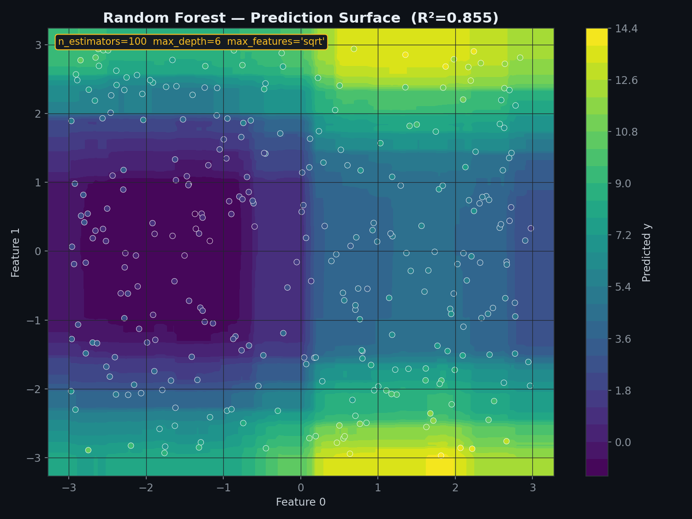
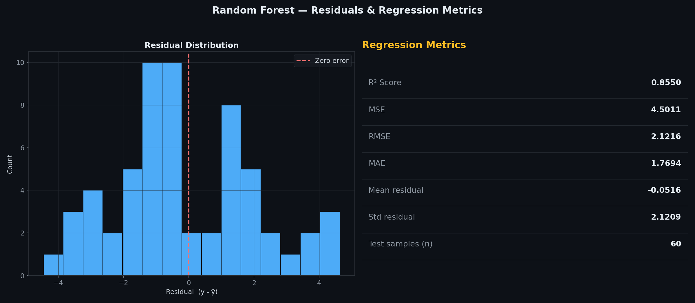

# Random Forest Regressor — Bagged Decision Trees

> A clean, **NumPy-only** implementation of Random Forest Regression.
> An ensemble of decision trees, each grown on a **bootstrap sample** with a **random feature subset** per split — predictions are the **mean** of every tree's output.
> Same variance-reduction splitting as a single Decision Tree — the forest just averages away each tree's noise.

---

## Table of Contents

1. [What is a Random Forest?](#1-what-is-a-random-forest)
2. [The Model](#2-the-model)
3. [Split Criterion — Variance Reduction](#3-split-criterion--variance-reduction)
4. [Why Bootstrap + Random Features?](#4-why-bootstrap--random-features)
5. [Single Tree vs Forest](#5-single-tree-vs-forest)
6. [Prediction Surface](#6-prediction-surface)
7. [Training Pipeline](#7-training-pipeline)
8. [Predicted vs Actual](#8-predicted-vs-actual)
9. [Effect of n_estimators](#9-effect-of-n_estimators)
10. [Feature Importance](#10-feature-importance)
11. [Residuals & Regression Metrics](#11-residuals--regression-metrics)
12. [Usage](#12-usage)
13. [Assumptions](#13-assumptions)
14. [Pros & Cons vs a Single Decision Tree & Linear Regression](#14-pros--cons-vs-a-single-decision-tree--linear-regression)

---

## 1. What is a Random Forest?

A Random Forest builds many decision trees, each on a slightly different view of the data, and averages their predictions. Individually, a deep decision tree overfits — it memorises noise along with signal. But if many such trees each overfit in a *different, uncorrelated* way, averaging their predictions cancels out most of that noise while keeping the signal.

| Symbol | Name | Meaning |
|--------|------|---------|
| $T$ | `n_estimators` | Number of trees in the forest |
| $p$ | `n_features_` | Total number of input features |
| $k$ | features per split | Random subset size, usually $\sqrt{p}$ |
| `feature`, `threshold` | Split rule | Which column and cutoff a node splits on |
| $\hat{y}_t(x)$ | Tree $t$'s prediction | One tree's leaf output for input $x$ |

---

## 2. The Model

Each tree $t$ predicts a value $\hat{y}_t(x)$ by traversing from root to leaf. The forest's prediction is the **average** across all $T$ trees:

$$\hat{y}(x) = \frac{1}{T}\sum_{t=1}^{T} \hat{y}_t(x)$$

Each leaf itself predicts the **mean target value** of the training samples that landed there — same as a standalone regression tree.

---

## 3. Split Criterion — Variance Reduction

Every tree in the forest still uses the same splitting rule as a single Decision Tree Regressor: at each node, pick the feature and threshold that maximise **Variance Reduction**:

$$\text{VR}(y, \text{split}) = \text{MSE}(y_\text{parent}) - \frac{|y_\text{left}|}{|y|}\,\text{MSE}(y_\text{left}) - \frac{|y_\text{right}|}{|y|}\,\text{MSE}(y_\text{right})$$

$$\text{MSE}(y) = \frac{1}{|y|}\sum_i (y_i - \bar{y})^2$$

A split with $\text{VR} \leq 0$ is rejected — the node becomes a leaf predicting $\text{mean}(y)$. The only difference from a single Decision Tree is **what each tree is allowed to see** — covered next.

---

## 4. Why Bootstrap + Random Features?

Two sources of randomness make each tree different, and that difference is what makes averaging useful:

- **Bootstrap sampling** — each tree trains on $n$ rows drawn **with replacement** from the training set, so every tree sees a different (overlapping) subset of samples.
- **Random feature subset** — at every single split, only $k$ randomly chosen features are considered (default $k = \sqrt{p}$), so different trees end up relying on different features even when trained on similar data.

Without this randomness, every tree in the forest would end up nearly identical, and averaging identical trees doesn't reduce any variance at all.

---

## 5. Single Tree vs Forest


**Left:** a single fully-grown tree fits every wiggle in the training noise — a jagged, overfit step function. **Right:** averaging 100 such trees, each trained on a different bootstrap sample, smooths that noise into a much closer approximation of the true underlying curve.

---

## 6. Prediction Surface



Two of the four input features are varied across a grid (the other two held at their mean) to visualise the forest's prediction surface. Unlike a single tree's blocky, rectangular regions, averaging over 100 trees' worth of random feature subsets and bootstrap samples produces a much smoother surface — while still being built entirely from axis-aligned splits underneath.

---

## 7. Training Pipeline


The five-step loop that runs once per tree, `n_estimators` times:

| Step | Operation |
|------|-----------|
| ① | Bootstrap sample — draw $n$ rows with replacement |
| ② | Random features — pick $k = \sqrt{p}$ features to consider, per split |
| ③ | Build decision tree — fit on the bootstrap sample using only those features |
| ④ | Store tree — append to `trees_`, repeat $T$ times |
| ⑤ | Average predictions — mean of every tree's output at inference time |

---

## 8. Predicted vs Actual


**Left panel:** each point is one test sample — actual $y$ on the x-axis, predicted $\hat{y}$ on the y-axis. Points hugging the red dashed diagonal are accurate predictions. **Right panel:** full model summary — hyperparameters, R², MSE, RMSE at a glance.

---

## 9. Effect of n_estimators


**Left:** R² climbs sharply with the first handful of trees, then flattens — most of the variance-reduction benefit comes from the first 10-20 trees. **Right:** the same trend at a few key checkpoints. Beyond a certain point, adding more trees costs training time without meaningfully improving accuracy.

---

## 10. Feature Importance


`feature_importances_` sums how much each feature reduced variance every time it was used for a split, weighted by how many samples passed through that node, then averages this across all trees and normalises to sum to 1. Features the forest relies on heavily for splitting show up with higher importance — a cheap, built-in way to see which inputs are actually driving the predictions.

---

## 11. Residuals & Regression Metrics



**Left:** distribution of test-set residuals — should be roughly centred at zero with no strong skew. **Right:** the full set of regression metrics (R², MSE, RMSE, MAE, mean/std of residuals) in one place.

---

## 12. Usage

### Basic fit and predict

```python
import numpy as np
from RandomForestRegressor import RandomForestRegressor

X_train = np.random.uniform(-3, 3, (200, 3))
y_train = np.sin(X_train[:, 0]) * 3 + X_train[:, 1] ** 2 + np.random.randn(200) * 0.3

model = RandomForestRegressor(n_estimators=100, max_depth=6, max_features='sqrt', random_state=42)
model.fit(X_train, y_train)

print(model)
print(f"Feature importances : {model.feature_importances_}")

X_test = np.random.uniform(-3, 3, (20, 3))
y_pred = model.predict(X_test)
print(f"Predictions : {y_pred}")
```

### Comparing n_estimators

```python
for k in [1, 5, 10, 25, 50, 100]:
    m = RandomForestRegressor(n_estimators=k, max_depth=6, random_state=42)
    m.fit(X_train, y_train)
    print(f"n_estimators={k:>4} -> R²={m.score(X_train, y_train):.4f}")
```

### Multi-feature example

```python
from sklearn.datasets import load_diabetes
from sklearn.model_selection import train_test_split

X, y = load_diabetes(return_X_y=True)
X_tr, X_te, y_tr, y_te = train_test_split(X, y, test_size=0.2, random_state=42)

model = RandomForestRegressor(n_estimators=100, max_depth=8, max_features='sqrt', random_state=42)
model.fit(X_tr, y_tr)

print(f"R²          : {model.score(X_te, y_te):.4f}")
print(f"n_features_ : {model.n_features_}")
```

---

## 13. Assumptions

| # | Assumption | How to check |
|---|-----------|--------------|
| 1 | **No feature scaling needed** — splits are threshold-based, like any decision tree | — |
| 2 | **Enough trees to stabilise variance** — too few trees leaves predictions noisy | n_estimators-vs-R² plot |
| 3 | **max_depth still matters per tree** — unbounded trees add variance the forest has to average away | Cross-validation |
| 4 | **Cannot extrapolate** — predictions are bounded by the range of training targets, same as any tree | Prediction surface plot |

> **Random Forests don't require feature scaling** — same as any tree-based model, since splits only compare relative order of feature values, not magnitude.

> **More trees never hurts accuracy, only speed** — unlike `max_depth`, adding more trees can't make the forest overfit further; it only costs more computation once R² has already flattened out.

---

## 14. Pros & Cons vs a Single Decision Tree & Linear Regression

| Criterion | **Random Forest** | **Single Decision Tree** | **Linear Regression** |
|-----------|----------------------|-----------------------------|--------------------------|
| Prediction | Averaged piecewise constant | Piecewise constant | Global linear |
| Overfitting risk | Low (averaging cancels noise) | High (deep trees memorise) | Low |
| Non-linear relationships | Yes | Yes | No |
| Feature importance | Yes, built-in | Yes, but noisier | Via coefficient magnitude (needs scaling) |
| Training cost | $T \times$ single tree cost | Low | Very low |
| Interpretability | Lower — ensemble of trees | Very high — a single rule path | High — explicit weights |
| Extrapolation | No — bounded by training range | No | Yes |
| Feature scaling | Not needed | Not needed | Recommended |
| sklearn equivalent | `RandomForestRegressor` | `DecisionTreeRegressor` | `LinearRegression` |

**Rule of thumb:** reach for a Random Forest whenever a single tree overfits and you don't need a fully interpretable model; drop to a single tree when you need to explain individual predictions as a simple rule path.

---

## Dependencies

```
numpy >= 1.21
matplotlib >= 3.4   # optional — for plots only
scikit-learn        # optional — for the diabetes dataset demo only
```

---

## License

MIT
