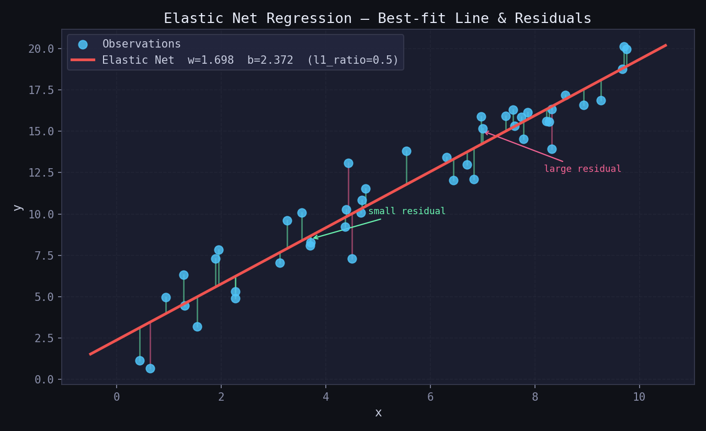
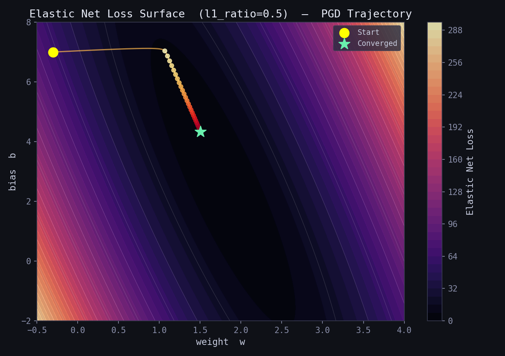
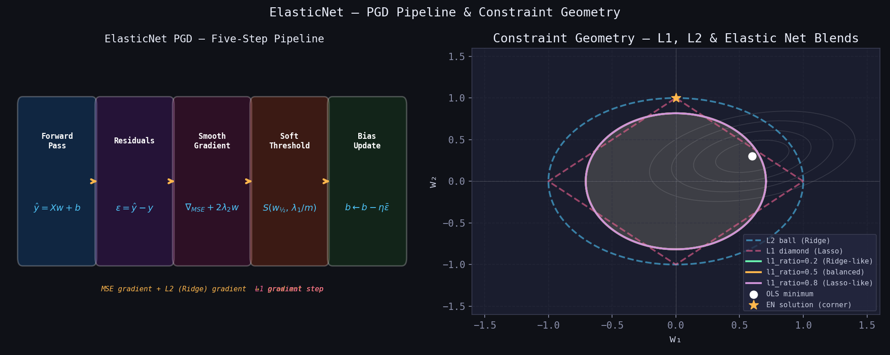
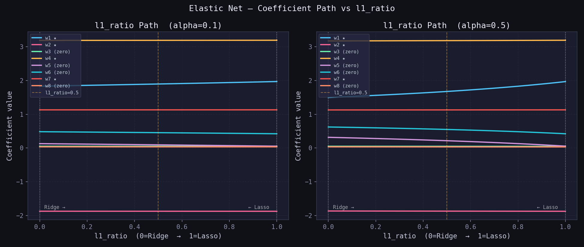
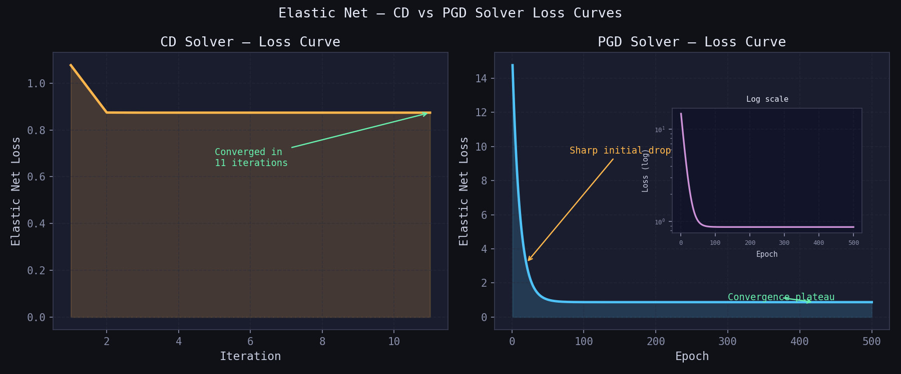
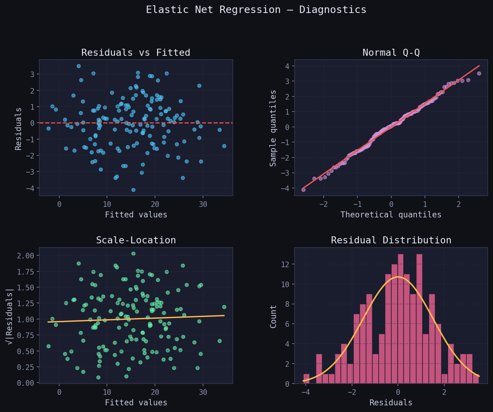
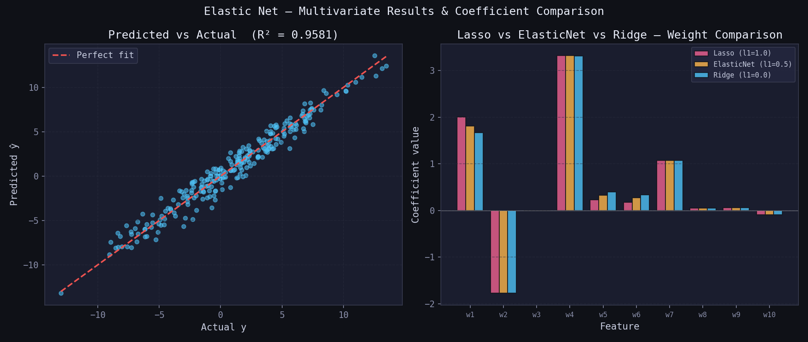

# Elastic Net Regression — L1 + L2 Regularised Linear Regression

> A clean, NumPy-only implementation of **Elastic Net Regression** supporting two solvers:  
> **Coordinate Descent** (CD, fast and exact) and **Proximal Gradient Descent** (PGD, iterative).  
> Elastic Net blends the Lasso (L1) and Ridge (L2) penalties via a single mixing parameter `l1_ratio` —  
> combining Ridge's stability on correlated features with Lasso's ability to produce exact zeros.

---

## Table of Contents

1. [What is Elastic Net Regression?](#1-what-is-elastic-net-regression)
2. [The Model](#2-the-model)
3. [Cost Function — Blended Penalty](#3-cost-function--blended-penalty)
4. [Deriving the Updates](#4-deriving-the-updates)
5. [Geometric Intuition](#5-geometric-intuition)
6. [Coefficient Path vs l1_ratio](#6-coefficient-path-vs-l1_ratio)
7. [Loss Curve — CD vs PGD](#7-loss-curve--cd-vs-pgd)
8. [Regression Diagnostics](#8-regression-diagnostics)
9. [Multivariate Results & Comparison](#9-multivariate-results--comparison)
10. [Usage](#10-usage)
11. [Hyperparameter Guide](#11-hyperparameter-guide)
12. [Assumptions](#12-assumptions)
13. [Comparison — OLS vs Ridge vs Lasso vs Elastic Net](#13-comparison--ols-vs-ridge-vs-lasso-vs-elastic-net)

---

## 1. What is Elastic Net Regression?

**Elastic Net** is a regularised linear regression that simultaneously applies both the L1 (Lasso) and L2 (Ridge) penalties. It was introduced to overcome two key limitations:

- **Lasso's instability with correlated features** — when features are highly correlated, Lasso arbitrarily picks one and zeros out the rest, producing unstable, non-reproducible models.
- **Ridge's inability to produce sparse models** — Ridge shrinks weights toward zero but never reaches exactly zero, making the model hard to interpret when many features are irrelevant.

Elastic Net solves both by blending the two penalties with a mixing parameter `l1_ratio`:

1. **Sparsity** from the L1 term — some weights can still be driven to exact zero.
2. **Grouping effect** from the L2 term — correlated features receive similar (not arbitrarily different) weights.
3. **Numerical stability** from the L2 term — the regularised system is always well-conditioned.

The result is a model that is more robust than pure Lasso for correlated data, and more interpretable than pure Ridge for high-dimensional data.

Setting `l1_ratio = 1.0` recovers **pure Lasso**.  
Setting `l1_ratio = 0.0` recovers **pure Ridge**.  
The default `l1_ratio = 0.5` gives an equal blend.



*The red line is the Elastic Net best-fit line with `l1_ratio=0.5`. Green bars are small residuals; pink bars are large residuals. The blend of L1 and L2 penalties produces slight weight shrinkage while retaining the ability to zero out irrelevant features.*

---

## 2. The Model

For $m$ samples and $p$ features the prediction is identical to OLS, Ridge, and Lasso:

$$\hat{y}_i = w_1 x_{i1} + w_2 x_{i2} + \cdots + w_p x_{ip} + b$$

In matrix form over the full training set $\mathbf{X} \in \mathbb{R}^{m \times p}$:

$$\hat{\mathbf{y}} = \mathbf{X}\,\mathbf{w} + b, \qquad \mathbf{w} \in \mathbb{R}^{p},\quad b \in \mathbb{R}$$

where $\mathbf{w} = [w_1,\ w_2,\ \ldots,\ w_p]^T$ are the feature weights and $b$ is the **un-penalised** scalar bias.

The difference from all prior methods lies entirely in the penalty applied during optimisation — Elastic Net uses a **convex combination of the L1 and L2 norms**, controlled by `l1_ratio`.

---

## 3. Cost Function — Blended Penalty

Elastic Net minimises the **Mean Squared Error plus a weighted blend of L1 and L2 penalties**:

$$\mathcal{L}(\mathbf{w}, b) = \underbrace{\frac{1}{m}\|\mathbf{X}\mathbf{w} + b - \mathbf{y}\|^2}_{\text{MSE}} + \underbrace{\frac{\alpha}{m}\Big[\,\rho\|\mathbf{w}\|_1 + (1-\rho)\|\mathbf{w}\|_2^2\,\Big]}_{\text{Elastic Net penalty}}$$

where $\rho$ is `l1_ratio` and $\alpha$ is the overall regularisation strength.

The full penalty expands to:

$$\frac{\alpha}{m}\Big[\,\rho\sum_{j=1}^{p}|w_j| + (1-\rho)\sum_{j=1}^{p}w_j^2\,\Big]$$

Key properties:

- Setting $\rho = 1$ recovers the Lasso penalty $\frac{\alpha}{m}\|\mathbf{w}\|_1$.
- Setting $\rho = 0$ recovers the Ridge penalty $\frac{\alpha}{m}\|\mathbf{w}\|_2^2$.
- The bias $b$ is **not penalised** in either term.
- Dividing $\alpha$ by $m$ keeps both penalty terms on the same scale as the MSE gradient.
- The surface is **strictly convex** for any $\alpha > 0$ — a unique global minimum always exists.



*Contour map of the Elastic Net loss surface over $(w, b)$ with `l1_ratio=0.5`. The amber trajectory shows the PGD path from the yellow start toward the green converged minimum. The smooth contours reflect the L2 component; the slight asymmetry near $w=0$ reflects the L1 component.*

---

## 4. Deriving the Updates

### Coordinate Descent (CD) — recommended

For each feature $j$, holding all other weights fixed, the 1-D Elastic Net sub-problem has the closed-form solution:

$$w_j^* = \frac{S\!\left(\rho_j,\;\dfrac{\alpha\,\rho}{m}\right)}{z_j + \dfrac{2\,\alpha\,(1-\rho)}{m}}$$

where:

$$\rho_j = \frac{1}{m}\,\mathbf{x}_j^T\,\mathbf{r}_j \qquad \text{(partial correlation with residual excluding } w_j \text{)}$$

$$z_j = \frac{1}{m}\|\mathbf{x}_j\|^2 \qquad \text{(column normaliser, pre-computed)}$$

$$S(z,\, t) = \text{sign}(z)\cdot\max(|z| - t,\; 0) \qquad \text{(soft-threshold operator)}$$

Compared to the Lasso CD update, Elastic Net has **one extra term in the denominator**: $\dfrac{2\,\alpha\,(1-\rho)}{m}$ — the Ridge shrinkage factor. When $\rho = 1$ this vanishes (pure Lasso); when $\rho = 0$ the numerator threshold vanishes and only Ridge shrinkage remains.

### Proximal Gradient Descent (PGD)

The Elastic Net objective is split into a smooth part (MSE + L2) and a non-smooth part (L1):

**Step 1 — Gradient step on the smooth MSE + L2 term:**
$$\mathbf{g} = \frac{1}{m}\,\mathbf{X}^T(\mathbf{X}\mathbf{w} + b - \mathbf{y}) + \frac{2\,\alpha\,(1-\rho)}{m}\,\mathbf{w}$$
$$\mathbf{w}_{½} = \mathbf{w} - \eta\,\mathbf{g}$$

**Step 2 — Proximal step on the L1 term only (soft-threshold):**
$$\mathbf{w} \leftarrow S\!\left(\mathbf{w}_{½},\;\frac{\eta\,\alpha\,\rho}{m}\right)$$

**Bias update (no penalty):**
$$b \leftarrow b - \eta \cdot \frac{1}{m}\sum_{i=1}^{m}(\hat{y}_i - y_i)$$

The Ridge (L2) gradient is folded into Step 1 so the proximal operator in Step 2 remains the simple soft-threshold — the same operator used by pure Lasso. The L2 term makes no contribution to the soft-threshold; it is handled exactly via the gradient.



*Left: the five-step PGD pipeline. The key difference from Lasso PGD is Step 3 — the gradient includes both the MSE gradient and the L2 (Ridge) gradient. Step 4 (soft-threshold) is identical to Lasso's. Right: constraint geometry showing how the Elastic Net feasible region (amber/purple curves) interpolates between the L2 ball (blue circle) and the L1 diamond (pink), producing rounded corners that can still touch the axes.*

---

## 5. Geometric Intuition

- **OLS**: no constraint — solution can lie anywhere.
- **Ridge**: L2 ball (sphere) — smooth boundary, solution almost never at a corner, no exact zeros.
- **Lasso**: L1 diamond — sharp corners on the axes, solution often at a corner, exact zeros produced.
- **Elastic Net**: a **rounded diamond** — the L2 component smooths the L1 corners, but corners still exist. Exact zeros are still possible (from the L1 term), but the solution is more stable near the corners (from the L2 term).

The critical advantage over Lasso emerges when features are correlated:

| Scenario | Lasso | Elastic Net |
|---|---|---|
| Two uncorrelated features, both informative | Keeps both | Keeps both |
| Two highly correlated features, both informative | Arbitrarily keeps one | Keeps both with similar weights |
| Many irrelevant features | Zeros them out | Zeros them out |
| High-dimensional, $p > m$ | Selects at most $m$ | Can select more than $m$ |

This **grouping effect** is Elastic Net's defining property: correlated features are treated as a group rather than competed against each other.

---

## 6. Coefficient Path vs l1_ratio

As `l1_ratio` sweeps from 0 (pure Ridge) to 1 (pure Lasso), the behaviour of every coefficient changes. Plotting this path reveals the **transition between Ridge-like and Lasso-like behaviour** for each feature.



*Each coloured line is one coefficient plotted against `l1_ratio`. Stars (★) mark truly informative features. Left: `alpha=0.1` — mild regularisation; coefficients change gradually. Right: `alpha=0.5` — strong regularisation; the Ridge end (left) shows non-zero but shrunk weights; the Lasso end (right) shows sparser, more aggressive zeroing. The amber dashed line at `l1_ratio=0.5` is the default balanced setting.*

**What to look for:**

| Observation | Interpretation |
|---|---|
| Coefficients flat across the path | That feature is robust to the L1/L2 trade-off |
| Coefficients decay to zero only at high l1_ratio | Feature is informative; Lasso zeroing it is overly aggressive |
| Coefficients near zero across the whole path | That feature is mostly noise |
| Two coefficients merge at low l1_ratio | Those features are highly correlated — Ridge groups them |

---

## 7. Loss Curve — CD vs PGD

`loss_history_` stores the full Elastic Net loss (MSE + L1 penalty + L2 penalty) at the end of every iteration or epoch. Both solvers populate this attribute.



*Left (CD): converges in very few iterations — CD is extremely efficient for the Elastic Net because the 1-D sub-problem has an exact closed-form solution. Right (PGD): the characteristic sharp initial drop followed by smooth flattening. The log-scale inset confirms monotone decay. If the PGD curve oscillates or diverges — reduce `learning_rate`.*

---

## 8. Regression Diagnostics

After fitting, verify the four core OLS assumptions visually. Elastic Net regression inherits these assumptions:



| Plot | What to look for | Assumption checked |
|---|---|---|
| **Residuals vs Fitted** | Random scatter around 0 | Linearity & homoscedasticity |
| **Normal Q-Q** | Points on the diagonal | Normality of residuals |
| **Scale-Location** | Flat, random band | Constant variance |
| **Residual Distribution** | Bell-shaped histogram | Normality |

---

## 9. Multivariate Results & Comparison

The grouped-weight behaviour of Elastic Net is most visible when features are correlated. The chart below compares Lasso, Elastic Net, and Ridge weights side-by-side on a dataset where features 5 and 6 are highly correlated with feature 1.



*Left: predicted vs actual with R² near 1.0. Right: weight comparison across Lasso (pink), Elastic Net (amber), and Ridge (blue). Notice that Lasso assigns most weight to feature 1 and near-zeros features 5 and 6, while Elastic Net distributes the weight more evenly across the correlated group, and Ridge distributes it most evenly of all.*

---

## 10. Usage

```python
import numpy as np
from elasticnet_regression import ElasticNetRegressor

# ── Coordinate Descent — balanced L1/L2 mix (recommended default) ─────────────
X_train = np.array([[1], [2], [3], [4], [5]], dtype=float)
y_train = np.array([2.1, 3.9, 6.2, 7.8, 10.1])

model = ElasticNetRegressor(alpha=0.1, l1_ratio=0.5, solver='cd')
model.fit(X_train, y_train)

print("Intercept (b) :", model.intercept_)   # scalar float
print("Weights   (w) :", model.coef_)        # ndarray, shape (n_features,)
print("n_iter_       :", model.n_iter_)      # iterations until convergence
print("__repr__      :", model)

# ── Predict ───────────────────────────────────────────────────────────────────
X_test = np.array([[6], [7], [8]], dtype=float)
y_pred = model.predict(X_test)
print("Predictions   :", y_pred)

# ── Evaluate — R² ─────────────────────────────────────────────────────────────
print(f"R²  = {model.score(X_test, y_train[:3]):.4f}")
```

**Proximal Gradient Descent solver:**

```python
model = ElasticNetRegressor(alpha=0.1, l1_ratio=0.5, solver='pgd',
                             learning_rate=0.05, epochs=2000)
model.fit(X_train, y_train)

# Plot loss curve to confirm convergence
import matplotlib.pyplot as plt
plt.plot(model.loss_history_)
plt.xlabel("Epoch"); plt.ylabel("Elastic Net Loss  (MSE + L1 + L2)")
plt.title("ElasticNet PGD — Loss Curve")
plt.show()
```

**Multi-feature example with correlated features:**

```python
from sklearn.datasets import make_regression
from sklearn.preprocessing import StandardScaler
from sklearn.model_selection import train_test_split

X, y = make_regression(n_samples=500, n_features=20,
                       n_informative=6, noise=10, random_state=0)

# Feature scaling is required for both CD and PGD solvers
scaler = StandardScaler()
X_scaled = scaler.fit_transform(X)

X_train, X_test, y_train, y_test = train_test_split(
    X_scaled, y, test_size=0.2, random_state=42
)

model = ElasticNetRegressor(alpha=0.1, l1_ratio=0.5,
                             solver='cd', max_iter=2000, tol=1e-6)
model.fit(X_train, y_train)

print(f"Train R²     : {model.score(X_train, y_train):.4f}")
print(f"Test  R²     : {model.score(X_test,  y_test ):.4f}")
print(f"Non-zero w   : {(model.coef_ != 0).sum()} / {X.shape[1]}")
```

**Sweeping l1_ratio to find the best blend:**

```python
l1_ratios = [0.1, 0.3, 0.5, 0.7, 0.9, 1.0]

for l1r in l1_ratios:
    m = ElasticNetRegressor(alpha=0.1, l1_ratio=l1r, solver='cd').fit(X_train, y_train)
    n_nz = (np.abs(m.coef_) > 1e-6).sum()
    print(f"l1_ratio={l1r:.1f}  |  Test R²: {m.score(X_test, y_test):.4f}  "
          f"|  Non-zero: {n_nz:2d} / {X.shape[1]}")
```

**Recovering pure Lasso or pure Ridge:**

```python
# Pure Lasso
lasso_model = ElasticNetRegressor(alpha=0.1, l1_ratio=1.0, solver='cd')

# Pure Ridge
ridge_model = ElasticNetRegressor(alpha=0.1, l1_ratio=0.0, solver='cd')
```

---

## 11. Hyperparameter Guide

### `alpha`

| Value | Behaviour | Recommended when |
|---|---|---|
| 0.0 | No regularisation — identical to OLS | Baseline comparison only |
| 0.001 – 0.01 | Very mild regularisation | Large datasets, low noise |
| 0.1 – 0.5 | Moderate regularisation | **Default starting point** |
| 1.0 – 5.0 | Strong regularisation, many zeros | High-dimensional, noisy data |
| 10.0+ | Near-total sparsity | Extremely high-dimensional data |

### `l1_ratio`

| Value | Effect | Recommended when |
|---|---|---|
| 0.0 | Pure Ridge — no zeros, stable | All features informative, highly correlated |
| 0.1 – 0.3 | Ridge-dominant — few zeros | Most features informative, mild correlation |
| 0.5 | Equal mix — **default** | Unknown correlation structure |
| 0.7 – 0.9 | Lasso-dominant — more zeros | Many irrelevant features, some correlation |
| 1.0 | Pure Lasso — maximum sparsity | Features independent, many irrelevant |

### `solver`

- Use `'cd'` (Coordinate Descent) by default — exact 1-D solutions, no learning rate tuning, early stopping via `tol`.
- Switch to `'pgd'` (Proximal Gradient Descent) when you want smooth epoch-level loss monitoring or need to integrate with a learning rate schedule.

### `learning_rate` *(PGD solver only)*

- Start with `0.01` or `0.05` for standardised features.
- If the loss **diverges** → halve the learning rate.
- If the loss **plateaus too early** → try a slight increase.

### `epochs` *(PGD solver only)*

- Monitor `loss_history_` — stop when the curve fully flattens.
- A typical range is `500 – 3000` for small-to-medium datasets.
- With feature scaling, far fewer epochs are needed.

### `max_iter` and `tol` *(CD solver only)*

- `max_iter=1000` and `tol=1e-4` are good defaults for most problems.
- Tighten `tol` to `1e-6` or `1e-7` when high-precision coefficients are needed.
- Check `n_iter_` after fitting — if it equals `max_iter`, the solver did not converge; increase `max_iter`.

### `fit_intercept`

- Always leave as `True` (default) unless the data has been manually centred.
- The intercept is **never penalised** — neither the L1 nor the L2 term applies to it.

---

## 12. Assumptions

For Elastic Net Regression to produce a meaningful solution:

1. **Linearity** — the true relationship is $y = \mathbf{X}\mathbf{w} + b + \varepsilon$.
2. **Zero-mean errors** — $\mathbb{E}[\varepsilon] = 0$.
3. **Homoscedasticity** — $\text{Var}(\varepsilon_i) = \sigma^2$ (constant for all $i$).
4. **No autocorrelation** — $\text{Cov}(\varepsilon_i, \varepsilon_j) = 0$ for $i \neq j$.
5. **Feature scaling required** — like Lasso, Elastic Net is sensitive to feature scale. Always apply `StandardScaler` (zero mean, unit variance) before fitting; without scaling, features with larger magnitudes receive disproportionately large penalties.
6. **Hyperparameter selection** — use cross-validation to choose `alpha` and `l1_ratio` jointly. A 2-D grid search over both is standard practice (`ElasticNetCV` in scikit-learn).
7. **Correlated features** — Elastic Net is specifically designed for correlated features. The L2 component ensures that correlated features receive similar, stable weights rather than the arbitrary selection that Lasso applies.

---

## 13. Comparison — OLS vs Ridge vs Lasso vs Elastic Net

| Criterion | **OLS** | **Ridge (L2)** | **Lasso (L1)** | **Elastic Net** ✓ |
|---|---|---|---|---|
| Penalty | None | $\alpha\|\mathbf{w}\|_2^2$ | $\alpha\|\mathbf{w}\|_1$ | $\alpha[\rho\|\mathbf{w}\|_1 + (1-\rho)\|\mathbf{w}\|_2^2]$ |
| Constraint shape | — | Sphere | Diamond | Rounded diamond |
| Exact zero weights | No | No | Yes | **Yes** |
| Variable selection | No | No | Yes | **Yes** |
| Handles correlated features | Poorly | Well (groups) | Arbitrarily | **Well (groups + selects)** |
| Closed-form solution | Yes | Yes | No | No |
| Unique solution | Yes (if full rank) | Always | Not always | **Always** |
| Works when $p > m$ | No | Yes | Partially | **Yes** |
| Bias introduced | None | Small | Small–moderate | Small–moderate |
| Variance reduction | None | Significant | Significant | **Significant** |
| Interpretability | Baseline | Moderate | High (sparse) | **High (sparse + stable)** |
| Key hyperparameter | — | `alpha` | `alpha` | `alpha` + `l1_ratio` |

**Rule of thumb:** use Elastic Net as the default regularised regressor when you have moderate-to-high-dimensional data and suspect some features are correlated. Start with `alpha=0.1, l1_ratio=0.5` and tune both via cross-validation. Fall back to pure Lasso (`l1_ratio=1.0`) only when features are known to be independent; fall back to pure Ridge (`l1_ratio=0.0`) only when all features are known to be informative.

---

## Dependencies

```
numpy >= 1.21
```

No other dependencies required.

---

## License

MIT
