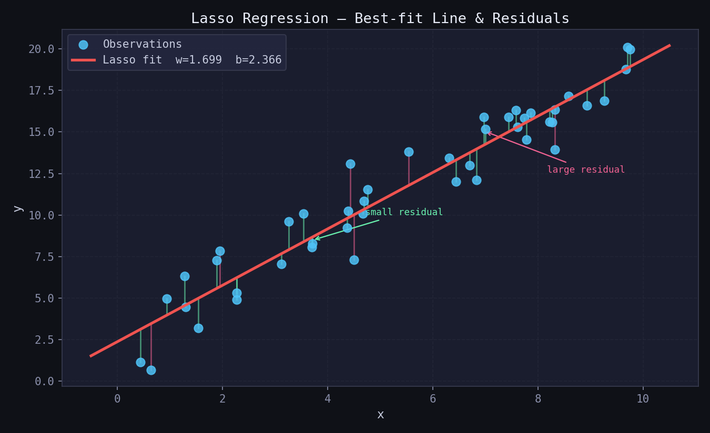
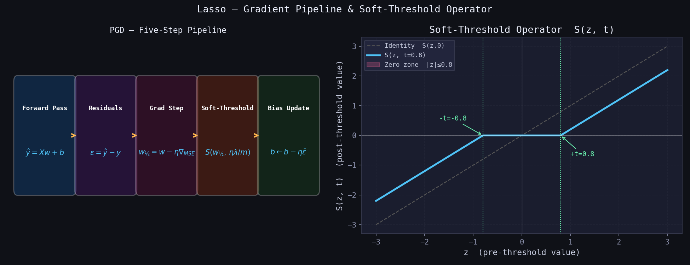
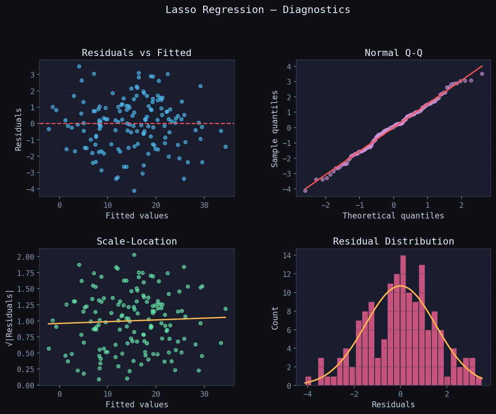
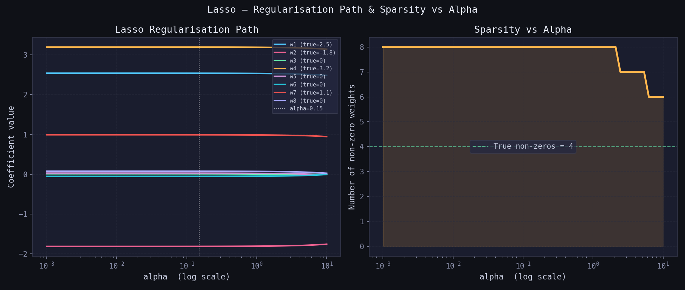
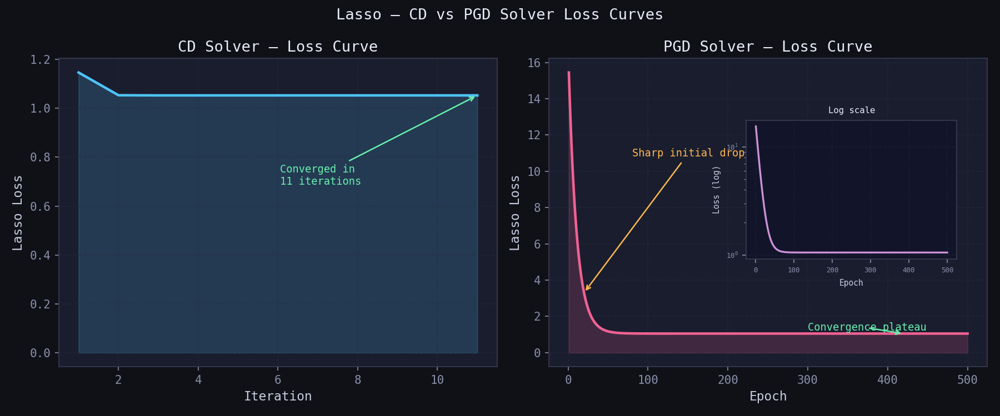

# Lasso Regression — L1-Regularised Linear Regression

> A clean, **NumPy-only** implementation of Lasso Regression supporting two solvers:  
> **Coordinate Descent** (CD, fast and exact) and **Proximal Gradient Descent** (PGD, iterative).  
> Lasso adds an **L1 penalty** on the weights — the only regulariser that shrinks coefficients to **exactly zero**,  
> **performing automatic variable selection alongside regularisation.**

---

## Table of Contents

1. [What is Lasso Regression?](#1-what-is-lasso-regression)
2. [The Model](#2-the-model)
3. [Cost Function — Regularised MSE](#3-cost-function--regularised-mse)
4. [Deriving the Updates](#4-deriving-the-updates)
5. [Geometric Intuition](#5-geometric-intuition)
6. [Best-Fit Line & Residuals](#6-best-fit-line--residuals)
7. [Loss Surface & PGD Trajectory](#7-loss-surface--pgd-trajectory)
8. [Derivation Pipeline](#8-derivation-pipeline)
9. [Regression Diagnostics](#9-regression-diagnostics)
10. [Predicted vs Actual](#10-predicted-vs-actual)
11. [Regularisation Path & Sparsity](#11-regularisation-path--sparsity)
12. [Loss Curve — CD vs PGD](#12-loss-curve--cd-vs-pgd)
13. [Usage](#13-usage)
14. [Assumptions](#14-assumptions)

---

## 1. What is Lasso Regression?

**Lasso** (Least Absolute Shrinkage and Selection Operator) extends Ordinary Least Squares by adding the **sum of absolute weight values** as a penalty to the loss function.

Given $n$ observations $(\mathbf{x}_1, y_1), \ldots, (\mathbf{x}_n, y_n)$, it finds the hyperplane:

$$\hat{y} = w_1 x_1 + w_2 x_2 + \cdots + w_p x_p + b$$

| Symbol | Name | Meaning |
|--------|------|---------|
| $w_j$ | Weight | Change in $\hat{y}$ per unit increase in $x_j$ |
| $b$ | Bias / Intercept | Value of $\hat{y}$ when all $x_j = 0$ — never penalised |
| $\hat{y}$ | Prediction | Model output for a given $\mathbf{x}$ |
| $e_i = y_i - \hat{y}_i$ | Residual | Error for sample $i$ |
| $\alpha$ | Regularisation strength | Controls how many weights are driven to exactly zero |

Unlike Ridge (L2), Lasso can push weights to **exactly zero** — effectively removing irrelevant features. This makes it the tool of choice for:

1. **Regularisation** — preventing overfitting by penalising large weights.
2. **Variable selection** — automatically identifying the most informative features.
3. **Sparse models** — producing compact, interpretable solutions.

---

## 2. The Model

For $n$ samples and $p$ features the prediction is identical to OLS and Ridge:

$$\hat{y}_i = w_1 x_{i1} + w_2 x_{i2} + \cdots + w_p x_{ip} + b$$

In matrix form:

$$\hat{\mathbf{y}} = \mathbf{X}\mathbf{w} + b, \qquad \mathbf{X} \in \mathbb{R}^{n \times p},\quad \mathbf{w} \in \mathbb{R}^{p},\quad b \in \mathbb{R}$$

> The difference from OLS and Ridge is entirely in the penalty — Lasso uses the **L1 norm** $\|\mathbf{w}\|_1$ instead of squared L2, which is what enables exact zeros. The bias $b$ is **never penalised**.

---

## 3. Cost Function — Regularised MSE

Lasso minimises **MSE plus an L1 penalty on the weights**:

$$\mathcal{L}(\mathbf{w}, b) = \underbrace{\frac{1}{n}\|\mathbf{X}\mathbf{w} + b - \mathbf{y}\|^2}_{\text{MSE}} + \underbrace{\frac{\alpha}{n}\|\mathbf{w}\|_1}_{\text{Lasso penalty}}$$

where $\|\mathbf{w}\|_1 = |w_1| + |w_2| + \cdots + |w_p|$ is the **L1 norm**.

Key properties:

- The L1 penalty is **not differentiable at zero** — this enables exact zeros but prevents a closed-form global solution.
- The bias $b$ is **not penalised**.
- Dividing $\alpha$ by $n$ keeps the penalty on the same scale as MSE regardless of dataset size.
- The surface is **convex** — a unique global minimum always exists.

| $\alpha$ value | Behaviour |
|---------------|-----------|
| $= 0$ | Identical to plain OLS |
| Small (0.001–0.01) | Very mild shrinkage, few zeros |
| Medium (0.1–0.5) | Moderate sparsity — good default |
| Large (1–5) | Strong sparsity, many exact zeros |
| Very large | Almost all weights collapse to zero |

---

## 4. Deriving the Updates

Because the L1 penalty is non-differentiable at zero, standard gradient descent cannot be applied directly. Two solvers handle this:

### Coordinate Descent (CD) — recommended

For each feature $j$, holding all others fixed, the 1-D Lasso sub-problem has the closed-form solution via the **soft-threshold operator**:

$$w_j^* = \frac{S\!\left(\rho_j,\;\dfrac{\alpha}{n}\right)}{z_j}$$

where:

$$\rho_j = \frac{1}{n}\,\mathbf{x}_j^T\,\mathbf{r}_j \quad \text{(partial correlation)}, \qquad z_j = \frac{1}{n}\|\mathbf{x}_j\|^2 \quad \text{(column normaliser)}$$

$$S(z,\, t) = \text{sign}(z)\cdot\max(|z| - t,\; 0) \quad \text{(soft-threshold operator)}$$

If $|\rho_j| \leq \alpha/n$ the weight is set to **exactly zero** — this is the variable selection mechanism.

### Proximal Gradient Descent (PGD)

Each update is a two-step operation:

**Step 1 — Gradient step on smooth MSE only:**
$$\mathbf{w}_{½} = \mathbf{w} - \eta \cdot \frac{1}{n}\,\mathbf{X}^T(\mathbf{X}\mathbf{w} + b - \mathbf{y})$$

**Step 2 — Proximal step — soft-threshold handles L1:**
$$\mathbf{w} \leftarrow S\!\left(\mathbf{w}_{½},\;\frac{\eta\,\alpha}{n}\right)$$

**Bias update (no penalty):**
$$b \leftarrow b - \eta \cdot \frac{1}{n}\sum_{i=1}^{n}(\hat{y}_i - y_i)$$

---

## 5. Geometric Intuition

- OLS minimises MSE with **no constraint** — the solution can lie anywhere.
- Ridge adds a **spherical L2 constraint** — smooth ball, weights shrunk but rarely zero.
- Lasso adds a **diamond-shaped L1 constraint** — sharp corners aligned with the axes.

The Lasso solution is where the MSE ellipsoids first touch the L1 diamond. Because the diamond has **corners on the axes**, the touching point is very often at a corner — meaning one or more weights are exactly zero.

| Property | Ridge (L2 ball) | Lasso (L1 diamond) |
|---|---|---|
| Shape of constraint | Sphere — smooth | Diamond — corners |
| Solution at corner? | Almost never | Very often |
| Exact zeros produced? | No | Yes |
| Variable selection? | No | Yes |

---

## 6. Best-Fit Line & Residuals



| Visual Element | Meaning |
|----------------|---------|
| Blue dots | Observed data points $(x_i,\ y_i)$ |
| Red line | Lasso best-fit line after convergence |
| Green bars | Small residuals — points close to the line |
| Pink bars | Large residuals — points far from the line |

Lasso slightly shrinks the slope compared to OLS — trading a small increase in bias for lower variance and sparser weights.

---

## 7. Loss Surface & PGD Trajectory


The contour map shows the Lasso loss surface over slope $w$ and bias $b$.

- The surface is **convex** — one global minimum guaranteed.
- The **amber path** is the PGD trajectory from the yellow start toward the green converged minimum.
- The cyan vertical line at $w=0$ marks the **sparsity axis** — the L1 penalty creates a kink here, pulling solutions toward exact zero.

---

## 8. Derivation Pipeline



**Left — PGD five-step loop per epoch:**

| Step | Operation | Formula |
|------|-----------|---------|
| ① | Forward pass | $\hat{\mathbf{y}} = \mathbf{X}\mathbf{w} + b$ |
| ② | Residuals | $\varepsilon = \hat{\mathbf{y}} - \mathbf{y}$ |
| ③ | Gradient step | $\mathbf{w}_{½} = \mathbf{w} - \eta\nabla_{\text{MSE}}$ |
| ④ | Soft-threshold | $\mathbf{w} \leftarrow S(\mathbf{w}_{½},\; \eta\alpha/n)$ |
| ⑤ | Bias update | $b \leftarrow b - \eta\bar{\varepsilon}$ |

**Right — Soft-Threshold Operator $S(z, t)$:** values inside the zero zone $|z| \leq t$ are mapped to exactly zero; values outside are shifted toward zero by $t$.

---

## 9. Regression Diagnostics

After fitting, verify the four core assumptions visually:



| Plot | What to look for | Assumption verified |
|------|-----------------|---------------------|
| **Residuals vs Fitted** | Random scatter around $y=0$, no curve | Linearity |
| **Normal Q-Q** | Points on the diagonal line | Normality of residuals |
| **Scale-Location** | Flat, uniform band — no funnel | Homoscedasticity |
| **Residual Histogram** | Bell-shaped, centred at 0 | Normality |

**Red flags:**
- Curve in *Residuals vs Fitted* → relationship is non-linear; try feature transformation
- Funnel shape in *Scale-Location* → variance not constant; try log($y$)
- Heavy tails in Q-Q → residuals not normal; consider robust regression

---

## 10. Predicted vs Actual


**Left panel:** each point is one sample — actual $y$ on x-axis, predicted $\hat{y}$ on y-axis.
- Points hugging the **red dashed diagonal** = accurate predictions.
- Systematic deviation above/below = model bias.

**Right panel:** learned Lasso weights $\mathbf{w}$ — green bars are positive, pink bars are negative. Near-zero bars show features that Lasso has almost completely removed. The title shows how many exact zeros were produced.

**Model summary:**

| Metric | Meaning |
|--------|---------|
| $R^2$ | Proportion of variance in $y$ explained by the model |
| MSE | Mean squared error — average squared residual |
| Non-zero $w$ | Number of features kept — rest were driven to exactly zero |
| $n\_iter\_$ | Actual iterations run (CD may converge early) |

---

## 11. Regularisation Path & Sparsity



**Left — regularisation path:** each coloured line is one weight plotted against $\alpha$ on a log scale. Features with weak signal collapse to zero first; informative features persist longer.

**Right — sparsity vs alpha:** number of non-zero weights as $\alpha$ increases. The step-function descent shows Lasso driving weights to zero one at a time. The green dashed line marks the true number of non-zero features.

| Observation | Interpretation |
|-------------|---------------|
| Path hits zero early | Feature is weakly informative — correctly removed |
| Path stays large | Feature has strong signal — robust to regularisation |
| All paths at zero | $\alpha$ too large — model underfit; reduce $\alpha$ |
| All paths non-zero | $\alpha$ too small — no sparsity benefit yet |

---

## 12. Loss Curve — CD vs PGD

`loss_history_` stores the full Lasso loss (MSE + L1 penalty) at the end of every iteration or epoch. Always plot it to confirm convergence.



**Left (CD):** converges in very few iterations — often under 20 passes for well-conditioned data. Check `n_iter_` after fitting; if it equals `max_iter`, increase `max_iter`.

**Right (PGD):** sharp initial drop followed by smooth flattening. The log-scale inset confirms clean monotone decay. If the curve oscillates or diverges → reduce `learning_rate`.

---

## 13. Usage

### Basic fit and predict

```python
import numpy as np
from lasso_regression import LassoRegressor

X_train = np.array([[1], [2], [3], [4], [5]], dtype=float)
y_train = np.array([2.1, 3.9, 6.2, 7.8, 10.1])

# coordinate descent — recommended default
model = LassoRegressor(alpha=0.1, solver='cd')
model.fit(X_train, y_train)

print(f"Intercept (b) : {model.intercept_:.4f}")
print(f"Weights   (w) : {model.coef_}")
print(f"n_iter_       : {model.n_iter_}")
print(model)

X_test = np.array([[6], [7], [8]], dtype=float)
y_test = np.array([12.0, 13.8, 16.1])
y_pred = model.predict(X_test)

print(f"Predictions   : {y_pred}")
print(f"R²            : {model.score(X_test, y_test):.4f}")
```

### PGD solver with loss curve

```python
model = LassoRegressor(alpha=0.1, solver='pgd',
                       learning_rate=0.05, epochs=2000)
model.fit(X_train, y_train)

import matplotlib.pyplot as plt
plt.plot(model.loss_history_)
plt.xlabel("Epoch")
plt.ylabel("Lasso Loss (MSE + L1)")
plt.title("Lasso PGD — Loss Curve")
plt.show()
```

### Multi-feature sparse example

```python
X_multi = np.random.randn(200, 8)
true_w  = np.array([2.5, -1.8, 0.0, 3.2, 0.0, 0.0, 1.1, 0.0])
y_multi = X_multi @ true_w + np.random.randn(200)

model = LassoRegressor(alpha=0.15, solver='cd', max_iter=2000, tol=1e-6)
model.fit(X_multi, y_multi)

print(f"R²         : {model.score(X_multi, y_multi):.4f}")
print(f"Non-zero w : {(model.coef_ != 0).sum()} / {X_multi.shape[1]}")
print(model)
```

### Comparing alpha values

```python
for alpha in [0.001, 0.01, 0.1, 0.5, 1.0]:
    m = LassoRegressor(alpha=alpha, solver='cd').fit(X_multi, y_multi)
    print(f"alpha={alpha:.3f}  |  R²={m.score(X_multi, y_multi):.4f}  "
          f"|  non-zero={( m.coef_ != 0).sum()}")
```

---

## 14. Assumptions

| # | Assumption | How to check |
|---|-----------|--------------|
| 1 | **Linearity** — true relationship is $y = \mathbf{X}\mathbf{w} + b + \varepsilon$ | Residuals vs Fitted plot |
| 2 | **Zero-mean errors** — $\mathbb{E}[\varepsilon] = 0$ | Residual histogram centred at 0 |
| 3 | **Homoscedasticity** — $\text{Var}(\varepsilon_i) = \sigma^2$ constant | Scale-Location plot |
| 4 | **Independent errors** — $\text{Cov}(\varepsilon_i, \varepsilon_j) = 0$ | Durbin-Watson test |
| 5 | **Normality** *(inference only)* — $\varepsilon \sim \mathcal{N}(0, \sigma^2)$ | Normal Q-Q plot |

> **Feature scaling is required** — Lasso is highly sensitive to feature scale. Always apply `StandardScaler` before fitting; without it, features with larger magnitudes are penalised more aggressively.

> **Correlated features caveat** — when features are highly correlated, Lasso arbitrarily selects one and zeros the others. Use Ridge or Elastic Net if retaining all correlated features matters.

---

## OLS vs Ridge vs Lasso

| Criterion | OLS | Ridge (L2) | Lasso (L1) |
|-----------|-----|-----------|-----------|
| Penalty term | None | $\alpha\|\mathbf{w}\|_2^2$ | $\alpha\|\mathbf{w}\|_1$ |
| Penalty shape | — | Sphere — smooth | Diamond — corners |
| Weight shrinkage | None | Toward zero | Toward zero |
| Exact zero weights | No | No | Yes |
| Variable selection | No | No | Yes |
| Handles multicollinearity | Poorly | Well | Partially — picks one |
| Closed-form solution | Yes | Yes | No |
| Unique solution | Yes (if full rank) | Always | Not always |

**Rule of thumb:** use Lasso when many features are irrelevant and you want the model to automatically discard them. Use Ridge when all features are likely informative. Use Elastic Net when you want both sparsity and Ridge stability for correlated features.

---

## Dependencies

```
numpy >= 1.21
matplotlib >= 3.4   # optional — for loss curve and plots only
scipy >= 1.7        # optional — for Q-Q diagnostics
```

---

## License

MIT