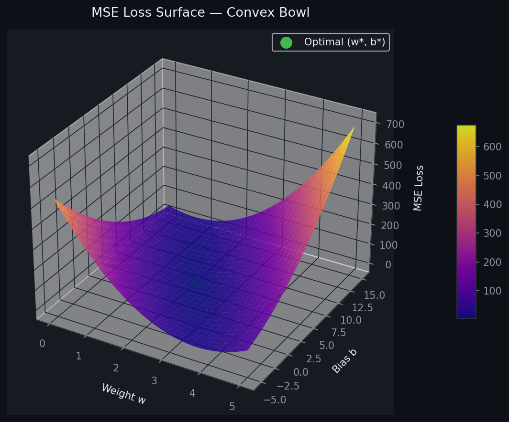
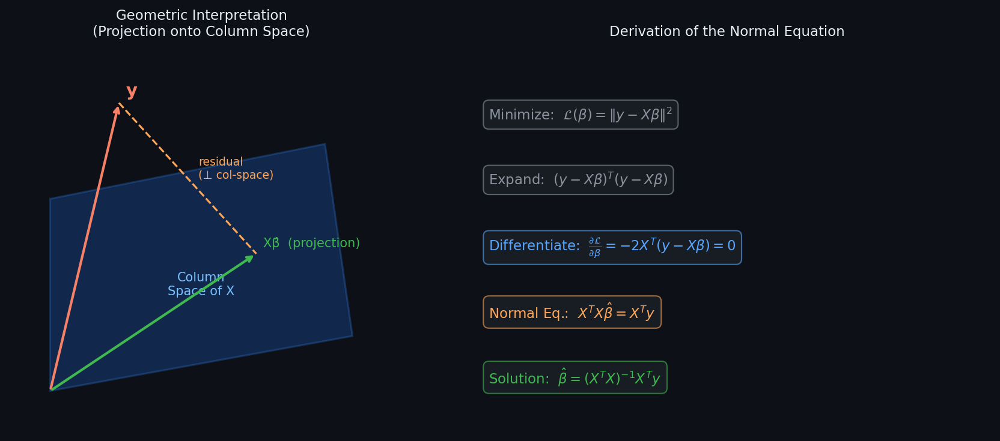
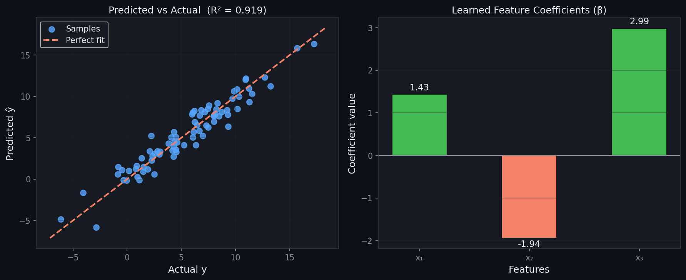
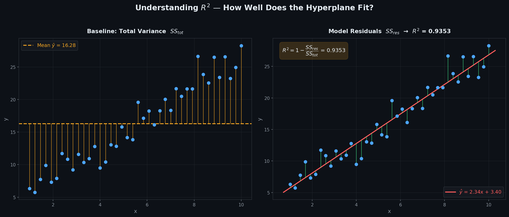

# Multiple Linear Regression — Closed-Form Solution

> A clean, **NumPy-only** implementation of Multiple Linear Regression using the  
> **Ordinary Least Squares (OLS) closed-form solution — Normal Equation**.  
> Fits a hyperplane through $(X, y)$ data by minimising Mean Squared Error —  
> **no iterations, no learning rate, exact answer in one step.**

---

## Table of Contents

1. [What is Multiple Linear Regression?](#1-what-is-multiple-linear-regression)
2. [The Model](#2-the-model)
3. [Cost Function — MSE](#3-cost-function--mse)
4. [Closed-Form Solution — Normal Equation](#4-closed-form-solution--normal-equation)
5. [Geometric Intuition](#5-geometric-intuition)
6. [Best-Fit Hyperplane & Residuals](#6-best-fit-hyperplane--residuals)
7. [MSE Loss Surface](#7-mse-loss-surface)
8. [Derivation Pipeline](#8-derivation-pipeline)
9. [Regression Diagnostics](#9-regression-diagnostics)
10. [Predicted vs Actual](#10-predicted-vs-actual)
11. [Understanding R²](#11-understanding-r)
12. [Usage](#12-usage)
13. [Assumptions](#13-assumptions)

---

## 1. What is Multiple Linear Regression?

Multiple Linear Regression models the **linear relationship between multiple inputs $\mathbf{x}$ and one output $y$**.

Given $n$ observations $(\mathbf{x}_1, y_1), \ldots, (\mathbf{x}_n, y_n)$, it finds the hyperplane:

$$\hat{y} = w_1 x_1 + w_2 x_2 + \cdots + w_p x_p + b$$

| Symbol | Name | Meaning |
|--------|------|---------|
| $w_j$ | Weight / Slope | Change in $\hat{y}$ per unit increase in $x_j$, holding others fixed |
| $b$ | Intercept | Value of $\hat{y}$ when all $x_j = 0$ |
| $\hat{y}$ | Prediction | Model output for a given $\mathbf{x}$ |
| $e_i = y_i - \hat{y}_i$ | Residual | Error for sample $i$ |

---

## 2. The Model

For $n$ samples and $p$ features, the prediction for sample $i$ is:

$$\hat{y}_i = w_1 x_{i1} + w_2 x_{i2} + \cdots + w_p x_{ip} + b$$

In matrix form — after prepending a column of 1s to absorb the bias $b$:

$$\hat{\mathbf{y}} = \mathbf{X}\boldsymbol{\hat{\beta}}, \qquad \mathbf{X} \in \mathbb{R}^{n \times (p+1)},\quad \boldsymbol{\hat{\beta}} \in \mathbb{R}^{p+1}$$

where $\boldsymbol{\hat{\beta}} = [b,\ w_1,\ w_2,\ \ldots,\ w_p]^T$.

> Unlike Simple Linear Regression — $w$ is now a **vector**, $\mathbf{X}$ is a **matrix**, and the solution requires a matrix inversion instead of scalar arithmetic. No `np.linalg.inv` risk if you use the SVD fallback.

---

## 3. Cost Function — MSE

We minimise the **Mean Squared Error** — the average squared gap between predictions and true values:

$$\mathcal{L}(\boldsymbol{\beta}) = \frac{1}{n}\|\mathbf{y} - \mathbf{X}\boldsymbol{\beta}\|^2 = \frac{1}{n}\sum_{i=1}^{n}(y_i - \hat{y}_i)^2$$

The MSE surface over all weights is a **convex paraboloid** — it has exactly **one global minimum**, which the closed-form formula reaches directly.

---

## 4. Closed-Form Solution — Normal Equation

Setting $\dfrac{\partial \mathcal{L}}{\partial \boldsymbol{\beta}} = 0$ and solving analytically:

| Step | Expression |
|------|-----------|
| **Expand** | $\mathcal{L} = (\mathbf{y} - \mathbf{X}\boldsymbol{\beta})^T(\mathbf{y} - \mathbf{X}\boldsymbol{\beta})$ |
| **Differentiate** | $\dfrac{\partial \mathcal{L}}{\partial \boldsymbol{\beta}} = -2\mathbf{X}^T(\mathbf{y} - \mathbf{X}\boldsymbol{\beta})$ |
| **Set to zero** | $\mathbf{X}^T\mathbf{X}\,\boldsymbol{\hat{\beta}} = \mathbf{X}^T\mathbf{y}$ |
| **Solve** | $\boxed{\boldsymbol{\hat{\beta}} = (\mathbf{X}^T\mathbf{X})^{-1}\mathbf{X}^T\mathbf{y}}$ |

This is the **Normal Equation** — the OLS closed-form solution, proven to be the **Best Linear Unbiased Estimator (BLUE)** under the Gauss-Markov theorem.

**Intercept** is recovered automatically since the 1s column was prepended:

$$\boldsymbol{\hat{\beta}} = [b,\ w_1,\ w_2,\ \ldots,\ w_p]^T$$

Key fact: the best-fit hyperplane always passes through the centroid $(\bar{x}_1, \bar{x}_2, \ldots, \bar{x}_p,\ \bar{y})$.

---

## 5. Geometric Intuition

The Normal Equation has a clean geometric meaning:

- $\mathbf{y}$ lives in $\mathbb{R}^n$ — one dimension per sample.
- The column space of $\mathbf{X}$ is a $p$-dimensional subspace.
- $\hat{\mathbf{y}} = \mathbf{X}\boldsymbol{\hat{\beta}}$ is the point in that subspace **closest** to $\mathbf{y}$.
- "Closest" means the residual $\mathbf{y} - \hat{\mathbf{y}}$ is **perpendicular** to every column of $\mathbf{X}$ — giving exactly $\mathbf{X}^T(\mathbf{y} - \mathbf{X}\boldsymbol{\hat{\beta}}) = \mathbf{0}$, i.e., the Normal Equation.

---

## 6. Best-Fit Hyperplane & Residuals


| Visual Element | Meaning |
|----------------|---------|
| Blue dots | Observed data points $(x_i,\ y_i)$ |
| Red line | Fitted line $\hat{y} = \mathbf{X}\boldsymbol{\hat{\beta}}$ (single-feature view) |
| Green bars | Residuals $e_i = y_i - \hat{y}_i$ |

A good fit shows residuals that are **small, symmetric, and randomly scattered** with no obvious pattern.

---

## 7. MSE Loss Surface



The loss surface shows MSE as a function of weight $w$ and bias $b$.

- The surface is a **smooth convex bowl** — one global minimum guaranteed.
- The **green dot** marks the exact $(w^*, b^*)$ reached by the Normal Equation.
- No iterative path needed — we jump directly to the minimum.

---

## 8. Derivation Pipeline



The five-step pipeline from raw data to prediction:

| Step | Operation | Formula |
|------|-----------|---------|
| ① | Expand loss | $\mathcal{L} = (\mathbf{y} - \mathbf{X}\boldsymbol{\beta})^T(\mathbf{y} - \mathbf{X}\boldsymbol{\beta})$ |
| ② | Differentiate | $\partial\mathcal{L}/\partial\boldsymbol{\beta} = -2\mathbf{X}^T(\mathbf{y} - \mathbf{X}\boldsymbol{\beta})$ |
| ③ | Set to zero | $\mathbf{X}^T\mathbf{X}\boldsymbol{\hat{\beta}} = \mathbf{X}^T\mathbf{y}$ |
| ④ | Invert | $\boldsymbol{\hat{\beta}} = (\mathbf{X}^T\mathbf{X})^{-1}\mathbf{X}^T\mathbf{y}$ |
| ⑤ | Predict | $\hat{\mathbf{y}} = \mathbf{X}\boldsymbol{\hat{\beta}}$ |

---

## 9. Regression Diagnostics

After fitting, verify the four core OLS assumptions visually:


| Plot | What to look for | Assumption verified |
|------|-----------------|---------------------|
| **Residuals vs Fitted** | Random scatter around $y=0$, no curve | Linearity |
| **Normal Q-Q** | Points on the diagonal line | Normality of residuals |
| **Scale-Location** | Flat, uniform band — no funnel | Homoscedasticity |
| **Residual Histogram** | Bell-shaped, centred at 0 | Normality |

**Red flags:**
- Curve in *Residuals vs Fitted* → relationship is non-linear; try transforming features
- Funnel shape in *Scale-Location* → variance not constant; try log($y$)
- Heavy tails in Q-Q → residuals not normal; consider robust regression

---

## 10. Predicted vs Actual



**Left panel:** each point is one sample — actual $y$ on x-axis, predicted $\hat{y}$ on y-axis.
- Points hugging the **red dashed diagonal** = accurate predictions.
- Systematic deviation above/below = model bias.

**Right panel:** learned $\hat{\beta}$ values — green bars are positive weights, red bars are negative. Magnitude shows how much each feature moves the prediction per unit increase.

**Model summary:**

| Metric | Meaning |
|--------|---------|
| $R^2$ | Proportion of variance in $y$ explained by the model |
| MSE | Mean squared error — average squared residual |
| RMSE | Root MSE — same units as $y$ |
| $\boldsymbol{\hat{\beta}}$ | Learned weights $[b, w_1, w_2, \ldots, w_p]$ |

---

## 11. Understanding R²

$$R^2 = 1 - \frac{SS_{res}}{SS_{tot}} = 1 - \frac{\sum(y_i - \hat{y}_i)^2}{\sum(y_i - \bar{y})^2}$$



| Panel | Shows | Represents |
|-------|-------|-----------|
| **Left** — amber bars | Deviation from the mean $\bar{y}$ | $SS_{tot}$ — total variance in $y$ |
| **Right** — green bars | Deviation from the fitted line | $SS_{res}$ — unexplained variance |

| $R^2$ value | Meaning |
|------------|---------|
| $= 1.0$ | Perfect fit — model explains all variance |
| $\approx 0.9$ | Strong fit — 90% of variance explained |
| $= 0.0$ | Model no better than predicting $\bar{y}$ |
| $< 0$ | Model is worse than the mean baseline |

> **MLR note:** $R^2$ always increases when you add more features — even useless ones. Use **Adjusted R²** to penalise unnecessary features:
> $$\bar{R}^2 = 1 - \frac{(1 - R^2)(n-1)}{n - p - 1}$$

**When is $(X^TX)^{-1}$ valid?**

| Condition | Effect | Fix |
|-----------|--------|-----|
| $n > p$, no collinearity | Invertible, unique solution | — |
| Perfect multicollinearity | Singular, no inverse | Remove duplicate feature |
| $n < p$ | Rank-deficient | Add $\lambda\mathbf{I}$ — Ridge Regression |

---

## 12. Usage

### Basic fit and predict

```python
import numpy as np
from LinearRegression import LinearRegression

X_train = np.array([[1], [2], [3], [4], [5]], dtype=float)
y_train = np.array([2.1, 3.9, 6.2, 7.8, 10.1])

model = LinearRegression()
model.fit(X_train, y_train)

print(f"Intercept (b) : {model.intercept_:.4f}")
print(f"Weights   (w) : {model.coef_}")
print(model)

X_test = np.array([[6], [7], [8]], dtype=float)
y_test = np.array([12.0, 13.8, 16.1])
y_pred = model.predict(X_test)

print(f"Predictions   : {y_pred}")
print(f"R²            : {model.score(X_test, y_test):.4f}")
```

**Multi-feature example:**

```python
X_multi = np.random.randn(100, 3)
y_multi = X_multi @ np.array([1.5, -2.0, 3.0]) + 5.0 + np.random.randn(100)

model.fit(X_multi, y_multi)
predictions = model.predict(X_multi)
print(f"R² = {model.score(X_multi, y_multi):.4f}")
print(model)
```

**No-intercept mode:**

```python
model = LinearRegression(fit_intercept=False)
model.fit(X_train, y_train)
```

---

## 13. Assumptions

| # | Assumption | How to check |
|---|-----------|--------------|
| 1 | **Linearity** — true relationship is $y = \mathbf{X}\boldsymbol{\beta} + \varepsilon$ | Residuals vs Fitted plot |
| 2 | **No perfect multicollinearity** — $\text{rank}(\mathbf{X}) = p+1$ | Correlation matrix, VIF |
| 3 | **Zero-mean errors** — $\mathbb{E}[\varepsilon] = 0$ | Residual histogram centred at 0 |
| 4 | **Homoscedasticity** — $\text{Var}(\varepsilon_i) = \sigma^2$ constant | Scale-Location plot |
| 5 | **Independent errors** — $\text{Cov}(\varepsilon_i, \varepsilon_j) = 0$ | Durbin-Watson test |
| 6 | *(Inference only)* **Normality** — $\varepsilon \sim \mathcal{N}(0, \sigma^2)$ | Normal Q-Q plot |

> **Feature scaling is NOT required** — the closed-form OLS solution is scale-invariant.

---

## Dependencies

```
numpy >= 1.21
matplotlib >= 3.4   # optional — for plotting only
scipy >= 1.7        # optional — for Q-Q diagnostics
```

---

## License

MIT