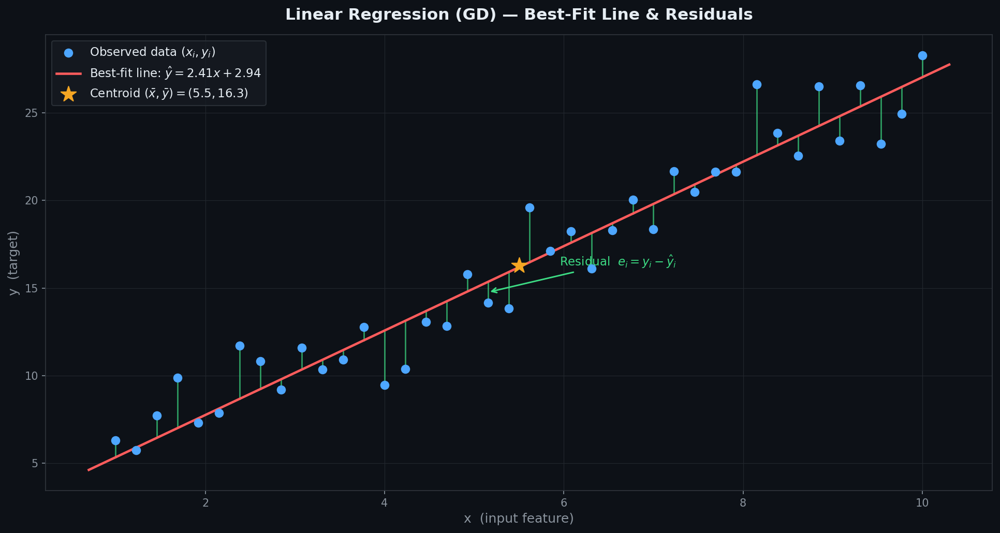
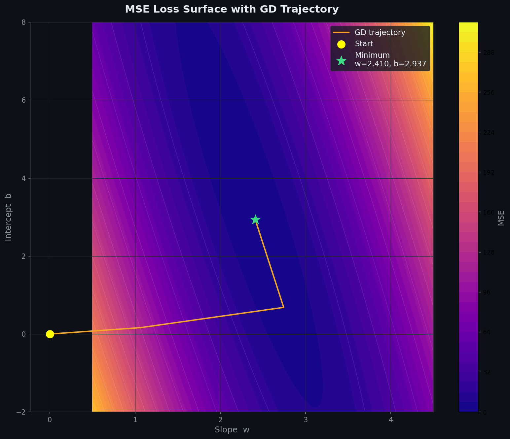
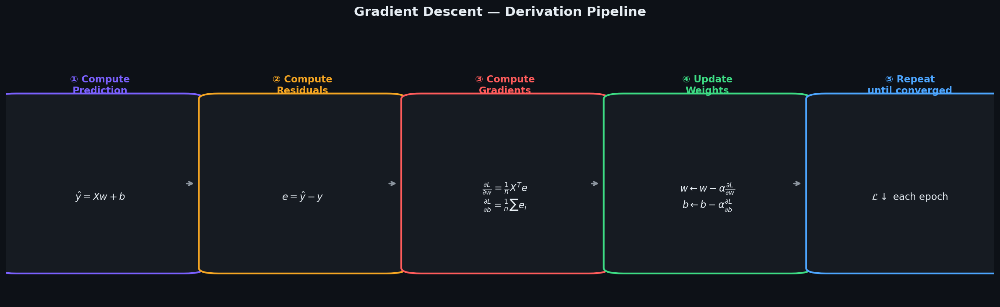
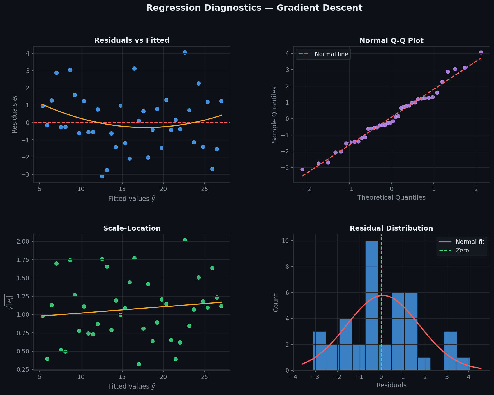
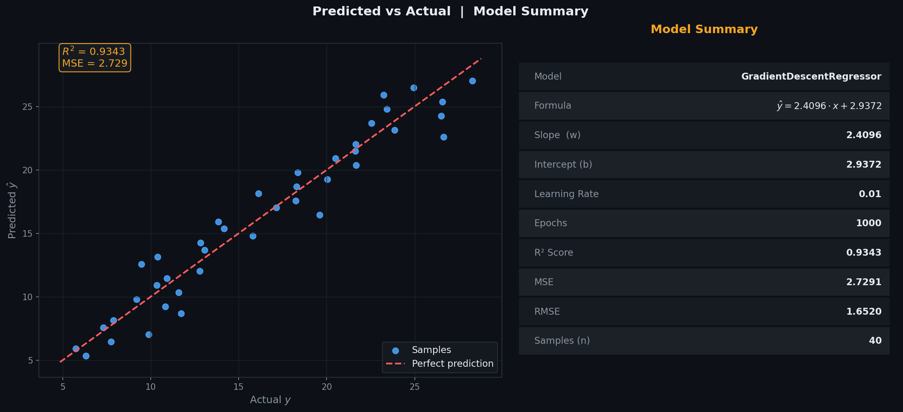
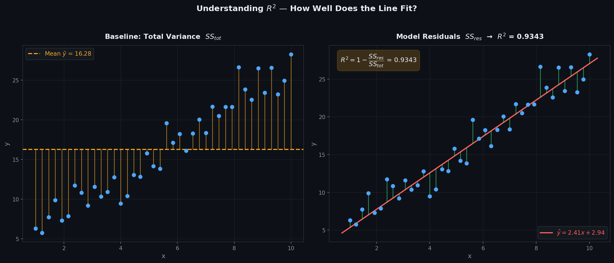

# Linear Regression — Gradient Descent

> A clean, **NumPy-only** implementation of Linear Regression trained via **Batch Gradient Descent**.  
> No closed-form inversion — iteratively nudges weights $\mathbf{w}$ and bias $b$ down the loss surface until convergence.  
> **Same model as the Normal Equation, different solver — iterative, scalable, explicit.**

---

## Table of Contents

1. [What is Gradient Descent?](#1-what-is-gradient-descent)
2. [The Model](#2-the-model)
3. [Cost Function — MSE](#3-cost-function--mse)
4. [Deriving the Gradients](#4-deriving-the-gradients)
5. [Geometric Intuition](#5-geometric-intuition)
6. [Best-Fit Line & Residuals](#6-best-fit-line--residuals)
7. [MSE Loss Surface & GD Trajectory](#7-mse-loss-surface--gd-trajectory)
8. [Derivation Pipeline](#8-derivation-pipeline)
9. [Regression Diagnostics](#9-regression-diagnostics)
10. [Predicted vs Actual](#10-predicted-vs-actual)
11. [Understanding R²](#11-understanding-r)
12. [Usage](#12-usage)
13. [Assumptions](#13-assumptions)

---

## 1. What is Gradient Descent?

Gradient Descent is an iterative optimisation algorithm that finds the minimum of a loss function by repeatedly stepping in the **direction of steepest descent** — the negative gradient.

Given $n$ observations $(\mathbf{x}_1, y_1), \ldots, (\mathbf{x}_n, y_n)$, it finds the line:

$$\hat{y} = w_1 x_1 + w_2 x_2 + \cdots + w_p x_p + b$$

| Symbol | Name | Meaning |
|--------|------|---------|
| $w_j$ | Weight | Change in $\hat{y}$ per unit increase in $x_j$ |
| $b$ | Bias / Intercept | Value of $\hat{y}$ when all $x_j = 0$ |
| $\hat{y}$ | Prediction | Model output for a given $\mathbf{x}$ |
| $e_i = \hat{y}_i - y_i$ | Residual | Signed error for sample $i$ |
| $\alpha$ | Learning rate | Step size at each iteration |

---

## 2. The Model

For $n$ samples and $p$ features the prediction is:

$$\hat{y}_i = w_1 x_{i1} + w_2 x_{i2} + \cdots + w_p x_{ip} + b$$

In matrix form:

$$\hat{\mathbf{y}} = \mathbf{X}\mathbf{w} + b, \qquad \mathbf{X} \in \mathbb{R}^{n \times p},\quad \mathbf{w} \in \mathbb{R}^{p},\quad b \in \mathbb{R}$$

> Unlike the Normal Equation — $\mathbf{w}$ and $b$ are kept **separate** (no prepended 1s column). They are updated independently each epoch via their own gradients.

---

## 3. Cost Function — MSE

We minimise the **Mean Squared Error** over all $n$ training samples:

$$\mathcal{L}(\mathbf{w}, b) = \frac{1}{n}\sum_{i=1}^{n}(\hat{y}_i - y_i)^2 = \frac{1}{n}\|\hat{\mathbf{y}} - \mathbf{y}\|^2$$

The MSE surface is a **convex bowl** — one global minimum, guaranteed convergence for a small enough learning rate $\alpha$.

---

## 4. Deriving the Gradients

Taking partial derivatives of $\mathcal{L}$ with respect to $\mathbf{w}$ and $b$:

**Gradient w.r.t weights $\mathbf{w}$:**

$$\frac{\partial \mathcal{L}}{\partial \mathbf{w}} = \frac{1}{n}\mathbf{X}^T(\hat{\mathbf{y}} - \mathbf{y})$$

**Gradient w.r.t bias $b$:**

$$\frac{\partial \mathcal{L}}{\partial b} = \frac{1}{n}\sum_{i=1}^{n}(\hat{y}_i - y_i)$$

**Update rule — simultaneously update $\mathbf{w}$ and $b$ each epoch:**

$$\mathbf{w} \leftarrow \mathbf{w} - \alpha \cdot \frac{\partial \mathcal{L}}{\partial \mathbf{w}}, \qquad b \leftarrow b - \alpha \cdot \frac{\partial \mathcal{L}}{\partial b}$$

where $\alpha$ is the **learning rate** — the step size controlling how far we move each iteration.

---

## 5. Geometric Intuition

- The loss surface is a **convex bowl** over all possible $(w, b)$ values.
- At each epoch, we compute the gradient — the direction of steepest ascent — and step **opposite** to it.
- Large gradients early on → big steps. Small gradients near the minimum → tiny steps.
- The algorithm converges when gradients become close to zero — we've found the bottom of the bowl.

Key difference from the Normal Equation: instead of jumping directly to the minimum, gradient descent **walks** there step by step — slower but memory-efficient and always applicable.

---

## 6. Best-Fit Line & Residuals



| Visual Element | Meaning |
|----------------|---------|
| Blue dots | Observed data points $(x_i,\ y_i)$ |
| Red line | Fitted line $\hat{y} = \mathbf{w} \cdot x + b$ after convergence |
| Green bars | Residuals $e_i = y_i - \hat{y}_i$ |
| Amber star | Centroid $(\bar{x},\ \bar{y})$ — the line always passes through here |

A good fit shows residuals that are **small, symmetric, and randomly scattered** with no obvious pattern.

---

## 7. MSE Loss Surface & GD Trajectory



The contour map shows MSE as a function of slope $w$ and intercept $b$.

- The surface is a **smooth convex bowl** — one global minimum guaranteed.
- The **amber path** is the gradient descent trajectory — stepping from the yellow start toward the green minimum.
- The **green star** marks the converged $(w^*, b^*)$.

> Compare this to the Normal Equation (MLR closed-form) which jumps directly to the green star in one step.

---

## 8. Derivation Pipeline



The five-step loop that runs every epoch:

| Step | Operation | Formula |
|------|-----------|---------|
| ① | Forward pass | $\hat{\mathbf{y}} = \mathbf{X}\mathbf{w} + b$ |
| ② | Compute residuals | $e = \hat{\mathbf{y}} - \mathbf{y}$ |
| ③ | Compute gradients | $\partial L/\partial \mathbf{w} = \frac{1}{n}\mathbf{X}^T e$,  $\quad\partial L/\partial b = \frac{1}{n}\sum e_i$ |
| ④ | Update weights | $\mathbf{w} \leftarrow \mathbf{w} - \alpha \cdot \partial L/\partial \mathbf{w}$,  $\quad b \leftarrow b - \alpha \cdot \partial L/\partial b$ |
| ⑤ | Repeat | Until MSE stops decreasing — convergence |

---

## 9. Regression Diagnostics

After fitting, verify the four core assumptions visually:



| Plot | What to look for | Assumption verified |
|------|-----------------|---------------------|
| **Residuals vs Fitted** | Random scatter around $y=0$, no curve | Linearity |
| **Normal Q-Q** | Points on the diagonal line | Normality of residuals |
| **Scale-Location** | Flat, uniform band — no funnel | Homoscedasticity |
| **Residual Histogram** | Bell-shaped, centred at 0 | Normality |

**Red flags:**
- Curve in *Residuals vs Fitted* → relationship is non-linear; try feature transformation
- Funnel shape in *Scale-Location* → variance not constant; try log($y$)
- Heavy tails in Q-Q → residuals not normal; consider robust regression

---

## 10. Predicted vs Actual



**Left panel:** each point is one sample — actual $y$ on x-axis, predicted $\hat{y}$ on y-axis.
- Points hugging the **red dashed diagonal** = accurate predictions.
- Systematic deviation above/below = model bias.

**Right panel:** model summary card showing learned $w$, $b$, learning rate, epochs, $R^2$, MSE, and RMSE at a glance.

---

## 11. Understanding R²

$$R^2 = 1 - \frac{SS_{res}}{SS_{tot}} = 1 - \frac{\sum(y_i - \hat{y}_i)^2}{\sum(y_i - \bar{y})^2}$$



| Panel | Shows | Represents |
|-------|-------|-----------|
| Left — amber bars | Deviation from the mean $\bar{y}$ | $SS_{tot}$ — total variance in $y$ |
| Right — green bars | Deviation from the fitted line | $SS_{res}$ — unexplained variance |

| $R^2$ value | Meaning |
|------------|---------|
| $= 1.0$ | Perfect fit — model explains all variance |
| $\approx 0.9$ | Strong fit — 90% of variance explained |
| $= 0.0$ | Model no better than predicting $\bar{y}$ |
| $< 0$ | Model is worse than the mean baseline |

---

## 12. Usage

### Basic fit and predict

```python
import numpy as np
from GradientDescentRegressor import GradientDescentRegressor

X_train = np.array([[1], [2], [3], [4], [5]], dtype=float)
y_train = np.array([2.1, 3.9, 6.2, 7.8, 10.1])

model = GradientDescentRegressor(learning_rate=0.01, epochs=1000)
model.fit(X_train, y_train)

print(f"Intercept (b) : {model.intercept_:.4f}")
print(f"Weights   (w) : {model.coef_}")
print(model)

X_test = np.array([[6], [7], [8]], dtype=float)
y_test = np.array([12.0, 13.8, 16.1])
y_pred = model.predict(X_test)

print(f"Predictions   : {y_pred}")
print(f"R²            : {model.score(X_test, y_test):.4f}")
```

### Plot the loss curve

```python
import matplotlib.pyplot as plt

plt.plot(model.loss_history_)
plt.xlabel("Epoch")
plt.ylabel("MSE")
plt.title("Loss Curve — MSE over Epochs")
plt.show()
```

### Multi-feature example

```python
X_multi = np.random.randn(100, 3)
y_multi = X_multi @ np.array([1.5, -2.0, 3.0]) + 5.0 + np.random.randn(100)

model = GradientDescentRegressor(learning_rate=0.01, epochs=2000)
model.fit(X_multi, y_multi)

print(f"R² = {model.score(X_multi, y_multi):.4f}")
print(model)
```

---

## 13. Assumptions

| # | Assumption | How to check |
|---|-----------|--------------|
| 1 | **Linearity** — true relationship is $y = \mathbf{X}\mathbf{w} + b + \varepsilon$ | Residuals vs Fitted plot |
| 2 | **Zero-mean errors** — $\mathbb{E}[\varepsilon] = 0$ | Residual histogram centred at 0 |
| 3 | **Homoscedasticity** — $\text{Var}(\varepsilon_i) = \sigma^2$ constant | Scale-Location plot |
| 4 | **Independent errors** — $\text{Cov}(\varepsilon_i, \varepsilon_j) = 0$ | Durbin-Watson test |
| 5 | **Normality** *(inference only)* — $\varepsilon \sim \mathcal{N}(0, \sigma^2)$ | Normal Q-Q plot |

> **Feature scaling IS recommended** — gradient descent converges faster when features are on the same scale. Use `StandardScaler` or normalise manually before fitting.

---

## Dependencies

```
numpy >= 1.21
matplotlib >= 3.4   # optional — for plotting and loss curve only
scipy >= 1.7        # optional — for Q-Q diagnostics
```

---

## License

MIT
