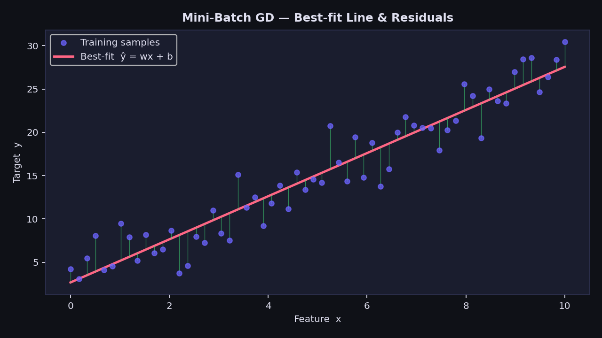
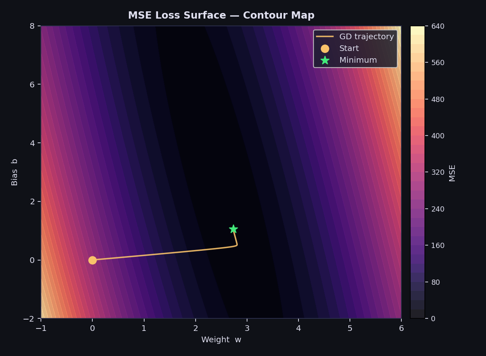
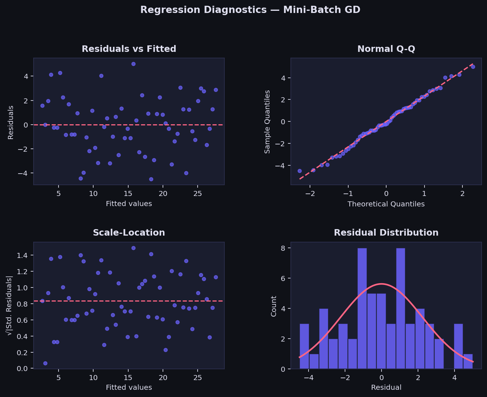
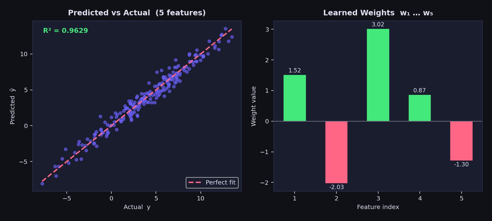

# Linear Regression — Mini-Batch Gradient Descent

> A clean, **NumPy-only** implementation of Linear Regression trained via **Mini-Batch Gradient Descent**.  
> Splits training data into small random batches each epoch and updates parameters once per batch —  
> **balancing the stability of Batch GD with the speed of Stochastic GD.**

---

## Table of Contents

1. [What is Mini-Batch Gradient Descent?](#1-what-is-mini-batch-gradient-descent)
2. [The Model](#2-the-model)
3. [Cost Function — MSE](#3-cost-function--mse)
4. [Deriving the Gradients](#4-deriving-the-gradients)
5. [Geometric Intuition](#5-geometric-intuition)
6. [Best-Fit Line & Residuals](#6-best-fit-line--residuals)
7. [MSE Loss Surface & Trajectory](#7-mse-loss-surface--trajectory)
8. [Derivation Pipeline](#8-derivation-pipeline)
9. [Regression Diagnostics](#9-regression-diagnostics)
10. [Predicted vs Actual](#10-predicted-vs-actual)
11. [Loss Curve](#11-loss-curve)
12. [3-D Weight Convergence](#12-3-d-weight-convergence)
13. [Usage](#13-usage)
14. [Assumptions](#14-assumptions)

---

## 1. What is Mini-Batch Gradient Descent?

Mini-Batch Gradient Descent (MBGD) is an iterative optimisation algorithm that updates model parameters by stepping in the **direction of steepest descent** — computed on a small random subset (a *mini-batch*) of training data each step.

Given $n$ observations $(\mathbf{x}_1, y_1), \ldots, (\mathbf{x}_n, y_n)$, it finds the hyperplane:

$$\hat{y} = w_1 x_1 + w_2 x_2 + \cdots + w_p x_p + b$$

| Symbol | Name | Meaning |
|--------|------|---------|
| $w_j$ | Weight | Change in $\hat{y}$ per unit increase in $x_j$ |
| $b$ | Bias / Intercept | Value of $\hat{y}$ when all $x_j = 0$ |
| $\hat{y}$ | Prediction | Model output for a given $\mathbf{x}$ |
| $e_i = \hat{y}_i - y_i$ | Residual | Signed error for sample $i$ |
| $\alpha$ | Learning rate | Step size per parameter update |
| $B$ | Batch size | Number of samples per mini-batch |

Each training epoch proceeds as:

1. **Shuffle** the dataset randomly — eliminates ordering bias.
2. **Partition** into mini-batches of size $B$.
3. **For each batch**, compute gradient and update $\mathbf{w}$ and $b$.

This gives $\lceil m/B \rceil$ updates per epoch — far more than Batch GD (1 update) while still less noisy than pure SGD ($m$ updates with $B=1$).

---

## 2. The Model

For $n$ samples and $p$ features the prediction is:

$$\hat{y}_i = w_1 x_{i1} + w_2 x_{i2} + \cdots + w_p x_{ip} + b$$

In matrix form over a mini-batch $\mathbf{X}_b \in \mathbb{R}^{B \times p}$:

$$\hat{\mathbf{y}}_b = \mathbf{X}_b\,\mathbf{w} + b, \qquad \mathbf{w} \in \mathbb{R}^{p},\quad b \in \mathbb{R}$$

> Unlike the Normal Equation — $\mathbf{w}$ and $b$ are updated iteratively one batch at a time. The shuffle at every epoch ensures no batch ordering dominates learning.

---

## 3. Cost Function — MSE

We minimise the **Mean Squared Error** computed over each mini-batch of size $B$:

$$\mathcal{L}(\mathbf{w}, b) = \frac{1}{B}\sum_{i=1}^{B}(\hat{y}_i - y_i)^2 = \frac{1}{B}\|\hat{\mathbf{y}}_b - \mathbf{y}_b\|^2$$

The full-epoch loss stored in `loss_history_` is evaluated over all $m$ samples after each epoch:

$$\mathcal{L}_{\text{epoch}} = \frac{1}{m}\|\mathbf{X}\mathbf{w} + b - \mathbf{y}\|^2$$

The MSE surface is **convex** — one global minimum exists, convergence is guaranteed for a sufficiently small learning rate.

---

## 4. Deriving the Gradients

Taking partial derivatives of the batch MSE with respect to $\mathbf{w}$ and $b$:

**Gradient w.r.t weights $\mathbf{w}$:**

$$\frac{\partial \mathcal{L}}{\partial \mathbf{w}} = \frac{1}{B}\mathbf{X}_b^T(\hat{\mathbf{y}}_b - \mathbf{y}_b)$$

**Gradient w.r.t bias $b$:**

$$\frac{\partial \mathcal{L}}{\partial b} = \frac{1}{B}\sum_{i=1}^{B}(\hat{y}_i - y_i)$$

**Update rule — applied once per mini-batch:**

$$\mathbf{w} \leftarrow \mathbf{w} - \alpha \cdot \frac{\partial \mathcal{L}}{\partial \mathbf{w}}, \qquad b \leftarrow b - \alpha \cdot \frac{\partial \mathcal{L}}{\partial b}$$

where $\alpha$ is the **learning rate**.

---

## 5. Geometric Intuition

- The loss surface is a **convex bowl** over all possible $(\mathbf{w}, b)$ — one global minimum guaranteed.
- Batch GD computes the exact gradient each step → smooth, direct path to the minimum.
- Mini-Batch GD computes an approximate gradient on $B$ samples → noisier path but more updates per epoch.
- The noise from mini-batches can actually help in non-convex settings (deep learning) by escaping shallow local minima.
- Shuffling at every epoch ensures every mini-batch is a fresh random sample — removing ordering bias that would otherwise skew gradients.

---

## 6. Best-Fit Line & Residuals



| Visual Element | Meaning |
|----------------|---------|
| Blue dots | Observed data points $(x_i,\ y_i)$ |
| Red line | Best-fit line $\hat{y} = \mathbf{w} \cdot x + b$ after convergence |
| Green bars | Residuals $e_i = y_i - \hat{y}_i$ |

A good fit shows residuals that are **small, symmetric, and randomly scattered** with no obvious pattern.

---

## 7. MSE Loss Surface & Trajectory



The contour map shows MSE as a function of slope $w$ and bias $b$.

- The surface is a **smooth convex bowl** — one global minimum guaranteed.
- The **amber path** is the parameter trajectory stepping from the yellow start toward the green minimum.
- Compared to Batch GD, the MBGD path has slight zig-zag — this is the batch noise in action.

---

## 8. Derivation Pipeline


The five-step loop that runs for every mini-batch inside every epoch:

| Step | Operation | Formula |
|------|-----------|---------|
| ① | Forward pass | $\hat{y} = \mathbf{X}_b\mathbf{w} + b$ |
| ② | Residuals | $\varepsilon = \hat{y} - y$ |
| ③ | Gradient (b) | $\nabla_b = \frac{1}{B}\sum \varepsilon_i$ |
| ④ | Gradient (w) | $\nabla_w = \frac{\mathbf{X}_b^T \varepsilon}{B}$ |
| ⑤ | Update rule | $\mathbf{w} \leftarrow \mathbf{w} - \alpha\nabla_w$, $\quad b \leftarrow b - \alpha\nabla_b$ |

---

## 9. Regression Diagnostics

After fitting, verify the four core assumptions visually:



| Plot | What to look for | Assumption verified |
|------|-----------------|---------------------|
| **Residuals vs Fitted** | Random scatter around $y=0$, no curve | Linearity |
| **Normal Q-Q** | Points on the diagonal line | Normality of residuals |
| **Scale-Location** | Flat, uniform band — no funnel | Homoscedasticity |
| **Residual Histogram** | Bell-shaped, centred at 0 | Normality |

**Red flags:**
- Curve in *Residuals vs Fitted* → relationship is non-linear; try feature transformation
- Funnel shape in *Scale-Location* → variance not constant; try log($y$)
- Heavy tails in Q-Q → residuals not normal; consider robust regression

---

## 10. Predicted vs Actual



**Left panel:** each point is one sample — actual $y$ on x-axis, predicted $\hat{y}$ on y-axis.
- Points hugging the **red dashed diagonal** = accurate predictions.
- Systematic deviation above/below = model bias.

**Right panel:** learned weights $\mathbf{w}$ — green bars are positive, pink bars are negative. Magnitude shows how strongly each feature influences the prediction.

**Model summary:**

| Metric | Meaning |
|--------|---------|
| $R^2$ | Proportion of variance in $y$ explained by the model |
| MSE | Mean squared error — average squared residual |
| RMSE | Root MSE — same units as $y$ |
| `batch_size` | Mini-batch size used during training |

---

## 11. Loss Curve

`loss_history_` stores the full-dataset MSE at the end of every epoch. Always plot it to confirm convergence.


- **Sharp initial drop** — large gradients correct zero initialisation quickly.
- **Smooth flattening** — weights settle near the minimum, gradients become tiny.
- The green dashed line marks the minimum MSE achieved.

If the curve oscillates → reduce `learning_rate`. If it plateaus too early → increase `epochs` or reduce `batch_size`.

---

## 12. 3-D Weight Convergence


The amber path traces two weights $(w_1, w_2)$ descending the 3-D MSE surface from the start (circle) to the converged minimum (green star).

| Observation | Interpretation |
|-------------|---------------|
| Smooth, direct descent | `learning_rate` may be too small — Batch GD-like behaviour |
| Erratic, diverging path | `learning_rate` too large — reduce it |
| Gradual spiral to minimum | Healthy MBGD convergence |
| Path stalls at plateau | Reduce `batch_size` for noisier, more exploratory updates |

---

## 13. Usage

### Basic fit and predict

```python
import numpy as np
from MBGDRegressor import MBGDRegressor

X_train = np.array([[1], [2], [3], [4], [5]], dtype=float)
y_train = np.array([2.1, 3.9, 6.2, 7.8, 10.1])

model = MBGDRegressor(batch_size=2, learning_rate=0.01,
                      epochs=1000, random_state=42)
model.fit(X_train, y_train)

print(f"Intercept (b) : {model.intercept_:.4f}")
print(f"Weights   (w) : {model.coef_}")
print(model)

X_test = np.array([[6], [7], [8]], dtype=float)
y_test = np.array([12.0, 13.8, 16.1])
y_pred = model.predict(X_test)

print(f"Predictions   : {y_pred}")
print(f"R²            : {model.score(X_test, y_test):.4f}")
```

### Plot loss curve

```python
import matplotlib.pyplot as plt

plt.plot(model.loss_history_)
plt.xlabel("Epoch")
plt.ylabel("MSE")
plt.title("MBGD — Loss Curve")
plt.show()
```

### Multi-feature example

```python
X_multi = np.random.randn(200, 5)
y_multi = X_multi @ np.array([1.5, -2.0, 3.0, 0.8, -1.3]) + np.random.randn(200)

model = MBGDRegressor(batch_size=32, learning_rate=0.01,
                      epochs=500, random_state=0)
model.fit(X_multi, y_multi)

print(f"R² = {model.score(X_multi, y_multi):.4f}")
print(model)
```

### Comparing Batch GD vs Mini-Batch GD

```python
from GradientDescentRegressor import GradientDescentRegressor

bgd  = GradientDescentRegressor(learning_rate=0.01, epochs=300)
mbgd = MBGDRegressor(batch_size=32, learning_rate=0.01, epochs=300, random_state=0)

bgd.fit(X_multi, y_multi)
mbgd.fit(X_multi, y_multi)

plt.plot(bgd.loss_history_,  label="Batch GD  — smooth")
plt.plot(mbgd.loss_history_, label="Mini-Batch GD — noisier, faster")
plt.legend()
plt.xlabel("Epoch")
plt.ylabel("MSE")
plt.show()
```

---

## 14. Assumptions

| # | Assumption | How to check |
|---|-----------|--------------|
| 1 | **Linearity** — true relationship is $y = \mathbf{X}\mathbf{w} + b + \varepsilon$ | Residuals vs Fitted plot |
| 2 | **Zero-mean errors** — $\mathbb{E}[\varepsilon] = 0$ | Residual histogram centred at 0 |
| 3 | **Homoscedasticity** — $\text{Var}(\varepsilon_i) = \sigma^2$ constant | Scale-Location plot |
| 4 | **Independent errors** — $\text{Cov}(\varepsilon_i, \varepsilon_j) = 0$ | Durbin-Watson test |
| 5 | **Normality** *(inference only)* — $\varepsilon \sim \mathcal{N}(0, \sigma^2)$ | Normal Q-Q plot |

> **Feature scaling is recommended** — MBGD converges significantly faster when features are on the same scale. Apply `StandardScaler` before fitting.

---

## Batch GD vs Mini-Batch GD vs Stochastic GD

| Criterion | Batch GD | Mini-Batch GD | Stochastic GD |
|-----------|---------|--------------|--------------|
| Gradient computed on | All $m$ samples | $B$ samples | 1 sample |
| Updates per epoch | 1 | $\lceil m/B \rceil$ | $m$ |
| Gradient noise | None — exact | Low to medium | High |
| Convergence path | Smooth, direct | Slightly noisy | Very noisy |
| Speed per epoch | Slow | Fast | Very fast |
| Memory usage | Full dataset | One batch | One sample |
| Vectorisation | Full | Full | Minimal |
| Escapes local minima | No | Partially | Yes — but unstable |
| Best for | Small datasets | Most cases | Online / streaming |

**Rule of thumb:** start with `batch_size=32` as the default. Scale up as dataset and hardware grow.

---

## Dependencies

```
numpy >= 1.21
matplotlib >= 3.4   # optional — for loss curve and plots only
scipy >= 1.7        # optional — for Q-Q diagnostics
```

---

## License

MIT