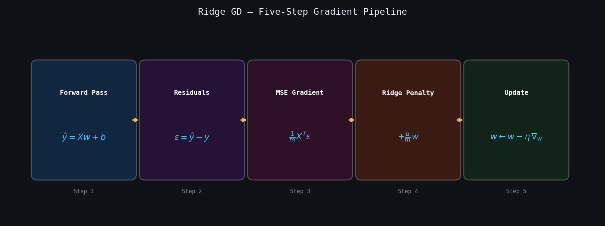
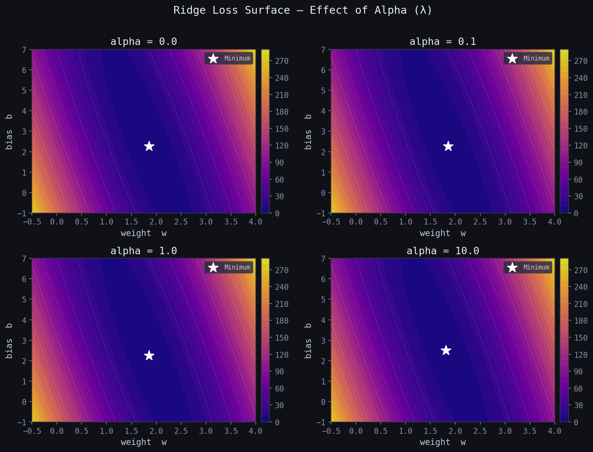
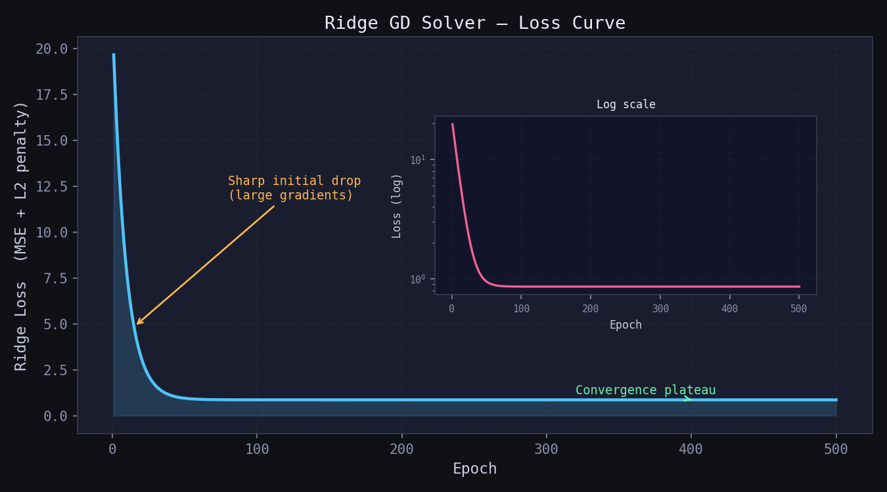

# Ridge Regression — L2-Regularised Linear Regression

> A clean, **NumPy-only** implementation of Ridge Regression supporting two solvers:  
> **Closed-form Normal Equation** (exact, instant) and **Gradient Descent** (iterative, scalable).  
> Ridge adds an **L2 penalty** on the weights to prevent overfitting and handle multicollinearity —  
> **same model as OLS, but with shrinkage applied to every weight.**

---

## Table of Contents

1. [What is Ridge Regression?](#1-what-is-ridge-regression)
2. [The Model](#2-the-model)
3. [Cost Function — Regularised MSE](#3-cost-function--regularised-mse)
4. [Closed-Form Solution](#4-closed-form-solution)
5. [Deriving the Gradients](#5-deriving-the-gradients)
6. [Geometric Intuition](#6-geometric-intuition)
7. [Best-Fit Line & Residuals](#7-best-fit-line--residuals)
8. [Loss Surface & GD Trajectory](#8-loss-surface--gd-trajectory)
9. [Derivation Pipeline](#9-derivation-pipeline)
10. [Regression Diagnostics](#10-regression-diagnostics)
11. [Predicted vs Actual](#11-predicted-vs-actual)
12. [Effect of Alpha — Loss Surface](#12-effect-of-alpha--loss-surface)
13. [Loss Curve — GD Solver](#13-loss-curve--gd-solver)
14. [Usage](#14-usage)
15. [Assumptions](#15-assumptions)

---

## 1. What is Ridge Regression?

Ridge Regression (also called **Tikhonov regularisation**) extends Ordinary Least Squares by adding a **squared penalty on the weight magnitudes** to the loss function.

Given $n$ observations $(\mathbf{x}_1, y_1), \ldots, (\mathbf{x}_n, y_n)$, it finds the hyperplane:

$$\hat{y} = w_1 x_1 + w_2 x_2 + \cdots + w_p x_p + b$$

| Symbol | Name | Meaning |
|--------|------|---------|
| $w_j$ | Weight | Change in $\hat{y}$ per unit increase in $x_j$ |
| $b$ | Bias / Intercept | Value of $\hat{y}$ when all $x_j = 0$ — never penalised |
| $\hat{y}$ | Prediction | Model output for a given $\mathbf{x}$ |
| $e_i = y_i - \hat{y}_i$ | Residual | Error for sample $i$ |
| $\alpha$ | Regularisation strength | Controls how aggressively weights are shrunk toward zero |

Without regularisation, OLS can overfit noisy data or become numerically unstable when features are highly correlated. Ridge solves both problems:

1. **Shrinks** all weights toward zero — prevents any single feature from dominating.
2. **Stabilises** the matrix inverse — makes the solution well-conditioned even when $\mathbf{X}^T\mathbf{X}$ is near-singular.

---

## 2. The Model

For $n$ samples and $p$ features the prediction is identical to OLS:

$$\hat{y}_i = w_1 x_{i1} + w_2 x_{i2} + \cdots + w_p x_{ip} + b$$

In matrix form:

$$\hat{\mathbf{y}} = \mathbf{X}\mathbf{w} + b, \qquad \mathbf{X} \in \mathbb{R}^{n \times p},\quad \mathbf{w} \in \mathbb{R}^{p},\quad b \in \mathbb{R}$$

> The difference from OLS is entirely in *how* $\mathbf{w}$ is found — Ridge adds a penalty during optimisation that shrinks the weights. The bias $b$ is **never penalised**.

---

## 3. Cost Function — Regularised MSE

Ridge minimises **MSE plus an L2 penalty on the weights**:

$$\mathcal{L}(\mathbf{w}, b) = \underbrace{\frac{1}{n}\|\mathbf{X}\mathbf{w} + b - \mathbf{y}\|^2}_{\text{MSE}} + \underbrace{\frac{\alpha}{n}\|\mathbf{w}\|^2}_{\text{Ridge penalty}}$$

Key properties:

- The penalty $\|\mathbf{w}\|^2 = w_1^2 + w_2^2 + \cdots + w_p^2$ is the **squared L2 norm** of the weight vector.
- The bias $b$ is **not penalised** — regularising it would shift the mean prediction.
- Dividing $\alpha$ by $n$ keeps the penalty on the same scale as MSE regardless of dataset size.
- The surface is **strictly convex** — a unique global minimum always exists.

| $\alpha$ value | Behaviour |
|---------------|-----------|
| $= 0$ | Identical to plain OLS — no regularisation |
| Small (0.01–0.1) | Mild shrinkage — large datasets, low noise |
| $= 1.0$ | Moderate shrinkage — good default starting point |
| Large (10–100) | Strong shrinkage — high multicollinearity, many features |
| Very large | All weights collapse toward zero |

---

## 4. Closed-Form Solution

Setting $\dfrac{\partial \mathcal{L}}{\partial \mathbf{w}} = 0$ and solving analytically gives the **Ridge Normal Equation**:

$$\boxed{\mathbf{w}^* = \left(\mathbf{X}^T\mathbf{X} + \alpha\,\mathbf{I}_p\right)^{-1} \mathbf{X}^T \mathbf{y}}$$

Compared to the OLS Normal Equation $(\mathbf{X}^T\mathbf{X})^{-1}\mathbf{X}^T\mathbf{y}$:

| Step | OLS | Ridge |
|------|-----|-------|
| **Matrix** | $\mathbf{X}^T\mathbf{X}$ | $\mathbf{X}^T\mathbf{X} + \alpha\mathbf{I}$ |
| **Invertible?** | Only if full rank | **Always** for $\alpha > 0$ |
| **Solution** | May not exist | Always unique |

The $+\alpha\mathbf{I}$ term inflates every eigenvalue of $\mathbf{X}^T\mathbf{X}$ by $\alpha$ — guaranteeing the matrix is positive-definite and the inverse always exists.

When `fit_intercept=True`, bias is folded into $\mathbf{w}$ via a prepended 1s column. The $(0,0)$ entry of $\mathbf{I}$ is zeroed so the bias remains un-penalised.

---

## 5. Deriving the Gradients

Taking partial derivatives of the Ridge objective with respect to $\mathbf{w}$ and $b$:

**Gradient w.r.t weights $\mathbf{w}$ (with Ridge penalty):**

$$\frac{\partial \mathcal{L}}{\partial \mathbf{w}} = \frac{1}{n}\mathbf{X}^T(\hat{\mathbf{y}} - \mathbf{y}) + \frac{\alpha}{n}\mathbf{w}$$

**Gradient w.r.t bias $b$ (no penalty):**

$$\frac{\partial \mathcal{L}}{\partial b} = \frac{1}{n}\sum_{i=1}^{n}(\hat{y}_i - y_i)$$

**Update rule — once per epoch:**

$$\mathbf{w} \leftarrow \mathbf{w} - \eta \cdot \frac{\partial \mathcal{L}}{\partial \mathbf{w}}, \qquad b \leftarrow b - \eta \cdot \frac{\partial \mathcal{L}}{\partial b}$$

where $\eta$ is the **learning rate**. The Ridge term $\frac{\alpha}{n}\mathbf{w}$ pulls the weights toward zero at every step — this is the shrinkage effect.

---

## 6. Geometric Intuition

- In OLS, the search for $\mathbf{w}$ is unconstrained — weights can grow arbitrarily large.
- Ridge adds a **spherical constraint** $\|\mathbf{w}\|^2 \leq t$ — the feasible region is a ball around the origin.
- The solution is where the MSE ellipsoids first touch the L2 ball.
- The L2 ball is **smooth** — solutions are rarely exactly zero, so Ridge shrinks but does not perform variable selection.
- Increasing $\alpha$ shrinks the ball — the solution is forced closer to the origin.

> This is the key difference from Lasso (L1): Lasso uses a diamond-shaped ball with corners at the axes, so solutions frequently land exactly at zero — producing sparse models. Ridge never produces exact zeros.

---

## 7. Best-Fit Line & Residuals


| Visual Element | Meaning |
|----------------|---------|
| Blue dots | Observed data points $(x_i,\ y_i)$ |
| Red line | Ridge best-fit line after convergence |
| Green bars | Residuals $e_i = y_i - \hat{y}_i$ |

Ridge shrinks the slope slightly compared to OLS — trading a small increase in bias for a reduction in variance. On noisy or collinear data this trade-off improves generalisation.

---

## 8. Loss Surface & GD Trajectory


The contour map shows the Ridge loss surface over slope $w$ and bias $b$.

- The surface is a **smooth convex bowl** — one global minimum guaranteed.
- The **amber path** is the gradient descent trajectory from the yellow start toward the green minimum.
- Compared to plain OLS, the minimum is pulled slightly toward the origin by the L2 penalty.

---

## 9. Derivation Pipeline



The five-step loop that runs every epoch for the GD solver:

| Step | Operation | Formula |
|------|-----------|---------|
| ① | Forward pass | $\hat{\mathbf{y}} = \mathbf{X}\mathbf{w} + b$ |
| ② | Compute residuals | $\varepsilon = \hat{\mathbf{y}} - \mathbf{y}$ |
| ③ | MSE gradient | $\frac{1}{n}\mathbf{X}^T\varepsilon$ |
| ④ | Add Ridge penalty | $+ \frac{\alpha}{n}\mathbf{w}$ |
| ⑤ | Update weights | $\mathbf{w} \leftarrow \mathbf{w} - \eta\,\nabla_w$,  $\quad b \leftarrow b - \eta\,\nabla_b$ |

---

## 10. Regression Diagnostics

After fitting, verify the four core assumptions visually:


| Plot | What to look for | Assumption verified |
|------|-----------------|---------------------|
| **Residuals vs Fitted** | Random scatter around $y=0$, no curve | Linearity |
| **Normal Q-Q** | Points on the diagonal line | Normality of residuals |
| **Scale-Location** | Flat, uniform band — no funnel | Homoscedasticity |
| **Residual Histogram** | Bell-shaped, centred at 0 | Normality |

**Red flags:**
- Curve in *Residuals vs Fitted* → relationship is non-linear; try feature transformation
- Funnel shape in *Scale-Location* → variance not constant; try log($y$)
- Heavy tails in Q-Q → residuals not normal; consider robust regression

---

## 11. Predicted vs Actual


**Left panel:** each point is one sample — actual $y$ on x-axis, predicted $\hat{y}$ on y-axis.
- Points hugging the **red dashed diagonal** = accurate predictions.
- Systematic deviation above/below = model bias.

**Right panel:** learned Ridge weights $\mathbf{w}$ — green bars are positive, pink bars are negative. Compared to OLS, no single bar dominates — the Ridge penalty distributes influence more evenly across correlated features.

**Model summary:**

| Metric | Meaning |
|--------|---------|
| $R^2$ | Proportion of variance in $y$ explained by the model |
| MSE | Mean squared error — average squared residual |
| RMSE | Root MSE — same units as $y$ |
| $\alpha$ | Regularisation strength used during fitting |

---

## 12. Effect of Alpha — Loss Surface



Four loss surfaces for $\alpha \in \{0, 0.1, 1, 10\}$ plotted over the $(w, b)$ plane.

| Observation | Interpretation |
|-------------|---------------|
| Minimum far from origin | $\alpha \approx 0$ — pure OLS |
| Minimum migrating inward | $\alpha$ is shrinking the weights |
| Nearly circular contours | Ridge penalty dominates — reduce $\alpha$ if underfitting |
| Minimum very close to origin | $\alpha$ is too large — weights approaching zero |

As $\alpha$ increases the minimum moves toward the origin and the elliptical contours become more circular — the penalty term increasingly dominates the curvature.

---

## 13. Loss Curve — GD Solver

`loss_history_` stores the Ridge loss at the end of every epoch when `solver='gd'`. Always plot it to confirm convergence.



- **Sharp initial drop** — large gradients correct the zero initialisation quickly.
- **Smooth flattening** — weights settle near the minimum, gradients become tiny.
- **Log-scale inset** — shows fine-grained convergence after the initial drop.

If the curve oscillates or diverges → reduce `learning_rate`. If it plateaus too early → increase `epochs` or `learning_rate`.

---

## 14. Usage

### Basic fit and predict

```python
import numpy as np
from RidgeRegressor import RidgeRegressor

X_train = np.array([[1], [2], [3], [4], [5]], dtype=float)
y_train = np.array([2.1, 3.9, 6.2, 7.8, 10.1])

# closed-form solver — recommended default
model = RidgeRegressor(alpha=0.1, solver='closed')
model.fit(X_train, y_train)

print(f"Intercept (b) : {model.intercept_:.4f}")
print(f"Weights   (w) : {model.coef_}")
print(model)

X_test = np.array([[6], [7], [8]], dtype=float)
y_test = np.array([12.0, 13.8, 16.1])
y_pred = model.predict(X_test)

print(f"Predictions   : {y_pred}")
print(f"R²            : {model.score(X_test, y_test):.4f}")
```

### Gradient Descent solver

```python
model = RidgeRegressor(alpha=0.1, solver='gd',
                       learning_rate=0.01, epochs=1000)
model.fit(X_train, y_train)

# plot loss curve to confirm convergence
import matplotlib.pyplot as plt
plt.plot(model.loss_history_)
plt.xlabel("Epoch")
plt.ylabel("Ridge Loss")
plt.title("Ridge GD — Loss Curve")
plt.show()
```

### Multi-feature example

```python
X_multi = np.random.randn(100, 3)
y_multi = X_multi @ np.array([1.5, -2.0, 3.0]) + 5.0 + np.random.randn(100)

model = RidgeRegressor(alpha=1.0, solver='closed')
model.fit(X_multi, y_multi)

print(f"R² = {model.score(X_multi, y_multi):.4f}")
print(model)
```

### Comparing alpha values

```python
for alpha in [0.0, 0.1, 1.0, 10.0]:
    m = RidgeRegressor(alpha=alpha, solver='closed')
    m.fit(X_multi, y_multi)
    print(f"alpha={alpha:5.1f}  |  R²={m.score(X_multi, y_multi):.4f}  "
          f"|  ||w||={np.linalg.norm(m.coef_):.4f}")
```

---

## 15. Assumptions

| # | Assumption | How to check |
|---|-----------|--------------|
| 1 | **Linearity** — true relationship is $y = \mathbf{X}\mathbf{w} + b + \varepsilon$ | Residuals vs Fitted plot |
| 2 | **Zero-mean errors** — $\mathbb{E}[\varepsilon] = 0$ | Residual histogram centred at 0 |
| 3 | **Homoscedasticity** — $\text{Var}(\varepsilon_i) = \sigma^2$ constant | Scale-Location plot |
| 4 | **Independent errors** — $\text{Cov}(\varepsilon_i, \varepsilon_j) = 0$ | Durbin-Watson test |
| 5 | **Normality** *(inference only)* — $\varepsilon \sim \mathcal{N}(0, \sigma^2)$ | Normal Q-Q plot |

> **Feature scaling is strongly recommended** for the `'gd'` solver — use `StandardScaler` before fitting. The `'closed'` solver is scale-invariant but still benefits numerically from scaled features.

> **Alpha selection** — use cross-validation to find the best $\alpha$ rather than guessing. sklearn's `RidgeCV` does this automatically.

---

## OLS vs Ridge vs Lasso

| Criterion | OLS | Ridge (L2) | Lasso (L1) |
|-----------|-----|-----------|-----------|
| Penalty term | None | $\alpha\|\mathbf{w}\|_2^2$ | $\alpha\|\mathbf{w}\|_1$ |
| Penalty shape | — | Sphere — smooth | Diamond — corners |
| Weight shrinkage | None | Toward zero | Toward zero |
| Exact zero weights | No | No | Yes — sparse |
| Variable selection | No | No | Yes |
| Handles multicollinearity | Poorly | Well | Partially |
| Closed-form solution | Yes | Yes | No |
| Unique solution | Yes (if full rank) | Always | Not always |

**Rule of thumb:** start with Ridge (`alpha=1.0`, `solver='closed'`) as the default regularised regressor. Switch to Lasso only if you expect many features to be truly irrelevant and want a sparse model.

---

## Dependencies

```
numpy >= 1.21
matplotlib >= 3.4   # optional — for loss curve and plots only
scipy >= 1.7        # optional — for Q-Q diagnostics
```

---

## License

MIT