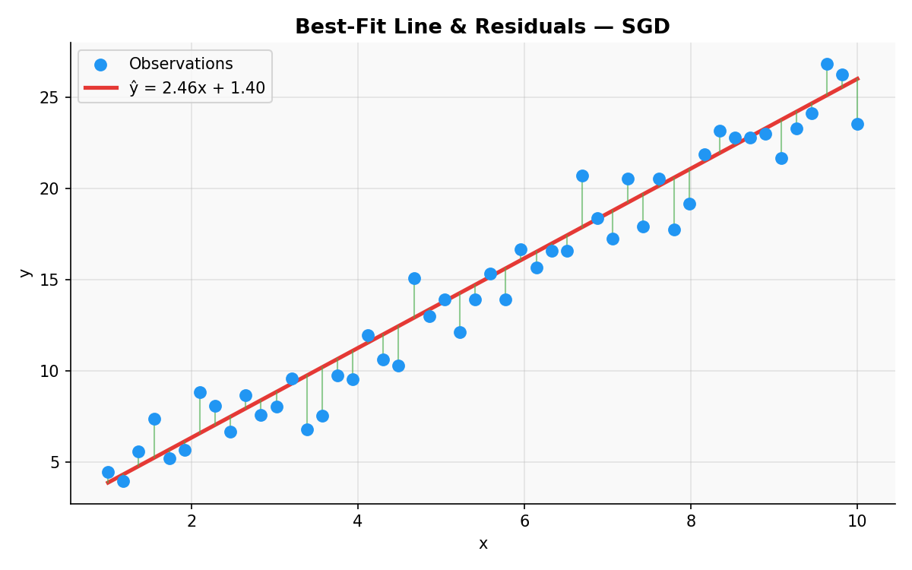
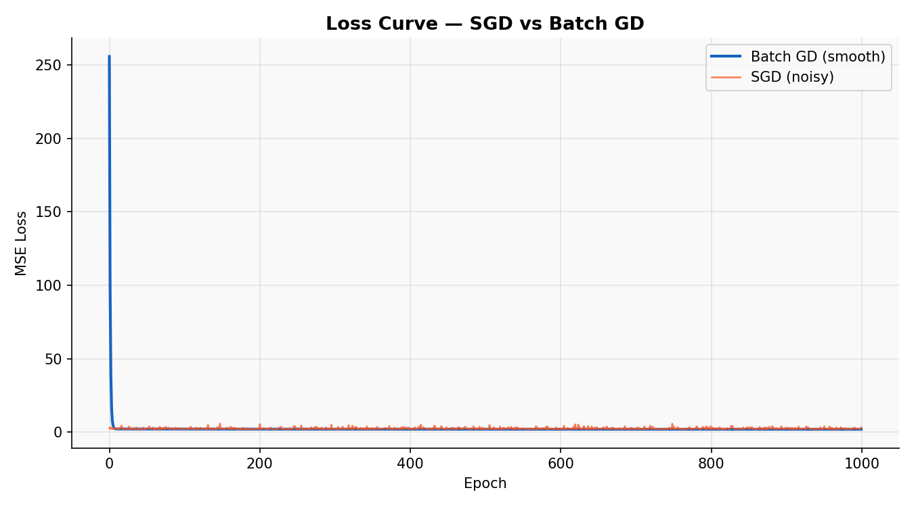

# Linear Regression — Stochastic Gradient Descent

> A clean, **NumPy-only** implementation of Linear Regression trained via **Stochastic Gradient Descent (SGD)**.
> Shuffles the data every epoch and updates $\mathbf{w}$ and $b$ **once per sample**, not once per epoch.
> **Same model as Batch GD — different update frequency: noisier, but each epoch does m updates instead of 1.**

---

## Table of Contents

1. [What is Stochastic Gradient Descent?](#1-what-is-stochastic-gradient-descent)
2. [The Model](#2-the-model)
3. [Cost Function — MSE](#3-cost-function--mse)
4. [Deriving the Gradients](#4-deriving-the-gradients)
5. [Geometric Intuition](#5-geometric-intuition)
6. [Best-Fit Line & Residuals](#6-best-fit-line--residuals)
7. [MSE Loss Surface & SGD Trajectory](#7-mse-loss-surface--sgd-trajectory)
8. [SGD vs Batch GD — Update Rule](#8-sgd-vs-batch-gd--update-rule)
9. [Loss Curve](#9-loss-curve)
10. [Regression Diagnostics](#10-regression-diagnostics)
11. [Multivariate Results](#11-multivariate-results)
12. [Usage](#12-usage)
13. [Assumptions](#13-assumptions)
14. [Pros & Cons vs Batch GD & Normal Equation](#14-pros--cons-vs-batch-gd--normal-equation)

---

## 1. What is Stochastic Gradient Descent?

SGD is a variant of Gradient Descent that updates $\mathbf{w}$ and $b$ using **one training sample at a time**, instead of averaging over the whole dataset like Batch GD.

Each epoch:
1. Shuffle the $m$ training samples.
2. Loop over them one at a time — compute the error for that single sample, then update $\mathbf{w}$ and $b$ immediately.

That means **m updates per epoch** (one per sample), compared to Batch GD's 1 update per epoch. This matches how `sklearn.linear_model.SGDRegressor` behaves internally.

| Symbol | Name | Meaning |
|--------|------|---------|
| $w_j$ | Weight | Change in $\hat{y}$ per unit increase in $x_j$ |
| $b$ | Bias / Intercept | Value of $\hat{y}$ when all $x_j = 0$ |
| $\hat{y}_i$ | Prediction | Model output for sample $i$ |
| $e_i = \hat{y}_i - y_i$ | Residual | Signed error for sample $i$ |
| $\alpha$ | Learning rate | Step size at each update |
| $m$ | Sample count | Number of updates per epoch |

---

## 2. The Model

For $n$ samples and $p$ features the prediction is:

$$\hat{y}_i = w_1 x_{i1} + w_2 x_{i2} + \cdots + w_p x_{ip} + b$$

In matrix form:

$$\hat{\mathbf{y}} = \mathbf{X}\mathbf{w} + b, \qquad \mathbf{X} \in \mathbb{R}^{n \times p},\quad \mathbf{w} \in \mathbb{R}^{p},\quad b \in \mathbb{R}$$

Identical model to Batch GD — only the **way we walk toward the minimum** changes.

---

## 3. Cost Function — MSE

The overall objective is still the **Mean Squared Error** over all $n$ samples:

$$\mathcal{L}(\mathbf{w}, b) = \frac{1}{n}\sum_{i=1}^{n}(\hat{y}_i - y_i)^2$$

But SGD never computes this full-dataset loss during an update — each step only looks at **one sample's** squared error:

$$\mathcal{L}_i(\mathbf{w}, b) = (\hat{y}_i - y_i)^2$$

---

## 4. Deriving the Gradients

Taking partial derivatives of the **per-sample** loss $\mathcal{L}_i$:

**Gradient w.r.t weights $\mathbf{w}$:**

$$\frac{\partial \mathcal{L}_i}{\partial \mathbf{w}} = x_i \cdot (\hat{y}_i - y_i) = x_i \cdot e_i$$

**Gradient w.r.t bias $b$:**

$$\frac{\partial \mathcal{L}_i}{\partial b} = \hat{y}_i - y_i = e_i$$

**Update rule — applied after every single sample:**

$$\mathbf{w} \leftarrow \mathbf{w} - \alpha \cdot x_i \cdot e_i, \qquad b \leftarrow b - \alpha \cdot e_i$$

> No $\frac{1}{m}$ averaging term — there's only one sample, so nothing to average over.

---

## 5. Geometric Intuition

- Each epoch **shuffles** the dataset so every sample is seen exactly once, in a random order.
- After each sample, $(\mathbf{w}, b)$ takes a small step based on that sample's error alone.
- The path through the loss surface is **jagged** — each sample pulls the weights in a slightly different direction.
- Over many epochs the noise averages out and the weights settle near the true minimum.

**Why shuffle?** Without it, ordered data (e.g. time series) biases each epoch toward whatever samples come last — the model ends up overfitting the tail of the dataset.

---

## 6. Best-Fit Line & Residuals



| Visual Element | Meaning |
|----------------|---------|
| Blue dots | Observed data points $(x_i,\ y_i)$ |
| Red line | Fitted line $\hat{y} = \mathbf{w} \cdot x + b$ after convergence |
| Green bars | Residuals $e_i = y_i - \hat{y}_i$ |

Residuals should be **small and scattered with no obvious pattern** — same fit-quality check as Batch GD.

---

## 7. MSE Loss Surface & SGD Trajectory


- The contour map shows MSE as a function of slope $w$ and intercept $b$ — still a smooth convex bowl.
- The **orange path** is noticeably jagged compared to Batch GD's smooth line — each of the $m$ per-sample updates nudges $(w, b)$ in a slightly different direction.
- The **green star** marks where SGD settles, close to but not exactly at the true minimum (SGD oscillates around the minimum rather than landing on it precisely).

---

## 8. SGD vs Batch GD — Update Rule


| Step | Batch GD | SGD |
|------|----------|-----|
| Sample used | All $m$ samples | 1 shuffled sample |
| Residual | $e = \hat{y} - y$ (vector) | $e_i = \hat{y}_i - y_i$ (scalar) |
| $\partial L/\partial b$ | $\frac{1}{m}\sum e_i$ | $e_i$ |
| $\partial L/\partial \mathbf{w}$ | $\frac{1}{m}\mathbf{X}^T e$ | $x_i \cdot e_i$ |
| Updates / epoch | 1 | $m$ |

---

## 9. Loss Curve

`loss_history_` logs the **full-dataset** MSE at the end of every epoch, even though updates happen per sample.



Batch GD descends smoothly. SGD is noisier at convergence — this is expected, since each of the $m$ per-epoch updates only sees one sample's error. The noise is the trade-off for many more updates per epoch.

---

## 10. Regression Diagnostics


| Plot | What to look for | Assumption verified |
|------|-----------------|---------------------|
| **Residuals vs Fitted** | Random scatter around $y=0$, no curve | Linearity |
| **Normal Q-Q** | Points on the diagonal line | Normality of residuals |
| **Scale-Location** | Flat, uniform band — no funnel | Homoscedasticity |
| **Residual Histogram** | Bell-shaped, centred at 0 | Normality |

**Red flags:**
- Curve in *Residuals vs Fitted* → relationship is non-linear
- Funnel shape in *Scale-Location* → variance not constant
- Heavy tails in Q-Q → residuals not normal

---

## 11. Multivariate Results

The same per-sample update applies unchanged when $p > 1$ — `xi` is just a row vector instead of a scalar.


**Left panel:** predicted vs actual $y$ — points hugging the red dashed diagonal indicate an accurate fit.
**Right panel:** learned feature weights $\mathbf{w}$ — green bars are positive weights, red bars are negative.

---

## 12. Usage

### Basic fit and predict

```python
import numpy as np
from SGDRegressor import SGDRegressor

X_train = np.array([[1], [2], [3], [4], [5]], dtype=float)
y_train = np.array([2.1, 3.9, 6.2, 7.8, 10.1])

model = SGDRegressor(learning_rate=0.01, epochs=1000)
model.fit(X_train, y_train)

print(f"Intercept (b) : {model.intercept_:.4f}")
print(f"Weights   (w) : {model.coef_}")
print(model)

X_test = np.array([[6], [7], [8]], dtype=float)
y_test = np.array([12.0, 13.8, 16.1])
y_pred = model.predict(X_test)

print(f"Predictions   : {y_pred}")
print(f"R²            : {model.score(X_test, y_test):.4f}")
```

### Plot the loss curve

```python
import matplotlib.pyplot as plt

plt.plot(model.loss_history_)
plt.xlabel("Epoch")
plt.ylabel("MSE")
plt.title("SGD Loss Curve")
plt.show()
```

### Multi-feature example

```python
X_multi = np.random.randn(100, 3)
y_multi = X_multi @ np.array([1.5, -2.0, 3.0]) + 5.0 + np.random.randn(100)

model = SGDRegressor(learning_rate=0.01, epochs=2000)
model.fit(X_multi, y_multi)

print(f"R² = {model.score(X_multi, y_multi):.4f}")
print(model)
```

---

## 13. Assumptions

| # | Assumption | How to check |
|---|-----------|--------------|
| 1 | **Linearity** — true relationship is $y = \mathbf{X}\mathbf{w} + b + \varepsilon$ | Residuals vs Fitted plot |
| 2 | **Zero-mean errors** — $\mathbb{E}[\varepsilon] = 0$ | Residual histogram centred at 0 |
| 3 | **Homoscedasticity** — $\text{Var}(\varepsilon_i) = \sigma^2$ constant | Scale-Location plot |
| 4 | **Independent errors** — $\text{Cov}(\varepsilon_i, \varepsilon_j) = 0$ | Durbin-Watson test |
| 5 | **Normality** *(inference only)* — $\varepsilon \sim \mathcal{N}(0, \sigma^2)$ | Normal Q-Q plot |

> **Feature scaling is strongly recommended** — SGD is more sensitive to feature scale than Batch GD, since a single unscaled feature can dominate every per-sample update. Use `StandardScaler` or normalise manually before fitting.

---

## 14. Pros & Cons vs Batch GD & Normal Equation

| Criterion | **SGD** | **Batch GD** | **Normal Equation** |
|-----------|---------|--------------|----------------------|
| Updates per epoch | $m$ (one per sample) | 1 | — (one-shot) |
| Gradient noise | High (single sample) | Low (full dataset) | None |
| Convergence | Noisy but fast per-epoch progress | Smooth but slower | Exact, instant |
| Hyperparameters | Learning rate, epochs | Learning rate, epochs | None |
| Time complexity | $O(k \cdot n \cdot p)$ | $O(k \cdot n \cdot p)$ | $O(p^3)$ |
| Best for | Large datasets, online learning | Medium datasets | $p \lesssim 10{,}000$ |
| Feature scaling | Strongly required | Recommended | Not needed |
| sklearn equivalent | `SGDRegressor` | — | `LinearRegression` |

**Rule of thumb:** use SGD when the dataset is too large for Batch GD to be efficient per epoch; use the Normal Equation for small-to-medium datasets where an exact, closed-form solution is preferred.

---

## Dependencies

```
numpy >= 1.21
matplotlib >= 3.4   # optional — for plotting and loss curve only
scipy >= 1.7        # optional — for Q-Q diagnostics
```

---

## License

MIT