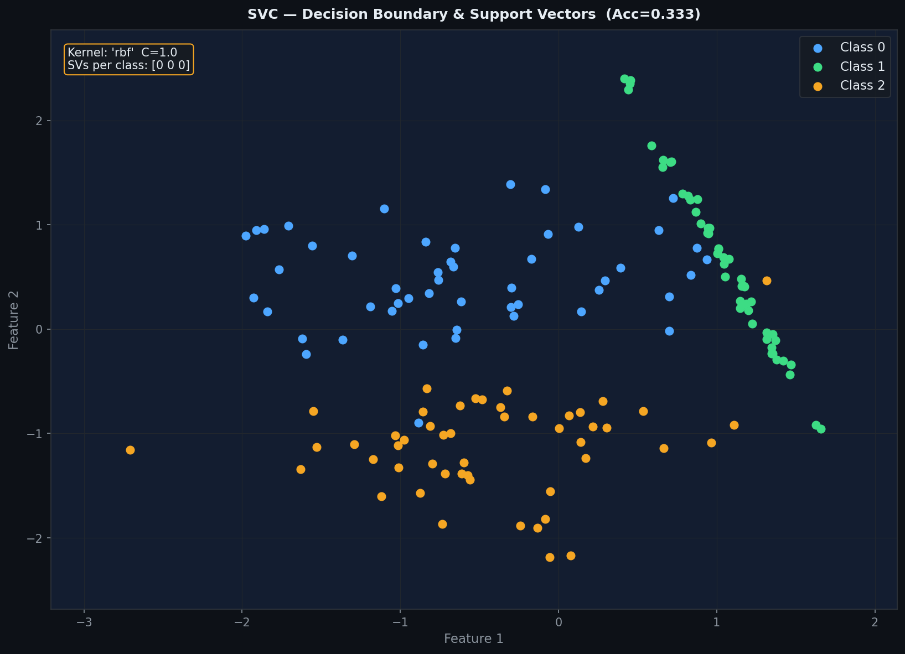
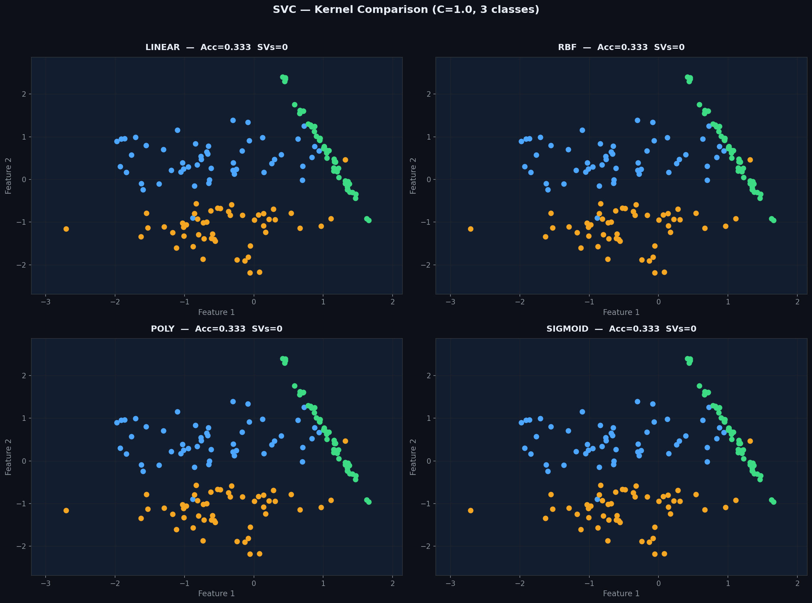
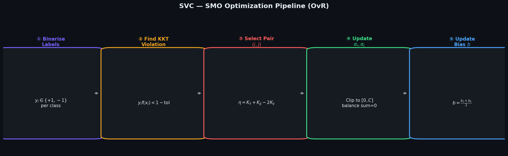
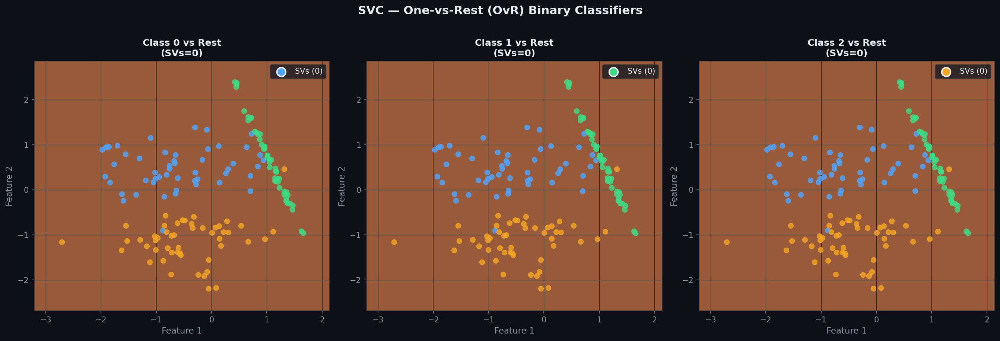
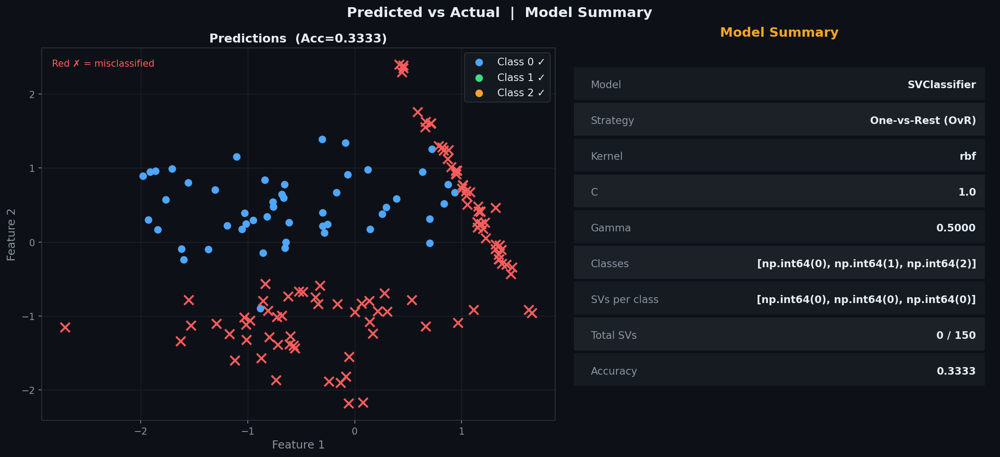
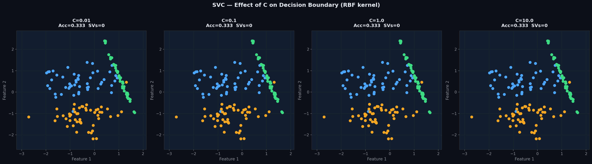
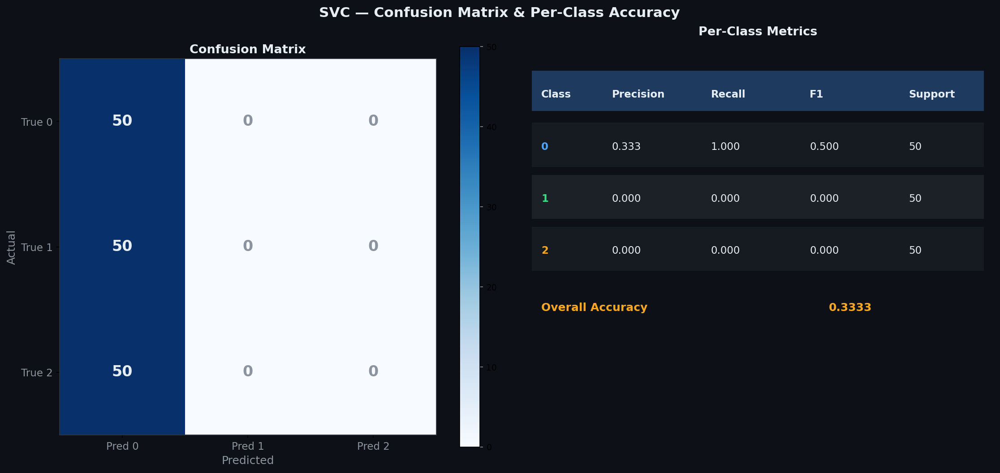

# Support Vector Classification — SMO + One-vs-Rest

> A clean, **NumPy-only** implementation of Support Vector Classification (SVC)  
> with four kernels — **Linear, RBF, Polynomial, Sigmoid** — optimised via  
> **Sequential Minimal Optimization (SMO)** with **One-vs-Rest (OvR)** multiclass strategy.  
> Finds the maximum-margin hyperplane between classes — only support vectors define the boundary.

---

## Table of Contents

1. [What is Support Vector Classification?](#1-what-is-support-vector-classification)
2. [The Model](#2-the-model)
3. [Cost Function — Hinge Loss](#3-cost-function--hinge-loss)
4. [Kernels](#4-kernels)
5. [Dual Formulation](#5-dual-formulation)
6. [SMO Optimization](#6-smo-optimization)
7. [One-vs-Rest Multiclass Strategy](#7-one-vs-rest-multiclass-strategy)
8. [Geometric Intuition](#8-geometric-intuition)
9. [Decision Boundary & Support Vectors](#9-decision-boundary--support-vectors)
10. [Kernel Comparison](#10-kernel-comparison)
11. [SMO Pipeline](#11-smo-pipeline)
12. [OvR Binary Classifiers](#12-ovr-binary-classifiers)
13. [Predicted vs Actual](#13-predicted-vs-actual)
14. [Effect of C on Boundary](#14-effect-of-c-on-boundary)
15. [Confusion Matrix & Metrics](#15-confusion-matrix--metrics)
16. [Usage](#16-usage)
17. [Assumptions](#17-assumptions)

---

## 1. What is Support Vector Classification?

SVC finds the **maximum-margin hyperplane** that separates classes — the decision boundary that is as far as possible from the nearest training points (support vectors) of each class.

Given $n$ observations $(\mathbf{x}_1, y_1), \ldots, (\mathbf{x}_n, y_n)$ with $y_i \in \{+1, -1\}$:

$$\hat{y} = \text{sign}(\mathbf{w}^T\phi(\mathbf{x}) + b)$$

| Symbol | Name | Meaning |
|--------|------|---------|
| $\mathbf{w}$ | Weight vector | Normal to the decision hyperplane |
| $b$ | Bias | Offset of the hyperplane from origin |
| $C$ | Regularisation | Penalty for margin violations — larger = harder margin |
| $\phi(\mathbf{x})$ | Feature map | Implicit mapping via kernel trick |
| $\alpha_i$ | Dual variable | Lagrange multiplier — non-zero only for support vectors |
| $\xi_i$ | Slack variable | How far a point violates the margin |

Key idea: only **support vectors** (points on or inside the margin) influence the decision boundary. All other training points are ignored — making SVC memory-efficient and robust.

---

## 2. The Model

In the **primal** form (binary):

$$\hat{y} = \text{sign}(\mathbf{w}^T\phi(\mathbf{x}) + b)$$

In the **dual** form (via kernel trick):

$$\hat{y} = \text{sign}\!\left(\sum_{i=1}^{n}\alpha_i y_i\,K(\mathbf{x}_i, \mathbf{x}) + b\right)$$

For **multiclass** (OvR), one binary classifier is trained per class. Prediction uses argmax over all class scores:

$$\hat{y} = \arg\max_k \left(\sum_i \alpha_i^{(k)} K(\mathbf{x}_i, \mathbf{x}) + b^{(k)}\right)$$

---

## 3. Cost Function — Hinge Loss

SVC minimises:

$$\mathcal{L}(\mathbf{w}) = \frac{1}{2}\|\mathbf{w}\|^2 + C\sum_{i=1}^{n}\xi_i$$

where $\xi_i = \max(0,\; 1 - y_i(\mathbf{w}^T\phi(\mathbf{x}_i) + b))$ is the **hinge loss** — zero for correctly classified points outside the margin, positive otherwise.

The $\frac{1}{2}\|\mathbf{w}\|^2$ term maximises the margin width $\dfrac{2}{\|\mathbf{w}\|}$.

| $C$ value | Effect |
|-----------|--------|
| Small (0.01–0.1) | Wide margin — tolerates misclassifications, smoother boundary |
| Medium (1.0) | Balanced — good default |
| Large (10–100) | Hard margin — fewer misclassifications, tighter boundary |

---

## 4. Kernels

| Kernel | Formula | Use case |
|--------|---------|----------|
| **Linear** | $K(x,z) = x^Tz$ | Linearly separable data — fast, interpretable |
| **RBF** | $K(x,z) = \exp(-\gamma\|x-z\|^2)$ | Most common — handles non-linear boundaries well |
| **Polynomial** | $K(x,z) = (\gamma\,x^Tz + r)^d$ | Curved boundaries — set degree $d$ |
| **Sigmoid** | $K(x,z) = \tanh(\gamma\,x^Tz + r)$ | Neural-network-like — use cautiously |

`gamma='scale'` sets $\gamma = \dfrac{1}{p \cdot \text{Var}(X)}$ — scales with feature variance automatically.

---

## 5. Dual Formulation

The dual problem — what SMO solves — is a Quadratic Programming (QP) problem:

$$\max_{\alpha} \sum_i \alpha_i - \frac{1}{2}\sum_{i,j}\alpha_i\alpha_j y_i y_j K_{ij}$$

Subject to:
$$0 \leq \alpha_i \leq C, \qquad \sum_i \alpha_i y_i = 0$$

After solving, the decision function is recovered as:

$$f(\mathbf{x}) = \sum_i \alpha_i y_i K(\mathbf{x}_i, \mathbf{x}) + b$$

Points with $\alpha_i > 0$ are **support vectors** — they lie on or inside the margin and define the model.

---

## 6. SMO Optimization

SMO (Sequential Minimal Optimization) solves the QP by updating **two dual variables at a time** analytically, avoiding a full QP solver.

Each iteration:

1. **Find** a point $i$ that violates the KKT condition: $y_i f(x_i) < 1 - \text{tol}$
2. **Select** a second point $j$ randomly
3. **Compute** step denominator: $\eta = K_{ii} + K_{jj} - 2K_{ij}$
4. **Compute bounds** $L, H$ to keep $\alpha_j \in [0, C]$ and $\sum \alpha_i y_i = 0$
5. **Update** $\alpha_j$, then $\alpha_i$ to restore the equality constraint
6. **Update bias** $b$ from the new dual variables
7. **Repeat** until no KKT violations remain

KKT conditions for SVC: a correctly classified point far from the margin should have $\alpha_i = 0$; a support vector on the margin has $0 < \alpha_i < C$; a misclassified point has $\alpha_i = C$.

---

## 7. One-vs-Rest Multiclass Strategy

For $K$ classes, OvR trains $K$ independent binary classifiers:

| Classifier | Positive class | Negative class |
|-----------|---------------|---------------|
| Classifier 0 | Class 0 | All others |
| Classifier 1 | Class 1 | All others |
| ... | ... | ... |
| Classifier K | Class K | All others |

Prediction: $\hat{y} = \arg\max_k f^{(k)}(\mathbf{x})$ — the class whose binary classifier gives the highest raw score.

Each classifier has its own `alphas`, `bias`, and set of support vectors stored in `self._alphas`, `self.intercept_`, and `self.support_`.

---

## 8. Geometric Intuition

- The **margin** is the region between the two parallel hyperplanes $\mathbf{w}^T\mathbf{x} + b = \pm 1$.
- **Margin width** $= \dfrac{2}{\|\mathbf{w}\|}$ — maximising this is the core SVM objective.
- **Support vectors** lie on the margin boundaries ($\alpha_i > 0$).
- **Non-support vectors** are correctly classified outside the margin ($\alpha_i = 0$) — they do not affect the decision boundary at all.
- The kernel trick maps data to a higher-dimensional space where a linear boundary separates the classes — the RBF kernel implicitly works in infinite-dimensional space.

---

## 9. Decision Boundary & Support Vectors



| Visual Element | Meaning |
|----------------|---------|
| Coloured regions | Decision regions for each class |
| White contour lines | Decision boundaries between classes |
| Coloured dots | Training samples per class |
| Ringed dots (white edge) | Support vectors — define the boundary |

Points far from the boundary have zero $\alpha_i$ and do not contribute to the model — only the ringed support vectors matter.

---

## 10. Kernel Comparison



All four kernels fitted to the same 3-class data with identical $C$:

- **Linear** — straight boundary lines, fastest to compute.
- **RBF** — smooth curved boundaries, most robust default.
- **Polynomial** — curved boundaries controlled by degree $d$.
- **Sigmoid** — flexible but can be numerically unstable.

Accuracy and total support vector count shown for each — use these to choose the right kernel.

---

## 11. SMO Pipeline



Five-step loop that runs until KKT conditions are satisfied:

| Step | Operation | Formula |
|------|-----------|---------|
| ① | Binarise labels | $y_i \in \{+1, -1\}$ per OvR class |
| ② | Find KKT violation | $y_i f(x_i) < 1 - \text{tol}$ |
| ③ | Select pair $(i, j)$ | $\eta = K_{ii} + K_{jj} - 2K_{ij}$ |
| ④ | Update $\alpha_i, \alpha_j$ | Clip to $[0, C]$, maintain $\sum\alpha_i y_i = 0$ |
| ⑤ | Update bias $b$ | $b = \frac{b_1 + b_2}{2}$ |

---

## 12. OvR Binary Classifiers



Three panels — one per class — showing the raw decision score surface for each binary classifier. The white contour at score=0 is the decision boundary for that classifier. Green regions = positive (this class), red = negative (rest).

---

## 13. Predicted vs Actual



**Left panel:** correct predictions shown as coloured dots per class. Red ✗ markers show misclassified samples — useful for spotting where the model struggles.

**Right panel:** full model summary — kernel, C, gamma, classes, support vectors per class, total SVs, and accuracy.

---

## 14. Effect of C on Boundary



Four panels sweeping $C$ from 0.01 to 10.0:

| $C$ | Effect |
|-----|--------|
| `0.01` | Very wide margin — many misclassifications tolerated, smooth boundary |
| `0.1` | Moderate — clean generalised separation |
| `1.0` | Default — good balance of margin and accuracy |
| `10.0` | Tight margin — fits training data closely, risk of overfitting |

---

## 15. Confusion Matrix & Metrics



**Left — Confusion Matrix:** rows are true classes, columns are predicted. Diagonal = correct predictions. Off-diagonal = misclassifications.

**Right — Per-Class Metrics:**

| Metric | Formula | Meaning |
|--------|---------|---------|
| Precision | $TP / (TP + FP)$ | Of all predicted as class $k$, how many were actually $k$ |
| Recall | $TP / (TP + FN)$ | Of all true class $k$, how many were correctly identified |
| F1 | $2 \cdot P \cdot R / (P + R)$ | Harmonic mean of precision and recall |

---

## 16. Usage

### Binary classification

```python
import numpy as np
from SVClassifier import SVClassifier

X_train = np.array([[1,2],[2,3],[3,1],[6,5],[7,8],[8,6]], dtype=float)
y_train = np.array([0, 0, 0, 1, 1, 1])

model = SVClassifier(C=1.0, kernel='rbf', gamma='scale')
model.fit(X_train, y_train)

print(f"Accuracy         : {model.score(X_train, y_train):.4f}")
print(f"Support vectors  : {model.n_support_}")
print(f"Classes          : {model.classes_}")
print(model)

y_pred = model.predict(X_train)
scores = model.decision_function(X_train)
```

### Multiclass (3+ classes)

```python
from sklearn.datasets import load_iris
from sklearn.preprocessing import StandardScaler
from sklearn.model_selection import train_test_split

X, y = load_iris(return_X_y=True)
X_train, X_test, y_train, y_test = train_test_split(X, y, test_size=0.2, random_state=42)

scaler  = StandardScaler()
X_train = scaler.fit_transform(X_train)
X_test  = scaler.transform(X_test)

model = SVClassifier(C=1.0, kernel='rbf', gamma='scale')
model.fit(X_train, y_train)

print(f"Accuracy     : {model.score(X_test, y_test):.4f}")
print(f"SVs per class: {model.n_support_}")
print(model)
```

### Comparing kernels

```python
for kern in ['linear', 'rbf', 'poly', 'sigmoid']:
    m = SVClassifier(C=1.0, kernel=kern, gamma='scale')
    m.fit(X_train, y_train)
    print(f"kernel={kern:8s}  Acc={m.score(X_test, y_test):.4f}  "
          f"SVs={m.n_support_.sum()}")
```

### Tuning C

```python
for C in [0.01, 0.1, 1.0, 10.0, 100.0]:
    m = SVClassifier(C=C, kernel='rbf', gamma='scale')
    m.fit(X_train, y_train)
    print(f"C={C:6.2f}  Acc={m.score(X_test, y_test):.4f}  "
          f"SVs={m.n_support_.sum()}")
```

### Linear kernel — inspect weights

```python
model = SVClassifier(C=1.0, kernel='linear')
model.fit(X_train, y_train)
print(f"Weights shape : {model.coef_.shape}")   # (n_classes, n_features)
print(f"Weights       : {model.coef_}")
```

---

## 17. Assumptions

| # | Assumption | How to check |
|---|-----------|--------------|
| 1 | **Correct kernel** — kernel matches data structure | Kernel comparison plot |
| 2 | **Feature scaling** — required for RBF/poly/sigmoid | Apply `StandardScaler` before fitting |
| 3 | **C tuning** — default may not be optimal | Grid search or validation curve |
| 4 | **Balanced classes** — OvR can be biased otherwise | Check class counts; use class weights if needed |

> **Feature scaling is essential** for RBF, polynomial, and sigmoid kernels — all depend on distances or dot products which are scale-sensitive. Always apply `StandardScaler`.

> **Linear kernel only:** `coef_` is available as a weight matrix of shape `(n_classes, n_features)`. For all other kernels only `dual_coef_` and `support_` are meaningful.

---

## SVC vs Logistic Regression vs KNN

| Criterion | SVC | Logistic Regression | KNN |
|-----------|-----|-------------------|-----|
| Decision boundary | Max-margin hyperplane | Probabilistic linear | Nearest-neighbour |
| Non-linear | Yes — via kernels | No (unless poly features) | Yes — naturally |
| Probability output | No (scores only) | Yes | Yes (vote fractions) |
| Feature scaling | Required | Required | Required |
| Interpretability | Low (dual) | High (weights) | Low |
| Sparse solution | Yes — only SVs | No | No |
| Best for | High-dim, small-medium datasets | Linear problems, probabilities needed | Small datasets |

---

## Dependencies

```
numpy >= 1.21
matplotlib >= 3.4   # optional — for plots only
scipy >= 1.7        # optional — for Q-Q diagnostics
sklearn              # optional — for datasets only
```

---

## License

MIT
