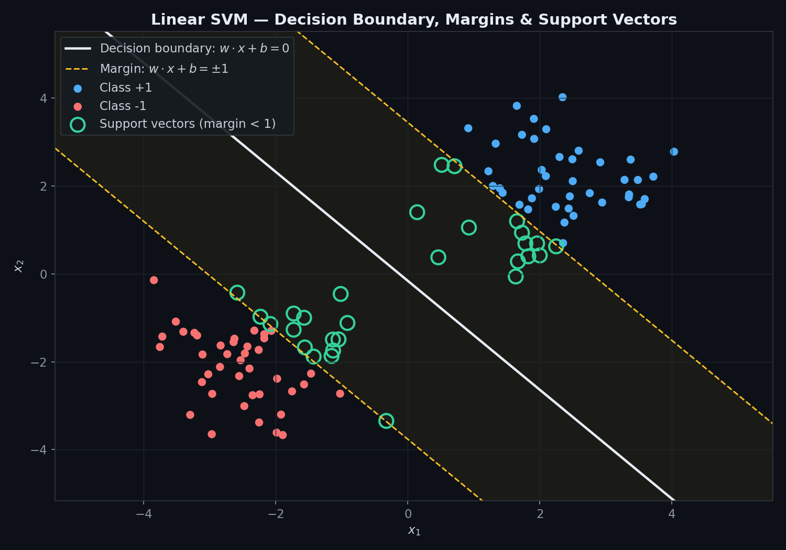
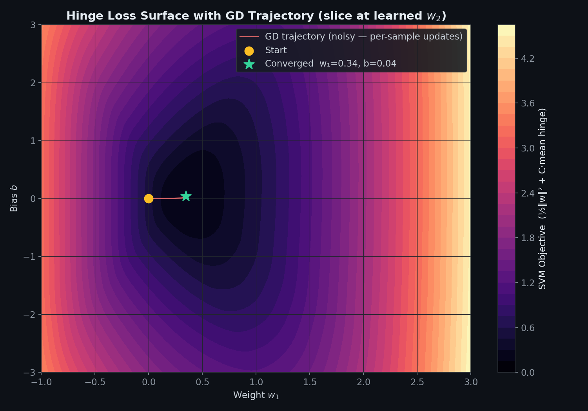
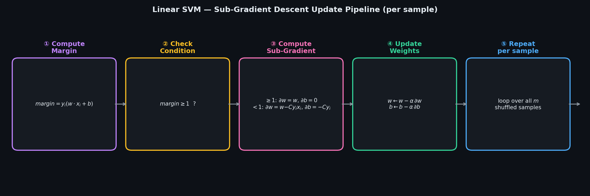
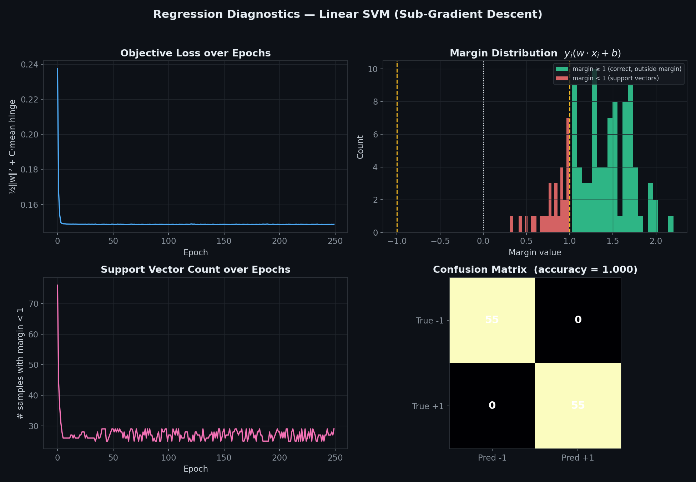
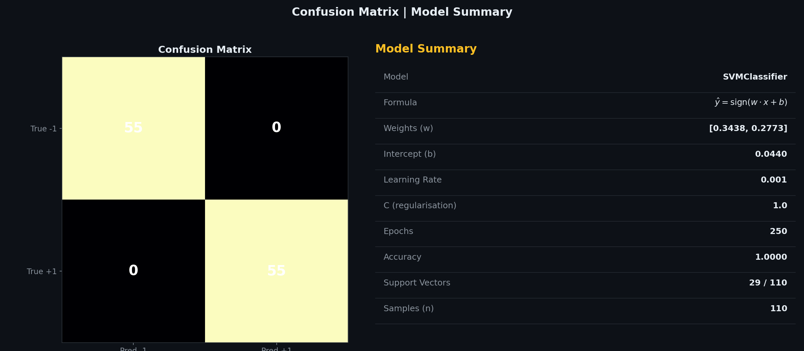
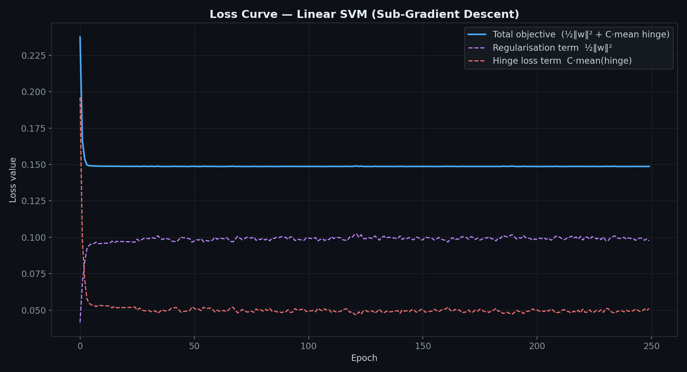

# Support Vector Machine — Linear, Sub-Gradient Descent

> A clean, **NumPy-only** implementation of a binary linear SVM trained via **Sub-Gradient Descent**.
> No kernel, no dual, no QP solver — the primal hinge-loss objective is minimised directly, one sample at a time.
> **Same margin-maximising idea as the classic SVM — an iterative solver instead of quadratic programming.**

---

## Table of Contents

1. [What is an SVM?](#1-what-is-an-svm)
2. [The Model](#2-the-model)
3. [Cost Function — Hinge Loss](#3-cost-function--hinge-loss)
4. [Deriving the Sub-Gradients](#4-deriving-the-sub-gradients)
5. [Geometric Intuition](#5-geometric-intuition)
6. [Decision Boundary, Margins & Support Vectors](#6-decision-boundary-margins--support-vectors)
7. [Hinge Loss Surface & GD Trajectory](#7-hinge-loss-surface--gd-trajectory)
8. [Update Pipeline](#8-update-pipeline)
9. [Diagnostics](#9-diagnostics)
10. [Confusion Matrix & Model Summary](#10-confusion-matrix--model-summary)
11. [Loss Curve Breakdown](#11-loss-curve-breakdown)
12. [Usage](#12-usage)
13. [Assumptions](#13-assumptions)
14. [Pros & Cons vs Kernel SVM & Logistic Regression](#14-pros--cons-vs-kernel-svm--logistic-regression)

---

## 1. What is an SVM?

A Support Vector Machine finds the hyperplane that separates two classes with the **widest possible margin** — not just any separating line, but the one furthest from the nearest points of each class.

Points that sit exactly on or inside that margin are called **support vectors** — they're the only points that actually influence where the boundary sits. Everything else could be deleted without changing the solution.

| Symbol | Name | Meaning |
|--------|------|---------|
| $w_j$ | Weight | Orientation of the separating hyperplane |
| $b$ | Bias / Intercept | Offset of the hyperplane from the origin |
| $y_i \in \{-1, +1\}$ | Label | Class of sample $i$ |
| $\text{margin}_i = y_i(w \cdot x_i + b)$ | Functional margin | How confidently, and correctly, sample $i$ is classified |
| $C$ | Regularisation strength | Trade-off between a wide margin and fewer margin violations |
| $\alpha$ | Learning rate | Step size at each update |

---

## 2. The Model

For $n$ samples and $p$ features, the raw decision score is:

$$f(x) = w \cdot x + b, \qquad w \in \mathbb{R}^{p},\quad b \in \mathbb{R}$$

The predicted class comes from the **sign** of that score:

$$\hat{y} = \text{sign}(w \cdot x + b)$$

Labels are converted internally to $\{-1, +1\}$ regardless of how they're passed in (`0/1`, `-1/1`, or anything else where non-positive maps to the negative class).

---

## 3. Cost Function — Hinge Loss

The SVM minimises the **regularised hinge-loss** objective:

$$\mathcal{L}(w, b) = \underbrace{\frac{1}{2}\|w\|^2}_{\text{maximise margin}} + C \cdot \underbrace{\frac{1}{n}\sum_{i=1}^{n}\max\big(0,\ 1 - y_i(w \cdot x_i + b)\big)}_{\text{penalise margin violations}}$$

- The first term shrinks $w$, which **widens** the margin $\frac{2}{\|w\|}$.
- The second term penalises any point with a functional margin less than 1 — i.e. inside the margin or misclassified.
- $C$ controls the trade-off: a **large $C$** punishes violations heavily (narrow margin, fewer mistakes); a **small $C$** allows a wider margin at the cost of more violations.

---

## 4. Deriving the Sub-Gradients

The hinge loss isn't differentiable at the kink ($\text{margin} = 1$), so we use a **sub-gradient** — a valid descent direction on both sides of the kink.

For a single sample $(x_i, y_i)$ with $\text{margin}_i = y_i(w \cdot x_i + b)$:

**If $\text{margin}_i \geq 1$** (correctly classified, outside the margin — only the regulariser matters):

$$\frac{\partial \mathcal{L}_i}{\partial w} = w, \qquad \frac{\partial \mathcal{L}_i}{\partial b} = 0$$

**If $\text{margin}_i < 1$** (inside the margin or misclassified — the hinge term kicks in):

$$\frac{\partial \mathcal{L}_i}{\partial w} = w - C y_i x_i, \qquad \frac{\partial \mathcal{L}_i}{\partial b} = -C y_i$$

**Update rule — applied after every single sample:**

$$w \leftarrow w - \alpha \cdot \frac{\partial \mathcal{L}_i}{\partial w}, \qquad b \leftarrow b - \alpha \cdot \frac{\partial \mathcal{L}_i}{\partial b}$$

---

## 5. Geometric Intuition

- Each epoch **shuffles** the dataset, then walks through every sample once.
- Points safely outside the margin only get shrunk slightly (regularisation pulling $w$ toward 0).
- Points inside the margin or on the wrong side get an extra push — $w$ and $b$ are nudged to bring that point back outside the margin.
- Over many epochs, the boundary settles where the **regularisation pull** and the **misclassification push** balance out — the maximum-margin hyperplane.

---

## 6. Decision Boundary, Margins & Support Vectors



| Visual Element | Meaning |
|----------------|---------|
| Blue / orange dots | Observed samples, class $+1$ / class $-1$ |
| White line | Decision boundary $w \cdot x + b = 0$ |
| Amber dashed lines | Margin boundaries $w \cdot x + b = \pm 1$ |
| Green circles | Support vectors — samples with functional margin $< 1$ |

A good fit shows the margin sitting cleanly between the two classes, with only a handful of support vectors marking its edge.

---

## 7. Hinge Loss Surface & GD Trajectory



- The contour shows the SVM objective as a function of one weight and the bias, holding the other weight fixed at its converged value — a 2D slice through the true multi-dimensional surface.
- Unlike Batch GD's smooth path, sub-gradient descent here updates **once per sample**, so the trajectory is jagged — similar in spirit to SGD.
- The path eventually settles near the minimum of this slice, shown by the green star.

---

## 8. Update Pipeline



The five-step loop that runs for **every sample, every epoch**:

| Step | Operation | Formula |
|------|-----------|---------|
| ① | Compute margin | $\text{margin} = y_i(w \cdot x_i + b)$ |
| ② | Check condition | $\text{margin} \geq 1$ ? |
| ③ | Compute sub-gradient | Two cases, depending on ② |
| ④ | Update weights | $w \leftarrow w - \alpha \cdot \partial w,\ \ b \leftarrow b - \alpha \cdot \partial b$ |
| ⑤ | Repeat | For every sample, every epoch, until convergence |

---

## 9. Diagnostics



| Plot | What to look for |
|------|-----------------|
| **Objective loss over epochs** | Should trend downward and flatten out |
| **Margin distribution** | Most points should sit at $\text{margin} \geq 1$; the pileup near $\pm 1$ are your support vectors |
| **Support vector count over epochs** | Should shrink and stabilise as the boundary settles |
| **Confusion matrix** | Diagonal-heavy = few misclassifications |

---

## 10. Confusion Matrix & Model Summary



**Left panel:** confusion matrix — true class (rows) vs predicted class (columns).
**Right panel:** model summary card — learned $w$, $b$, hyperparameters, accuracy, and support vector count at a glance.

---

## 11. Loss Curve Breakdown



The total objective splits into two components:
- **Regularisation term** $\frac{1}{2}\|w\|^2$ — grows slightly as $w$ moves away from zero to separate the classes.
- **Hinge loss term** $C \cdot \text{mean(hinge)}$ — drops sharply as violations are corrected, then flattens once only the true support vectors remain.

---

## 12. Usage

### Basic fit and predict

```python
import numpy as np
from SVMClassifier import SVMClassifier

X_train = np.array([[2, 2], [3, 3], [2.5, 1.5], [-2, -2], [-3, -1], [-1.5, -2.5]])
y_train = np.array([1, 1, 1, 0, 0, 0])   # 0/1 labels work fine — converted internally

model = SVMClassifier(learning_rate=0.001, C=1.0, epochs=1000)
model.fit(X_train, y_train)

print(f"Weights (w) : {model.coef_}")
print(f"Intercept(b): {model.intercept_:.4f}")
print(model)

X_test = np.array([[2.8, 2.2], [-2.2, -1.8]])
print(f"Scores      : {model.decision_function(X_test)}")
print(f"Predictions : {model.predict(X_test)}")
print(f"Accuracy    : {model.score(X_train, y_train):.4f}")
```

### Plot the loss curve

```python
import matplotlib.pyplot as plt

plt.plot(model.loss_history_)
plt.xlabel("Epoch")
plt.ylabel("½‖w‖² + C·mean(hinge)")
plt.title("SVM Loss Curve")
plt.show()
```

### Tuning C

```python
for C in [0.01, 0.1, 1.0, 10.0]:
    model = SVMClassifier(learning_rate=0.001, C=C, epochs=1000)
    model.fit(X_train, y_train)
    print(f"C={C:>5} -> accuracy={model.score(X_train, y_train):.4f}, ||w||={np.linalg.norm(model.coef_):.4f}")
```

---

## 13. Assumptions

| # | Assumption | How to check |
|---|-----------|--------------|
| 1 | **Linear separability (approximate)** — a straight hyperplane should reasonably separate the classes | Decision boundary plot |
| 2 | **Binary labels** — this implementation is strictly two-class | Convert multi-class problems to one-vs-rest first |
| 3 | **Feature scaling recommended** — unscaled features distort the margin geometry | Use `StandardScaler` before fitting |
| 4 | **C is tuned, not guessed** — too large overfits to outliers, too small underfits | Cross-validate over a range of $C$ |

> **Feature scaling matters more here than in linear regression** — since the margin width is $\frac{2}{\|w\|}$, a feature on a much larger scale than the others can dominate the geometry of the boundary.

---

## 14. Pros & Cons vs Kernel SVM & Logistic Regression

| Criterion | **Linear SVM (this impl.)** | **Kernel SVM** | **Logistic Regression** |
|-----------|------------------------------|-----------------|--------------------------|
| Decision boundary | Straight hyperplane | Non-linear (via kernel trick) | Straight hyperplane |
| Solver | Sub-gradient descent | QP / SMO | Gradient descent |
| Output | Hard label (sign of score) | Hard label | Probability |
| Handles non-linear data | No | Yes | No (without feature engineering) |
| Time complexity | $O(k \cdot n \cdot p)$ | $O(n^2)$ to $O(n^3)$ | $O(k \cdot n \cdot p)$ |
| Best for | Large, roughly linearly-separable data | Small-to-medium, non-linear data | Interpretable probabilities |
| Feature scaling | Strongly required | Strongly required | Recommended |
| sklearn equivalent | `SGDClassifier(loss='hinge')` | `SVC(kernel='rbf')` | `LogisticRegression` |

**Rule of thumb:** use this linear form when the dataset is large and roughly linearly separable; reach for a kernel SVM when the boundary is clearly non-linear and the dataset is small enough for $O(n^2)$–$O(n^3)$ solvers to be practical.

---

## Dependencies

```
numpy >= 1.21
matplotlib >= 3.4   # optional — for plotting only
```

---

## License

MIT
