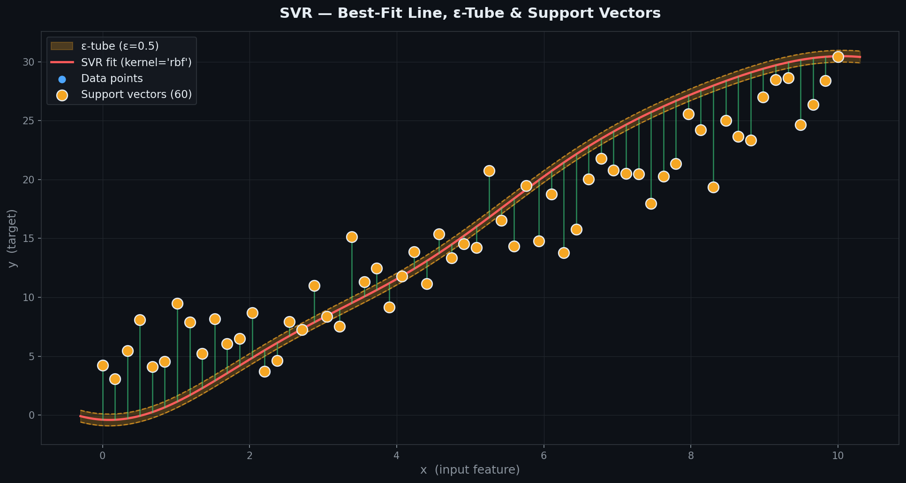
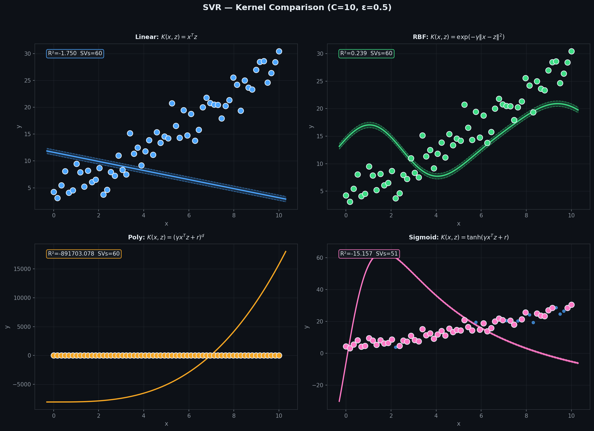
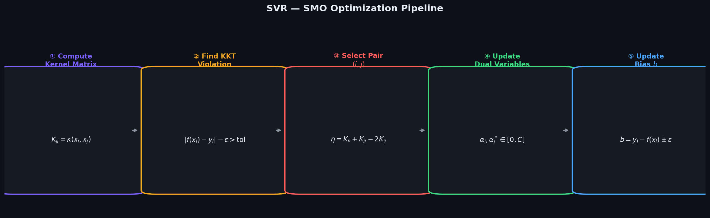
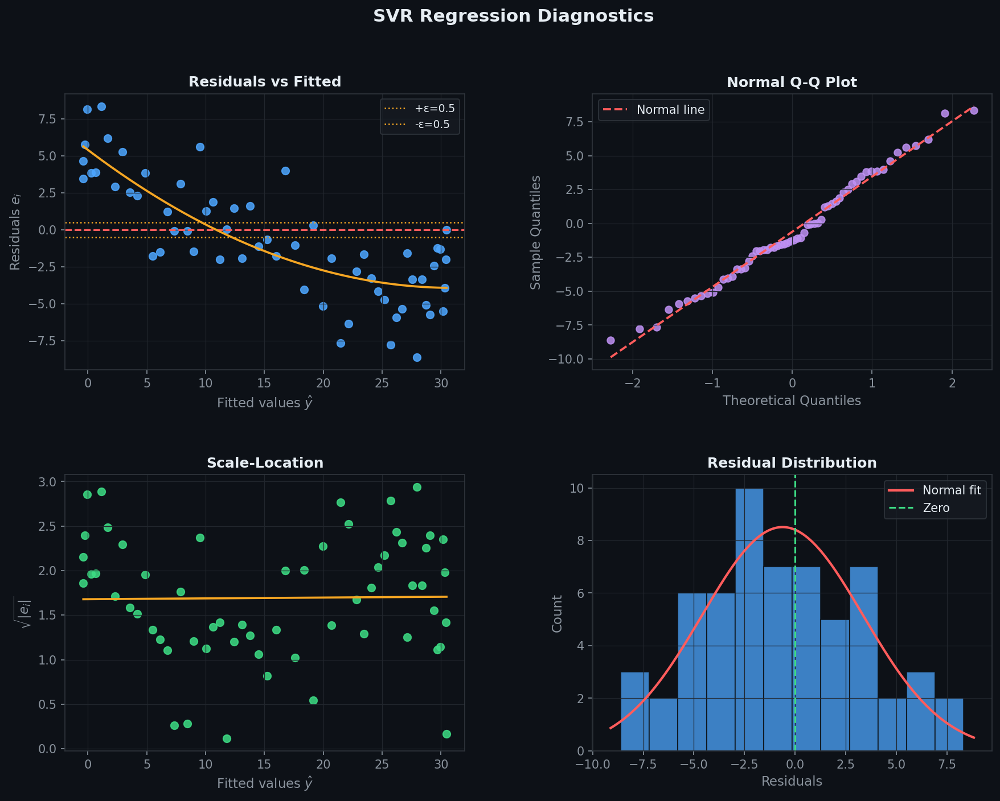
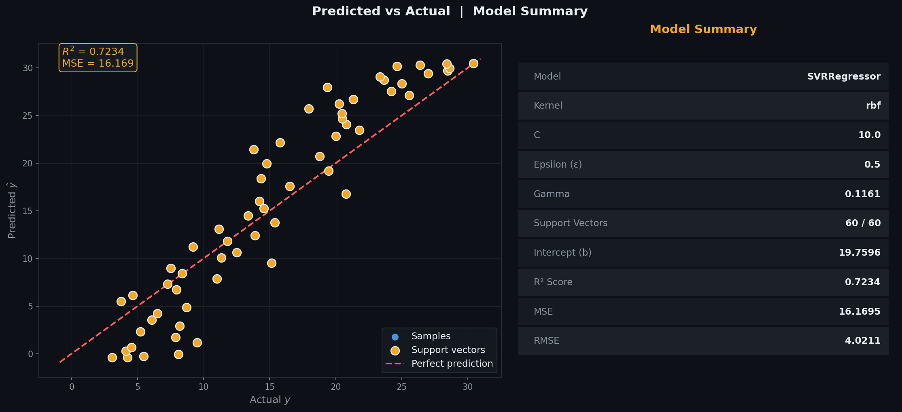
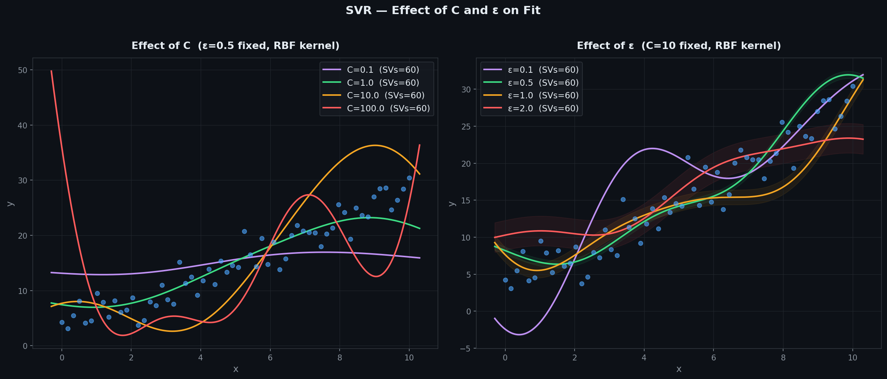
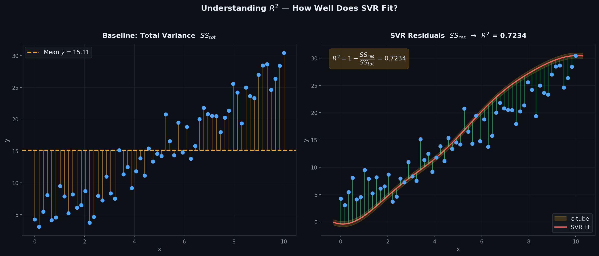

# Support Vector Regression — SMO Optimization

> A clean, **NumPy-only** implementation of Support Vector Regression (SVR)  
> with four kernels — **Linear, RBF, Polynomial, Sigmoid** — optimised via  
> **Sequential Minimal Optimization (SMO)**.  
> Finds the flattest tube that contains most of the data — only points outside the ε-tube affect the fit.

---

## Table of Contents

1. [What is Support Vector Regression?](#1-what-is-support-vector-regression)
2. [The Model](#2-the-model)
3. [Cost Function — ε-Insensitive Loss](#3-cost-function--ε-insensitive-loss)
4. [Kernels](#4-kernels)
5. [Dual Formulation](#5-dual-formulation)
6. [SMO Optimization](#6-smo-optimization)
7. [Geometric Intuition](#7-geometric-intuition)
8. [Best-Fit Line & ε-Tube](#8-best-fit-line--ε-tube)
9. [Kernel Comparison](#9-kernel-comparison)
10. [SMO Pipeline](#10-smo-pipeline)
11. [Regression Diagnostics](#11-regression-diagnostics)
12. [Predicted vs Actual](#12-predicted-vs-actual)
13. [Effect of C and ε](#13-effect-of-c-and-ε)
14. [Understanding R²](#14-understanding-r)
15. [Usage](#15-usage)
16. [Assumptions](#16-assumptions)

---

## 1. What is Support Vector Regression?

SVR finds the **flattest function** that fits the training data within a tolerance $\varepsilon$ — the epsilon-insensitive tube. Only points that fall **outside** the tube contribute to the loss.

Given $n$ observations $(\mathbf{x}_1, y_1), \ldots, (\mathbf{x}_n, y_n)$, it finds:

$$\hat{y} = \mathbf{w}^T\phi(\mathbf{x}) + b$$

| Symbol | Name | Meaning |
|--------|------|---------|
| $\mathbf{w}$ | Weight vector | Learned in feature space |
| $b$ | Bias | Intercept term |
| $\varepsilon$ | Epsilon | Half-width of the insensitive tube |
| $C$ | Regularisation | Penalty for points outside the tube — larger = tighter fit |
| $\phi(\mathbf{x})$ | Feature map | Implicit mapping via kernel trick |
| $\alpha_i, \alpha_i^*$ | Dual variables | Lagrange multipliers from the dual problem |

Key idea: predictions are only influenced by **support vectors** — training points on or outside the tube boundary. Everything inside the tube is ignored during optimization.

---

## 2. The Model

In the **primal** form:

$$\hat{y} = \mathbf{w}^T\phi(\mathbf{x}) + b$$

In the **dual** form (used in practice via the kernel trick):

$$\hat{y} = \sum_{i=1}^{n}(\alpha_i - \alpha_i^*)\,K(\mathbf{x}_i, \mathbf{x}) + b$$

where $K(\mathbf{x}_i, \mathbf{x}_j) = \phi(\mathbf{x}_i)^T\phi(\mathbf{x}_j)$ is the **kernel function** — it computes inner products in a high-dimensional space without explicitly mapping there.

> The kernel trick is what makes SVR powerful — an RBF kernel implicitly works in infinite-dimensional space, allowing non-linear fits without computing $\phi$ directly.

---

## 3. Cost Function — ε-Insensitive Loss

SVR minimises:

$$\mathcal{L}(\mathbf{w}) = \frac{1}{2}\|\mathbf{w}\|^2 + C\sum_{i=1}^{n}(\xi_i + \xi_i^*)$$

where $\xi_i, \xi_i^* \geq 0$ are **slack variables** measuring how far outside the tube each point falls:

$$\xi_i = \max(0,\; y_i - \hat{y}_i - \varepsilon), \qquad \xi_i^* = \max(0,\; \hat{y}_i - y_i - \varepsilon)$$

The $\varepsilon$**-insensitive loss** ignores errors smaller than $\varepsilon$:

$$L_\varepsilon(y, \hat{y}) = \max(0,\; |y - \hat{y}| - \varepsilon)$$

| $C$ value | Effect |
|-----------|--------|
| Small (0.01–0.1) | Wide tube — tolerates large errors, simpler model |
| Medium (1.0) | Balanced — good default |
| Large (10–100) | Tight tube — fits data closely, more support vectors |

| $\varepsilon$ value | Effect |
|--------------------|--------|
| Small (0.01–0.1) | Narrow tube — more points are support vectors |
| Medium (0.5) | Good default for most problems |
| Large (1.0+) | Wide tube — fewer support vectors, smoother fit |

---

## 4. Kernels

| Kernel | Formula | Use case |
|--------|---------|----------|
| **Linear** | $K(x,z) = x^Tz$ | Linearly separable data — fast |
| **RBF** | $K(x,z) = \exp(-\gamma\|x-z\|^2)$ | Most common — handles non-linear data well |
| **Polynomial** | $K(x,z) = (\gamma\,x^Tz + r)^d$ | Curved relationships — set degree $d$ |
| **Sigmoid** | $K(x,z) = \tanh(\gamma\,x^Tz + r)$ | Neural-network-like — use cautiously |

`gamma='scale'` sets $\gamma = \dfrac{1}{p \cdot \text{Var}(X)}$ — sklearn's default, scales with feature variance.

---

## 5. Dual Formulation

The dual problem — what SMO actually solves — is a Quadratic Programming (QP) problem:

$$\min_{\alpha, \alpha^*} \frac{1}{2}\sum_{i,j}(\alpha_i - \alpha_i^*)(\alpha_j - \alpha_j^*)K_{ij} + \varepsilon\sum_i(\alpha_i + \alpha_i^*) - \sum_i y_i(\alpha_i - \alpha_i^*)$$

Subject to:
$$\sum_i(\alpha_i - \alpha_i^*) = 0, \qquad 0 \leq \alpha_i,\; \alpha_i^* \leq C$$

After solving, the weight vector is recovered as:

$$\mathbf{w} = \sum_i(\alpha_i - \alpha_i^*)\,\phi(\mathbf{x}_i)$$

Points with $\alpha_i - \alpha_i^* \neq 0$ are the **support vectors** — they define the model.

---

## 6. SMO Optimization

SMO (Sequential Minimal Optimization) solves the QP problem by breaking it into the smallest possible sub-problems — updating **two dual variables at a time** analytically, avoiding the need for a full QP solver.

Each iteration:

1. **Find** a training point $i$ that violates the KKT conditions.
2. **Select** a second point $j$ randomly.
3. **Compute** the step size: $\eta = K_{ii} + K_{jj} - 2K_{ij}$
4. **Update** $\alpha_i, \alpha_i^*, \alpha_j, \alpha_j^*$ analytically and clip to $[0, C]$.
5. **Update** bias $b$ from the new dual variables.
6. **Repeat** until no KKT violations remain or `max_iter` is reached.

KKT (Karush-Kuhn-Tucker) conditions are the optimality conditions for the constrained QP — a point violates them if it is misclassified or lies inside the tube when it shouldn't.

---

## 7. Geometric Intuition

- The ε-tube is a band of width $2\varepsilon$ around the prediction function.
- Points **inside** the tube: zero loss — they don't affect the model.
- Points **on the tube boundary**: support vectors with $0 < \alpha_i$ or $\alpha_i^* < C$.
- Points **outside** the tube: penalised support vectors with $\alpha_i = C$ or $\alpha_i^* = C$.
- The model is entirely determined by support vectors — making SVR memory-efficient at prediction time.

---

## 8. Best-Fit Line & ε-Tube



| Visual Element | Meaning |
|----------------|---------|
| Blue dots | All training data points |
| Red line | SVR prediction $\hat{y}$ |
| Amber band | ε-insensitive tube — zero loss inside |
| Amber dashed | Tube boundaries $\hat{y} \pm \varepsilon$ |
| Green bars | Residuals for points outside the tube |
| Amber circles | Support vectors — define the model |

Points inside the tube contribute **zero** to the loss — this is the key difference from OLS which penalises every point.

---

## 9. Kernel Comparison



All four kernels fitted to the same data with identical $C$ and $\varepsilon$:

- **Linear** — straight line fit, fastest to compute.
- **RBF** — smooth non-linear curve, most robust default.
- **Polynomial** — curved fit controlled by degree $d$.
- **Sigmoid** — flexible but can be numerically unstable.

R² and support vector count shown for each — use these to choose the right kernel for your data.

---

## 10. SMO Pipeline



Five-step loop that runs until KKT conditions are satisfied:

| Step | Operation | Formula |
|------|-----------|---------|
| ① | Compute Kernel Matrix | $K_{ij} = \kappa(x_i, x_j)$ |
| ② | Find KKT Violation | $\|f(x_i) - y_i\| - \varepsilon > \text{tol}$ |
| ③ | Select Pair $(i, j)$ | $\eta = K_{ii} + K_{jj} - 2K_{ij}$ |
| ④ | Update Dual Variables | $\alpha_i, \alpha_i^* \in [0, C]$ |
| ⑤ | Update Bias $b$ | $b = y_i - f(x_i) \pm \varepsilon$ |

---

## 11. Regression Diagnostics

After fitting, verify the four core assumptions visually:



| Plot | What to look for | Assumption verified |
|------|-----------------|---------------------|
| **Residuals vs Fitted** | Random scatter — amber lines show ε boundaries | Linearity |
| **Normal Q-Q** | Points on the diagonal line | Normality of residuals |
| **Scale-Location** | Flat, uniform band — no funnel | Homoscedasticity |
| **Residual Histogram** | Bell-shaped, centred at 0 | Normality |

**Red flags:**
- Systematic pattern in residuals → wrong kernel; try RBF
- Heavy tails in Q-Q → outliers affecting the fit; increase $C$

---

## 12. Predicted vs Actual



**Left panel:** each point is one sample — actual $y$ on x-axis, predicted $\hat{y}$ on y-axis.
- Points hugging the **red dashed diagonal** = accurate predictions.
- Amber highlighted points are support vectors.

**Right panel:** model summary card — kernel, C, ε, gamma, support vector count, R², MSE, RMSE.

---

## 13. Effect of C and ε



**Left — varying C** (ε fixed):
- Small C → wider effective margin, smoother fit, fewer support vectors.
- Large C → tighter fit, more support vectors, risk of overfitting.

**Right — varying ε** (C fixed):
- Small ε → narrow tube, more points outside → more support vectors.
- Large ε → wide tube, most points inside → fewer support vectors, flatter fit.

---

## 14. Understanding R²

$$R^2 = 1 - \frac{SS_{res}}{SS_{tot}} = 1 - \frac{\sum(y_i - \hat{y}_i)^2}{\sum(y_i - \bar{y})^2}$$



| Panel | Shows | Represents |
|-------|-------|-----------|
| Left — amber bars | Deviation from mean $\bar{y}$ | $SS_{tot}$ — total variance |
| Right — green bars | Deviation from SVR fit | $SS_{res}$ — unexplained variance |

> Note: SVR does not minimise MSE directly — it minimises the ε-insensitive loss. R² is still useful as a summary metric but is not the objective being optimised.

| $R^2$ value | Meaning |
|------------|---------|
| $= 1.0$ | Perfect fit |
| $\approx 0.9$ | Strong fit — 90% of variance explained |
| $= 0.0$ | No better than predicting $\bar{y}$ |
| $< 0$ | Worse than the mean baseline |

---

## 15. Usage

### Basic fit and predict

```python
import numpy as np
from SVRRegressor import SVRRegressor

X_train = np.array([[1], [2], [3], [4], [5]], dtype=float)
y_train = np.array([2.1, 3.9, 6.2, 7.8, 10.1])

model = SVRRegressor(C=10.0, epsilon=0.5, kernel='rbf', gamma='scale')
model.fit(X_train, y_train)

print(f"Intercept (b)    : {model.intercept_:.4f}")
print(f"Support vectors  : {model.n_support_}")
print(f"SV indices       : {model.support_}")
print(model)

X_test = np.array([[6], [7], [8]], dtype=float)
y_test = np.array([12.0, 13.8, 16.1])
y_pred = model.predict(X_test)

print(f"Predictions      : {y_pred}")
print(f"R²               : {model.score(X_test, y_test):.4f}")
```

### Comparing kernels

```python
for kern in ['linear', 'rbf', 'poly', 'sigmoid']:
    m = SVRRegressor(C=10.0, epsilon=0.5, kernel=kern, gamma='scale')
    m.fit(X_train, y_train)
    print(f"kernel={kern:8s}  R²={m.score(X_test, y_test):.4f}  "
          f"SVs={m.n_support_}")
```

### Tuning C and epsilon

```python
for C in [0.1, 1.0, 10.0, 100.0]:
    m = SVRRegressor(C=C, epsilon=0.5, kernel='rbf')
    m.fit(X_train, y_train)
    print(f"C={C:6.1f}  R²={m.score(X_test, y_test):.4f}  SVs={m.n_support_}")
```

### Linear kernel — inspect weights

```python
model = SVRRegressor(C=1.0, epsilon=0.1, kernel='linear')
model.fit(X_train, y_train)
print(f"Weights (w) : {model.coef_}")   # only available for linear kernel
print(f"Bias    (b) : {model.intercept_:.4f}")
```

---

## 16. Assumptions

| # | Assumption | How to check |
|---|-----------|--------------|
| 1 | **Correct kernel** — kernel matches data structure | Kernel comparison plot |
| 2 | **Feature scaling** — required for RBF/poly/sigmoid | Apply `StandardScaler` before fitting |
| 3 | **C and ε tuning** — defaults may not be optimal | Grid search or validation curve |
| 4 | **Sufficient data** — SMO needs enough samples | Check n_support_ / n_samples ratio |

> **Feature scaling is essential** for RBF, polynomial, and sigmoid kernels — all three depend on distances or dot products which are scale-sensitive. Always apply `StandardScaler` before fitting.

> **Linear kernel only:** `coef_` is available as a weight vector. For all other kernels, the model lives in the dual space and only `dual_coef_` and `support_` are meaningful.

---

## OLS vs Ridge vs SVR

| Criterion | OLS | Ridge | SVR |
|-----------|-----|-------|-----|
| Loss function | MSE — penalises all points | Regularised MSE | ε-insensitive — ignores tube interior |
| Outlier sensitivity | High | Moderate | Low — outliers capped at $C$ |
| Non-linear fit | No | No | Yes — via kernel trick |
| Feature scaling | Not required | Not required | Required (RBF/poly/sigmoid) |
| Closed-form | Yes | Yes | No — QP / SMO |
| Sparse solution | No | No | Yes — only support vectors matter |
| Key hyperparameters | — | `alpha` | `C`, `epsilon`, `kernel`, `gamma` |

---

## Dependencies

```
numpy >= 1.21
matplotlib >= 3.4   # optional — for plots only
scipy >= 1.7        # optional — for Q-Q diagnostics
```

---

## License

MIT
